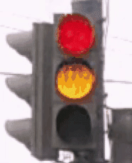
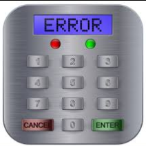

# Группа 907св
# Программа курса
* [Vue](https://dmitryweiner.github.io/lectures/Vue.html#/)
* [Vue: библиотеки компонентов](https://dmitryweiner.github.io/lectures/Vue%20-%20UI%20Libraries.html#/)
* [VueX](https://dmitryweiner.github.io/lectures/Vue%20-%20VueX.html#/)
* [Angular](https://dmitryweiner.github.io/lectures/Angular.html#/)
* [Angular: библиотеки компонентов](https://dmitryweiner.github.io/lectures/Angular%20-%20UI%20Libraries.html#/)
* [Angular: менеджеры состояния](https://dmitryweiner.github.io/lectures/Angular%20-%20State%20Managers.html#/)
* [PHP](https://dmitryweiner.github.io/lectures/PHP.html#/)
* [Yii2](https://dmitryweiner.github.io/lectures/Yii2.html#/)
* [Svelte](https://github.com/dmitryweiner/lectures/raw/main/old/%D0%98%D0%BD%D1%82%D0%B5%D1%80%D1%84%D0%B5%D0%B9%D1%81%D1%8B/%D0%98%D0%BD%D1%82%D0%B5%D1%80%D1%84%D0%B5%D0%B9%D1%81%D1%8B%20%D0%9B%D0%B5%D0%BA%D1%86%D0%B8%D1%8F%20Svelte.pptx)
* [Firebase](https://github.com/dmitryweiner/lectures/raw/main/old/%D0%98%D0%BD%D1%82%D0%B5%D1%80%D1%84%D0%B5%D0%B9%D1%81%D1%8B/%D0%98%D0%BD%D1%82%D0%B5%D1%80%D1%84%D0%B5%D0%B9%D1%81%D1%8B%20%D0%9B%D0%B5%D0%BA%D1%86%D0%B8%D1%8F%20Firebase.pptx)
* [i18n многоязычность](https://github.com/dmitryweiner/lectures/raw/main/old/%D0%98%D0%BD%D1%82%D0%B5%D1%80%D1%84%D0%B5%D0%B9%D1%81%D1%8B/%D0%98%D0%BD%D1%82%D0%B5%D1%80%D1%84%D0%B5%D0%B9%D1%81%D1%8B%20%D0%9B%D0%B5%D0%BA%D1%86%D0%B8%D1%8F%20React%20i18n.pptx)
* [Оптимизация загрузки в React: lazy load, chunks](https://github.com/dmitryweiner/lectures/raw/main/old/%D0%9E%D0%BF%D1%82%D0%B8%D0%BC%D0%B8%D0%B7%D0%B0%D1%86%D0%B8%D1%8F/%D0%9E%D0%BF%D1%82%D0%B8%D0%BC%D0%B8%D0%B7%D0%B0%D1%86%D0%B8%D1%8F%20React.pptx)
* [Анализ причин для рендера в React](https://github.com/dmitryweiner/lectures/raw/main/old/%D0%98%D0%BD%D1%82%D0%B5%D1%80%D1%84%D0%B5%D0%B9%D1%81%D1%8B/%D0%98%D0%BD%D1%82%D0%B5%D1%80%D1%84%D0%B5%D0%B9%D1%81%D1%8B%20%D0%9B%D0%B5%D0%BA%D1%86%D0%B8%D1%8F%2017%20angular.pptx)
* [Анализ бандла в Webpack](https://github.com/dmitryweiner/lectures/raw/main/old/%D0%9E%D0%BF%D1%82%D0%B8%D0%BC%D0%B8%D0%B7%D0%B0%D1%86%D0%B8%D1%8F/%D0%9E%D0%BF%D1%82%D0%B8%D0%BC%D0%B8%D0%B7%D0%B0%D1%86%D0%B8%D1%8F%20React.pptx)
* [Рендер на сервере на примере фреймворка Next](https://github.com/dmitryweiner/lectures/raw/main/old/%D0%98%D0%BD%D1%82%D0%B5%D1%80%D1%84%D0%B5%D0%B9%D1%81%D1%8B/%D0%98%D0%BD%D1%82%D0%B5%D1%80%D1%84%D0%B5%D0%B9%D1%81%D1%8B%20%D0%9B%D0%B5%D0%BA%D1%86%D0%B8%D1%8F%2016%20next.pptx)

# Лабораторные
За весь семестр нужно сделать 3 лабы. К первой контрольной неделе надо сделать 1 лабу.

Для лабы нужно выбрать технологию из нижеследующего списка. Желательно все 3 лабы сделать на разных фреймворках.

За использование какой-то технологии начисляются баллы (указаны в скобках).

На контрольной/экзаменационной неделе строим гауссово распределение суммы баллов и выставляем оценки:
* 2: 0%
* 3: <40%
* 4: >40%, <70%
* 5: > 70%

## Технологии
### Вариант c React
* React (1)
* Redux (3)
* Redux Toolkit (6)
* Тесты (3)
* Линтер (3)
* TypeScript (3)
* Обращение в сеть (3)

### Вариант c Vue
* Vue (1)
* VueX (3)
* Тесты (3)
* Линтер (3)
* TypeScript (3)
* Обращение в сеть (3)

### Вариант c Angular
* Angular (1)
* Сервис (3)
* Тесты (3)
* Линтер (3)
* TypeScript (3)
* Обращение в сеть (3)

### Вариант c Svelte
* Svelte (5)
* Тесты (3)
* Линтер (3)
* Обращение в сеть (3)

## Варианты проектов
* Редактируемый, фильтруемый список дел.
* Редактируемый список таймеров с кнопками старт/пауза, удалить.
* Обращение к [API](https://github.com/public-apis/public-apis), 
  [ещё](https://proglib.io/p/7-besplatnyh-api-o-kotoryh-nikto-ne-govorit-2020-12-07?focus=comment)
  и вывод результатов:
  * Прогноз погоды.
  * Список астероидов, летящий к Земле.
  * Комиксы (Марвел).
  * Кинопоиск.
  * [Список рецептов еды](https://spoonacular.com/food-api/docs).
  * [Github](https://api.github.com/users/dmitryweiner).
  * [Google Books](https://www.googleapis.com/books/v1/volumes?maxResults=5&orderBy=relevance&q=oliver%20sacks).
  * [Fake users](https://randomuser.me/documentation).
  * [NASA](https://api.nasa.gov/).
* Игры:
  * Крестики-нолики.
  * Морской бой.
  * Тетрис.
  * Судоку.
  * Викторина.

# Экзаменационные вопросы
* Написать компонент, используя один из предложенных фреймворков: 
[React](https://github.com/dmitryweiner/react-template),
[Vue](https://github.com/dmitryweiner/vue3-template),
[Angular](https://github.com/dmitryweiner/angular-template).
* Реализовывать компонент, начиная с тестов к нему (по возможности).

1. Измеритель времени реакции. Компонент показывает красную кнопку. На неё пока нельзя нажимать. Через случайное время (1-10 с)
цвет кнопки меняется на зелёный и на неё надо нажать. После нажатия компонент пишет время между изменением цвета и
нажатием (время реакции среднего человека 0.1-0.2 с).

3. Компонент получает на вход строку. Каждую секунду он переставляет последнюю букву в начало строки и показывает получившееся:
  * привет
  * тприве
  * етприв

3. Написать компонент, который отображает светофор вместе с секундами, соответствующими времени,
оставшемся до окончания текущей фазы.



5. Компонент на вход принимает список опций и отображает поле ввода. При попадании фокуса в поле ввода и 
печати туда информации компонент отображает фильтрованный по подстроке список опций. При клике на опцию
в поле ввода остаётся выбранная опция. При клике снаружи компонента список скрывается.

7. Отображение комментариев. Дан JSON, пришедший от сервера:
```json
[
  {
    "id": 1,
    "text": "Я не мышь!",
    "parent_id": 2,
    "created_at": "23.11.2021, 16:10:11"
  },
  {
    "id": 2,
    "text": "Вы мышь!",
    "parent_id": null,
    "created_at": "23.11.2021, 15:16:27"
  },
  {
    "id": 3,
    "text": "Это я мышь",
    "parent_id": 2,
    "created_at": "23.11.2021, 17:22:28"
  },
  {
    "id": 4,
    "text": "Все вы не правы",
    "parent_id": 3,
    "created_at": "23.11.2021, 19:06:17"
  },
  {
    "id": 5,
    "text": "Погода сегодня хорошая",
    "parent_id": null,
    "created_at": "24.11.2021, 10:10:57"
  },
  {
    "id": 6,
    "text": "И всё-таки я не мышь!",
    "parent_id": 2,
    "created_at": "25.11.2021, 03:20:24"
  }
]
```
Необходимо отобразить комментарии лесенкой, учитывая какой комментарий отвечает на что. Более новые отображаются снизу.
При ответе комментарий сдвигается вправо (см. [ЖЖ](https://bakluzhino.livejournal.com/162772.html?view=comments#comments)).

7. Написать компонент, поочерёдно раз в 100 мс показывающий кадры скачущего зайца ([отсюда](src/assets/programs/animation.zip)).

9. Написать компонент, рисующий панель ввода PIN, и показывающий, что PIN введён правильно или неправильно.

  

9. Кликер с debounce. Компонент считает нажатия на кнопку. Если нажатия произведены в промежутке 300 мс, засчитывается
только первое нажатие, остальные игнорируются.

10. Компонент показывает одно эмодзи из списка 🐷, 💥, 🦊, 🐻, 🐸, 🐶, 🐞 (набор эмодзи произвольный) в течение 10 с. 
Потом компонент скрывает эмодзи на 10 с. Потом показывает весь набор, надо выбрать только что показанное эмодзи. 
Можно делать это в цикле и подсчитывать число правильных.

12. Реализовать компонент, принимающий на вход число секунд, который показывает плавно растущий прогрессбар с процентами,
доходящий до 100% ровно через указанное число секунд.

