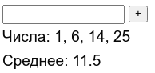

### Задачи на контрольную неделю 1

* Написать кликер. В минус уходить нельзя. Если число чётное, оно зелёное, если нечетное, оно красное.

   

* Список чисел с фильтрацией:
  
  
  При нажатии на [+] в список добавляется очередное число из поля ввода. При изменении состояния фильтра список обновляется. 

* Калькулятор систем счисления:
  

  При изменении любого поля ввода числа второе поле обновляется автоматически.
  Также автоматически обновляется число при изменении системы счисления. 

* Сделать калькулятор перевода температур из Цельсия в Фаренгейты и обратно.
При изменении одного поля меняется другое и наоборот.

  

* Обратный таймер:

  

  Таймер при нажатии кнопки "старт" идёт до 0 и останавливается. Можно остановить кнопкой "стоп".

* Реализовать светофор, меняющийся раз в секунду.

  Задача со ✨: сделать светофор с показом секунд.

  

* Частотный словарь. Многострочное поле ввода, а снизу выводится список слов и сколько раз это слово встретилось.
Обновляется автоматически при изменении поля. Список отсортирован от самых частых к самым редким.

  

* Сделать кнопку, которая при нажатии меняет цвет фона с красного на зелёный и обратно:
   <button style="background-color: lightgreen">Нажми меня!</button>

* Добавляем числа в список и показываем среднее арифметическое:

  

* Калькулятор площади прямоугольника:

  

  Площадь должна обновляться автоматически при изменении ползунков.

