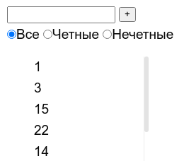

# Задачи для дифференцированного зачета по курсу "Системное программирование"
Для решения каждой задачи надо написать компонент на React.js. Писать легче всего
в проекте, созданном с помощью create-react-app.
Писать компонент надо в функциональном стиле с использованием хуков.

### Число Фибоначчи
Компонент каждую секундую пишет новое [число Фибоначчи](https://ru.wikipedia.org/wiki/%D0%A7%D0%B8%D1%81%D0%BB%D0%B0_%D0%A4%D0%B8%D0%B1%D0%BE%D0%BD%D0%B0%D1%87%D1%87%D0%B8)
вдобавок к уже отображённым. Так, в первую секунду он напишет: 0

Потом: 0, 1

Потом: 0, 1, 1

Потом: 0, 1, 1, 2

Потом: 0, 1, 1, 2, 3

Потом: 0, 1, 1, 2, 3, 5

Потом: 0, 1, 1, 2, 3, 5, 8

### Alert
Компоненту в пропсах передаётся строка для отображения и задержка в секундах:
```jsx
<Alert text="Тревога, волк украл зайчат!" delay={5} />
```
Будучи отображённым на экране, компонент показывает сообщение, а потом скрывает
его через указанное количество секунд.

### Обратная строка с кнопкой
Компоненту в пропсы передали строку:
```jsx
<Component text="!тевирП" />
```
Компонент отрисовывает строку и кнопку:


При нажатии на кнопку строка отображается в обратном порядке.

**Внимание!** В переданной строке могут быть символы юникода, эмодзи.

### Светофор
Компонент просто отображает светофор. Время переключения на усмотрение разработчика. Вёрстка не обязательна,
можно отобразить цветные лампы каким-нибудь символом:


### Счётчик с переменным шагом
Компонент отображает
* ползунок с текущим значением инкремента,
* кнопку инкремента со знаком +,
* текущее значение счётчика.

При нажатии на кнопку к текущему значению счётчика добавляется столько,
сколько указано ползунком:


### Компонент для неважной информации
Компонент предназначен для отображения дополнительной информации.
Ему передаётся на вход некий текст и резюме этого текста. 
```jsx
<Details shortText="Лицензионное соглашение" text="Настоящее соглашение дает вам нижеследующие права..." />
```

В изначальном состоянии он показывает краткий текст и ссылку "подробнее".

**Лицензионное соглашение** [подробнее]()

При нажатии на ссылку компонент отображает краткий и полный текст, а ссылка превращается в "скрыть".

**Лицензионное соглашение** 
Настоящее соглашение дает вам нижеследующие права... [скрыть]()

### Обращение к сети
Компонент содержит текстовое поле и кнопку "получить":


При нажатии на кнопку происходит обращение к серверу по адресу ```https://jsonplaceholder.typicode.com/todos/:id```,
где ```:id``` &mdash; то, что ввели в текстовое поле.

От сервера приходит:
```json
{
  "userId": 1,
  "id": 1,
  "title": "delectus aut autem",
  "completed": false
}
```

При получении ответа сервера нужно отобразить поле title.

### PIN-код

Написать компонент, рисующий панель ввода PIN.
PIN 4-значный, правильный код 9999.
При нажатии кнопок в поле ввода появляются соответствующие цифры.
Количество цифр в поле 4, они перезаписываются циклически 
(было 1234, нажали 5, отображается 2345).
Если ввели правильный PIN, показывается сообщение.


### Калькулятор систем счисления
Калькулятор перевода в другие системы счисления (2, 8, 16). Результат меняется при изменении полей.


### Список чисел с фильтрацией
Приложение содержит поле ввода, кнопку "+", выбор режима фильтрации (изначально показываются все числа)
и список чисел.

При нажатии "+" в список добавляется число из поля ввода, если оно там есть.

При изменении режима фильтрации список обновляется в соответствии с выбранным режимом (все, чётные, нечетные).

При добавлении числа список также должен обновляться в соответствии с выбранным режимом фильтрации.


