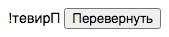
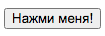
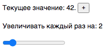
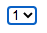

# Задачи для экзамена
Для решения каждой задачи надо написать компонент на React.js и тесты к нему. Писать легче всего
в проекте, созданном с помощью create-react-app ([например](https://github.com/dmitryweiner/cra)).

Писать компонент надо в функциональном стиле с использованием хуков.

### 1. Лайк
Компонент отображает чёрное сердечко 🖤. Когда на него кликнули дважды (задержка <= 800 ms),
сердечко становится красным ❤️. По техническим причинам нельзя пользоваться встроенным событием
```onDoubleClick```.

### 2. Обратный отсчёт
При отображении компонент показывает 10. Через секунду число сменяется на 9. И так до 0. На нуле
отсчёт останавливается.

### 3. Число Фибоначчи
Компонент каждую секундую пишет новое [число Фибоначчи](https://ru.wikipedia.org/wiki/%D0%A7%D0%B8%D1%81%D0%BB%D0%B0_%D0%A4%D0%B8%D0%B1%D0%BE%D0%BD%D0%B0%D1%87%D1%87%D0%B8)
вдобавок к уже отображённым. Так, в первую секунду он напишет: 0

Потом: 0, 1

Потом: 0, 1, 1

Потом: 0, 1, 1, 2

Потом: 0, 1, 1, 2, 3

Потом: 0, 1, 1, 2, 3, 5

Потом: 0, 1, 1, 2, 3, 5, 8

### 4. Обратная строка
Компоненту в пропсы передали строку. Он её отображает в обратном порядке:
```jsx
<Component text="❤!тевирП" />
```
Отображается:
```Привет!❤```

**Внимание!** В переданной строке могут быть символы юникода, эмодзи.

### 5. Alert
Компоненту в пропсах передаётся строка для отображения и задержка в секундах:
```jsx
<Alert text="Тревога, волк украл зайчат!" delay={5} />
```
Будучи отображённым на экране, компонент показывает сообщение, а потом скрывает
его через указанное количество секунд.

### 6. Обратная строка с кнопкой
Компоненту в пропсы передали строку:
```jsx
<Component text="!тевирП" />
```
Компонент отрисовывает строку и кнопку:



При нажатии на кнопку строка отображается в обратном порядке.

**Внимание!** В переданной строке могут быть символы юникода, эмодзи.

### 7. Градусник
Компоненту передаётся текущая температура в градусах Цельсия. Если значение < 0, температура отображается
синим шрифтом, если > 0 &mdash; красным.
```jsx
<Component temperature={-20} />
```

```jsx
<Component temperature={36.6} />
```


### 8. Светофор
Компонент просто отображает светофор. Время переключения на усмотрение разработчика. Вёрстка не обязательна,
можно отобразить цветные лампы каким-нибудь символом:


### 9. Счётчик
Реализовать счётчик нажатий на кнопку:



Нажатий на кнопку: 42.

### 10. Счётчик с переменным шагом
Компонент отображает
* ползунок с текущим значением инкремента,
* кнопку инкремента со знаком +,
* текущее значение счётчика.

При нажатии на кнопку к текущему значению счётчика добавляется столько,
сколько указано ползунком:



### 11. Селектбокс
Компоненту на вход передаётся:
* массив опций для отображения;
* коллбэк, который следует вызвать, когда в селектбоксе что-то выбрали, 
  передав в качестве аргумента выбранную опцию;
* дефолтное значение.
```jsx
<Selectbox 
  options={[1, 2, 3]} 
  onSelect={value => console.log(value)}
  defaultValue={2}
/>
```



### 12. Компонент для неважной информации
Компонент предназначен для отображения дополнительной информации.
Ему передаётся на вход некий текст и резюме этого текста. 
```jsx
<Details shortText="Лицензионное соглашение" text="Настоящее соглашение дает вам нижеследующие права..." />
```

В изначальном состоянии он показывает краткий текст и ссылку "подробнее".

**Лицензионное соглашение** [подробнее]()

При нажатии на ссылку компонент отображает краткий и полный текст, а ссылка превращается в "скрыть".

**Лицензионное соглашение** 
Настоящее соглашение дает вам нижеследующие права... [скрыть]()

### 13. Обращение к сети
Компонент содержит текстовое поле и кнопку "получить":


При нажатии на кнопку происходит обращение к серверу по адресу ```https://jsonplaceholder.typicode.com/todos/:id```,
где ```:id``` &mdash; то, что ввели в текстовое поле.

От сервера приходит:
```json
{
  "userId": 1,
  "id": 1,
  "title": "delectus aut autem",
  "completed": false
}
```

При получении ответа сервера нужно отобразить поле title.


