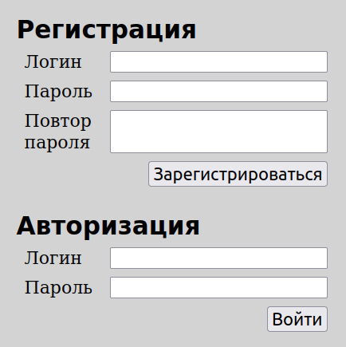
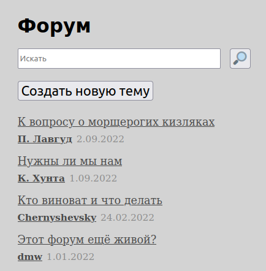
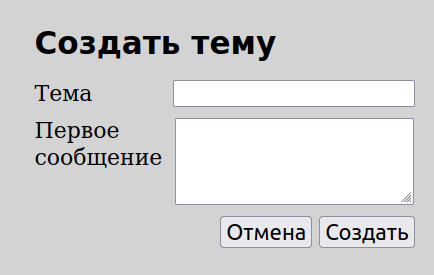
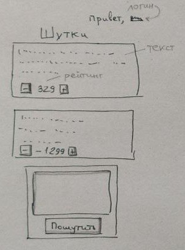

# Лабораторная работа

Реализовать вебсайт с бекендом и фронтендом.
Вебсайт реализует функциональность [форума](https://ru.wikipedia.org/wiki/%D0%92%D0%B5%D0%B1-%D1%84%D0%BE%D1%80%D1%83%D0%BC)
(живой пример https://www.phpbbguru.net/community/).

Результат закоммитить на github.com и прислать ссылку.

## Функциональные требования
* Гость может зарегистрироваться и логиниться.
Формы логина и регистрации валидируются (пустое нельзя отправить),
минимальный размер логина и пароля 6 символов. После логина пользователь
попадает на главную страницу.

  

* На главной странице отображается список тем (новые сверху).
У каждой темы отображается логин автора и дата создания.
Отображается кнопка "Создать тему", ведущая на экран создания темы.
Отображается форма поиска, при нажатии на кнопку [🔎] отображается отфильтрованный список.

  

* Создание новой темы. Пользователь заполняет тему (макс. 255 символов) и текст (1кб). 
Поля обязательные. После успешного создания пользователь попадает на главную страницу.

  

* Просмотр темы. Новые сообщения отобраются внизу. Внизу же находится форма создания нового
сообщения. При успешной отправке оно добавляется внизу.

  

## Бекенд
* Бекенд может быть написан на любом удобном языке и фреймворке 
(я предпочитаю Node.js + Express.js).
* Бекенд должен использовать БД. Выбор базы обуславливается тем, что 
можно запустить на компе в колледже. Удалось запустить:
  * [LowDB.js](https://github.com/typicode/lowdb).
  * SQLite.
* Бекенд должен быть написан в формате REST API.
* Должны быть следующие роуты:
  * Регистрация.
  * Аутентификация.
  * Темы.
  * Сообщения.

#### Альтернативные варианты тем:
* Чат с логином/регистрацией и комнатами. Можно использовать AES-шифрование.
* Сервис хранения анонимных записок с самоуничтожением при просмотре.
* Сайт с шутками по типу [bash.org.ru](https://ru.wikipedia.org/wiki/Bash.im).
 На главной странице отображаются самые новые шутки 
(чем ниже, тем старше).

Сверху отображается текущий логин пользователя (если он залогинен).

Шутке можно поставить оценку [+] или [-], при этом её общая оценка
изменяется. Один пользователь может проголосовать 1 раз.

На этой же странице можно отправить новую шутку (форма внизу, пустое отправить нелья).
При успешной отправке новая шутка появляется сверху, она же самая новая.
 

* Своя тема.

Альтернативную тему можно выбрать после согласования. Основные требования:
* Бекенд и фронтенд.
* Должны быть реализованы логин/регистрация.
* На бекенде хранение в базе/файле (что проще).
