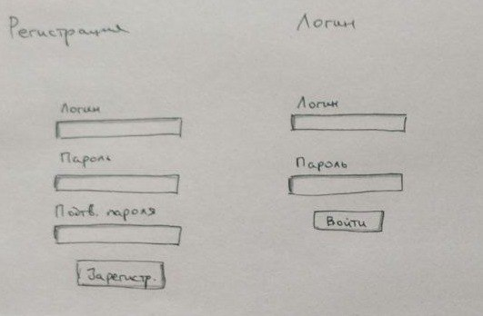
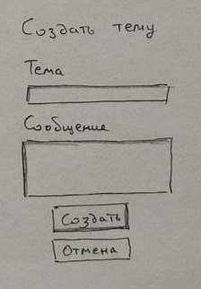
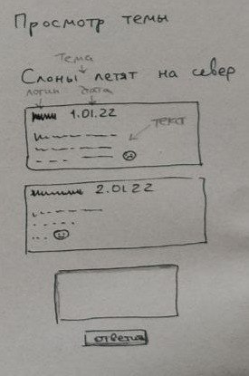

# Лабораторная работа

Реализовать вебсайт с бекендом и фронтендом.
Вебсайт реализует функциональность [форума](https://ru.wikipedia.org/wiki/%D0%92%D0%B5%D0%B1-%D1%84%D0%BE%D1%80%D1%83%D0%BC)
(живой пример https://www.phpbbguru.net/community/).

Результат закоммитить на github.com и прислать ссылку.

## Функциональные требования
* Гость может зарегистрироваться и логиниться.
Формы логина и регистрации валидируются (пустое нельзя отправить),
минимальный размер логина и пароля 6 символов. После логина пользователь
попадает на главную страницу.

* На главной странице отображается список тем (новые сверху).
У каждой темы отображается логин автора и дата создания.

* Создание новой темы.

* Просмотр темы.

#### Альтернативные варианты тем:
* Форум в стиле https://www.phpbbguru.net/community/
* Чат с логином и комнатами.
* Сервис хранения анонимных записок с самоуничтожением при просмотре.
* Сайт с шутками по типу bash.org.ru.
 На главной странице отображаются самые новые шутки 
(чем ниже, тем старше).

Сверху отображается текущий логин пользователя (если он залогинен).

Шутке можно поставить оценку [+] или [-], при этом её общая оценка
изменяется. Один пользователь может проголосовать 1 раз.

На этой же странице можно отправить новую шутку (форма внизу, пустое отправить нелья).
При успешной отправке новая шутка появляется сверху, она же самая новая.
 

* По желанию.

Альтернативную тему можно выбрать после согласования. Основные требования:
* Бекенд и фронтенд.
* Должны быть реализованы логин/регистрация.
* На бекенде хранение в базе/файле (что проще).
