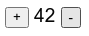
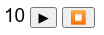
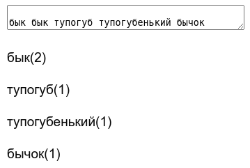
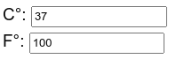
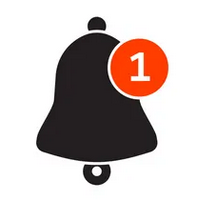
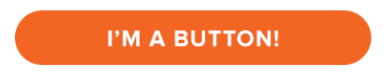
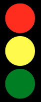

# Программа курса "Системное программирование" для групп 007са, 007сб, 907а, 907б.

### React
* [Введение в React.js](https://dmitryweiner.github.io/lectures/React%20-%20Basic.html#/)
* [Функциональные компоненты и хуки](https://dmitryweiner.github.io/lectures/React%20-%20Hooks.html#/)
* [Как работать с формами и контролами](https://dmitryweiner.github.io/lectures/React%20-%20Form%20controls.html#/)
* [Тестирование с помощью testing-library](https://dmitryweiner.github.io/lectures/React%20-%20Testing%20components.html#/)
* [Добавление стилей](https://dmitryweiner.github.io/lectures/React%20-%20Styles%20and%20assets.html#/)
* [Маршрутизация](https://dmitryweiner.github.io/lectures/React%20-%20Router.html#/)
* [Запросы в сеть](https://dmitryweiner.github.io/lectures/React%20-%20Fetch.html#/)
* [TypeScript + React](https://dmitryweiner.github.io/lectures/React%20-%20TypeScript%20with%20React.html#/)

### Backend
* [Express.js](https://dmitryweiner.github.io/lectures/Express.html#/)
* [MongoDB](https://dmitryweiner.github.io/lectures/Mongo.html#/)
* [ORM Mongoose](https://dmitryweiner.github.io/lectures/Mongoose.html#/)

<hr/>

# Лабораторная

# Задачи на дифференцированный зачёт
Эти задачи нужно решить с помощью библиотеки React.js.

#### 1. Лайк
На странице отображается чёрное сердечко 🖤. Когда на него кликнули дважды (задержка <= 800 ms),
сердечко становится красным ❤️. По техническим причинам нельзя пользоваться встроенным событием
```onDoubleClick```.

#### 2. Кликер
Написать кликер с возможностью уменьшения и увеличения:



Если число нечётное, то оно красное, иначе зелёное.

#### 3. Измеритель времени реакции. 
Страница показывает красную кнопку. На неё пока нельзя нажимать. Через случайное время (1-10 с)
цвет кнопки меняется на зелёный и на неё надо нажать. После нажатия компонент пишет время между изменением цвета и
нажатием (время реакции среднего человека 0.1-0.2 с).

#### 4. Обратный таймер:



Таймер при нажатии кнопки "старт" идёт до 0 и останавливается. Можно остановить кнопкой "стоп".

#### 5. Частоты слов
Многострочное поле ввода, а снизу выводится список слов и сколько раз это слово встретилось.
Обновляется автоматически при изменении поля.



#### 6. Калькулятор систем счисления
Калькулятор для перевода в другие системы счисления (2, 8, 16). Результат меняется при изменении полей.


#### 7. Калькулятор температур
Сделать калькулятор перевода температур из Цельсия в Фаренгейты и обратно.
При изменении одного поля меняется другое и наоборот.



#### 8. Нотификации
Сверстать виджет нотификаций. Он показывает, сколько пришло новых сообщений.
Колокольчик можно отобразить с помощью эмодзи 🔔. Число отображается в виде текста
в круглом `<div>`.



#### 9. Кнопка с закруглёнными краями
Сверстать модную кнопку с круглыми краями, белым текстом и оранжевым фоном.
При нажатии на кнопку цвет фона меняется на зелёный.



#### 10. Светофор
Реализовать светофор, меняющийся раз в секунду.
Задача со ✨: сделать светофор с показом секунд, как [здесь](src/assets/programs/traffic.gif).


