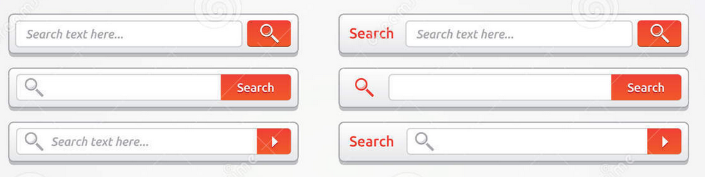
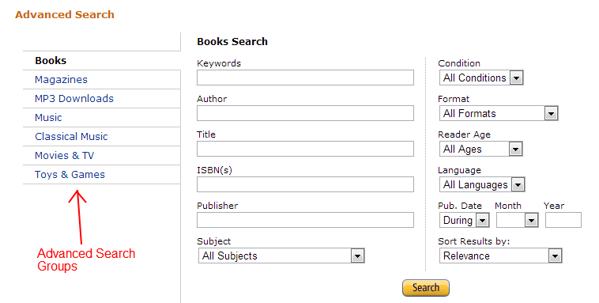

# Программа курса "Системное программирование" для групп 007са, 007сб, 907а, 907б.
## На самом деле это фронтенд/веб-разработка.

* [HTML](https://dmitryweiner.github.io/lectures/Basic%20-%20HTML.html)
* [CSS](https://dmitryweiner.github.io/lectures/Basic%20-%20CSS.html)
* [JavaScript](https://dmitryweiner.github.io/lectures/Basic%20-%20JS.html)
    * [Введение в язык JavaScript. Основы языка: синтаксис, управляющие конструкции.](https://dmitryweiner.github.io/lectures/JS_part1.html)
    * [Функции. Rest...spread.](https://dmitryweiner.github.io/lectures/JS_part2.html)
    * [Массивы.](https://dmitryweiner.github.io/lectures/JS_part3.html)
    * [Работа с DOM. События.](https://dmitryweiner.github.io/lectures/JS_part4.html)
    * [Асинхронный код. Обработка ошибок.](https://dmitryweiner.github.io/lectures/JS_part5.html)
    * [Map, Set. Даты. Работа с устройствами.](https://dmitryweiner.github.io/lectures/JS_part6.html)
* [Node.js](https://dmitryweiner.github.io/lectures/Basic%20-%20Nodejs.html)
* [NPM](https://dmitryweiner.github.io/lectures/Basic%20-%20NPM.html)
* [TypeScript](https://dmitryweiner.github.io/lectures/Basic%20-%20TypeScript.html)
* [Webpack](https://dmitryweiner.github.io/lectures/Basic%20-%20Webpack.html#/)
* [ESLint + Prettier + Husky](https://github.com/dmitryweiner/lectures/raw/main/old/%D0%9B%D0%B5%D0%BA%D1%86%D0%B8%D1%8F%20eslint%20prettier%20husky.pptx)
* [Git](https://dmitryweiner.github.io/lectures/Basic%20-%20Git.html)

## Лабораторная №1: Список дел
#### а) Вёрстка  HTML

* Сверстать заготовку будущего веб-приложения.
* В процессе можно пользоваться [презентацией](https://dmitryweiner.github.io/lectures/Basic%20-%20HTML.html#/).

#### б) работа с CSS

* Написать стили для веб-приложения. Не обязательно, чтоб было как на картинке, главное сам процесс.
* Постараться отцентрировать весь блок горизонтально и вертикально.
* Будет плюсом, если сам список можно будет прокручивать без прокручивания самой страницы.
* В процессе можно пользоваться [презентацией](https://dmitryweiner.github.io/lectures/Basic%20-%20CSS.html#/).

#### в) Оживляем список дел, прикручиваем JS
* Добавить возможность добавления новых элементов.
* Добавить возможность удаления элементов.
* _Задание со звёздочкой:_ Сохранить элементы в [localstorage](https://learn.javascript.ru/localstorage).

#### г) Фильтрация элементов

* Сделать нажимаемыми ссылки внизу. Нажимаешь на ссылку, она становится жирной. Так устанавливается режим фильтрации. 
Можно реализовать это с помощью радиокнопок.
* Сделать фильтрацию в соответствии с выбранным режимом. Нажали на ссылку, список обновился.
* Рефакторинг: вынос кода, обновляющего список, в отдельную функцию render().

## Лабораторная №2: Работа с API
#### а) Выбрать себе API по вкусу:
* [Github API](https://github.com/public-apis/public-apis),
* [7 публичных API](https://proglib.io/p/7-besplatnyh-api-o-kotoryh-nikto-ne-govorit-2020-12-07?focus=comment)
* [Список рецептов еды](https://spoonacular.com/food-api/docs).
* [Google Books](https://www.googleapis.com/books/v1/volumes?maxResults=5&orderBy=relevance&q=oliver%20sacks).
* [Fake users](https://randomuser.me/documentation).
* [NASA](https://api.nasa.gov/).
* [Покемоны](https://pokeapi.co/).
* [Чат](https://github.com/dmitryweiner/mini-chat-server).
#### б) Реализовать форму ввода (поиск?), кнопку "отправить" и отображение результатов.
  * При отправке должен отображаться спиннер, который исчезает при получении результатов.
  * Типовой вид формы: 
  
#### в) Реализовать дополнительные фичи:
  * Сортировку по какому-либо полю.
  * Фильтрация по категории.
  * Ограничение количества результатов на странице.
  * Типовой вид формы:
  
  

# Программа для тех, кто уже знает JS + CSS + HTML
* [Введение в React.js](https://dmitryweiner.github.io/lectures/React%20-%20Basic.html#/)
* [Функциональные компоненты и хуки](https://dmitryweiner.github.io/lectures/React%20-%20Hooks.html#/)
* [Как работать с формами и контролами](https://dmitryweiner.github.io/lectures/React%20-%20Form%20controls.html#/)
* [Тестирование с помощью testing-library](https://dmitryweiner.github.io/lectures/React%20-%20Testing%20components.html#/)
* [Добавление стилей](https://dmitryweiner.github.io/lectures/React%20-%20Styles%20and%20assets.html#/)
* [Маршрутизация](https://dmitryweiner.github.io/lectures/React%20-%20Router.html#/)
* [Запросы в сеть](https://dmitryweiner.github.io/lectures/React%20-%20Fetch.html#/)
* [TypeScript + React](https://dmitryweiner.github.io/lectures/React%20-%20TypeScript%20with%20React.html#/)

## Лабораторные
Сделать 1 и 2 лабораторные на React.js.
