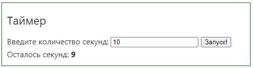

# Группы 907са, 907сб
# Программа курса
* [HTML](https://dmitryweiner.github.io/web-lectures/Basic%20-%20HTML.html)
* [CSS](https://dmitryweiner.github.io/web-lectures/Basic%20-%20CSS.html)
* [JavaScript](https://dmitryweiner.github.io/web-lectures/Basic%20-%20JS.html)
* [TypeScript](https://dmitryweiner.github.io/web-lectures/Basic%20-%20TypeScript.html)
* [Node.js](https://dmitryweiner.github.io/web-lectures/Basic%20-%20Nodejs.html)
* [NPM](https://dmitryweiner.github.io/web-lectures/Basic%20-%20NPM.html)
* [Git](https://dmitryweiner.github.io/web-lectures/Basic%20-%20Git.html)
* [Webpack](https://dmitryweiner.github.io/web-lectures/Basic%20-%20Webpack.html#/)
* [ESLint + Prettier + Husky](https://github.com/dmitryweiner/web-lectures/raw/main/old/%D0%9B%D0%B5%D0%BA%D1%86%D0%B8%D1%8F%20eslint%20prettier%20husky.pptx)

# Лабораторные
### 1. HTML


* Сверстать заготовку будущего веб-приложения.
* В процессе можно пользоваться [презентацией](https://dmitryweiner.github.io/web-lectures/Basic%20-%20HTML.html#/).
* Результат закоммитить на гитхаб и прислать ссылку на проект.

<hr/>

### 2. CSS


* Написать стили для веб-приложения.
* Постараться отцентрировать весь блок горизонтально и вертикально.
* Будет плюсом, если сам список можно будет прокручивать без прокручивания самой страницы.
* В процессе можно пользоваться [презентацией](https://dmitryweiner.github.io/web-lectures/Basic%20-%20CSS.html#/).
* Результат коммитить в тот же проект, что и предыдущее задание.

<hr/>

### 3. Оживляем список дел: прикручиваем JS
* Добавить возможность добавления новых элементов.
* Добавить возможность удаления элементов.
* Рефакторинг: вынос рендера в отдельную функцию.
* _Задание со звёздочкой:_ Сохранить элементы в [localstorage](https://learn.javascript.ru/localstorage).

<hr/>

### 4. Фильтрация элементов


* Сделать нажимаемыми ссылки внизу (нажимаешь, она становится жирной).
* Сделать фильтрацию в соответствии с выбранным режимом.

<hr/>

## Лабы для тех, кто хочет ещё, не обязательные:

### 5. Конвертер систем счисления


* Написать приложение для конвертирования между системами счисления.
* При вводе в верхнее поле в нижнем отображается сконвертированное число (в соответствии с тем, что выбрано в селектбоксе).
* При вводе в нижнее поле обновляется верхнее.
* При изменении селектбокса изменяется только нижнее.

<hr/>

### 6. Таймер с обратным отсчётом



* В поле ввода пишем количество секунд.
* При нажатии на кнопку таймер начинает идти: 10, 9, 8... Останавливается на 0.
* Когда он дошёл до 0, показывается красная надпись <font color="red"><b>ВРЕМЯ ИСТЕКЛО</b></font>.

<hr/>

# Экзаменационные вопросы

1. Посчитать максимум и минимум массива:
```js
const arr = [1, 6, -1, 22, 13];
```

2. перевернуть строку задом наперёд:
```js
const str = "!тевирП";
```

3. Вычислить сумму квадратных корней для всех чётных чисел целочисленного массива:
```js
const arr = [3, 5, 8, 13, 21, 42];
```

4. Написать функцию, которая проверяет, являются ли две строки анаграммой:
```js
anagram("Лунь", "нуль") // true
anagram("Лунь", "ноль") // false
```

5. Написать функцию, которая проверяет, является ли строка палиндромом:
```js
palindrome("Не гни папин ген") // true
palindrome("123") // false
```

6. Написать функцию, которая после вызова каждую секунду пишет в консоль очередное [число Фибоначчи](https://ru.wikipedia.org/wiki/%D0%A7%D0%B8%D1%81%D0%BB%D0%B0_%D0%A4%D0%B8%D0%B1%D0%BE%D0%BD%D0%B0%D1%87%D1%87%D0%B8).
Так, в консоли будет: 0, 1, 1, 2, 3, 5, 8, 13...

7. Написать функцию `delay(N)`, возвращающую промис, который сделает `resolve()` через N секунд.

8. Написать функцию `intersect(arrA, arrB)`, принимающую на вход два массива и возвращающую пересечение значений этих массивов.

9. Написать HTML и JS-код, который рисует кнопки "+" и "-" и значение, уменьшающееся или увеличивающееся при нажатии.

     

11. Что выведет этот код? Как сделать так, чтобы он вывел 1, 2, 3?
```js
let i;
for(i = 1; i <= 3; i++) {
  setTimeout(() => console.log(i), 1000);
}
```
