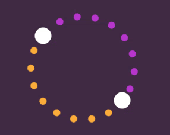
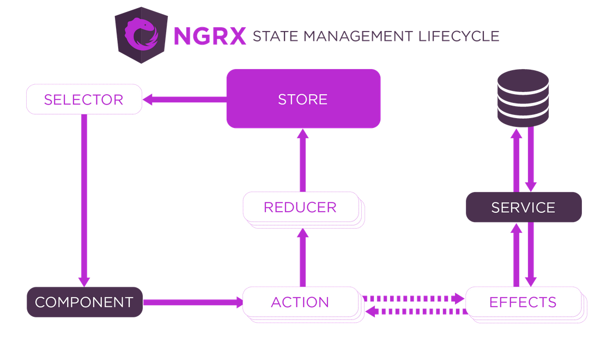

## Менеджеры состояния в Angular



[Дмитрий Вайнер](https://github.com/dmitryweiner)

[видео](https://drive.google.com/file/d/1lx57sSTE3t5EqA83wQ2ofQo5nbVZO1oW/view?usp=sharing)
---

### Варианты менеджеров состояния
* [NGRX](https://ngrx.io/guide/store).
* [NGXS](https://www.ngxs.io/).
* [MobX](https://github.com/mobxjs/mobx-angular).
* [Elf](https://ngneat.github.io/elf/docs/store).
* [rx-angular](https://github.com/rx-angular/rx-angular/blob/master/libs/state/README.md).
* [Mobx-angular](https://github.com/mobxjs/mobx-angular).
---

### NGRX: особенности
* За основу взяты идеи Redux.
* Изоляция сайд-эффектов.
* Интеграция с роутером в Angular.
* Активное использование библиотеки [RxJS](https://dmitryweiner.github.io/lectures/RxJS.html#/).
---


* [Документация](https://ngrx.io/guide/store).
* [Вызовы к API](https://medium.com/angular-in-depth/handle-api-call-state-nicely-445ab37cc9f8).
* [Пример проекта](https://github.com/zhaosiyang/loadable-example/tree/e505183bd25d55c173be03ad3ea43f019a373c50).
---

---

### Установка
* Без создания черновика стора:
```shell
ng add @ngrx/store@latest
```
* С генерацией черновика стора:
```shell
ng add @ngrx/store@latest --minimal false
```
---

### Генерация стора
```shell
ng g store State --root --module app.module.ts
 create src/app/reducers/index.ts
 update src/app/app.module.ts
```
---

### Экшены
* Создание экшена:
```ts
// actions.ts
import { createAction } from '@ngrx/store';
export const actionName = createAction('action name');
```
* Для примера опишем счётчик с инкрементом и декрементом:
```ts
import { createAction } from '@ngrx/store';
export const increment = createAction('[Counter Component] Increment');
export const decrement = createAction('[Counter Component] Decrement');
export const reset = createAction('[Counter Component] Reset');
```
---

### Акция с нагрузкой
* Создадим где-то интерфейс:
```ts
interface Todo {
    id: string;
    title: string;
    isDone: boolean;
}
```
* В экшенах:
```ts
import { createAction, props } from '@ngrx/store';
export const addTodo = createAction(
    'add todo',
    props<{title: string}>() // можно props<string>(), если один параметр
);
```
---

### Редьюсер
* Примерный редьюсер с инкрементом и декрементом:

```ts
import { createReducer, on } from '@ngrx/store';
import { increment, decrement, reset } from './counter.actions';
 
export const initialState = 0;
 
export const counterReducer = createReducer(
  initialState,
  on(increment, (state) => state + 1),
  on(decrement, (state) => state - 1),
  on(reset, (state) => 0)
);
```
---

### Редуктор с параметрами
```ts
const initialState: Todo[] = [];
export const todosReducer = createReducer(
  initialState,
  on(addTodo, (state, { title }) => {
    const todo = {
        id: Math.random().toString(36).substr(2),
        title,
        isDone
    }
    return [...state, todo];
  })
);
```
```ts
this.store.dispatch(addTodo({ title: "Покормить кота" }));
```
---

### Подключение в модуле
```ts
import { StoreModule } from '@ngrx/store';
import { counterReducer } from './somewhere';
 
@NgModule({
  /* тут всё, что было */
  imports: [
      /* другие импорты */
      StoreModule.forRoot({ 
          count: counterReducer // название ключа -- название поля в сторе
      })
  ],
})
```
---

### Использование в компоненте
```ts
import { Store } from '@ngrx/store';
import { Observable } from 'rxjs';
import { increment, decrement, reset } from '../counter.actions';

export class CounterComponent {
    count$: Observable<number>; // привет из RxJS

    constructor(private store: Store<{ count: number }>) {
        // вместо строки может быть и функция-селектор
        this.count$ = store.select('count');
    }

    increment() {
        this.store.dispatch(increment());
    }

    decrement() {
        this.store.dispatch(decrement());
    }

    reset() {
        this.store.dispatch(reset());
    }
}
```
---

### В шаблоне
* Внимание на **async**:

```angular2html
<button (click)="increment()">Increment</button>
<div>Current Count: {{ count$ | async }}</div>
<button (click)="decrement()">Decrement</button>
<button (click)="reset()">Reset Counter</button>
```
---

### Селекторы
* [Документация](https://ngrx.io/guide/store/selectors).

```ts
import { createSelector } from '@ngrx/store';
 
export interface State {
  counter1: number;
  counter2: number;
}
 
export const selectCounter1 = createSelector((state: State) => state.counter1);
export const selectCounter2 = createSelector((state: State) => state.counter2);
export const selectTotal = createSelector(
  selectCounter1,
  selectCounter2,
  (counter1, counter2) => counter1 + counter2
); 
```

```ts
// component.ts
constructor(private store: Store<{ count: number }>) {
    this.total$ = store.select(selectTotal);
}
```
---

### Сайд-эффекты
* Сайд-эффект &mdash; инструмент для обращения к API.
* Без сайд-эффекта происходит вот что:
  * Компонент запускает вызов к API (в сервисе).
  * Сервис возвращает данные.
  * Компонент сохраняет данные в стор или во внутреннее состояние.
* Минусы такого подхода:
  * Логика работы с API размазана между стором, компонентом и сервисом.
---

### Сайд-эффекты
* С сайд-эффектом происходит вот что:
  * Компонент вызывает экшен с помощью dispatch.
  * Сайд-эффект отслеживает нужный экшен.
  * Производит вызов в API (а то и не один).
  * Вызывает экшен сохранения результата.
  * Стор сохраняет результат.
* Плюсы: асинхронная логика лежит в одном месте.
* Напоминает [Redux Saga](https://redux-saga.js.org/).
---

### Сайд-эффекты: установка
```shell
ng add @ngrx/effects@latest
```
---

### Сайд-эффекты: приготовления
* Экшены:
```ts
export const retreiveTodos = createAction('retreiveTodos');
export const setTodos = createAction('setTodos', props<Todo[]>());
```
* Редуктор:
```ts
const initialState: Todos[] = [];
export const todosReducer = createReducer(
    initialState,
    on(setTodos, (state, todos) => {
      return [...todos];
    })
);
```
---

### Сайд-эффекты
* Эффект:
  
```ts
@Injectable()
export class TodoEffects {
  todos$ = createEffect(() =>
    this.actions$.pipe(
      ofType(retreiveTodos),
      exhaustMap(action =>
        // тут может быть вызов сервиса для похода в API
        this.http.get("http://URL").pipe(
          map(todos => setTodos(todos),
          catchError(error => console.error)) // можно вызвать экшен сохранения ошибки
        )
      )
    )
  );
  constructor(
    private actions$: Actions,
    private http: HttpClient
  ) {}
}
```
---

### Сайд-эффекты
* Подключение в модуле:
```ts
import { EffectsModule } from '@ngrx/effects';
import { MovieEffects } from './effects/movie.effects';
@NgModule({
    imports: [
      EffectsModule.forRoot([TodoEffects])
    ],
})
export class AppModule {}
```
---

### Сайд-эффекты
* Кода общения с API выносят в отдельный сервис (см. ниже ⬇).
* Эффект:
```ts
@Injectable()
export class TodoEffects {
    todos$ = createEffect(() =>
      this.actions$.pipe(ofType(retreiveTodos),
        exhaustMap(
            // Вызов API
            action => this.todoApiService.getAll()
            .pipe(map(todos => setTodos(todos))))
      )
    );
    constructor(
      private actions$: Actions,
      private todoApiService: TodoApiService
    ) {}
}
```
----
```ts
@Injectable({
  providedIn: 'root'
})
export class TodoApiService {
  constructor (private http: HttpClient) {}
  getAll() {
    return this.http.get('/todos');
  }
}
```
---

### Маршрутизация в сторе
* Можно использовать [@ngrx/router-store](https://ngrx.io/guide/router-store).
* Подключить routerReducer.
* Добавить вызов RouterStoreModule.connectRoute в основном модуле приложения.
* Добавляем RouterState в основное состояние приложения.
* [Подробнее](https://habr.com/ru/post/425959/).
---

### Тестирование
* [Тестирование стора](https://ngrx.io/guide/store/testing).
* [Тестирование сайд-эффектов](https://ngrx.io/guide/effects/testing).
---


* Реализует шаблон [CQRS](https://ru.wikipedia.org/wiki/CQRS).
* Разработчики вдохновлялись Redux и NgRx.
* Но решили уменьшить количество вспомогательного кода (как в Redux Toolkit).
* [Документация](https://www.ngxs.io/).
---

### NGXS


---

### Установка и подключение
* Установка:
```shell
npm i @ngxs/store 
```
* Подключение стора:

```ts
import { NgModule } from '@angular/core';
import { NgxsModule } from '@ngxs/store';
@NgModule({
    imports: [
      NgxsModule.forRoot([
          TodoState // тут массив сторов
      ], {
        developmentMode: !environment.production
      })
    ]
})
export class AppModule {}
```
---

### Создание и вызов экшенов
* [Документация](https://www.ngxs.io/concepts/actions).
* Создание:
```ts
export class AddTodo {
    static readonly type = '[todo] Add Todo';
    constructor(public title: string) {}
}
```
* Вызов в компоненте:
```ts
import { Store } from '@ngxs/store';
@Component({})
export class TodoList {
    constructor(private store: Store) {}
    addTodo(title: string) {
      this.store.dispatch(
        new AddTodo(title)
      );
    }
}
```
---

### Вызов экшенов
* Обработка нескольких экшенов:
```ts
this.store.dispatch([
    new AddTodo("купить деньги"),
    new AddTodo("завести картошку")
]);
```
* Подписка на завершение обработки экшена:
```ts
this.store
        .dispatch(new AddTodo("покормить кота"))
        // тут делаем что-то после завершения обработки
        .subscribe(() => this.resetForm());
```
---

### Экшены и пространство имён
* Авторы рекомендуют использовать для экшенов [пространство имён](https://www.typescriptlang.org/docs/handbook/namespaces.html):

```ts
export namespace Todo {
  export class Add {
    static readonly type = '[todo] Add';
    constructor(public title: string) {}
  }

  export class Remove {
    static readonly type = '[todo] Remove';
    constructor(public id: string) {}
  }
}
```
* Использование:

```ts
this.store.dispatch(
    new Todo.Add("покормить картошку")
);
```
---

### Стор
```ts
import { Injectable } from '@angular/core';
import { State, Action, StateContext } from '@ngxs/store';
import { patch } from '@ngxs/store/operators';

export interface StateModel { // тип стора
  todos: Todo[];
}

@State<StateModel>({
  name: 'todos', // ключ, с которым складывается в общий стор
  defaults: {
    todos: [] // начальное значение
  }
})
@Injectable()
export class TodosState {
  @Action(AddTodo) // подписываемся на экшен
  addTodo(ctx: StateContext<StateModel>, action: AddTodo) {
    const todos = cts.getState().todos; // текущее состояние
    const todo = {
      id: Math.random().toString(36).substr(2),
      title: action.title, // action payload
      isDone: false
    };
    ctx.setState(
      patch({ // patch чтобы не копировать весь стейт
        todos: [...todos, todo]
      })
    );
  }
}
```
---

### Что можно делать внутри setState
* patch: обновить какую-то часть стора.
* iif: обновить с условием.
* updateItem: обновить отдельный элемент.
* removeItem: удалить элемент.
* insertItem: добавить элемент.
* append: добавить несколько.
* compose: сочетание операторов.
---

### Примеры
* insertItem:
```ts
ctx.setState(
      patch({
        todos: insertItem(todo)
      })
    );
```
* updateItem:
```ts
ctx.setState(
      patch({
        todos: updateItem<Todo>(todo => todo === payload.id, payload.newTitle)
      })
    );
```
---

### Селекторы
* [Документация](https://www.ngxs.io/concepts/select).
* Получение данных из стора в компоненте:

```ts
import { Store, Select } from '@ngxs/store';
import { Observable } from 'rxjs';
@Component({})
export class ZooComponent {
  @Select(state => state.todos) todos$: Observable<Todo[]>;
  constructor(private store: Store) {}
}
```

* В шаблоне:

```angular2html
<ul>
  <li *ngFor="let todo in todos$ | async">
    {{ todo.title }}
  </li>
</ul>
```
---

### Варианты селекторов
* С функцией:
```ts
@Select(state => state.todos) todos$: Observable<Todo[]>;
```
* С указанием [мемоизованного](https://ru.wikipedia.org/wiki/%D0%9C%D0%B5%D0%BC%D0%BE%D0%B8%D0%B7%D0%B0%D1%86%D0%B8%D1%8F)
селектора в сторе:
```ts
@Select(TodosState.todos) todos$: Observable<Todo[]>;
@Select(TodosState.todosCount) todosCount: Observable<number>;
```
---

### Селекторы в сторе
```ts
@State<StateModel>({
  name: 'todos',
  defaults: {
    todos: []
  }
})
@Injectable()
export class TodosState {
  @Selector()
  static todos(state: StateModel) {
    return state.todos;
  }

  @Selector()
  static todosCount(state: StateModel) {
    return state.todos.length;
  }
  // ... тут экшены
}
```
---

### Селектор с аргументом
```ts
@Selector()
static todosFiltered(state: StateModel) {
  return (query: string) => {
    return state.todos.filter(item => item.title.includes(query));
  };
}
```
---

### Пример [стора](https://github.com/dmitryweiner/ngxs-todo)
```ts
import {Action, Selector, State, StateContext} from "@ngxs/store";
import {AddTodo, CheckTodo, FilterTodo, RemoveTodo, SearchTodo, getTodos} from "./todo.action";
import { TodoType } from "./todo.type";
import { TodoFilter } from "./todoFilter.enum";
import {TodoService} from "./todo.service";
import {Injectable} from "@angular/core";

export class TodoStateModel {
  todos!: TodoType[];
  search!: string;
  filter!: TodoFilter;
}

@State<TodoStateModel>({
  name: 'todo',
  defaults: {
    todos: [],
    search: '',
    filter: TodoFilter.All
  }
})
@Injectable()
export class TodoState {
  constructor(private todoService: TodoService) {}

  @Selector()
  static getTodos(state: TodoStateModel) {
    switch (state.filter) {
      case TodoFilter.All: {
        return state.todos.filter(
          item => item.title.toUpperCase().includes(state.search.toUpperCase())
        )
      }
      case TodoFilter.COMPLETE: {
        return state.todos.filter(
          item => item.title.toUpperCase().includes(state.search.toUpperCase()) && item.isChecked
        )
      }
      case TodoFilter.NOT_COMPLETE: {
        return state.todos.filter(
          item => item.title.toUpperCase().includes(state.search.toUpperCase()) && !item.isChecked
        )
      }
      default: {
        return state.todos.filter(
          item => item.title.toUpperCase().includes(state.search.toUpperCase())
        )
      }
    }
  }

  @Action(getTodos)
  async get(context: StateContext<TodoStateModel>) {
    this.todoService.get().subscribe((result) => {
      context.patchState({
        todos: result,
      })
    })
  }

  @Action(AddTodo)
  async add(context: StateContext<TodoStateModel>, action: AddTodo) {
    const state = context.getState()

    context.patchState({
      search: ''
    })

    this.todoService.add(action.payload).subscribe((result) => {
      state.todos.push(result)

      context.patchState({
        todos: state.todos,
      })
    })
  }

  @Action(RemoveTodo)
  remove(context: StateContext<TodoStateModel>, action: AddTodo) {
    const state = context.getState()

    this.todoService.remove(action.payload).subscribe(() => {
      context.patchState({
        todos: state.todos.filter(item => item.id !== action.payload)
      })
    })
  }

  @Action(SearchTodo)
  search(context: StateContext<TodoStateModel>, action: SearchTodo) {
    context.patchState({
      search: action.payload
    })
  }

  @Action(CheckTodo)
  check(context: StateContext<TodoStateModel>, action: CheckTodo) {
    const state = context.getState()

    const index = state.todos.findIndex(item => item.id === action.payload)
    const item = state.todos[index]

    this.todoService.checked(action.payload, !item.isChecked).subscribe((result) => {
      console.log(result)

      state.todos[index] = result

      context.patchState({
        todos: state.todos
      })
    })
  }

  @Action(FilterTodo)
  filter(context: StateContext<TodoStateModel>, action: FilterTodo) {
    context.patchState({
      filter: action.payload
    })
  }
}
```
---

### Альтернативы
* [Elf](https://ngneat.github.io/elf/docs/store).
* [rx-angular](https://github.com/rx-angular/rx-angular/blob/master/libs/state/README.md).
* [Mobx-angular](https://github.com/mobxjs/mobx-angular).