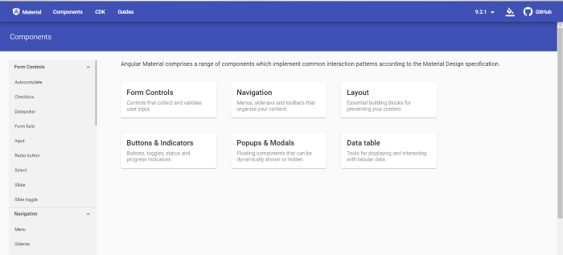
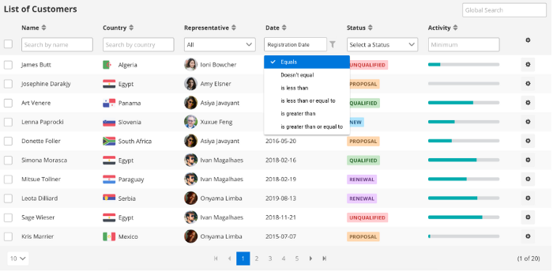
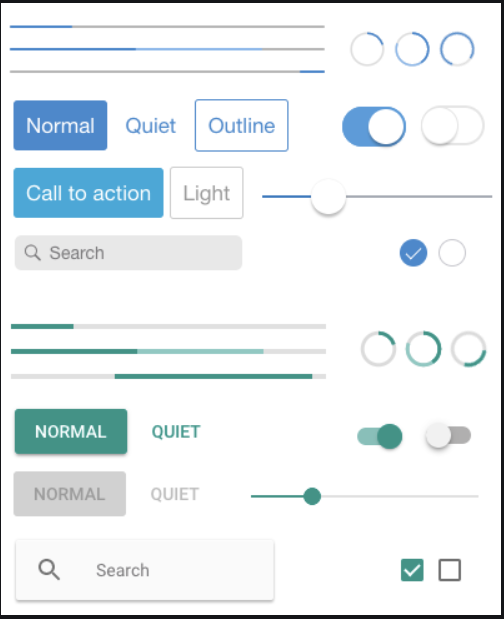
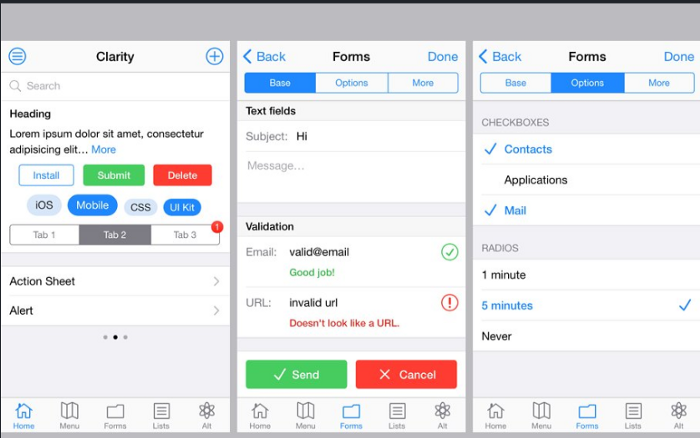
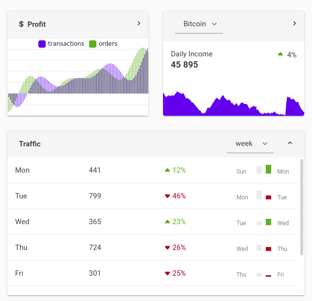

## Angular: библиотеки компонентов

[все лекции](https://github.com/dmitryweiner/web-lectures/blob/main/README.md)

[видео](https://drive.google.com/file/d/14-jBiba-gavdDzmBG7NFcdLy3Xf0UIqi/view?usp=sharing)
---

### Angular Material
* [Репозиторий](https://github.com/angular/components).
* [Документация](https://material.angular.io/components/categories).
* [Демо](https://material-density.glitch.me/).
* ⭐22.2k 🍴5.9k ⬇1M
---


---

### Angular Material
* Установка:
```shell
ng add @angular/material
```
* В модуле:
```ts
import { MatSliderModule } from '@angular/material/slider';
@NgModule ({
      imports: [
        MatSliderModule,
      ]
})
class AppModule {}
```
* В шаблоне:
```angular2html
<mat-slider min="1" max="100" step="1" value="50"></mat-slider>
```
---

### ngx-bootstrap
* [Репозиторий](https://github.com/valor-software/ngx-bootstrap).
* [Документация](https://valor-software.com/ngx-bootstrap/#/documentation).
* [Демо](https://codesandbox.io/s/j3qz78qvzy).
* ⭐5.3k 🍴1.7k ⬇266k
---

### ngx-bootstrap
* Установка:
```shell
ng add ngx-bootstrap
```
* В модуле:
```ts
import { TooltipModule } from 'ngx-bootstrap/tooltip';
@NgModule({
    imports: [ TooltipModule.forRoot()]
})
```
* В шаблоне:
```angular2html
<button type="button" class="btn btn-primary"
        tooltip="Vivamus sagittis lacus vel augue laoreet rutrum faucibus.">
    Simple demo
</button>
```
---

### Prime NG
* [Репозиторий](https://github.com/primefaces/primeng).
* [Документация](https://primefaces.org/primeng/showcase/#/setup).
* [Демо](https://primefaces.org/primeng/showcase/#/).
* ⭐7.1k 🍴3.6k ⬇267k
---


---

### Prime NG
* Установка:
```shell
npm i primeng primeicons
```
* В модуле:
```ts
import {AutoCompleteModule} from 'primeng/autocomplete';
```
* В шаблоне:
```angular2html
<p-autoComplete [(ngModel)]="text" [suggestions]="results" (completeMethod)="search($event)"></p-autoComplete>
```
---

### Kendo UI
* [Документация](https://www.telerik.com/kendo-angular-ui/components/buttons/).
* [Демо](https://www.telerik.com/kendo-angular-ui/components/).
* Цена $1k.
---


---

### Onsen UI
* Оптимизиация под мобильные устройства.
* [Репозиторий](https://github.com/OnsenUI/OnsenUI).
* [Документация](https://onsen.io/v2/guide/angular2/).
* [Демо](https://onsen.io/angular2/).
* ⭐8.5k 🍴980 ⬇25k
---


---

### Onsen UI
* Установка:
```shell
npm install onsenui ngx-onsenui --save
```
* В модуле:
```ts
import { OnsenModule } from 'ngx-onsenui';
//
imports: [ OnsenModule ]
```
* Стили в глобальном CSS:
```scss
@import 'node_modules/onsenui/css/onsenui.css';
@import 'node_modules/onsenui/css/onsen-css-components.css';
```
* В шаблоне:
```angular2html
<ons-button>Click Me</ons-button>
```
---

### Clarity
* [Репозиторий](https://github.com/vmware/clarity).
* [Документация](https://clarity.design/get-started/developing/angular/).
* [Демо](https://amellnik.github.io/clarity-demo/inputs).
* ⭐6.3k 🍴735 ⬇14k
---


---

### Clarity
* Установка:
```shell
ng add @clr/angular
```
* В модуле:
```ts
import { ClarityModule } from '@clr/angular';
//
imports: [ClarityModule]
```
* В шаблоне:
```angular2html
<clr-alert [clrAlertAppLevel]="true">
  <clr-alert-item>
    <span class="alert-text">
      Congratulations, you have installed Clarity!
    </span>
  </clr-alert-item>
</clr-alert>
```
---

### Nebular
* [Репозиторий](https://github.com/akveo/nebular).
* [Документация](https://akveo.github.io/nebular/docs/getting-started/what-is-nebular#what-is-nebular).
* [Демо](https://www.akveo.com/ngx-admin/pages/dashboard?theme=material-light).
* ⭐7.3k 🍴1.4k ⬇18k
---


---

### 
* Установка:
```shell
ng add @nebular/theme
```
* В модуле:
```ts
import { NbSidebarModule, NbLayoutModule, NbButtonModule } from '@nebular/theme';
//
imports: [
    NbLayoutModule,
    NbSidebarModule, // NbSidebarModule.forRoot(), //if this is your app.module
    NbButtonModule,
]
```
* В шаблоне:
```angular2html
<nb-layout>
    <nb-layout-header fixed>Company Name</nb-layout-header>
    <nb-sidebar>Sidebar Content</nb-sidebar>
    <nb-layout-column>
        Page Content <button nbButton>Hello World</button>
    </nb-layout-column>
</nb-layout>
```
---

### Полезные ссылки
* https://dharmendraoist.medium.com/19-best-angular-ui-frameworks-to-use-for-faster-development-in-2020-b50e8e8c5072
* https://dzone.com/articles/the-most-popular-angular-ui-libraries-to-try-in-20
* https://www.ngdevelop.tech/best-angular-ui-component-libraries/
