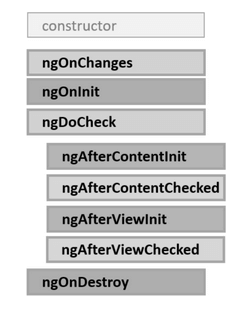
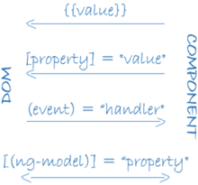
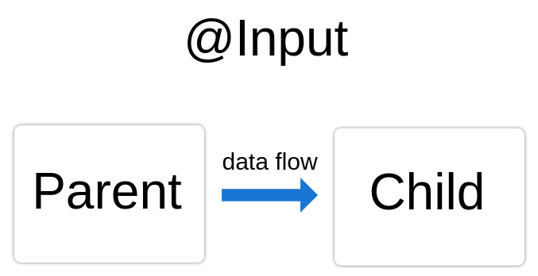
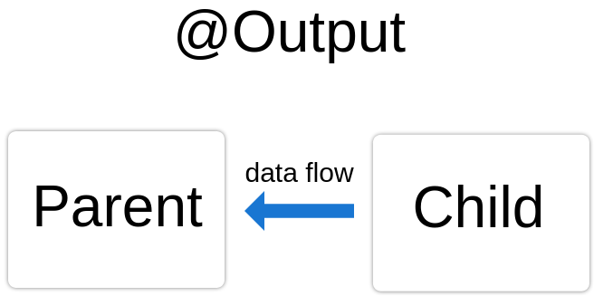
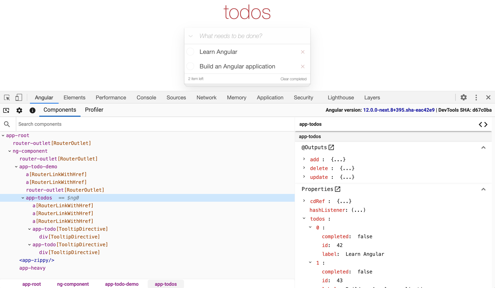

## Angular


[Дмитрий Вайнер](https://github.com/dmitryweiner)

Видео:
[1](https://drive.google.com/file/d/1Pnzf9Xkuz_IQ2wnJytIt3SQU4BRgAVQh/view?usp=sharing),
[2](https://drive.google.com/file/d/1CjTp5sgcAJShmzbi8xqv-kwR--izFjs0/view?usp=sharing),
[3](https://drive.google.com/file/d/1JKjbZQrWc8_Wh2rHWx-h9RUWAwfxkepm/view?usp=sharing).
---

### Фишечки
* TypeScript из коробки.
* Удобная автогенерация кода.
* Иерархия компонентов заложена в дизайне.
* Ленивая загрузка модулей и компонентов.
* Есть роутер.
* Есть сервисы (аналог стора).
* Есть собственный [твитор](https://twitter.com/angular).
---

### Установка
* Если есть права админа:
```shell
npm install -g @angular/cli
```
* Создание проекта:
```shell
ng new %APP_NAME%
```
* Если нет прав админа:
```shell
npx -p @angular/cli ng new %APP_NAME%
```
---

### Запуск
```shell
ng serve --open
```


---

### CLI
* Через CLI можно делать многие полезные вещи:
  * generate: сгенерировать что-то.
  * build: собрать проект.
  * add: добавить библиотеку.
  * test: юнит-тесты.
  * e2e: тест приложения в сборе.
  * lint: линтер.
* [Полный список](https://angular.io/cli).
---

### Идеология
* Приложение строится из модулей.
* Должен быть один корневой модуль и фиче-модули.
* Модуль содержит вью для отображения компонентов.
* Модуль использует сервисы (подключаются через инъекцию зависимостей).
* Модули используют декораторы.
---

### Автогенерация модуля
ng generate module chat
---

### Структура модуля
* Компонент(ы).
* Шаблон компонента.
* CSS компонента.
* Тест компонента.
* Модуль.


---

### Что внутри модуля
```js
import { NgModule } from '@angular/core';
import { BrowserModule } from '@angular/platform-browser';
@NgModule({
  imports:      [ BrowserModule ],
  providers:    [ Logger ],
  declarations: [ AppComponent ],
  exports:      [ AppComponent ],
  bootstrap:    [ AppComponent ]
})
export class AppModule { }
```
---

### Что внутри модуля
* declarations: перечисление компонентов и директив модуля.
* exports: что экспортируется наружу.
* imports: что импортируется в этот модуль.
* providers: какие сервисы есть в этом модуле.
* bootstrap: главное вью модуля.
---

### Особые модули
* BrowserModule импортируется один раз в корневом модуле.
* CommonModule импортируется в фиче-модулях.
  * Это нужно для работы директив ngIf, ngFor.
---


---

### Компоненты
* Компонент лежит внутри модуля и что-то отображает.
* Модуль может содержать несколько компонентов.
* Компоненты могут переиспользовать компоненты из других модули (части UI).
---

### Автогенерация компонента
```shell
ng generate component %MODULE_NAME%/%COMPONENT_NAME%
```
---

### Структура компонента

```js
import { Component } from '@angular/core';

@Component({
  selector: 'app-root', // тег компонента: <app-root></app-root>
  templateUrl: './app.component.html',
  styleUrls: ['./app.component.css']
})
export class AppComponent {
  title = 'angular-test'; // стейт
  methodName() {} // метод
}
```
---

### Жизненный цикл компонента
* [Подробнее](https://metanit.com/web/angular2/2.8.php).


---

### Синтаксис шаблонов
* [Подробнее](https://angular.io/guide/template-syntax).
* Вывод переменных и выражений JS:
```angular2html
<span>{{ title }} app is running!</span>

```
* Обработчик событий:
```angular2html
<button (click)="callPhone()">Call</button>
```
* Активный атрибут:
```angular2html
<div [hidden]="!itemForm.form.valid"></div>
```
* [Переменная шаблона](https://angular.io/guide/template-reference-variables):
```angular2html
<input #phone placeholder="phone number" />
{{ phone.value }}
```
---

### Pipes
```angular2html
<!-- Default format: output 'Jun 15, 2015'-->
 <p>Today is {{today | date}}</p>

<!-- fullDate format: output 'Monday, June 15, 2015'-->
<p>The date is {{today | date:'fullDate'}}</p>

<!-- shortTime format: output '9:43 AM'-->
<p>The time is {{today | date:'shortTime'}}</p>
```
* [Какие бывают потоки](https://angular.io/api?type=pipe).
---

### Директивы шаблонов
* [ngIf](https://angular.io/api/common/NgIf): отображает HTML, если выражение true:
```angular2html
<div *ngIf="condition">Content to render when condition is true.</div>
```
* [ngFor](https://angular.io/api/common/NgForOf): итерация по массиву:
```angular2html
<li *ngFor="let item of items">{{item.title}}</li>
```
* [ngSwitch](https://angular.io/api/common/NgSwitch): switch/case:
```angular2html
<container-element [ngSwitch]="switch_expression">
   <some-element *ngSwitchCase="match_expression_1">...</some-element>
   <some-element *ngSwitchCase="match_expression_2">...</some-element>
   <some-element *ngSwitchDefault>...</some-element>
</container-element>
```
* ngModel: двустороннее связывание.
* [Список директив](https://angular.io/guide/built-in-directives).
---

### Двусторонний биндинг


---

### Двусторонний биндинг
* Ставим библиотеку ```@angular/forms```.
* В модуле:
```js
import { FormsModule } from '@angular/forms';
imports: [ /* тут остальные импорты */
    FormsModule
],
```
* В компоненте:
```js
export class Component {
    value = 'Всем приветы';
}
```
* В шаблоне:
```angular2html
<input type="text" [(ngModel)]="value">
```
---

### Биндинг с полями объекта
* Можно биндить поля объекта к полям ввода ```object.field```:

```angular2html
<input name="title" [(ngModel)]="todo.title" #todoTitle="ngModel" />
<input name="isChecked" [(ngModel)]="todo.isChecked" #todoIsChecked="ngModel" />
<p>{{todoTitle.name}} : {{todoTitle.model}}</p>
<p>{{todoIsChecked.name}} : {{todoIsChecked.model}}</p>
```

```ts
export class Todo {
    constructor(public title: string, public isChecked: boolean) { }
}
@Component({
  selector: 'my-app'
})
export class AppComponent {
  todo: Todo = new Todo("", false);
}
```
---

### Валидация форм
* Валидация осуществляется с помощью атрибутов полей ввода, например:
  * **required**: требует обязательного ввода значения.
  * **pattern**: задает регулярное выражение, которому должны соответствовать вводимые данные.
* [Подробнее](https://metanit.com/web/angular2/5.3.php).
* [Ещё более подробно](https://angular.io/guide/form-validation).
---

### Валидация форм
* Проверка на пустоту:

```angular2html
<input class="form-control" name="name" [(ngModel)]="user.name" #name="ngModel" 
       required />
<div [hidden]="name.valid || name.untouched" class="alert alert-danger">
  Не указано имя
</div>
```
* Проверка по шаблону:

```angular2html
<input class="form-control" name="email" [(ngModel)]="user.email" #email="ngModel"
       required pattern="^[a-zA-Z0-9.!#$%&’*+/=?^_{|}~-]+@[a-zA-Z0-9-]+(?:\.[a-zA-Z0-9-]+)*$" />
<div [hidden]="email.valid || email.untouched" class="alert alert-danger">
  Некорректный email
</div>
```
---

### Доступные валидаторы
```ts
static min(min: number): ValidatorFn
static max(max: number): ValidatorFn
static required(control: AbstractControl): ValidationErrors | null
static requiredTrue(control: AbstractControl): ValidationErrors | null
static email(control: AbstractControl): ValidationErrors | null
static minLength(minLength: number): ValidatorFn
static maxLength(maxLength: number): ValidatorFn
static pattern(pattern: string | RegExp): ValidatorFn
static nullValidator(control: AbstractControl): ValidationErrors | null
static compose(validators: ValidatorFn[]): ValidatorFn | null
static composeAsync(validators: AsyncValidatorFn[]): AsyncValidatorFn | null
```

[Подробнее](https://angular.io/api/forms/Validators)
---

### Стили компонентов
* Все стили scoped.
* Активные стили:
```angular2html
<some-element [ngClass]="{'first': true, 'second': true, 'third': false}">...</some-element>
```
* [Подробнее](https://angular.io/guide/component-styles).
* [NgStyle](https://angular.io/api/common/NgClass), [NgStyle](https://angular.io/api/common/NgStyle).
---

### Передача данных от родителя к потомку
```angular2html
<component [property]="value"></component>
```

```ts
import { Component, Input } from '@angular/core';
export class Component {
  @Input() property: string = '';
}
```


---

### Передача данных от потомка к родителю


---

### Передача данных от потомка к родителю
* В потомке:

```ts
  @Output() newItemEvent = new EventEmitter<string>();

  addNewItem(value: string) {
    this.newItemEvent.emit(value);
  }
```

* В родителе:

```angular2html
<app-item-output (newItemEvent)="addItem($event)"></app-item-output>
```

```ts
export class ParentComponent {
  items = ['item1', 'item2', 'item3', 'item4'];
  addItem(newItem: string) {
    this.items.push(newItem);
  }
}
```
---

### Сервисы
* Автогенерация:

```shell
ng generate service %SERVICE_NAME%
```

* Примерный текст сервиса: 

```js
import { Injectable } from '@angular/core';

@Injectable({
  providedIn: 'root' // модуль, где представлен сервис
})
export class Service {
  items: Item[] = [];

  constructor() { }

  getItems(): Item[] {
    return this.items;
  }

  addItem(item: Item): void {
    this.items.push(item);
  }
}
```
---

### Сервисы и DI
* Компонент подключается к сервису с помощью 
[внедрения зависимости](https://ru.wikipedia.org/wiki/%D0%92%D0%BD%D0%B5%D0%B4%D1%80%D0%B5%D0%BD%D0%B8%D0%B5_%D0%B7%D0%B0%D0%B2%D0%B8%D1%81%D0%B8%D0%BC%D0%BE%D1%81%D1%82%D0%B8).
* [Подробнее](https://metanit.com/web/angular2/4.3.php).
* Добавляем сервис в нужный модуль:
```js
providers: [Service]
```
* Добавляем сервис в компонент с помощью DI:
```js
constructor(private service: Service) { }
```
---

### Получение данных от сервиса
* В компоненте:
```js
ngOnInit() {
    this.list = this.service.getItems();
}
```
* В шаблоне:
```angular2html
<ul>
  <li *ngFor="let item of list">
    <b>{{ item.id }}</b>: {{ item.title }} ₽
  </li>
</ul>
```
---

### Сервис с HTTP-запросами
* Сервис может менять состояние данных асинхронно, например в результате HTTP-запросов.
* Чтобы компонент получал всегда свежие данные, нужно на них подписаться.
* [Подробнее](https://angular.io/tutorial/toh-pt4), [ещё](https://angular.io/guide/http).
---

### Сервис с HTTP-запросами

```ts
import { Injectable } from '@angular/core';
import { HttpClient } from "@angular/common/http";

const URL = 'https://api.github.com/users/';

@Injectable({
  providedIn: 'root'
})
export class GithubService {
  constructor(private http: HttpClient) { }

  getData(username: string) {
    return this.http.get(URL + username);
  }
}
```
---

### Подписка на сервис в компоненте
* В модуле добавить в HttpClientModule в imports:
```js
imports: [
    CommonModule,
    FormsModule,
    HttpClientModule
],
```
* В компоненте:
```ts
constructor(private  githubService: GithubService) { }
ngOnInit() {
    this.githubService.getData(this.username).subscribe(data => this.data = data);
}
```
---

### Роуты: при создании проекта


```ts
// app-routing.module.ts
const routes: Routes = [
  { path: 'home', component: HomeComponent },
  { path: '', redirectTo: '/home', pathMatch: 'full' },
]
```
---

### Роуты: добавление в существующий проект
* Создать модуль:
```shell
ng generate module app-routing --flat --module=app
```
* Редактируем модуль app-routing.module.ts:

```ts
import { NgModule } from '@angular/core';
import { RouterModule, Routes } from '@angular/router';

const routes: Routes = [];

@NgModule({
  imports: [RouterModule.forRoot(routes)],
  exports: [RouterModule]
})
export class AppRoutingModule { }
```
---

### Роуты: добавление в существующий проект
* Настройка роутов:
```ts
const routes: Routes = [
    { path: 'home', component: HomeComponent },
    { path: '', redirectTo: '/home', pathMatch: 'full' },
]
```
* Подключение роутера в модуле:
```ts
imports: [
    BrowserModule,
    AppRoutingModule // <-- добавить
]
```
* В шаблоне app.component.html:
```angular2html
<router-outlet></router-outlet>
```
---

### Тестирование
* https://angular.io/guide/testing-components-basics
* https://angular.io/guide/testing-components-scenarios
---

### Дебаг
* [Документация](https://angular.io/guide/devtools).
* Расширение для 
[Firefox](https://addons.mozilla.org/ru/firefox/addon/angular-augury/), 
[Chrome](https://chrome.google.com/webstore/detail/angular-devtools/ienfalfjdbdpebioblfackkekamfmbnh).


---

### Полезные ссылки
* https://metanit.com/web/angular2/
* https://angular.io/guide/
* https://habr.com/ru/post/348818/
* https://angular.io/guide/cheatsheet

* Демо-проект ["Список покупок"](https://github.com/dmitryweiner/pokupki-angular)