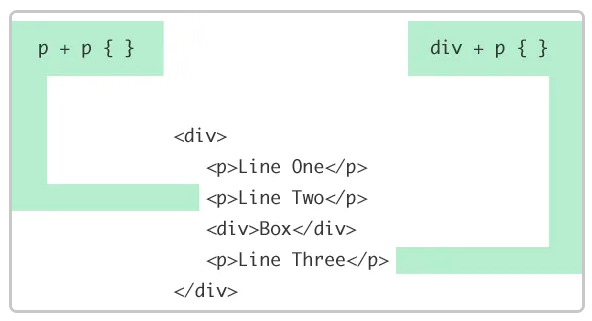

## Введение в CSS


[Дмитрий Вайнер](https://github.com/dmitryweiner)
---

### Немного истории
* **C**ascading **S**tyle **S**heets.
* Впервые описан в 1994.
* Принят как стандарт в 1996 (24 года назад).
* Сейчас принята третья версия CSS3.
* Создатель [Håkon Wium Lie](https://twitter.com/wiumlie?lang=en).
---

### Общие идеи CSS
* Разделить содержимое страницы и её дизайн.
* Гибко управлять отображением страницы, задавать:
  * Цвет
  * Шрифт
  * Расположение
  * Размеры
* Единый дизайн у разных страниц.
* Разный дизайн для разных устройств.
* Применять правила отображения **каскадно**: от более общих к более частным.
---

### Каскадность
* Правила CSS применяются от менее приоритетных к более приоритетным.
* Таким образом, можно задавать вначале более общие правила, а потом более частные,
уточняя отображение отдельных элементов.
---

### Минусы
* Разные браузеры по-разному отображают.
* Необходимо поддерживать консистентность CSS и HTML.
* Не верстальщику немного сложно понять.
---

---

### Иерархия стилей
* Стиль браузера:
  * Применяется, если не назначено никаких других стилей
* Стиль автора:
  * Применяется, если подключены CSS.
* Стиль пользователя:
  * Применяется, если включен особый режим.
----

---
### Подключение CSS
* Сторонний файл:
```html
<head>
      <link rel="stylesheet" type="text/css" href="style.css">
</head>
```
* Непосредственно в блоке &lt;head&gt;
```html
<style>
  #wrapper {
    padding: 20px;
  }
</style>
```
* Внутри элемента:
```html
<p style="font-size: 20px; color: green; font-family: arial, helvetica, sans-serif">
  .....
</p>
```
---

### Общий вид правила


* Правило состоит из селектора, скобок {}, внутри которых
определённым свойствам присваиваются значения.
* Свойств может быть несколько.
* Селектор служит для указания на элементы DOM-дерева,
чьё отображение надо изменить.
---
### Селекторы
* Селекторов может быть несколько в одном правиле, разделяются запятой:
```css
li.class, .another-lass {
    color: red;
}
```
* Разные свойства, относящиеся к одному селектору, надо записывать в одном правиле.
---

### Селекторы
* Универсальные: _*_
```css
✳️ { /* */ }
```
* По тегам:
```css
p, body, li { /* */ }
```
* По классам:
```css
.item, .list { /* */ }
```
* По ID:
```css
#root { /* */ }
```
* По атрибутам тегов:
```css
input[type="text"] { /* */ }
```
---

### Селекторы
* По потомкам: _родитель потомок_
```css
div li { /* */ }
```
* По детям: _родитель > ребёнок_
```css
div > li { /* */ }
```
* По соседям: _сосед1 + сосед2_
```css
div + div.class { /* */ }
```
* По псевдоклассам:
```css
a:active { /* */ }
```
* По псевдоэлементам: 
```css
a::first-letter { /* */ }
```
---

### Сложный селектор
* Селектор может сочетать несколько сущностей, 
например тег и класс, для большей специфичности:
<div style="background-color: silver">first</div>
<p style="color: red">second</p>

```html
<style>
    p.big {
        color: red; 
    }
    div#first {
        background-color: silver; 
    }
</style>
<div id="first">first</div>
<p class="second">second</p>
```
---

### Разница между ID и классом
* Класс нужен для группировки одинаковых элементов.
```html
<ul class="list">
  <li class="list-element">1</li>
  <li class="list-element">2</li>
  <li class="list-element">3</li>
</ul>
```
* У одного элемента может быть **несколько** классов.
```html
<p class="big red good"></p>
```
* ID должен быть **уникален** для элемента.
```html
<div id="reactRoot"></div>
```
---

### Селектор по потомкам
* Выбирает потомков на любом уровне вложенности:


```html
<style>
span {
    background-color: white;
}
div span {
    background-color: lawngreen;
}
</style>
<div>
    <span>Span #1, in the div.
          <span>Span #2, in the span that's in the div.</span>
    </span>
</div>
<span>Span #3, not in the div at all.</span>
```
---

### Селектор по детям
* Выбирает только потомков первого уровня, непосредственно детей:


```html
<style>
span {
  background-color: white;
}
div > span {
  background-color: lawngreen;
}
</style>
<div>
  <span>Span #1, in the div.
    <span>Span #2, in the span that's in the div.</span>
  </span>
</div>
<span>Span #3, not in the div at all.</span>
```
---

### Селектор по соседям
* Выбирает последующего соседа, если у него есть 
указанный предыдущий сосед:



```html
<style>
li + li {
  color: red;
}
</style>
<ul>
  <li>One</li>
  <li>Two!</li>
  <li>Three</li>
</ul>
```
---

### Псевдоклассы
* Служат для выбора элементов в определённом порядке (каждый второй, самый первый, последний).
* Особо полезные:
  * **:first-child**: первый потомок.
  * **:nth-child(N)**: каждый N-ый потомок.
  * **:last-child**: последний потомок.
  * **:only-child**: единственный потомок.
  * **:hover**: на что наведена мышь.
* [Список всех псевдоклассов](https://developer.mozilla.org/en-US/docs/Web/CSS/Pseudo-classes).
---

### Псевдоэлементы
* Служат для выбора элементов, которых не существует.
* Или для выбора отдельных кусочков элементов.
* Крайне полезные:
  * **::first-letter**: первая буква.
  * **::after**: после какого-то элемента.
  * **::before**: перед каким-то элементом.
* [Список всех псевдоэлементов](https://developer.mozilla.org/en-US/docs/Web/CSS/Pseudo-elements).
---

### Специфичность селекторов
* Если одному элементу подходит несколько правил, то применяется то правило, у которого специфичность селектора больше.
* Так и проявляется каскадность стилей.
* Специфичность вычисляется так: за каждый идентификатор (a) начисляется 100, за каждый класс и псевдокласс (b) начисляется 10, за каждый селектор тега и псевдоэлемент (c) начисляется 1.
---

### Специфичность селекторов
```css
✳️             {} /* a=0 b=0 c=0 -> специфичность = 0   */
li             {} /* a=0 b=0 c=1 -> специфичность = 1   */
li:first-line  {} /* a=0 b=0 c=2 -> специфичность = 2   */
ul li          {} /* a=0 b=0 c=2 -> специфичность = 2   */
ul ol+li       {} /* a=0 b=0 c=3 -> специфичность = 3   */
ul li.red      {} /* a=0 b=1 c=2 -> специфичность = 12  */
li.red.level   {} /* a=0 b=2 c=1 -> специфичность = 21  */
#t34           {} /* a=1 b=0 c=0 -> специфичность = 100 */
#content #wrap {} /* a=2 b=0 c=0 -> специфичность = 200 */
```
---

### Специфичность селекторов
* Встроенный стиль, добавляемый к тегу через атрибут style, имеет специфичность 1000, поэтому всегда перекрывает связанные и глобальные стили.
* Однако добавление ```!important``` перекрывает в том числе и встроенные стили.
* Если два селектора имеют одинаковую специфичность, то применяться будет тот стиль, что указан в коде ниже.
---
### Переменные

---

### 

---

### 

---

### 

---

### 

---

### 

---

### 

---

### 

---

### 

---

### 

---

### 

---

### 

---

### 

---

### 

---

### 

---

### 

---

### 

---

### 

---

### 

---

### 

---

### 

---

### 

---

### 

---

### 

---

### 

---

### 

---

### 

---

### 

---

### 

---

### 

---

### 

---
https://htmlacademy.ru/courses/41
