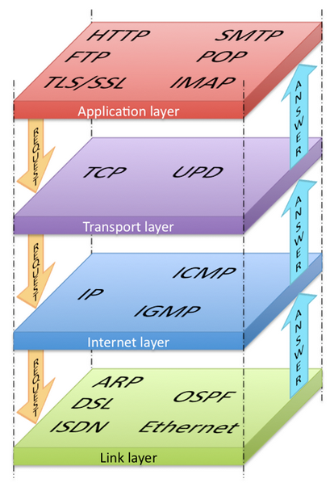
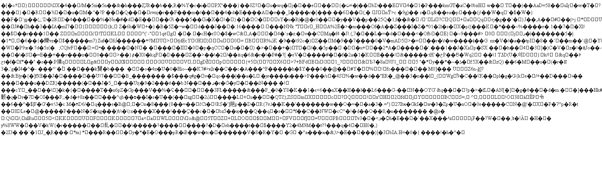
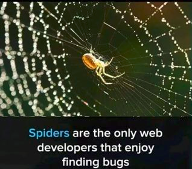

## Введение в HTML


[все лекции](https://github.com/dmitryweiner/web-lectures/blob/main/README.md)

Видео: 
[1](https://drive.google.com/file/d/1OkbiegilaFIY1DPr1JhmBx4Bg8iGSWFU/view?usp=sharing),
[2](https://drive.google.com/file/d/1ywU_fMsaTomGdc_JBkZGvha--LAoDBBF/view?usp=sharing)
---

### Как работает интернет


[Подробнее](https://developer.mozilla.org/ru/docs/Learn/Server-side/First_steps/Client-Server_overview)
---

### Стек [TCP/IP](https://ru.wikipedia.org/wiki/TCP/IP) ([подробнее](https://www.youtube.com/watch?v=BJSITWkSDQg))


---

### Что такое HTML?
* **H**yper **T**ext **M**arkup **L**anguage: язык разметки 
  [гипертекста](https://ru.wikipedia.org/wiki/%D0%93%D0%B8%D0%BF%D0%B5%D1%80%D1%82%D0%B5%D0%BA%D1%81%D1%82).
* HTML произошёл от [SGML](https://ru.wikipedia.org/wiki/SGML)
  * От SGML произошёл также [XML](https://ru.wikipedia.org/wiki/XML), они очень похожи.
* Создатель: [Тим Бернерс-Ли](https://twitter.com/timberners_lee).
* Первый в мире веб-сайт http://info.cern.ch.
* Текущая версия: 5.
---

### Пример HTML
```html
<!DOCTYPE html>
<html lang="ru">
<head>
  <title>Заголовок</title>
  <meta charset="UTF-8">
</head>
<body>
  <h1>Заголовок</h1>
  <p>My first paragraph.</p>
</body>
</html> 
```

---

### Структура документа
* Документ представляет собой иерархическое дерево тегов.
* Документ состоит из корневого тега `<html>`, в котором должны лежать `<body>` и `<head>`.
* Тег, лежащий внутри другого тега, называется потомком, а тот называется родителем.
* Теги на одном уровне называют siblings.
---


---

### Основные идеи языка
* Теги обозначаются угловыми скобками:
```html
<p>Тест</p>
```
* Теги объясняют браузеру, как отображать их содержимое.
* Тег может содержать текст вложенные теги, если это позволено спецификацией:
```html
<div>
    <p>Тест</p>
</div>
```
* Если тег открылся ```<p>```, он должен закрыться ```</p>```.
---

### Основные идеи языка
* Тег может не подразумевать закрывающего тега, тогда он оканчивается знаком /:
```html

```
* Внутри тега могут указываться параметры. Набор параметров специфичен для каждого тега.
* Символы переноса игнорируются (кроме как внутри определённых тегов).
---

### Тег и параметры
* У тега могут быть параметры (атрибуты).
* Они пишутся внутри тега, разделяются пробелом (или переносами), обрамляются двойными кавычками:
```html

```
* Набор параметров зависит от тега.

---

#### Основные теги
* **h1, h2, ..., h5**: заголовок страницы.
* **p**: параграф текста.
* **br**: перенос.
* **ul**: ненумерованный список.
* **ol**: нумерованный список.
* **div**: блок элементов.
* **img**: картинка.
* **a**: ссылка.
* **button**: кнопка.
* **input**: поле ввода.
* [Полный список](https://html5book.ru/html-tags/), [ещё](https://www.w3schools.com/tags/).
---

# Заголовок 1
## Заголовок 2
### Заголовок 3
#### Заголовок 4
##### Заголовок 5
```html
<h1>Заголовок 1</h1>
<h2>Заголовок 2</h2>
<h3>Заголовок 3</h3>
<h4>Заголовок 4</h4>
<h5>Заголовок 5</h5>
```
---

### Параграф [&lt;p&gt;](http://htmlbook.ru/html/p)
Lorem ipsum dolor sit amet, consectetur adipiscing elit, sed do eiusmod tempor incididunt ut labore et dolore magna aliqua.
```html
<p>
  Lorem ipsum dolor sit amet, consectetur adipiscing elit, sed do eiusmod tempor incididunt ut labore et dolore magna aliqua.
</p>
```
---

### Перенос [&lt;br&gt;](http://htmlbook.ru/html/br)
Lorem ipsum dolor sit amet,

consectetur adipiscing elit, sed do eiusmod tempor incididunt ut labore et dolore magna aliqua.
```html
<p>
  Lorem ipsum dolor sit amet,<br/>
  consectetur adipiscing elit, sed do eiusmod tempor incididunt ut labore et dolore magna aliqua.
</p>
```
---

### Ненумерованный список [&lt;ul&gt;](http://htmlbook.ru/html/ul)
* Элемент 1
* Элемент 2
* Элемент 3

```html
<ul>
  <li>Элемент 1</li>
  <li>Элемент 2</li>
  <li>Элемент 3</li>
</ul>
```
---

### Нумерованный список [&lt;ol&gt;](http://htmlbook.ru/html/ol)
1. Элемент 1
2. Элемент 2
3. Элемент 3

```html
<ol>
  <li>Элемент 1</li>
  <li>Элемент 2</li>
  <li>Элемент 3</li>
</ol>
```
---

### Блок [&lt;div&gt;](http://htmlbook.ru/html/div)
Блок, отделённый отступами.

Ещё один блок.

```html
<div>
  Просто блок текста, отделённый отступами.
</div>
<div>
  Ещё один блок.
</div>
```
---


### Картинка [&lt;img&gt;](http://htmlbook.ru/html/img)
* Параметры:
  * **src**: путь до картинки.
  * **width**: ширина.
  * **height**: высота.
  * **alt**: альтернативный текст.


```html

```

---

### Ссылка [&lt;a&gt;](http://htmlbook.ru/html/a)
* Параметры:
  * **href**: путь перехода.
  * **target**: открывать ли новую вкладку.

<a href="https://google.com" target="_blank">Ссылка</a>

```html
<a href="https://google.com" target="_blank">Ссылка</a>
```
---

### Кнопка [&lt;button&gt;](http://htmlbook.ru/html/button)
* Параметры:
  * **type**: тип кнопки button, reset, submit.
  * Тип кнопки имеет смысл, только если она внутри `<form>`.

<button>Нажми меня</button>

```html
<button>Нажми меня</button>
```
---
### Форма [&lt;form&gt;](http://htmlbook.ru/html/form)

<form>
  <input type="text" placeholder="Введите что-нибудь"/><br/>
  <button type="reset">Reset</button>&nbsp;
  <button type="submit">Submit</button>
</form>

```html
<form>
  <input type="text" placeholder="Введите что-нибудь" />
  <button type="reset">Reset</button>
  <button type="submit">Submit</button>
</form>
```
---

### Поле ввода [&lt;input&gt;](http://htmlbook.ru/html/input)
* Параметры:
  * **type**: тип поля text, number, radio и тд.
  * **value**: содержимое.
  * **placeholder**: подсказка.

<input type="text" value="я текстовое поле ввода"/>

```html
<input type="text" value="я текстовое поле ввода"/>
```
---
### [Варианты полей ввода](http://htmlbook.ru/html/input/type)

<input type="text" /><br/>

```html
<input type="text" />
```

<input type="number" /><br/>

```html
<input type="number" />
```

<input type="password" /><br/>

```html
<input type="password" />
```

<input type="checkbox" /><br/>

```html
<input type="checkbox" />
```
---
### [Варианты полей ввода](http://htmlbook.ru/html/input/type)

<input type="range" />

```html
<input type="range" />
```

<input type="file" />

```html
<input type="file" />
```

<input type="color" />

```html
<input type="color" />
```

<input type="date" />

```html
<input type="date" />
```
---

### [&lt;label&gt;](http://htmlbook.ru/html/label) + Checkbox
<label>
    <input type="checkbox">
    Запомнить меня
</label>

```html
<label>
  <input type="checkbox">
  Запомнить меня
</label>
```
---

### Radio buttons
<label><input type="radio" name="radio1"/>Вариант 1</label><br/>
<label><input type="radio" name="radio1"/>Вариант 2</label><br/>
<label><input type="radio" name="radio1"/>Вариант 3</label><br/>

```html
<label><input type="radio" name="radio1"/>Вариант 1</label>
<label><input type="radio" name="radio1"/>Вариант 2</label>
<label><input type="radio" name="radio1"/>Вариант 3</label>
```

Для группировки инпутов используется атрибут `name` с одинаковым значением.
---

### Selectbox [&lt;select&gt;](http://htmlbook.ru/html/select)
<select>
    <option>Пункт 1</option>
    <option>Пункт 2</option>
    <option>Пункт 3</option>
</select>

```html
<select>
  <option>Пункт 1</option>
  <option>Пункт 2</option>
  <option>Пункт 3</option>
</select>
```
---

### Множественный selectbox [&lt;select&gt;](http://htmlbook.ru/html/select)
<select multiple>
    <option>Пункт 1</option>
    <option>Пункт 2</option>
    <option>Пункт 3</option>
</select>

```html
<select multiple>
  <option>Пункт 1</option>
  <option>Пункт 2</option>
  <option>Пункт 3</option>
</select>
```
---

### Entities
* Для вывода символов, встречающихся в HMTL-разметке (как &lt; и &gt;), используются entities.
* Этот же приём используется для вывода эмодзи, разных других интересных символов вроде &copy;.
* [Каталог entities](https://www.freeformatter.com/html-entities.html).
* [Список эмодзи](https://www.w3schools.com/charsets/ref_emoji.asp).
```html
&copy; отображает ©
&#128030; (десятичный код) 
или &#x1F41E; (16-ричный) отображают 🐞
```
---

### Блок &lt;head&gt;
* В этом блоке подключаются:
  * Скрипты JavaScript.
  * Стили.
* Указывается title страницы (то, что отображается в заголовке вкладки).
* И многие другие полезные вещи:
  * Кодировка.
  * Ключевые слова для SEO.
---
  
### Метаданные [&lt;meta&gt;](http://htmlbook.ru/html/meta)
```html
<head>
  <!-- Кодировка: -->
  <meta charset="UTF-8">
  <!-- Для SEO: -->
  <meta name="description" content="Free Web tutorials">
  <meta name="keywords" content="HTML, CSS, JavaScript">
  <meta name="author" content="John Doe">
  <!-- Режим отображения: -->
  <meta name="viewport" content="width=device-width, initial-scale=1.0">
</head> 
```
---

### Кодировка
* Весь мир к счастью перешёл на кодировку [UTF-8](https://ru.wikipedia.org/wiki/UTF-8).
* Именно её и стоит указывать:
```html
<meta charset="UTF-8">
```

* Иначе страница выглядит вот так:


---
### Стили
* Стили можно определять непосредственно на странице:
```html
<html>
<head>
    <style>
      .class { 
        background-color: red;
      }
    </style>
</head>
<body>
...
</body>
</html>
```
---

### Стили
* Но лучше писать стили в отдельном файле:

```html
<html>
    <head>
      <link rel="stylesheet" href="styles.css">
    </head>
    <body>
    ...
    </body>
</html>
```
---

### Скрипты
* Активное содержимое страницы описывается на языке JavaScript и тоже располагается в блоке &lt;head&gt;.
* Либо непосредственно в теге &lt;script&gt;:
```html
<head>
    <script type="application/javascript">
      console.log('Hello world!');
    </script>
</head>
```
* Либо в отдельном файле:
```html
<head>
      <script src="script.js"></script>
</head>
```
---

### Относительные и абсолютные пути
* Ссылки на ресурсы могут быть относительными и абсолютными ([подробнее](http://htmlbook.ru/samhtml/ssylki/absolyutnye-i-otnositelnye-ssylki)).
* Абсолютные ссылки указываются вместе с доменом:
```html
<script src="http://google.com/script.js"></script>
```
* Относительные ссылки указываются от текущего файла:
```html
<script src="../scripts/script.js"></script>
```
---

### Относительные пути
* На уровень вверх относительно текущего файла:
```html
<script src="../script.js"></script>
```
* В том же каталоге, что и текущий файл:
```html
<script src="script.js"></script>
```
* От корневого каталога сервера:
```html
<script src="/script.js"></script>
```
---

### Комментарии
* Комментарии в HTML выглядят так:

```html
<!-- Комментарий -->

<!-- 
Многострочный 
комментарий
 -->
```
---

### Полезные ссылки
* https://www.w3schools.com/tags/
* https://www.w3schools.com/html/default.asp
* https://htmlacademy.ru/courses/basic-html-css
* http://htmlbook.ru/html/
* [Основы функционирования компьютерных сетей](https://www.youtube.com/watch?v=BJSITWkSDQg)

---


