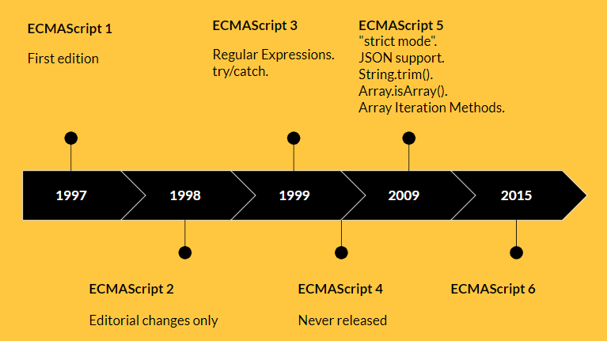
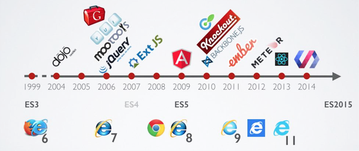
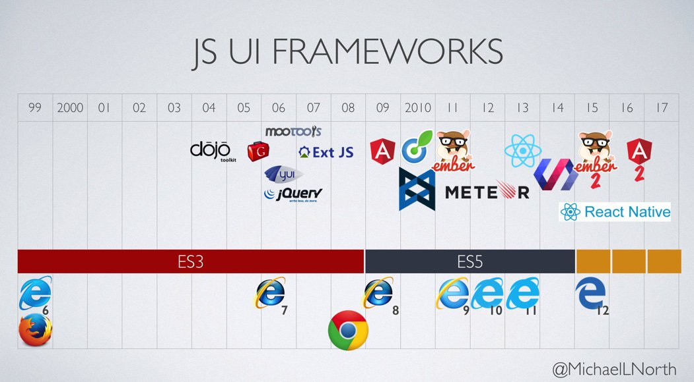
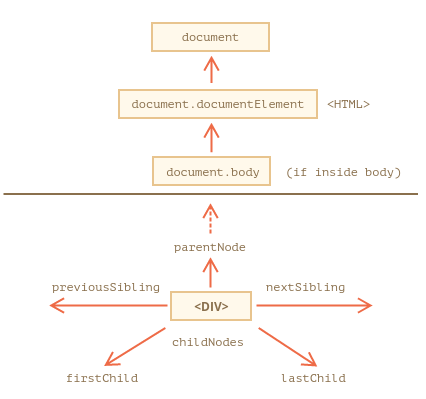

### Введение в JavaScript


[Дмитрий Вайнер](https://github.com/dmitryweiner)

Видео: 
[1](https://drive.google.com/file/d/19Vm7ZAM2YgCl3kvZAdTFNTNwN5ADT-du/view?usp=sharing),
[2](https://drive.google.com/file/d/1EaJTtvPbZauxQkvKh3kYAJWkLup7FzBo/view?usp=sharing),
[3](https://drive.google.com/file/d/1Ew3SkowW1VarQFBBVDei81JZTZvCKQfv/view?usp=sharing),
[4](https://drive.google.com/file/d/1RiGtyXDt6ACtyTmWaCvJwU0q_Qqs4xmi/view?usp=sharing),
[5](https://drive.google.com/file/d/1qtU9mq5pBjNBbpfeETOB8oy6FzOG0Bqq/view?usp=sharing).
---

### Факты
* Создатель [Брендан Айк (Brendan Eich)](https://twitter.com/brendaneich?lang=en).
* Год создания: 1995.
* Текущая версия: [12th Edition – ECMAScript 2021](https://en.wikipedia.org/wiki/ECMAScript#12th_Edition_%E2%80%93_ECMAScript_2021).
---

### Основные принципы
* Нестрогая типизация.
* Низкий порог входа.
* Выполняется в браузере (уже не только).
* Выполняется интерпретатором без компиляции.
* Прощает ошибки программиста (додумывает что-то своё).
---

### История развития языка

---

### История развития языка

---

### История развития фреймворков на JS

---

### История развития фреймворков на JS

---

### Подключение JS
```html
<!DOCTYPE html>
<html lang="ru">
<head>
    <meta charset="UTF-8">
    <title>Title</title>
  <script>
    console.log("Я скрипт!");
  </script>
  <script src="script.js"></script><!-- скрипт во внешнем файле -->
</head>
<body>
<script>
  console.log("И я скрипт!");
</script>
</body>
</html>
```
---

### Объявление переменных
* Устаревший синтаксис:
```js
var i = 1;
```
* Современный синтаксис:
```js
let i;
const j = 2;
```
* За один раз можно объявить и инициализировать несколько переменных:
```js
const i = 1, j = 2;
```
---

### Чем плох var?
* Объявление переменной перемещается в начало блока (hoisting).
* Нет блочной области видимости.
* Нет ошибки при повторном объявлении.
* При объявлении в глобальной области видимости затрагивает объект window. 
* [Подробнее](https://learn.javascript.ru/var). 
---

### Разница между let и const
* **const** служит для переменных, чьё значение не будет изменяться:
```js
const a = 1;
a = 2; // Exception!
const arr = [1, 2, 3];
arr.push(4); // всё хорошо, ссылка на массив не изменилась
```
* **let** для тех переменных, которые изменяются:
```js
let i = 1;
i = 2; // всё в порядке
```
---

### Области видимости
* Переменная видна только после объявления.
```js
console.log(i); // Uncaught ReferenceError: i is not defined
const i = 1;
console.log(i); // 1
```
* Переменная, объявленная внутри блока, видна только внутри этого блока.
```js
{
    const i = 1;
}
console.log(i); // Uncaught ReferenceError: i is not defined
```
---

### Области видимости
* Внутри блока видны внешние переменные сколь угодного высоких уровней.
```js
const i = 1;
{
    console.log(i); // 1
}
```
* Блочные переменные перекрывают внешние при совпадении имён.
```js
const i = 1;
{
    const i = 2;
    console.log(i); // 2
}
```
---

### Типы данных
* **number**: число.

```js
const i = 1; // в десятиричном виде
const j = 0xBE; // в 16-ричном виде
const k = 0777; // в восьмеричном виде
const f = 0b0101010; // в двоичном виде
```
* **string**: строка.

```js
const s = "string";
const anotherString = '123';
const phrase = `Обратные кавычки позволяют
 встраивать переменные ${s}`; // шаблонная строка
```
* **boolean**: [булево](https://ru.wikipedia.org/wiki/%D0%91%D1%83%D0%BB%D1%8C,_%D0%94%D0%B6%D0%BE%D1%80%D0%B4%D0%B6) значение.

```js
const isSet = true;
```
---

### Типы данных
* **function**: функция.

```js
const f = function (i) {
    return i * 2;
};
```
* **array**: массив.

```js
const arr = [1, 2, 3];
```
* **object**: объект.

```js
const obj = {
    field: 1
};
```
---

### Специальные типы
* **undefined**: не определено.

```js
let u;
console.log(u); // undefined
```
* **null**: значение неизвестно.

```js
let u = null;
console.log(u); // null
```
---

### Как узнать тип прямо в коде
* Оператор **typeof**:

```js
typeof undefined // "undefined"
typeof 0 // "number"
typeof 10n // "bigint"
typeof true // "boolean"
typeof "foo" // "string"
typeof null // "object" -- известный баг
typeof alert // "function"
```
---

### Операторы
* Присваивание: =
* Математические: *, /, +, -, %, **, ++, --
* Сравнения: >, <, >=, <=, ==, !=, ===, !==
* Логические: !, ||, &&
* Тернарный: ?
* Побитовые: |, &, ~, ^, <<, >>, >>>
* [Подробнее](https://learn.javascript.ru/operators).

---

### Неявное приведение типа
* Операторы неявно приводят переменные к тому типу, с которым работают.
* Математические операторы приводят к типу number, кроме оператора +.
* Логические операторы и операторы сравнения приводят к типу boolean.
* [Подробнее](https://learn.javascript.ru/type-conversions).
```js
"6" / "2" // 3
3 + "2" // 5
```
---

### Особенности оператора +
* Оператор "+" работает ещё и со строками, поэтому если первый операнд строка, то второй будет преобразован в строку:

```js
'2' + 1
// '21'

'2' - 1
// 1
```
---

### Явное приведение типа
* Если есть сомнения относительно типа пришедших данных, можно преобразовать к нужному типу:

```js
let value = "123";
console.log(value + 1); // "1231"
console.log(Number(value) + 1); // "124"
```
* Преобразовывать можно в любой встроенный тип: String, Number, Boolean, Array:

```js
String(123) // "123"
Boolean("false") // false
Number("123") // 123
```
* [Подробнее](https://learn.javascript.ru/type-conversions).
---

### Приведение типа и системы счисления
* Можно использовать приведение для преобразования между системами счисления:
* Из десятичной в любую другую:
```js
console.log(
    Number(123).toString(16 /* тут основание системы */)
);
// "7b"
```
* В десятичную систему:
```js
console.log(
    parseInt("7b", 16)
);
// 123
```
---

### Странности JS
* Поскольку преобразование типов может происходить неявно, некоторый код
  [выполняется странно](https://github.com/denysdovhan/wtfjs).
* Чтобы так не было, код надо писать с учётом типов или пользоваться типизированным языком TypeScript.
---

### Сравнение с учётом типа
* Есть два оператора сравнения: == и ===.
* Оператор == сравнивает, приводя операнды преимущественно к типу Number (у объектов проверяются ссылкию. Если один объект, а другой нет - пытается привести объект к примитивному типуThe equality operator (==) checks whether its two operands are equal, returning a Boolean result. Unlike the strict equality operator, it attempts to convert and compare operands that are of different types.):
```js
1 == "1" // true
```
* Оператор === сравнивает ещё и типы операндов. Если они не равны, равенство неверно:
```js
1 === "1" // false
```
* Надо пользоваться **ТОЛЬКО** операторами **===** и **!==**.
---

### Массивы
* Массивы объявляются с помощью квадратных скобок.
* Нумерация индексов элементов начинается с 0.
* Можно добавлять/удалять элементы в любой момент.
* Длина массива хранится в свойстве .length.
```js
const a = [], arr = [1, 2, 3];
arr.length; // 3
arr.push(4); // [1, 2, 3, 4]
arr.length; // 4
arr[0]; // 1
```
---

### Объекты
* Объект создаётся с помощью фигурных скобок, в которых перечисляются поля и значения.
* В объект можно добавить поле после создания.
* Значение поля можно посмотреть с помощью оператора точка "."
```js
const obj = {
    field: 1,
    stringField: "123",
    method() { /* ... */ }
};
obj.anotherField = true;
console.log(obj.field); // 1
```
---

### Создание объекта
* При создании объекта можно использовать другие переменные в качестве полей:
```js
const str = "John";
const password = "1#$%1";
const account = 10000;
// ❌
const user = {
    name: str,
    password: password,
    account: account
};
// ✔
const user = {
    name: str,
    password,
    account
};
```
---

### Optional chaining
* Что если мы пытаемся получить доступ к полю объекта,
  а такого поля нет?
* Чтобы не было ошибки, надо использовать оператор "?.":
```js
const obj = {
    a: 1,
    b: 2
};
console.log(obj.c.d); // Error!
console.log(obj?.c?.d); // undefined
```
* [Подробнее](https://learn.javascript.ru/optional-chaining).

---

### Ссылочные типы данных
* Присваивание переменных, содержащих массивы или объекты, происходит по ссылке:

```js
const obj = { a: 1, b: 2 };
const anotherObj = obj;
anotherObj.b = 42;
console.log(obj.b); // 42

const arr = [1, 2, 3];
const anotherArr = arr;
anotherArr[1] = 123;
console.log(arr[1]); // 123
```
----


---

### Условия
* Условный оператор if / else обрамляется фигурными скобками. 
* В условии должно быть булево значение или выражение, возвращающее такое значение.
* Если в условии не булево значение, оно будет к нему приведено.
```js
const a = 1, b = 2;
if (a > b) {
    console.log("a больше b");
} else {
    console.log("a не больше b");
}
```
---

### Switch
* Если if'ов много, удобно сделать из них switch:
```js
switch (a) {
    case 1: 
        console.log("a === 1");
        break;
    case 2: 
        console.log("a === 2");
        break;
    case 3: 
        console.log("a === 3");
        break;
    default: console.log("ни одно условие не сработало");
}
```
---

### Циклы
* Циклы делаются с помощью конструкций while, do/while, for:

```js
let i = 0;
while(i < 5) {
    console.log(i);
    i++;
}

// переменная объявляется прямо в for
for (let j = 0; j < 5; j++) {
    console.log(j);
}
```

---

### Варианты for
* Помимо классического for'а с переменной цикла есть ещё 2 удобных варианта для походов по массивам:

```js
const arr = [1, 2, 3];

// итерируем по индексам массива
for (let i in arr) {
    console.log(arr[i]);
}

// итерируем по элементам массива
for (let item of arr) {
  console.log(item);
}
```
---

### Функции
* Функция &mdash; участок кода, который можно вызвать.
* Функции бывают анонимные и именованные.
* Функции могут принимать на вход аргументы.
* Функции могут возвращать значение (return).
* Ссылку на функцию можно сохранить в переменную и потом вызвать.
* Функция может вызывать саму себя (рекурсия).
---

### Функции
[Документация](https://learn.javascript.ru/es-function).

```js
function fact(number) {
    let result = 1;
    for (let i = 1; i <= number; i++) {
        // сокращённая запись result = result * number
        result *= i;
    }
    return result;
}
fact(5); // 120
```
---

### Варианты анонимных функций
* Анонимная функция может быть записана в полном виде:
```js
const multiply = function (a, b) {
    return a * b;
}
multiply(2, 2); // 4
```
* Или в стрелочном виде:
```js
const divide = (a, b) => {
    return a / b;
}
divide(4, 2); // 2
```
* [Отличия](https://learn.javascript.ru/es-function#funktsii-strelki-ne-imeyut-svoego-this).
---

### Варианты стрелочных функций
* Если стрелочная функция сразу возвращает результат, можно обойтись без {}.
* Если аргумент один, можно обойтись без ().

```js
// эти функции эквивалентны
const square = function (a) {
    return a * a;
}

const square = (a) => {
    return a * a;
}

const square = a => a * a;
```
---

### Параметры по умолчанию
* У функции могут быть параметры, которые можно не указывать. Тогда будут заданы значения по умолчанию:
```js
function sayMyName(name = "Walter White") {
    console.log(`Your name is ${name}`);
}
sayMyName("Dmitry"); // Your name is Dmitry
sayMyName(); // Your name is Walter White
```
* Параметры по умолчанию могут быть не только значением, но и выражением.
* Они должны быть последними в списке параметров. Так нельзя: ❌
```js
function sayMyName(firstName = "Walter", lastName) {}
```
---

### Ссылочные типы в параметрах
* При передаче ссылочных типов в аргументах функция может их изменять.
* Эти изменения будут видны снаружи функции.
* Нельзя использовать этот эффект для возврата значений из функции, следует пользоваться return'ом.
```js
function changer(o) {
    o.a = 123;
}
const obj = { a: 1, b: 2 };
changer(o);
console.log(obj.a); // 123
```
---

### Rest & spread
* Оператор ...rest используется в аргументах функции и вбирает в себя все не перечисленные параметры.

```js
function sumAll(...args) { // args — имя массива
  let sum = 0;
  for (let arg of args) sum += arg;
  return sum;
}
console.log(sumAll(1, 2, 3)); // 6
```
* [Подробнее](https://learn.javascript.ru/rest-parameters-spread-operator).
---

### ...rest и аргументы функции
* Не все аргументы могут лежать в ...rest. Могут быть и указанные аргументы:
```js
function sayMyName(firstName, lastName, ...rest) {
    console.log(`${firstName} ${lastName} - ${rest}`);
}
```
---

### Rest & spread
* Оператор ...spread используется там, где ожидается несколько аргументов.
* Ему на вход подаётся что-то итерируемое (объект, массив).
```js
const arr = [1, 2, 3];
console.log(sumAll(...arr)); // 6
```
---

### Копирование объектов и массивов с помощью ...spread
* Чтобы избежать копирования по ссылке, нужно скопировать сам объект/массив.
* В этом нам поможет оператор ...spread:

```js
const obj = { a: 1, b: 2 };
const newObj = {...obj};
newObj.a = 123;
console.log(obj.a); // 1

const arr = [1, 2, 3];
const newArr = [...arr];
newArr[1] = 123;
console.log(arr[1]); // 2
```
---

### Деструктурирующее присваивание
* Можно при создании переменных брать значения из объектов:
```js
const obj = { a: 1, b: 2 };
const { a, b } = obj;
console.log(a, b); // 1, 2
```
* Или из массивов:
```js
const arr = [1, 2, 3];
const [a, b] = arr;
console.log(a, b); // 1, 2
```
* [Подробнее](https://learn.javascript.ru/destructuring-assignment).
---

### Деструктурирующее присваивание и ...rest
* Оставшиеся поля можно сложить в одну переменную с помощью оператора ...rest:

```js
const obj = { a: 1, b: 2, c: 3, d: 4 };
const { a, b, ...notUsed } = obj;
console.log(a, b); // 1, 2
console.log(notUsed); // { c: 3, d: 4 }

const arr = [1, 2, 3, 4];
const [f, g, notUsedArray] = arr;
console.log(f, g); // 1, 2
console.log(notUsedArray); // [3, 4]
```
---

### Деструктурирующее присваивание и параметры по умолчанию
* У объекта может не быть указанных полей, поэтому разумно применить параметры по умолчанию:

```js
const user = {
    firstName: "Walter",
    lastName: "White"
};
const { firstName = "", lastName = "", surname = "" } = user; 
```
---

### Деструктурирующее присваивание в аргументах функции
* Можно пользоваться деструктурирующим присваиванием прямо в аргументах функции.
* Это удобно, когда параметров слишком много (больше 3).
* Удобно это сочетать с параметрами по умолчанию.
---

### Деструктурирующее присваивание в аргументах функции
```js
function showMenu({title = "Заголовок", width = 100, height = 200}) {
  console.log(`${title} ${width} ${height}`);
}

// чтобы вызвать совсем без параметров:
function showMenu({
                    title = "Заголовок",
                    width = 100,
                    height = 200
} = {}) {
  console.log(`${title} ${width} ${height}`);
}
```
---

### Чистые функции
* Функции по возможности должны быть чистыми ([pure function](https://ru.wikipedia.org/wiki/%D0%A7%D0%B8%D1%81%D1%82%D0%BE%D1%82%D0%B0_%D1%84%D1%83%D0%BD%D0%BA%D1%86%D0%B8%D0%B8)).
* Чистая функция:
  * Детерменированная: при одних и тех же аргументах выдаёт одинаковые значения.
  * Без побочных эффектов:
    * Не изменяет внешние переменные.
    * Не изменяет аргументы.
* Плюсы чистых функций:
  * Легко тестировать.
  * Легко кешировать.
  * Легко понимать.
---

### Массивы: добавление/удаление элементов:
* push(...items) – добавляет элементы в конец,
* pop() – извлекает элемент с конца,
* shift() – извлекает элемент с начала,
* unshift(...items) – добавляет элементы в начало.
* splice(pos, deleteCount, ...items) – начиная с индекса pos, удаляет deleteCount элементов и вставляет items.
---

### Массивы: добавление/удаление элементов:
* slice(start, end) – создаёт новый массив, копируя в него элементы с позиции start до end (не включая end).
* concat(...items) – возвращает новый массив: копирует все члены текущего массива и добавляет к нему items. Если какой-то из items является массивом, тогда берутся его элементы.
---

### splice и slice
* Из массива можно вырезать кусок произвольной длины из произвольного места с помощью _splice_.
**Внимание!** Этот метод меняет сам массив.
```js
const arr = [1, 2, 3, 4, 5];
arr.splice(1, 2);
console.log(arr); // [1, 4, 5]
```
* Можно взять часть массива с помощью _slice_. Этот метод массив не изменяет.
```js
const arr = [1, 2, 3, 4, 5];
console.log(arr.slice(1, 2)); // [2, 3]
console.log(arr); // [1, 2, 3, 4, 5]
```
* [Подробнее](https://learn.javascript.ru/array-methods).
---

### Массивы: поиск среди элементов:
* indexOf/lastIndexOf(item, pos) – ищет item, начиная с позиции pos, и возвращает его индекс или -1, если ничего не найдено.
* includes(value) – возвращает true, если в массиве имеется элемент value, в противном случае false.
---

### Массивы: поиск среди элементов:
* filter - для каждого элемента вызывает функцию и отдаёт все те, для которых функция возвращает true.
* find – то же, что и предыдущее, только возвращается первый элемент.
* findIndex похож на find, но возвращает индекс вместо значения.
---

### Массивы: перебор элементов:
* forEach(func) – вызывает func для каждого элемента. Ничего не возвращает.
* map(func) – создаёт новый массив из результатов вызова func для каждого элемента.
* sort(func) – сортирует массив «на месте», а потом возвращает его.
* reverse() – «на месте» меняет порядок следования элементов на противоположный и возвращает изменённый массив.
---

### Массивы: перебор элементов:
* reduce(func, initial) – вычисляет одно значение на основе всего массива, вызывая func для каждого элемента и передавая промежуточный результат между вызовами.

```js
const arr = [1, 2, 3];
arr.reduce(
    (accumulator, currentValue) => accumulator + currentValue,
    0
);
// 6 - сумма массива
```
---

### Массивы: полезные функции:
* split/join – преобразует строку в массив и обратно.
* Array.isArray(arr) проверяет, является ли arr массивом.
* [Документация](https://learn.javascript.ru/array-iteration).
---

### Примеры

```js
const arr = [1, -1, 2, -2, 3];
arr.map(element => element * element);
// возвели в квадрат каждый элемент и вернули массив [1, 1, 4, 4, 9]

arr.forEach(element => console.log(element)); // вывели каждый элемент

arr.reduce((accumulator, currentValue) => accumulator + currentValue);
// 3 - сумма массива

arr.reverse() // перевернутый массив [3, -2, 2, -1, 1]
```
---

### Полезные методы массивов
* every: возвращает true, если вызов callback вернёт true для каждого элемента arr.
* some: возвращает true, если вызов callback вернёт true для какого-нибудь элемента arr.

```js
const arr = [1, -1, 2, -2, 3];

const isPositive = element => element > 0;

arr.every(isPositive); // false, не все положительные
arr.some(isPositive); // true, есть хоть одно положительное
arr.filter(isPositive); // [1, 2, 3]
arr.find(isPositive); // 1 -- первое положительное число
arr.findIndex(isPositive); // 0
```
---

### Обращение к DOM'у
* Поиск элементов DOM осуществляется с помощью следующих методов:
  * document.getElementById().
  * document.querySelector().
  * document.querySelectorAll().
  * document.getElementsByTagName().
  * document.getElementsByClassName().
  * document.getElementsByName().
* [Подробнее](https://learn.javascript.ru/searching-elements-dom).
---

### Поиск элемента по ID
```html
<div id="root"></div>
<script>
  const element = document.getElementById("root");
  console.log(element);
</script>
```
---

### Оси родитель-потомок и другие
* У найденного элемента можно посмотреть его потомков:
  * childNodes.
  * firstChild.
  * lastChild.
* И его родителя:
  * parentNode. 
* [Подробнее](https://learn.javascript.ru/dom-navigation).
---


---

### Коллекции
* Методы поиска по DOM querySelectorAll, getElementsByName и др. возвращают коллекции узлов.
* Коллекции могут быть итерированы с помощью for..of:
```js
for (let node of document.body.childNodes) {
    conslole.log(node); // покажет все узлы из коллекции
}
```
* Коллекцию можно конвертировать в массив для фильтрации или сортировки:
```js
const arr = Array.from(document.body.childNodes);
```
---

### Живые коллекции
* Коллекции являются живыми (кроме querySelectorAll) и динамически обновляются при изменении DOM.
* Если мы сохраним ссылку на elem.childNodes и добавим/удалим узлы в DOM, то они появятся в сохранённой коллекции автоматически.
---

### Изменение свойств
* У найденных узлов можно читать и изменять всевозможные свойства:
  * **.innerText**: текст внутри узла.
  * **.innerHTML**: если туда нужно добавить HTML.
  * **.style**.
  * **.width**.
  * **.value** (только для input).

```html
<div id="root"></div>
<script>
  const element = document.getElementById("root");
  element.innerText = "123";
</script>
```
---

### Чтение свойств
* Точно так же можно прочитать свойства DOM-элементов.
* Это может пригодиться, если надо узнать, что пользователь ввёл в поле ввода:

```html
<input type="text" id="userInput" />
<script>
  const userInput = document.getElementById("userInput");
  console.log(userInput.value);
</script>
```
---

### Создание элементов
* Для создания элемента можно использовать метод document.createElement:
```html
<div id="root"></div>
<script>
  const newElement = document.createElement("span");
  newElement.innerHTML = "Я просто маленький текстовый элемент";
  document.getElementById("root").appendChild(newElement);
</script>
```
---

### Создание элементов
* Есть способ попроще:

```html
<div id="root"></div>
<script>
  document.getElementById("root")
          .innerHTML = "<span>Текстовый элемент</span>";
</script>
```
---

### Удаление элементов
* Находим родителя нужного элемента и удаляем потомка через него:

```html
<div id="root">
  <div id="willBeDeleted"></div>
</div>
<script>
    const element = document.getElementById("willBeDeleted");
    element.parentElement.removeChild(element);
</script>
```
---

### Обработчики
* Обработчики событий DOM-элементов добавляются с помощью **addEventListener**.
* Удаляются с помощью **removeEventListener**.
```html
<button id="button">Click me!</button>
<script>
    const element = document.getElementById("button");
    element.addEventListener("click", () => {
      console.log("Button clicked!");
    });
</script>
```
---

### Типы событий
* DOM-элементы генерируют огромное множество событий. Самые частые:
  * **click**: клик по элементу.
  * **change**: поле ввода изменилось.
  * **blur**: с поля ввода ушёл фокус.
  * **focus**: пришёл фокус.
  * **submit**: форма отправлена.
* [Список всех событий](https://developer.mozilla.org/ru/docs/Web/Events).
---

### Event
* На вход обработчику приходит событие, из которого можно получить
  [много полезной информации](https://developer.mozilla.org/ru/docs/Web/API/Event).
* Поля события зависят от элемента, от которого оно пришло.
* Если это текстовое поле, то результат ввода лежит в **event.target.value**.
* Если это чекбокс, то состояние лежит в **event.target.checked**.

```js
const checkbox = document.getElementById("checkbox");
checkbox.addEventListener("click", event => {
    console.log(event.target.checked);
});
```
---

### Обработчик загрузки страницы
* Вначале выполняются скрипты, подключенные во внешних файлах, потом скрипты в блоке head, потом скрипты в body.
* Когда выполняются скрипты в файлах, DOM ещё не построен, поэтому getElementById будет возвращать null.
* Чтобы так не было, надо подписаться на событие DOMContentLoaded, а в обработчике искать нужные элементы.
---

### Обработчик загрузки страницы
```js
// script.js
const element = document.getElementById("button");
console.log(element); // null!
document.addEventListener("DOMContentLoaded", () => {
  const element = document.getElementById("button");
  element.addEventListener("click", () => {
    console.log("Button clicked!");
  });
});
```
---

### Отправка формы
```html
<form id="form">
  <input type="text" id="userInput" />
  <button type="submit">Send</button>
</form>
<script>
  const form = document.getElementById("form");
  form.addEventListener("submit", event => {
    event.preventDefault();  
    const userInput = document.getElementById("userInput");
    console.log(userInput.value);
  });
</script>
```
---

### Таймеры
* Для асинхронной работы используются функции **setTimeout**, **setInterval**.
* setTimeout срабатывает 1 раз через N миллисекунд:
* setInterval срабатывает каждые N миллисекунд.
* Для отключения таймеров используются функции **clearTimeout**, **clearInterval**.
* [Подробнее](https://learn.javascript.ru/settimeout-setinterval).
```js
const timerId = setTimeout(usefulFunction, 1000);
clearTimeout(timerId);
```
---

### Таймер
```html
<button id="start">Start</button>
<button id="stop">Stop</button>
<span id="currentCount"></span>
<script>
  let counter = 0, timerId;
  const start = document.getElementById("start");
  const stop = document.getElementById("stop");
  const currentCount = document.getElementById("currentCount");
  start.addEventListener("click", () => {
      timerId = setInterval(() => {
          currentCount.innerText = counter.toString();
          counter++;
      }, 1000);
  })
  stop.addEventListener("click", () => {
      clearInterval(timerId);
  })
</script>
```
---

### Замыкания
* Функция при создании копирует всё внешнее лексическое окружение. Это называется замыканием (closure).
* У каждого экземпляра функции своё замыкание.
* [Подробнее](https://learn.javascript.ru/closure).
---

### Замыкания
```js
function createIncrementFunc() {
    let counter = 0;
    return () => {
        console.log(counter);
        counter++;
    }
}

const counter1 = createIncrementFunc();
const counter2 = createIncrementFunc();
counter1(); // 0
counter1(); // 1
counter1(); // 2

counter2(); // 0
```
---

### Замыкания
* Что выведет этот код и почему?
```js
let i;
for(i = 1; i <= 3; i++) {
  setTimeout(() => console.log(i), 1000);
}
```
* Как сделать, чтобы он вывел 1, 2, 3? ⬇️
----
* На момент вызова функции внутри таймера значение переменной i уже остановилось в 3.
* Если мы хотим иметь актуальное значение i во время вызова таймера, необходимо скопировать значение во внутриблочную переменную,
которая будет создаваться каждый прогон цикла.

```js
let i;
for(i = 1; i <= 3; i++) {
  const innerI = i;
  setTimeout(() => console.log(innerI), 1000);
}
```
---

### Exception
* В процессе работы программа может генерировать исключения, сигнализирующие о невозможности продолжения работы.
* Чтобы выбросить исключение, применяется конструкция throw:
```js
function divide(a, b) {
    if (b === 0) {
      throw new Error("Division by zero is strictly prohibited!");
    }
    return a / b;
}
```
* [Подробнее](https://learn.javascript.ru/exception).
---

### Try / catch
* Исключение можно перехватить и обработать.
```js
try {
    throw new Error('Уупс!');
} catch (e) {
    console.log(e.name + ': ' + e.message);
}
```
* Исключения бывают разные, в зависимости от типа ошибки.
* В конце может быть блок finally, выполняющийся всегда.
* [Подробнее](https://learn.javascript.ru/try-catch).
---

### [Типы ошибок](https://developer.mozilla.org/ru/docs/Web/JavaScript/Reference/Global_Objects/Error)
* EvalError: ошибка, возникающая в глобальной функции eval().
* InternalError: при выбрасывании внутренней ошибки в движке JavaScript. К примеру, ошибки «слишком глубокая рекурсия» («too much recursion»).
* RangeError: при выходе числовой переменной или параметра за пределы допустимого диапазона.
---

### [Типы ошибок](https://developer.mozilla.org/ru/docs/Web/JavaScript/Reference/Global_Objects/Error)
* ReferenceError: при разыменовывании недопустимой ссылки.
* SyntaxError: при разборе исходного кода в функции eval().
* TypeError: при недопустимом типе для переменной или параметра.
* URIError: при передаче в функции encodeURI() или decodeURI() недопустимых параметров.
---
  
### Try / catch / finally
```js
let result;

try {
    result = unstableFunction();
} catch (e) {
  if (e instanceof TypeError) {
    // обработка исключения TypeError
  } else if (e instanceof RangeError) {
    // обработка исключения RangeError
  } else if (e instanceof EvalError) {
    // обработка исключения EvalError
  } else {
    // обработка остальных исключений
  }
} finally {
  // в независимости от того, произошла ошибка или нет:
  freeMemory();
}
```
---
  
### Promise
* Промис &mdash; это способ организации асинхронного кода.
* Он хранит и меняет своё состояние в зависимости от выполнения.
* [Подробнее](https://learn.javascript.ru/promise).


---

### Promise
```js
const promise = new Promise((resolve, reject) => {
  setTimeout(() => {
    // переведёт промис в состояние fulfilled с результатом "result"
    resolve("result");
  }, 1000);
});
```
---

### Promise: реакция на выполнение
```js
// promise.then навешивает обработчики на успешный результат или ошибку
promise
  .then(
    result => {
      // первая функция-обработчик - запустится при вызове resolve
      alert("Fulfilled: " + result); // result - аргумент resolve
    },
    error => {
      // вторая функция - запустится при вызове reject
      alert("Rejected: " + error); // error - аргумент reject
    }
  );
```
---

### Promise: then / catch
* Обработчик отказа можно вынести в отдельный метод:

```js
promise
  .then(
    result => {
      alert("Fulfilled: " + result); // result - аргумент resolve
    })
  .catch(
    error => {
      alert("Rejected: " + error); // error - аргумент reject
    }
  );
```
---

### Promise: цепочки
* Если then/catch возвращают promise или какое-то значение, можно вызвать следующий then/catch.
* Так промисы можно объединять в цепочки.
* Это пригодится, когда мы будем делать сетевые запросы.

```js
fetch(...)
  .then(...)
  .then(...)
  .then(...)
```
---

### Promise.all()
* Можно запустить несколько промисов одновременно и подождать результатов выполнения их всех:

```js
Promise.all([
  fetch('/article/promise/user.json'),
  fetch('/article/promise/guest.json')
]).then(results => {
  console.log(results);
});
```
---

### async/await
* Async/await это 
[синтаксический сахар](https://ru.wikipedia.org/wiki/%D0%A1%D0%B8%D0%BD%D1%82%D0%B0%D0%BA%D1%81%D0%B8%D1%87%D0%B5%D1%81%D0%BA%D0%B8%D0%B9_%D1%81%D0%B0%D1%85%D0%B0%D1%80)
над промисами.
* Модификатор async применяется к функции и означает, что она возвращает промис:
```js
// было
function f() {
    return new Promise(resolve => resolve(10));
}
// стало
async function f() {
    return 10;
}
```
---

### async/await
* Await применяется вместо then там, где нужно подождать ответа промиса:
```js
// было
f().then(result => console.log(result));
// стало
const result = await f();
console.log(result);
```
* Await может быть применен **только** в функции с модификатором **async** или на 
самом [верхнем уровне вызовов](https://habr.com/ru/post/524068/).
* [Подробнее](https://learn.javascript.ru/async-await).
---

### Async/await
* Было:

```js
function f() {
  return new Promise(resolve => resolve(10));
}

f().then(result => console.log(result));
```
* Стало:

```js
async function f() {
  return 10;
}

const result = await f();
console.log(result);
```
---

### async/await и исключения
* Можно обрабатывать исключения внутри async-функций.
* Это аналог then().catch():
```js
async function check() {
    let result;
    try {
        result = await f();    
    } catch (e) {
        result = "Error!";
    }
    return result;
}
```
---

### Походы в сеть: fetch
* Обращение к сети происходит с помощью функции **fetch**.
* Fetch возвращает промис, работать с которым лучше с помощью синтаксического сахара async/await:
```js
const response = await fetch("https://api.github.com/users/dmitryweiner");
const json = await response.json();
console.log(json);
```
* [Подробнее](https://learn.javascript.ru/fetch).
---

### Походы в сеть: fetch
* Отправка более сложного запроса:

```js
let user = {
  name: 'John',
  surname: 'Smith'
};

let response = await fetch('/article/fetch/post/user', {
  method: 'POST',
  headers: {
    'Content-Type': 'application/json;charset=utf-8'
  },
  body: JSON.stringify(user)
});

let result = await response.json();
```
---

### Map, Set
* Set &mdash; это объект для хранения набора уникальных значений.
* Map &mdash; это объект для хранения пар ключ-значение.
* [Подробнее](https://learn.javascript.ru/map-set).
---

### Set
```js
// конструктор
const numbers = new Set();

// добавление значений
numbers.add(1);
numbers.add(2);
numbers.add(2);
numbers.add(3);
numbers.add(3);

// взять значения в виде массива
Array.from(numbers.values()); // [1, 2, 3]

// проверка, есть ли такое значение
numbers.has(1); // true

// размер коллекции
numbers.size; // 3

// очистка
numbers.clear();
```
---

### Set
* Простой способ поместить в массив только уникальные значения из другого массива:
```js
const arr = [1, 4, 4, 6, 1, 5, 6];
const unique = [...new Set(arr)]; // [1, 4, 6, 5]
```
---

### Map
* new Map() – создаёт коллекцию.
* map.set(key, value) – записывает по ключу key значение value.
* map.get(key) – возвращает значение по ключу или undefined, если ключ key отсутствует.
* map.has(key) – возвращает true, если ключ key присутствует в коллекции, иначе false.
* map.delete(key) – удаляет элемент по ключу key.
* map.clear() – очищает коллекцию.
* map.size – возвращает текущее количество.
---

### Работа с датами
* Конструкторы:
```js
new Date();
new Date(milliseconds)
new Date(datestring)
new Date(year, month, date, hours, minutes, seconds, ms)
```
* Получение компонентов даты:
  * getFullYear() Получить год (из 4 цифр)
  * getMonth() Получить месяц, от 0 до 11.
  * getDate() Получить число месяца, от 1 до 31.
  * getHours(), getMinutes(), getSeconds(), getMilliseconds()
---

### Работа с датами
* Установка компонентов даты:
  * setFullYear(year [, month, date])
  * setMonth(month [, date])
  * setDate(date)
  * setHours(hour [, min, sec, ms])
  * setMinutes(min [, sec, ms])
  * setSeconds(sec [, ms])
  * setMilliseconds(ms)
  * setTime(milliseconds)
* [Подробнее](https://learn.javascript.ru/datetime).
---

### Локальное представление даты
* Можно представить дату в региональном формате (зависит от выставленного региона в системе и браузере):

```js
const date = new Date();
date.toLocaleString(); // "18.10.2021, 12:00:34"
date.toLocaleTimeString(); // "12:00:34"
date.toLocaleDateString(); // "18.10.2021"
```
---

### Moment.js
* Для удобной работы с датами можно подключить библиотеку [moment.js](https://momentjs.com/).

```js
moment().format('MMMM Do YYYY, h:mm:ss a'); // October 17th 2021, 9:22:04 pm
moment().format('dddd');                    // Sunday
moment().format("MMM Do YY");               // Oct 17th 21

moment().startOf('day').fromNow();        // 21 hours ago
moment().endOf('day').fromNow();          // in 3 hours
moment().startOf('hour').fromNow();       // 22 minutes ago
```
---

### Математика
* Вся математика лежит в объекте Math:
  * Константы:
    * Math.E Число Эйлера или Непера (2,718).
    * Math.PI Число π (3,14159265).
  * Функции:
    * Math.ceil(x) значение числа, округлённое к большему целому.
    * Math.floor(x) значение числа, округлённое к меньшему целому.
    * Math.round(x) "обычное" округление.
---

### Математика
* Math.random() псевдослучайное число в диапазоне от 0 до 1.
* Math.max([x[, y[, …]]]) наибольшее число из своих аргументов.
* Math.min([x[, y[, …]]]) наименьшее число из своих аргументов.
* Math.sin(x) синус числа.
* Math.sqrt(x) положительный квадратный корень числа.
* [Подробнее](https://developer.mozilla.org/ru/docs/Web/JavaScript/Reference/Global_Objects/Math).
---

### Полезные ссылки
* https://learn.javascript.ru/
* https://htmlacademy.ru/courses/343
