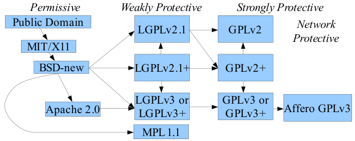
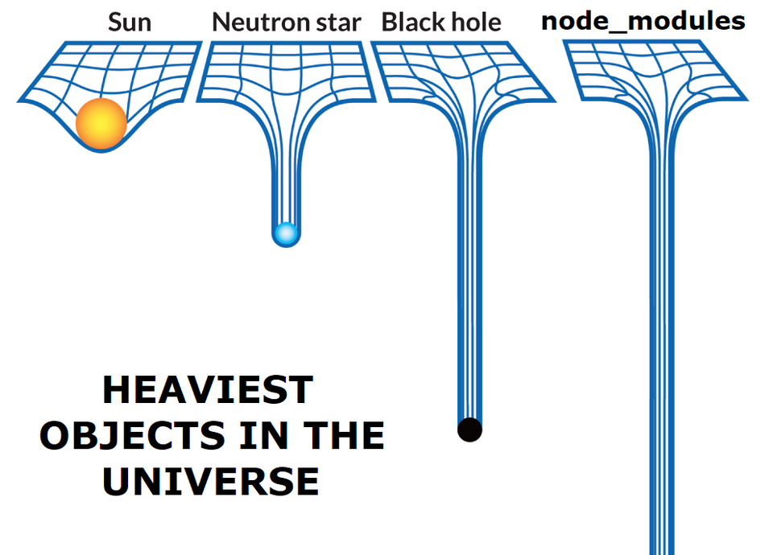
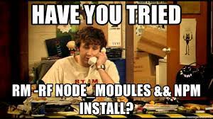

## NPM


[все лекции](https://github.com/dmitryweiner/web-lectures/blob/main/README.md)

Видео: 
[1](https://drive.google.com/file/d/1lFMBimAdKy3rIZaThYxWYibMKQaT-r21/view?usp=sharing),
[2](https://drive.google.com/file/d/1WWMzqjHWpqvrSH3A8g0VTSfWuydThqHC/view?usp=sharing)
---

### Идея
* Коммитить зависимые библиотеки - плохая идея. 
* Зависимости проекта должны быть зафиксированы.
* Должно быть средство установки пакетов, прописанных в зависимостях:
  * PHP: [composer](https://getcomposer.org/).
  * Java: 
    [Gradle](https://javarush.ru/groups/posts/2126-kratkoe-znakomstvo-s-gradle),
    [Maven](https://javarush.ru/groups/posts/2523-chastjh-4osnovih-maven),
    [Ant](https://habr.com/ru/post/323204/).
  * Python: [pip](https://pypi.org/project/pip/).
* Средство должно автоматически определять нужные версии пакетов.
---

### NPM
* В экосистеме JS роль менеджера пакетов выполняет NPM.
* NPM &mdash; **N**ode **P**ackage **M**anager.
* Устанавливается вместе с [Node.js](https://nodejs.org/en/download/).

---

### package.json
* Главный конфигурационный файл называется ```package.json``` и располагается в корне проекта.
* Он должен быть в формате [JSON](https://ru.wikipedia.org/wiki/JSON).
* Его можно создать вручную, можно сгенерировать с помощью NPM.
* Файл хранит:
  * Имя проекта.
  * Зависимости от сторонних библиотек.
  * Скрипты запуска.
  * Настройки проекта.
---

### Инициализация проекта
* Для генерации ```package.json``` надо выполнить команду:
```shell
npm init
```
* В ходе создания придётся ответить на вопросы:

```shell
package name: (sample-project) 
version: (1.0.0) 
description: This is sample project
entry point: (index.js) 
test command: 
git repository: https://github.com/dmitryweiner/sample-project
keywords: project sample
author: Dmitry Weiner
license: (ISC) GPL-3.0-or-later
About to write to /home/dmw/projects/sample-project/package.json:

{
  "name": "sample-project",
  "version": "1.0.0",
  "description": "This is sample project",
  "main": "index.js",
  "scripts": {
    "test": "echo \"Error: no test specified\" && exit 1"
  },
  "repository": {
    "type": "git",
    "url": "git+https://github.com/dmitryweiner/sample-project.git"
  },
  "keywords": [
    "project",
    "sample"
  ],
  "author": "Dmitry Weiner",
  "license": "GPL-3.0-or-later",
  "bugs": {
    "url": "https://github.com/dmitryweiner/sample-project/issues"
  },
  "homepage": "https://github.com/dmitryweiner/sample-project#readme"
}


Is this OK? (yes) yes
```
---

### Инициализация проекта
* Если лень отвечать на вопросы, можно запустить ту же команду с ключом `-y`, вопросов не будет:
```shell
npm init -y
```
* ```package.json``` будет создан с дефолтными значениями.
---

### Поля package.json
* [Полный список возможных полей](https://docs.npmjs.com/cli/v8/configuring-npm/package-json).
* name: имя проекта.
* version: версия вида "1.2.3" (обязательно).
* author: автор (обязательно).
* dependencies: список необходимых библиотек.
* devDependencies: библиотеки для разработки.
* license: под какой [лицензией](https://spdx.org/licenses/).
* description: краткое описание проекта.
* keywords: ключевые слова.
* homepage: домашняя страница проекта.
* repository: ссылка на репозиторий.
---

### [Типы лицензий](https://habr.com/ru/post/275995/) 

---

### Установка библиотеки
* [Поиск нужной библиотеки: www.npmjs.com](https://www.npmjs.com/).
* Установка:
```shell
npm install %ИМЯ_БИБЛИОТЕКИ%
# сокращённая команда:
npm i %ИМЯ_БИБЛИОТЕКИ%
```
* Установка библиотеки, нужной только для разработки:
```shell
npm install --save-dev %ИМЯ_БИБЛИОТЕКИ%
# сокращённая команда:
npm i -D %ИМЯ_БИБЛИОТЕКИ%
```
* Код библиотек сохраняется в ```./node_modules```.
---

### Различие devDependencies и dependencies
* Зависимости, перечисленные в `dependencies` нужны для сборки проекта для продакшена.
* Зависимости в `devDependencies` нужны только во время разработки и на продакшен попасть не должны.
* Есть ещё `peerDependencies` для зависимостей библиотеки, которые надо устанавливать самостоятельно.
* [Подробнее](https://stackoverflow.com/questions/18875674/whats-the-difference-between-dependencies-devdependencies-and-peerdependencies).
---

### Нужная версия
* При установке можно указывать конкретную версию библиотеки:
```shell
npm i lodash@4.17.21
```
* Можно указывать минорную или мажорную версии:
```shell
npm i lodash@~4.0 # поставит только 4.0.0 - 4.0.9
npm i lodash@^4.0 # поставит любую начиная от 4.0.0 до 4.17.21
```
* Это называется [семантическое версионирование](https://docs.npmjs.com/about-semantic-versioning).
* [Калькулятор версии](https://semver.npmjs.com/).
---

### Подключение установленной библиотеки
* После установки можно использовать нужную библиотеку с помощью `require`, 
  если библиотека поддерживает формат модулей [CommonJS](https://nodejs.org/api/modules.html):
```js
const _ = require("lodash");
_.first([1, 2, 3]); // 1
```
---

### Проблема с `import from`
* Библиотека может быть написана в формате ES6-module. Это выражается в ошибке:
```shell
internal/modules/cjs/loader.js:1102
      throw new ERR_REQUIRE_ESM(filename, parentPath, packageJsonPath);
      ^
Error [ERR_REQUIRE_ESM]: Must use import to load ES Module
```
* Чтобы работало, надо добавить в package.json:
```json
{ 
    // тут остальной код
    "type": "module"
}
```
* Импортировать потом в формате [ES6-module](https://developer.mozilla.org/ru/docs/Web/JavaScript/Guide/Modules):
```js
import ora from "ora";
```
---

### package-lock.json
* При установке пакетов (библиотек) конкретные версии записываются в `package-lock.json`:

```json
{
  "name": "sample-project",
  "version": "1.0.0",
  "lockfileVersion": 2,
  "requires": true,
  "packages": {
    "": {
      "name": "sample-project",
      "version": "1.0.0",
      "license": "GPL-3.0-or-later",
      "dependencies": {
        "lodash": "~1.0"
      }
    },
    "node_modules/lodash": {
      "version": "1.0.2",
      "resolved": "https://registry.npmjs.org/lodash/-/lodash-1.0.2.tgz",
      "integrity": "sha1-j1dWDIO1n8JwvT1WG2kAQ0MOJVE=",
      "engines": [
        "node",
        "rhino"
      ]
    }
  },
  "dependencies": {
    "lodash": {
      "version": "1.0.2",
      "resolved": "https://registry.npmjs.org/lodash/-/lodash-1.0.2.tgz",
      "integrity": "sha1-j1dWDIO1n8JwvT1WG2kAQ0MOJVE="
    }
  }
}
```
---

### Что коммитить, а что нет
* Коммитить:
  * `package.json`
  * `package-lock.json`: чтобы зафиксировать конкретные версиии пакетов.
* Не коммитить `node_modules`, добавить их в .gitignore:
```gitignore
./node_modules/
```

---

### node_modules

[](assets/npm/node_modules.mp4)
---

### Установка всех зависимостей
* Для склонированного проекта встаёт задача установки **всех** зависимостей, перечисленных в `package.json`.
* Это делается командой:
```shell
npm install
# сокращённая команда
npm i
```
* При этом вычисляются версии пакетов в соответствии с указаниями. Если стоит версия ~1.0, может поставится 1.0.0 или 1.0.9.
* При этом обновляется `package-lock.json`.
---

### Установка зависимостей "как у разработчика"
* Если нужно поставить именно те версии пакетов, которые стоят у разработчика, имеет смысл выполнить команду:
```shell
npm ci
```
* При этом ставятся пакеты с версиями из `package-lock.json`.
---

### Удаление библиотеки
* Библиотека удаляется командой:
```shell
npm uninstall lodash
npm un lodash
```
* При этом обновляется package.json и package-lock.json.
* Созависимые библиотеки не будут удалены.

---

### Скрипты запуска
* В поле scripts следует описать доступные команды для запуска в проекте:
```json
{
    "scripts": {
      "start": "node index.js",
      "test": "jest",
      "lint": "eslint . --fix"
    }
}
```
* Команды вызываются с помощью конструкции `npm run %ИМЯ_КОМАНДЫ%`:
```shell
npm run start # вызывает "node index.js"
```
---

### Консольные команды
* [Полный список команд](https://docs.npmjs.com/cli/v8/commands).
* Полезные:
  * npm audit: поиск уязвимостей в установленных библиотеках.
  * npm ping: попинговать репозиторий npm.
  * npm publish: опубликовать пакет.
  * npm rebuild: пересобрать пакет.
---

### npx
* Команда [npx](https://medium.com/devschacht/introducing-npx-an-npm-package-runner-a72a658cd9e6)
не устанавливает, а скачивает пакет и тут же запускает. Пример:
```shell
npx tsc --out file.js file.ts
npx create-react-app my-app
```
* Раньше ставили пакет глобально (опция -g), но тогда его нужно самостоятельно обновлять, а так пакет
всегда самой последней версии.
---

### Самое частое решение проблем


---

### Альтернативы NPM
* [Yarn](https://yarnpkg.com/).
  * Намного быстрее.
  * Скачивает библиотеки в несколько потоков.
  * Хранит конфиг в таком же формате.
* [Bower](https://bower.io/).
  * Свой формат конфига. 
  * Классная птица на лого.
  * Любят владельцы MacOS.
---

### Задачи
* Инициализировать проект.
* Поставить библиотеку [`lodash`](https://github.com/lodash/lodash).
* Подключить её и отсортировать массив объектов по полю `age` (можно использовать метод sortBy):
```js
const users = [
    { user: 'fred',   age: 48 },
    { user: 'barney', age: 36 },
    { user: 'fred',   age: 40 },
    { user: 'barney', age: 34 }
];
```
* Вызвать написанный код через `npm run` (используется поле `script`).
---

### Полезные ссылки
* [Список полезных библиотек](https://github.com/sindresorhus/awesome-nodejs).
* [Ещё список полезных библиотек](https://github.com/bsonntag/cool-node-modules).
* [10 самых бесполезных библиотек](https://dev.to/jyotishman/10-useless-npm-package-with-millions-of-downloads-de9).
* [Поиск нужной библиотеки: www.npmjs.com](https://www.npmjs.com/).
* [Шпаргалка по командам](https://habr.com/ru/post/133363/).
