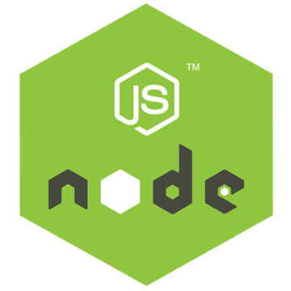
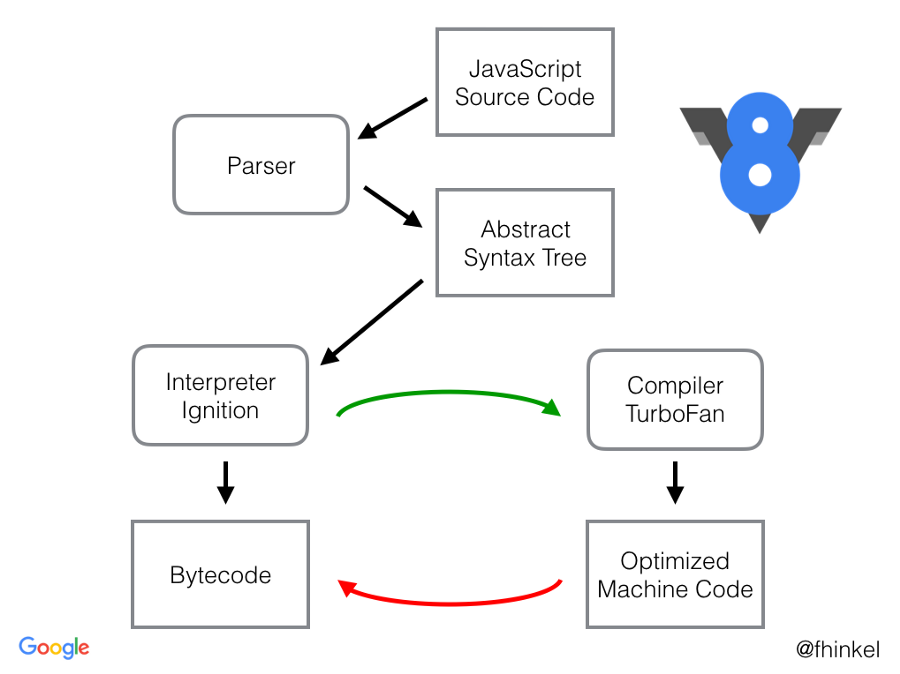
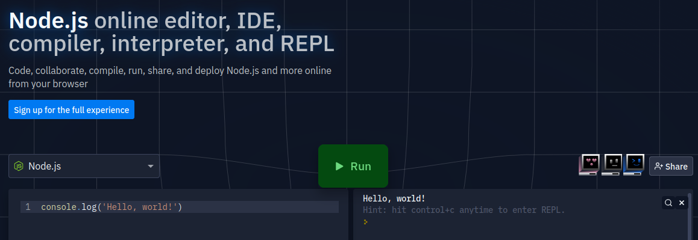
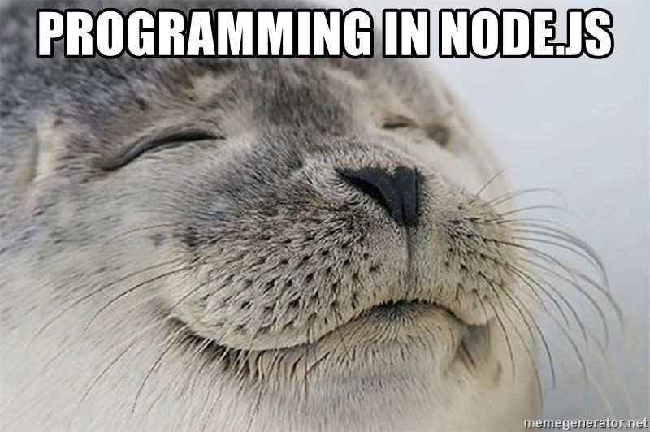

## Node.js



[все лекции](https://github.com/dmitryweiner/lectures/blob/main/README.md)

Видео: 
[1](https://youtu.be/JcV7XtC5On0),
[2](https://drive.google.com/file/d/1F4scyA2hAXCBexbm0wyDh-piC_yT_B7y/view?usp=sharing),
[3](https://drive.google.com/file/d/1Soub-RJCEoB4bC4CWZusbFWCgzoDaJM4/view?usp=sharing).
---

* Node.js &mdash; программная платформа, основанная на движке V8
(транслирующем JavaScript в машинный код), превращающая JavaScript
из узкоспециализированного языка в язык общего назначения.
* Создан в 2009г.
* Создатель [Райан Дал](https://tinyclouds.org/).


---

### Node.js
* Выполняется не в браузере, а на уровне системы.
* Имеет доступ к файлам, сети, устройствам.
* Есть асинхронное выполнение.
* Есть модули.
* Есть [NPM](https://dmitryweiner.github.io/lectures/Basic%20-%20NPM.html) (менеджер пакетов).
* Последняя версия: 17 (на апрель 2022).
* [Компилируется в байткод](https://habr.com/ru/company/ruvds/blog/336294/).
* [Документация](https://nodejs.org/api/documentation.html).
* [Самоучитель](https://nodejs.dev/learn).
---


---

### Движок или фреймворк?
* С одной стороны, можно назвать Node.js движком, т.к. она только выполняет JS-код.
* С другой стороны, в инфраструктуре Node.js можно пользоваться [библиотеками](https://www.w3schools.com/nodejs/ref_modules.asp),
  которые не нужно ставить:
  * http
  * fs
  * events
---

### Установка
* Лучше использовать
  [LTS](https://ru.wikipedia.org/wiki/%D0%94%D0%BE%D0%BB%D0%B3%D0%BE%D1%81%D1%80%D0%BE%D1%87%D0%BD%D0%B0%D1%8F_%D0%BF%D0%BE%D0%B4%D0%B4%D0%B5%D1%80%D0%B6%D0%BA%D0%B0_%D0%BF%D1%80%D0%BE%D0%B3%D1%80%D0%B0%D0%BC%D0%BC%D0%BD%D0%BE%D0%B3%D0%BE_%D0%BE%D0%B1%D0%B5%D1%81%D0%BF%D0%B5%D1%87%D0%B5%D0%BD%D0%B8%D1%8F)
  версии 14 или 16.
* Ubuntu:
```shell
curl -fsSL https://deb.nodesource.com/setup_16.x | sudo -E bash -
sudo apt install -y nodejs
```
* Windows: [скачать](https://nodejs.org/en/download/).
---

### Игровая площадка
* Можно не ставить Node.js локально, а запустить прямо в браузере:



[Запустить!](https://replit.com/languages/nodejs)
---

### Event loop
* JS синхронный однопоточный язык.
* Сначала выполняется весь синхронный код в главном потоке.
* Потом выполняются промисы (микротаски).
* Потом выполняются таймауты (макротаски).
* Выполнение организовано в бесконечном цикле, называемом Event Loop.
* [Хорошая статья про это](https://jinoantony.com/blog/setimmediate-vs-process-nexttick-in-nodejs)
  ([перевод](https://medium.com/devschacht/event-loop-timers-and-nexttick-18579cd122e0)).
* [Игровая площадка и лекция](http://latentflip.com/loupe/).
---


---
  
### Запуск программы
* Создать файл index.js:

```js
console.log("Hello, world!");
```
* В терминале:

```shell
node index.js
```

* В WebStorm: 

```
Ctrl + Shift + F10
```
---

### Мониторинг и управление
* Глобальный объект ```process``` (не нужно импортировать).
* Можно прерывать выполнение процесса, считывать аргументы и многое другое:
```js
// вывести аргументы, с которыми запущен процесс
console.log(process.argv);
// переменные окружения
console.log(process.env);
// использование процессора
process.cpuUsage();
// использование памяти
process.memoryUsage();
// выйти с кодом 1
process.exit(1);
```
* [Документация](https://nodejs.org/api/process.html).
---

### Модули
* Модули &mdash; способ организации и переиспользования кода.
* Модуль экспортирует наружу некие методы и/или переменные.
* Другой код импортирует и использует нужные методы с помощью **require()**.
* В Node.js используются [CommonJS](https://nodejs.org/docs/latest/api/modules.html)-модули.
---

### Модули
* В подключаемом модуле:

```js
// module.js
function usefulFunction(param) {
    return param * 3;
}

module.exports = {
    usefulFunction
}
```
* В основном коде:

```js
// путь указывается относительно текущего файла
const { usefulFunction } = require("./module.js");
usefulFunction(3);
```
---

### ES6 модули
* Существует также [ES6-формат](https://developer.mozilla.org/ru/docs/Web/JavaScript/Guide/Modules) модулей.
* Поддержка ES6 модулей есть c 16-й версии Node.js.
* У файла должно быть расширение ```*.mjs```.
* [Документация](https://nodejs.org/api/esm.html).
---

### Работа с файлами
* Используется встроенная библиотека ```fs```.
* Синхронная работа с файлами: поток выполнения останавливается и ждёт, пока ответит ОС.
```js
const fs = require("fs");
const data = fs.readFileSync("./input.txt",  {encoding:"utf8", flag:"r"});
console.log(data);
```
* [Документация](https://nodejs.org/api/fs.html).
---

### Асинхронная работа с файлами
* Удобнее работать с файлами, используя промисы и синтаксический сахар async/await:
```js
const { promises } = require("fs");
async function openAndClose() {
    let data;
    try {
      data = await promises.readFile("./input.txt");
      console.log(data);
    } catch(e) {
      console.error(`Что-то пошло не так: ${e.message}`);
    }
}
```
* [Документация](https://nodejs.org/docs/latest-v14.x/api/fs.html#fs_promises_api).
---

### Разбор аргументов
* В ```process.argv``` лежит массив аргументов, не очень удобно с ним работать.
* Очень удобная библиотека [yargs](https://github.com/yargs/yargs) парсит аргументы и выводит подсказки.
* [Полезная статья](https://nodejs.org/en/knowledge/command-line/how-to-parse-command-line-arguments/)
```js
#!/usr/bin/env node
const yargs = require("yargs/yargs");
const { hideBin } = require("yargs/helpers");
yargs(hideBin(process.argv))
    .command("serve [port]", "start the server", (yargs) => {
        return yargs
            .positional("port", {
                describe: "port to bind on",
                default: 5000
            });
    }, (argv) => {
        if (argv.verbose) console.info(`start server on :${argv.port}`);
        serve(argv.port);
    })
    .option("verbose", {
        alias: "v",
        type: "boolean",
        description: "Run with verbose logging"
    })
    .argv
```
---

### Ввод с консоли
* С помощью встроенного модуля [`readline`](https://nodejs.dev/learn/accept-input-from-the-command-line-in-nodejs):
```js
const readline = require('readline').createInterface({
    input: process.stdin,
    output: process.stdout
});
readline.question('What is your name?', name => {
    console.log(`Hi ${name}!`)
    readline.close()
});
```
---

### Ввод с консоли

* С помощью библиотеки [`prompt`](https://github.com/flatiron/prompt):

```shell
npm i prompt
```

```js
const prompt = require('prompt');
prompt.start();
prompt.get(['username', 'email'], function (err, result) {
    console.log('Command-line input received:');
    console.log('  username: ' + result.username);
    console.log('  email: ' + result.email);
});
```
---

### Раскрашиваем вывод в консоль
* Библиотека [`cli-color`](https://github.com/medikoo/cli-color): 

```shell
npm install cli-color
```

```js
const clc = require("cli-color");
console.log(clc.red.underline("Error!"));
console.log(clc.red("Warning!"));
console.log(clc.green("This is okay!"));
```

* Библиотека [`chalk`](https://github.com/chalk/chalk):

```shell
npm i chalk
```

```js
const chalk = require('chalk');
console.log(chalk.red('Text in red'));
```
---

### Отправка HTTP-запроса
* Так можно написать парсер страниц:

```js
const https = require('https');

const req = https.get('https://jsonplaceholder.typicode.com/todos', res => {
  console.log(`statusCode: ${res.statusCode}`);
  res.on('data', d => {
    console.log("Data: ", d.toString());
  })
})

req.on('error', error => {
  console.error(error);
})

req.end();
```
---

### Сервер
* Можно написать сервер, отвечающий на запросы:
```js
// Подключение модуля http
const http = require("http");
// Создаем веб-сервер с обработчиком запросов
const server = http.createServer((incomingMessage, response) => {
    console.log("Начало обработки запроса");
    // Передаем код ответа и заголовки http
    response.writeHead(200, { 
        "Content-Type": "text/plain; charset=UTF-8" 
    });
    response.end("Hello, world!");
});
// Запускаем веб-сервер
server.listen(3000, "127.0.0.1", () => {
    const { address, port } = server.address();
    console.log(`Сервер запущен ${address}:${port}`);
});
```
---

### Сервер статики
```js
const fs = require("fs"),
    http = require("http");

http.createServer(function (req, res) {
    fs.readFile(__dirname + req.url, function (err, data) {
        if (err) {
            res.writeHead(404);
            res.end(JSON.stringify(err));
            return;
        }
        res.writeHead(200);
        res.end(data);
    });
}).listen(8080);
```
---

### REST на чистой Node.js
* [Базовый сервер, реализующий REST](https://gist.github.com/JohanSundstain/b6063eceb169a11e709b9633c15ebe08).
* [Руководство, как написать свой сервер](https://metanit.com/web/nodejs/3.1.php).
---

### Серверные фреймворки
* Adonis.js
* [Express.js](https://expressjs.com/)
  ([Лекция](https://dmitryweiner.github.io/lectures/Express.html#/))
* Fastify
* Hapi.js
* [Koa.js](https://koajs.com/)
* LoopBack.js
* Meteor.js
* Nest.js
* Sails.js
* [Обзор фреймворков](https://medium.com/dailyjs/which-one-is-the-best-node-js-framework-choosing-among-10-tools-87a0e191eefd).

---

### Менеджеры запуска
* Приложения на node.js периодически падают, хорошо бы их перезапускать автоматически:
  * [nodemon](https://www.geeksforgeeks.org/nodejs-automatic-restart-nodejs-server-with-nodemon/?ref=rp)
  * [pm2](https://pm2.keymetrics.io/docs/usage/quick-start/)
---

### Альтернативы node.js
* [Deno](https://deno.land/) от создателя Node.js.
* Rust.
* Go.
* PHP.
* Python + Django.
---

### Задачи
* Написать скрипт, который считывает файл с диска и записывает его в обратном порядке в тот же файл.
* Написать сервер, который при запросе GET отправляет содержимое некоего файла, а при запросе POST пишет в файл тело запроса.
---

### Полезные ссылки
* [Самоучитель](https://nodejs.dev/learn).
* [Документация](https://nodejs.org/api/documentation.html).


