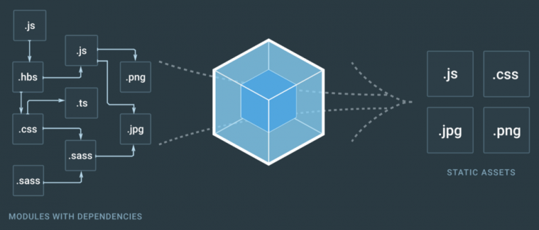
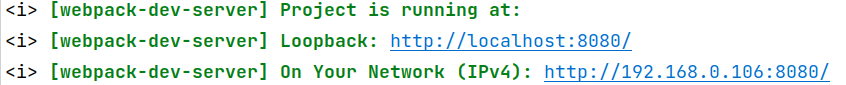
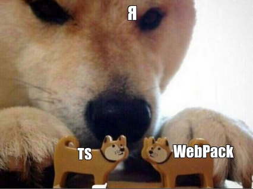

## Webpack


[все лекции](https://github.com/dmitryweiner/web-lectures/blob/main/README.md)

Видео: 
[1](https://drive.google.com/file/d/1i-PFI78XGiXL97jxFRuAQQ2eSyuqFR0m/view?usp=sharing),
[2](https://drive.google.com/file/d/1mSSpG_v3hIh5I4OjU63G0-uUNEWLx_0Z/view?usp=sharing)
---

### Проблемы фронтенда
* Есть много JS-файлов на странице, когда их много, грузится медленно.
* В файлах много пробелов, комментариев, их можно удалить, чтобы не грузить лишнее.
* Старые браузеры не поддерживают новый код.
* Ошибся в порядке подключения файлов &mdash; нужные класс/функция не найдены.
* Сторонние библиотеки приходится либо качать себе в проект, либо загружать из [CDN](https://ru.wikipedia.org/wiki/Content_Delivery_Network).
---

### Решение
* Собрать все JS-файлы в один бандл для ускорения загрузки.
* Настроить [транспиляцию](https://ru.wikipedia.org/wiki/%D0%A2%D1%80%D0%B0%D0%BD%D1%81%D0%BF%D0%B0%D0%B9%D0%BB%D0%B5%D1%80),
чтобы работало в старых браузерах (Internet Explorer 6.0).
* Настроить [минификацию](https://ru.wikipedia.org/wiki/%D0%9C%D0%B8%D0%BD%D0%B8%D1%84%D0%B8%D0%BA%D0%B0%D1%86%D0%B8%D1%8F_(%D0%BF%D1%80%D0%BE%D0%B3%D1%80%D0%B0%D0%BC%D0%BC%D0%B8%D1%80%D0%BE%D0%B2%D0%B0%D0%BD%D0%B8%D0%B5))
JS и CSS для уменьшения размера.
* Поднимать веб-сервер при разработке и перезагружать страницу при каждом изменении файла.
---

### Webpack
* Самый распространённый сборщик файлов (бандлер).
* Первый релиз 10 марта 2012.
* Текущая версия 5.
* [Документация](https://webpack.js.org/concepts/).
---

### Предисловие
* Описанные далее решения используют последнюю на 2021й год версию Webpack **5.64**.
* Примеры выложены в [репозиторий](https://github.com/dmitryweiner/webpack-template).
---

### Схема работы Webpack
* Вебпак начинает анализ с файла точки входа, указанной в конфиге.
* Если в файле импортируются другие файлы, вебпак анализирует их.
* В итоге строится дерево импортов.
* В конечный файл (бандл) добавляются только те методы файлов, которые используются 
  ([tree shaking](https://webpack.js.org/guides/tree-shaking/)).
---


---

### Формат импорта
* Для импорта используется формат [ES6 Modules](https://developer.mozilla.org/ru/docs/Web/JavaScript/Guide/Modules).
* Пример импорта:
```js
import Utils, { revertString } from "./utils";
console.log(revertString("123"));
```
* Экспорт:
```jsx
export function revertString(str) {
    return [...str].reverse().join("");
}
```
---

### Установка
* Проект должен быть инициализирован через [`npm init`](https://dmitryweiner.github.io/web-lectures/Basic%20-%20NPM.html#/).
* Установка необходимых библиотек:

```shell
npm i -D webpack webpack-cli webpack-dev-server \
    webpack-merge babel-loader clean-webpack-plugin \
    copy-webpack-plugin html-webpack-plugin @babel/core
```
* Команды для сборки в package.json -> scripts:

```json
{
  "scripts": {
    // ...тут предыдущие команды
    "start": "webpack-dev-server --config webpack.config.js",
    "build": "webpack --config webpack.config.js"
  }
}
```
---

### `./webpack.config.js`
* Создадим в корне проекта файл `webpack.config.js`:

```js
const path = require('path');
const { CleanWebpackPlugin } = require('clean-webpack-plugin');
const CopyWebpackPlugin = require('copy-webpack-plugin');
const HtmlWebpackPlugin = require('html-webpack-plugin');

const paths = {
    src: path.resolve(__dirname, './src'), // исходные файлы JS
    build: path.resolve(__dirname, './build'), // собранный проект для выкладывания на хостинг
    static: path.resolve(__dirname, './public'), // статичные файлы, которые копируются в build
};

module.exports = {
    mode: 'development', // режим работы: development - для разработки, production - для выкладывания на сервер
    devtool: 'inline-source-map', // что делать с исходниками @see https://habr.com/ru/post/509250/
    entry: [paths.src + '/index.js'], // точка входа
    output: {
        path: paths.build, // куда класть бандл
        filename: '[name].bundle.js', // имя бандла
        publicPath: '/',
    },
    plugins: [
        new CleanWebpackPlugin(),
        new CopyWebpackPlugin({ // плагин копирует файлы из static
            patterns: [
              {
                from: paths.static,
                to: paths.build,
                globOptions: {
                  ignore: ['**/index.html'] // кроме index.html
                }
              }
            ],
        }),
        new HtmlWebpackPlugin({
            template: paths.static + '/index.html', // template file
            filename: 'index.html', // output file
        }),
    ],
    module: {
        rules: [
            {   // модуль для обработки JS
                test: /\.js$/,
                exclude: /node_modules/,
                use: ['babel-loader'],
            },
        ]
    }
};
```
---

### Расположение файлов
* `./src/`: исходные файлы JS.
* `./build/`: собранный проект для выкладывания на хостинг.
* `./public/`: статичные файлы, которые копируются в `build`:
  * index.html.
  * картинки.
  * стили.
---

### Базовая структура проекта
```
./
├── build
├── package.json
├── package-lock.json
├── public
│   ├── css
│   │   └── main.css
│   ├── images
│   │   ├── cat.jpg
│   │   └── ... // ещё картинки
│   └── index.html
├── src
│   ├── index.js // точка входа Webpack
│   └── ... // ещё какие-нибудь файлы
└── webpack.config.js // конфиг вебпака
```

[Посмотреть](https://github.com/dmitryweiner/webpack-template/tree/73ad30edf095bbd9c35968c5e4eddd4bd00361a3).
---

### `index.html`
* Файл `public/index.html` служит шаблоном, куда будет *автоматически* добавлен собранный бандл.
* Но он должен самостоятельно подключать необходимые стили.
* Примерный код:
```html
<!DOCTYPE html>
<html lang="en">
<head>
    <meta charset="UTF-8">
    <title>Мега-сайт</title>
    <link rel="stylesheet" type="text/css" href="css/main.css">
    <!-- сюда будет добавлен бандл -->
</head>
<body>
</body>
</html>
```
---

### Команды запуска
* `npm run start` поднимает web-сервер для разработки с моментальным отображением изменений.
* Сервер лежит по адресу http://localhost:8080 (порт может меняться).

* `npm run build` собирает проект для выкладывания на хостинг. Результат будет лежать в `build`.
---

### Результат сборки JS
* Файл index.js использует функцию revertString (это пример):
```js
import { revertString } from "./utils";
document.addEventListener("DOMContentLoaded", () => {
    const input = document.getElementById("inputString");
    const form = document.getElementById("form");
    form.addEventListener("submit", event => {
        event.preventDefault();
        input.value = revertString(input.value);
    });
});
```
* Файл с утилитами utils.js для примера:
```js
export function revertString(str) {
    return [...str].reverse().join("");
}
```
---

### Сборка JS
* Что в итоге получается после запуска `npm run build`:

```js
/******/ (() => { // webpackBootstrap
/******/ 	"use strict";
/******/ 	var __webpack_modules__ = ({

/***/ "./src/utils.js":
/*!**********************!*\
  !*** ./src/utils.js ***!
  \**********************/
/***/ ((__unused_webpack_module, __webpack_exports__, __webpack_require__) => {

__webpack_require__.r(__webpack_exports__);
/* harmony export */ __webpack_require__.d(__webpack_exports__, {
/* harmony export */   "revertString": () => (/* binding */ revertString)
/* harmony export */ });
function revertString(str) {
  return [...str].reverse().join("");
}

/***/ })

/******/ 	});
/************************************************************************/
/******/ 	// The module cache
/******/ 	var __webpack_module_cache__ = {};
/******/ 	
/******/ 	// The require function
/******/ 	function __webpack_require__(moduleId) {
/******/ 		// Check if module is in cache
/******/ 		var cachedModule = __webpack_module_cache__[moduleId];
/******/ 		if (cachedModule !== undefined) {
/******/ 			return cachedModule.exports;
/******/ 		}
/******/ 		// Create a new module (and put it into the cache)
/******/ 		var module = __webpack_module_cache__[moduleId] = {
/******/ 			// no module.id needed
/******/ 			// no module.loaded needed
/******/ 			exports: {}
/******/ 		};
/******/ 	
/******/ 		// Execute the module function
/******/ 		__webpack_modules__[moduleId](module, module.exports, __webpack_require__);
/******/ 	
/******/ 		// Return the exports of the module
/******/ 		return module.exports;
/******/ 	}
/******/ 	
/************************************************************************/
/******/ 	/* webpack/runtime/define property getters */
/******/ 	(() => {
/******/ 		// define getter functions for harmony exports
/******/ 		__webpack_require__.d = (exports, definition) => {
/******/ 			for(var key in definition) {
/******/ 				if(__webpack_require__.o(definition, key) && !__webpack_require__.o(exports, key)) {
/******/ 					Object.defineProperty(exports, key, { enumerable: true, get: definition[key] });
/******/ 				}
/******/ 			}
/******/ 		};
/******/ 	})();
/******/ 	
/******/ 	/* webpack/runtime/hasOwnProperty shorthand */
/******/ 	(() => {
/******/ 		__webpack_require__.o = (obj, prop) => (Object.prototype.hasOwnProperty.call(obj, prop))
/******/ 	})();
/******/ 	
/******/ 	/* webpack/runtime/make namespace object */
/******/ 	(() => {
/******/ 		// define __esModule on exports
/******/ 		__webpack_require__.r = (exports) => {
/******/ 			if(typeof Symbol !== 'undefined' && Symbol.toStringTag) {
/******/ 				Object.defineProperty(exports, Symbol.toStringTag, { value: 'Module' });
/******/ 			}
/******/ 			Object.defineProperty(exports, '__esModule', { value: true });
/******/ 		};
/******/ 	})();
/******/ 	
/************************************************************************/
var __webpack_exports__ = {};
// This entry need to be wrapped in an IIFE because it need to be isolated against other modules in the chunk.
(() => {
/*!**********************!*\
  !*** ./src/index.js ***!
  \**********************/
__webpack_require__.r(__webpack_exports__);
/* harmony import */ var _utils__WEBPACK_IMPORTED_MODULE_0__ = __webpack_require__(/*! ./utils */ "./src/utils.js");

document.addEventListener("DOMContentLoaded", () => {
  const input = document.getElementById("inputString");
  const form = document.getElementById("form");
  form.addEventListener("submit", event => {
    event.preventDefault();
    input.value = (0,_utils__WEBPACK_IMPORTED_MODULE_0__.revertString)(input.value);
  });
});
})();

/******/ })()
;
//# sourceMappingURL=data:application/json;charset=utf-8;base64,eyJ2ZXJzaW9uIjozLCJmaWxlIjoibWFpbi5idW5kbGUuanMiLCJtYXBwaW5ncyI6Ijs7Ozs7Ozs7Ozs7Ozs7QUFBTyxTQUFTQSxZQUFULENBQXNCQyxHQUF0QixFQUEyQjtBQUM5QixTQUFPLENBQUMsR0FBR0EsR0FBSixFQUFTQyxPQUFULEdBQW1CQyxJQUFuQixDQUF3QixFQUF4QixDQUFQO0FBQ0g7Ozs7OztVQ0ZEO1VBQ0E7O1VBRUE7VUFDQTtVQUNBO1VBQ0E7VUFDQTtVQUNBO1VBQ0E7VUFDQTtVQUNBO1VBQ0E7VUFDQTtVQUNBO1VBQ0E7O1VBRUE7VUFDQTs7VUFFQTtVQUNBO1VBQ0E7Ozs7O1dDdEJBO1dBQ0E7V0FDQTtXQUNBO1dBQ0EseUNBQXlDLHdDQUF3QztXQUNqRjtXQUNBO1dBQ0E7Ozs7O1dDUEE7Ozs7O1dDQUE7V0FDQTtXQUNBO1dBQ0EsdURBQXVELGlCQUFpQjtXQUN4RTtXQUNBLGdEQUFnRCxhQUFhO1dBQzdEOzs7Ozs7Ozs7Ozs7QUNOQTtBQUVBQyxRQUFRLENBQUNDLGdCQUFULENBQTBCLGtCQUExQixFQUE4QyxNQUFNO0FBQ2hELFFBQU1DLEtBQUssR0FBR0YsUUFBUSxDQUFDRyxjQUFULENBQXdCLGFBQXhCLENBQWQ7QUFDQSxRQUFNQyxJQUFJLEdBQUdKLFFBQVEsQ0FBQ0csY0FBVCxDQUF3QixNQUF4QixDQUFiO0FBQ0FDLEVBQUFBLElBQUksQ0FBQ0gsZ0JBQUwsQ0FBc0IsUUFBdEIsRUFBZ0NJLEtBQUssSUFBSTtBQUNyQ0EsSUFBQUEsS0FBSyxDQUFDQyxjQUFOO0FBQ0FKLElBQUFBLEtBQUssQ0FBQ0ssS0FBTixHQUFjWCxvREFBWSxDQUFDTSxLQUFLLENBQUNLLEtBQVAsQ0FBMUI7QUFDSCxHQUhEO0FBSUgsQ0FQRCxFIiwic291cmNlcyI6WyJ3ZWJwYWNrOi8vd2VicGFjay10ZW1wbGF0ZS8uL3NyYy91dGlscy5qcyIsIndlYnBhY2s6Ly93ZWJwYWNrLXRlbXBsYXRlL3dlYnBhY2svYm9vdHN0cmFwIiwid2VicGFjazovL3dlYnBhY2stdGVtcGxhdGUvd2VicGFjay9ydW50aW1lL2RlZmluZSBwcm9wZXJ0eSBnZXR0ZXJzIiwid2VicGFjazovL3dlYnBhY2stdGVtcGxhdGUvd2VicGFjay9ydW50aW1lL2hhc093blByb3BlcnR5IHNob3J0aGFuZCIsIndlYnBhY2s6Ly93ZWJwYWNrLXRlbXBsYXRlL3dlYnBhY2svcnVudGltZS9tYWtlIG5hbWVzcGFjZSBvYmplY3QiLCJ3ZWJwYWNrOi8vd2VicGFjay10ZW1wbGF0ZS8uL3NyYy9pbmRleC5qcyJdLCJzb3VyY2VzQ29udGVudCI6WyJleHBvcnQgZnVuY3Rpb24gcmV2ZXJ0U3RyaW5nKHN0cikge1xuICAgIHJldHVybiBbLi4uc3RyXS5yZXZlcnNlKCkuam9pbihcIlwiKTtcbn0iLCIvLyBUaGUgbW9kdWxlIGNhY2hlXG52YXIgX193ZWJwYWNrX21vZHVsZV9jYWNoZV9fID0ge307XG5cbi8vIFRoZSByZXF1aXJlIGZ1bmN0aW9uXG5mdW5jdGlvbiBfX3dlYnBhY2tfcmVxdWlyZV9fKG1vZHVsZUlkKSB7XG5cdC8vIENoZWNrIGlmIG1vZHVsZSBpcyBpbiBjYWNoZVxuXHR2YXIgY2FjaGVkTW9kdWxlID0gX193ZWJwYWNrX21vZHVsZV9jYWNoZV9fW21vZHVsZUlkXTtcblx0aWYgKGNhY2hlZE1vZHVsZSAhPT0gdW5kZWZpbmVkKSB7XG5cdFx0cmV0dXJuIGNhY2hlZE1vZHVsZS5leHBvcnRzO1xuXHR9XG5cdC8vIENyZWF0ZSBhIG5ldyBtb2R1bGUgKGFuZCBwdXQgaXQgaW50byB0aGUgY2FjaGUpXG5cdHZhciBtb2R1bGUgPSBfX3dlYnBhY2tfbW9kdWxlX2NhY2hlX19bbW9kdWxlSWRdID0ge1xuXHRcdC8vIG5vIG1vZHVsZS5pZCBuZWVkZWRcblx0XHQvLyBubyBtb2R1bGUubG9hZGVkIG5lZWRlZFxuXHRcdGV4cG9ydHM6IHt9XG5cdH07XG5cblx0Ly8gRXhlY3V0ZSB0aGUgbW9kdWxlIGZ1bmN0aW9uXG5cdF9fd2VicGFja19tb2R1bGVzX19bbW9kdWxlSWRdKG1vZHVsZSwgbW9kdWxlLmV4cG9ydHMsIF9fd2VicGFja19yZXF1aXJlX18pO1xuXG5cdC8vIFJldHVybiB0aGUgZXhwb3J0cyBvZiB0aGUgbW9kdWxlXG5cdHJldHVybiBtb2R1bGUuZXhwb3J0cztcbn1cblxuIiwiLy8gZGVmaW5lIGdldHRlciBmdW5jdGlvbnMgZm9yIGhhcm1vbnkgZXhwb3J0c1xuX193ZWJwYWNrX3JlcXVpcmVfXy5kID0gKGV4cG9ydHMsIGRlZmluaXRpb24pID0+IHtcblx0Zm9yKHZhciBrZXkgaW4gZGVmaW5pdGlvbikge1xuXHRcdGlmKF9fd2VicGFja19yZXF1aXJlX18ubyhkZWZpbml0aW9uLCBrZXkpICYmICFfX3dlYnBhY2tfcmVxdWlyZV9fLm8oZXhwb3J0cywga2V5KSkge1xuXHRcdFx0T2JqZWN0LmRlZmluZVByb3BlcnR5KGV4cG9ydHMsIGtleSwgeyBlbnVtZXJhYmxlOiB0cnVlLCBnZXQ6IGRlZmluaXRpb25ba2V5XSB9KTtcblx0XHR9XG5cdH1cbn07IiwiX193ZWJwYWNrX3JlcXVpcmVfXy5vID0gKG9iaiwgcHJvcCkgPT4gKE9iamVjdC5wcm90b3R5cGUuaGFzT3duUHJvcGVydHkuY2FsbChvYmosIHByb3ApKSIsIi8vIGRlZmluZSBfX2VzTW9kdWxlIG9uIGV4cG9ydHNcbl9fd2VicGFja19yZXF1aXJlX18uciA9IChleHBvcnRzKSA9PiB7XG5cdGlmKHR5cGVvZiBTeW1ib2wgIT09ICd1bmRlZmluZWQnICYmIFN5bWJvbC50b1N0cmluZ1RhZykge1xuXHRcdE9iamVjdC5kZWZpbmVQcm9wZXJ0eShleHBvcnRzLCBTeW1ib2wudG9TdHJpbmdUYWcsIHsgdmFsdWU6ICdNb2R1bGUnIH0pO1xuXHR9XG5cdE9iamVjdC5kZWZpbmVQcm9wZXJ0eShleHBvcnRzLCAnX19lc01vZHVsZScsIHsgdmFsdWU6IHRydWUgfSk7XG59OyIsImltcG9ydCB7IHJldmVydFN0cmluZyB9IGZyb20gXCIuL3V0aWxzXCI7XG5cbmRvY3VtZW50LmFkZEV2ZW50TGlzdGVuZXIoXCJET01Db250ZW50TG9hZGVkXCIsICgpID0+IHtcbiAgICBjb25zdCBpbnB1dCA9IGRvY3VtZW50LmdldEVsZW1lbnRCeUlkKFwiaW5wdXRTdHJpbmdcIik7XG4gICAgY29uc3QgZm9ybSA9IGRvY3VtZW50LmdldEVsZW1lbnRCeUlkKFwiZm9ybVwiKTtcbiAgICBmb3JtLmFkZEV2ZW50TGlzdGVuZXIoXCJzdWJtaXRcIiwgZXZlbnQgPT4ge1xuICAgICAgICBldmVudC5wcmV2ZW50RGVmYXVsdCgpO1xuICAgICAgICBpbnB1dC52YWx1ZSA9IHJldmVydFN0cmluZyhpbnB1dC52YWx1ZSk7XG4gICAgfSk7XG59KTsiXSwibmFtZXMiOlsicmV2ZXJ0U3RyaW5nIiwic3RyIiwicmV2ZXJzZSIsImpvaW4iLCJkb2N1bWVudCIsImFkZEV2ZW50TGlzdGVuZXIiLCJpbnB1dCIsImdldEVsZW1lbnRCeUlkIiwiZm9ybSIsImV2ZW50IiwicHJldmVudERlZmF1bHQiLCJ2YWx1ZSJdLCJzb3VyY2VSb290IjoiIn0=
```
---

### ES6 -> ES5
* Как видим, современный код остался таким же, ИЕ6 его не запустит:
```js
function revertString(str) {
    return [...str].reverse().join("");
}
```
* Чтобы запустилось и в ИЕ6, необходимо сконфигурировать [Babel](https://github.com/babel/babel-loader). Поставить:
```shell
npm i -D @babel/preset-env
```
---

### ES6 -> ES5
* Изменить конфиг webpack.config.js:

```js
// ... тут остальной конфиг
module: {
    rules: [
        {
            test: /\.js$/,
            exclude: /node_modules/,
            use: {
                loader: 'babel-loader',
                options: {
                    presets: [
                        ['@babel/preset-env', { targets: "ie 6" }]
                    ]
                }
            },
        },
    ]
}
```
---

### На выходе из Babel
* Получаем код, работающий под ИЕ6. Современный код заменён на [полифилы](https://learn.javascript.ru/polyfills):

```js
function _toConsumableArray(arr) { return _arrayWithoutHoles(arr) || _iterableToArray(arr) || _unsupportedIterableToArray(arr) || _nonIterableSpread(); }

function _nonIterableSpread() { throw new TypeError("Invalid attempt to spread non-iterable instance.\nIn order to be iterable, non-array objects must have a [Symbol.iterator]() method."); }

function _unsupportedIterableToArray(o, minLen) { if (!o) return; if (typeof o === "string") return _arrayLikeToArray(o, minLen); var n = Object.prototype.toString.call(o).slice(8, -1); if (n === "Object" && o.constructor) n = o.constructor.name; if (n === "Map" || n === "Set") return Array.from(o); if (n === "Arguments" || /^(?:Ui|I)nt(?:8|16|32)(?:Clamped)?Array$/.test(n)) return _arrayLikeToArray(o, minLen); }

function _iterableToArray(iter) { if (typeof Symbol !== "undefined" && iter[Symbol.iterator] != null || iter["@@iterator"] != null) return Array.from(iter); }

function _arrayWithoutHoles(arr) { if (Array.isArray(arr)) return _arrayLikeToArray(arr); }

function _arrayLikeToArray(arr, len) { if (len == null || len > arr.length) len = arr.length; for (var i = 0, arr2 = new Array(len); i < len; i++) { arr2[i] = arr[i]; } return arr2; }

function revertString(str) {
  return _toConsumableArray(str).reverse().join("");
}
```
---

### Цели
* ~~Собрать все JS-файлы в один бандл для ускорения загрузки.~~ ✅
* ~~Настроить транспиляцию через Babel, чтобы работало в Internet Explorer.~~ ✅
* Сделать разные конфиги для продакшена и для разработки.
* Настроить минификацию JS и CSS для уменьшения размера бандла.
* При запуске веб-сервера открывать окно браузера.
---

### Разделение конфигов
* Создадим каталог `./configs`.
* В нём общий конфиг `./configs/webpack.common.js`.
* Конфиг для продакшена `./configs/webpack.production.js`.
* Конфиг для разработки `./configs/webpack.development.js`.
* Файл путей `./configs/paths.js`.
* Старый `./webpack.config.js` можно удалить.
---

### Структура проекта

```
├── configs
│   ├── paths.js
│   ├── webpack.common.js
│   ├── webpack.development.js
│   └── webpack.production.js
```
---

### Скрипты запуска
* Поправить пути к конфигам в package.json → scripts:

```json
{
  "scripts": {
    "start": "webpack-dev-server --config ./configs/webpack.development.js",
    "build": "webpack --config ./configs/webpack.production.js"
  }
}
```

---

### Файл путей ./configs/paths.js

```js
const path = require('path');

module.exports = {
    src: path.resolve(__dirname, '../src'), // source files
    build: path.resolve(__dirname, '../build'), // production build files
    static: path.resolve(__dirname, '../public'), // static files to copy to build folder
};
```
---

### Общий конфиг ./configs/webpack.common.js

```js
const paths = require('./paths');
const { CleanWebpackPlugin } = require('clean-webpack-plugin');
const CopyWebpackPlugin = require('copy-webpack-plugin');
const HtmlWebpackPlugin = require('html-webpack-plugin');

module.exports = {
    entry: [paths.src + '/index.js'],
    output: {
        path: paths.build,
        filename: '[name].bundle.js',
        publicPath: '/',
    },
    plugins: [
        new CleanWebpackPlugin(),
        new CopyWebpackPlugin({
            patterns: [
                {
                    from: paths.static,
                    to: paths.build,
                    globOptions: {
                        ignore: ['**/index.html']
                    }
                }
            ]
        }),
        new HtmlWebpackPlugin({
            template: paths.static + '/index.html', // template file
            filename: 'index.html', // output file
        }),
    ],
    module: {
        rules: [
            {
                test: /\.js$/,
                exclude: /node_modules/,
                use: {
                    loader: 'babel-loader',
                    options: {
                        presets: [
                            ['@babel/preset-env', { targets: "ie 6" }]
                        ]
                    }
                },
            },
        ]
    }
};
```
---

### webpack.production.js
* Надо установить библиотеку для слияния конфигов:
```shell
npm i -D webpack-merge
```

```js
const { merge } = require('webpack-merge');
const common = require('./webpack.common.js');

module.exports = merge(common, {
    mode: 'production',
    devtool: 'source-map'
});
```
---

### webpack.development.js

```js
const { merge } = require('webpack-merge');
const common = require('./webpack.common.js');

module.exports = merge(common, {
    mode: 'development',
    devtool: 'inline-source-map',
    devServer: {
        historyApiFallback: true,
        open: true,
    },
});
```
---

### Что получилось
* Посмотреть шаблон проекта можно [тут](https://github.com/dmitryweiner/webpack-template/tree/b243b5b056fc7f499fdea3bdee17d7fb16760e87).
* После выполнения команды `npm run build` генерируется сжатый JS:

```js
(()=>{"use strict";function t(t,e){(null==e||e>t.length)&&(e=t.length);for(var r=0,n=new Array(e);r<e;r++)n[r]=t[r];return n}document.addEventListener("DOMContentLoaded",(function(){var e=document.getElementById("inputString");document.getElementById("form").addEventListener("submit",(function(r){var n;r.preventDefault(),e.value=(n=e.value,function(e){if(Array.isArray(e))return t(e)}(n)||function(t){if("undefined"!=typeof Symbol&&null!=t[Symbol.iterator]||null!=t["@@iterator"])return Array.from(t)}(n)||function(e,r){if(e){if("string"==typeof e)return t(e,r);var n=Object.prototype.toString.call(e).slice(8,-1);return"Object"===n&&e.constructor&&(n=e.constructor.name),"Map"===n||"Set"===n?Array.from(e):"Arguments"===n||/^(?:Ui|I)nt(?:8|16|32)(?:Clamped)?Array$/.test(n)?t(e,r):void 0}}(n)||function(){throw new TypeError("Invalid attempt to spread non-iterable instance.\nIn order to be iterable, non-array objects must have a [Symbol.iterator]() method.")}()).reverse().join("")}))}))})();
```
---

### Сжатие CSS
* Установка:
```shell
npm i -D css-minimizer-webpack-plugin
```
* `configs/webpack.production.js`:
```js
const CssMinimizerPlugin = require('css-minimizer-webpack-plugin');
module.exports = merge(common, {
    mode: 'production',
    devtool: 'source-map',
    optimization: {
        minimizer: [
            `...`,
            new CssMinimizerPlugin()
        ],
    }
});
```
---

### Конечная структура проекта

```
├── build
│   ├── css
│   │   └── main.css
│   ├── index.html
│   ├── main.bundle.js
│   └── main.bundle.js.map
├── configs
│   ├── paths.js
│   ├── webpack.common.js
│   ├── webpack.development.js
│   └── webpack.production.js
├── package.json
├── package-lock.json
├── public
│   ├── css
│   │   └── main.css
│   └── index.html
└── src
    ├── index.js
    └── utils.js
```
---

### Что коммитить?
* Не нужно коммитить:
  * `node_modules/`
  * `build/`
  * `.idea/`
* Всё остальное коммитить нужно.
* Чтобы не закоммитить лишние файлы, надо создать [.gitignore](https://www.atlassian.com/ru/git/tutorials/saving-changes/gitignore) и добавить в него следующее:
```gitignore
node_modules/
build/
.idea/
```
---

### Альтернативы
* Бандлеры:
  * [Rollup](https://rollupjs.org/guide/en/).
  * [Parсel](https://parceljs.org/).
* Сборщики:
  * [Gulp](https://gulpjs.com/).
  * [Grunt](https://gruntjs.com/).
---

### Полезные ссылки
* [Документация](https://webpack.js.org/concepts/).
* https://habr.com/ru/post/519064/
* https://habr.com/ru/post/514838/
* https://habr.com/ru/post/524260/
* https://webdevblog.ru/ochen-prostoe-rukovodstvo-dlya-nachinajushhih-po-webpack/
* [Шаблонный проект с Webpack](https://github.com/dmitryweiner/webpack-template)
---


