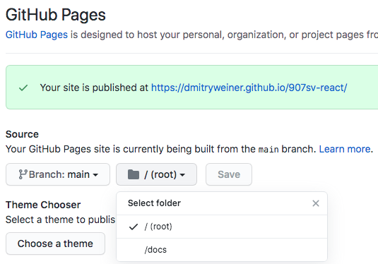

## Deploy


[все лекции](https://github.com/dmitryweiner/lectures/blob/main/README.md)
---


> Деплой &mdash; развёртывание программного продукта на хостинге.

---
### Варианты хостинга
* По цене:
  * [Бесплатный](https://ru.wikipedia.org/wiki/%D0%91%D0%B5%D1%81%D0%BF%D0%BB%D0%B0%D1%82%D0%BD%D1%8B%D0%B9_%D1%85%D0%BE%D1%81%D1%82%D0%B8%D0%BD%D0%B3).
  * Платный.
* По типу изолированности от пользователей:
  * [VDS](https://ru.wikipedia.org/wiki/VPS).
  * Shared.
* По типу установленного ПО:
  * Статика.
  * Динамика: PHP, Node.js.
---

### Github pages
* Подходит для небольших проектов без бэкенда.
* Со сборкой и без сборки.
* Время обновления большое (особенно картинки).
* Зато бесплатно.
* Проекты лежат в каталогах, могут быть проблемы с роутером.
---

### GH без сборки
* Предполагается, что проект лежит в корне репозитория, как [тут](https://github.com/dmitryweiner/react-standalone).
* Идём в [репозиторий -> Settings -> Pages](https://github.com/username/projectname/settings/pages).
* Выбираем main, /(root), жмём Save:


---

### GH со сборкой
* Предполагается, что проект собирается Webpack'ом или react-scripts в папку ```build```.
* package.json ([решение для Windows](https://coderoad.ru/50696920/%D0%BD%D0%B0%D1%81%D1%82%D1%80%D0%BE%D0%B9%D0%BA%D0%B0-package-json-%D0%BD%D0%B0-windows)):
```json
"homepage": "https://username.github.io/projectname",
"scripts": {
    "deploy": "rm -rf docs && react-scripts build && mv build docs",
```
* Идём в Settings -> Pages, выбираем ```/docs```:
  
---

### gh-pages
* Можно использовать [gh-pages](https://dev.to/yuribenjamin/how-to-deploy-react-app-in-github-pages-2a1f):
```shell
npm i -D gh-pages
```
* package.json:
```json
"homepage": "https://username.github.io/projectname",
"scripts": {
    "deploy": "gh-pages -d build",
```
* Запуск:
```shell
npm run deploy
```
* [Лечение беды с 'gh-pages' already exists](https://stackoverflow.com/questions/63964575/fatal-a-branch-named-gh-pages-already-exists).
---

### Domain и GH
Можно прикрутить домен вида ```foo.js.org``` к проекту на Github Pages:

https://github.com/pcottle/dns.js.org
---

### Heroku
* Бесплатный хостинг (с некоторыми ограничениями), [см. цены](https://www.heroku.com/pricing).
* Процесс ложится через 30 минут неиспользования.
* Подходит для бэкенда &mdash; есть Node.js.
---

### Heroku
* Поставить [heroku cli](https://devcenter.heroku.com/articles/heroku-cli).
* Создать и закоммитить файл [./static.json](https://github.com/heroku/heroku-buildpack-static#configuration):
```js
{
    "root": "dist", // корневой каталог, куда смотрит сервер
    "clean_urls": true,
    "routes": {
        "/**": "index.html"
    }
}
```
---

### Heroku: пример деплоя
* Логин в аккаунт на [heroku.com](https://signup.heroku.com/):
```shell
heroku login
```
* Создание приложения:
```shell
heroku create
```
* Добавление пакетов:
```shell
 # для Node.js
heroku buildpacks:add heroku/nodejs
 # для статики
heroku buildpacks:add https://github.com/heroku/heroku-buildpack-static
```
* Деплой:
```shell
git push heroku master
```
---

### Vercel
1. Загружаем на гит нужный проект.
2. Заходим на [vercel.com/dashboard](https://vercel.com/dashboard).
3. Там регаемся через GitHub.
4. После регистрации откроется форма, с предложением импорта репозитория. Кликаем по ней.
5. Из списка проектов выбираем нужный.
6. Происходит загрузка.
7. Проект загружен и выводятся ссылки на него.

---

### Glitch
* Работает статика и Node.js.
* На бесплатном тарифе любой может посмотреть код.
* Бэк засыпает после 5 минут простоя.
* Не даёт выбрать имя поддомена.
* Есть онлайн-редактор.
* [Регистрация](https://glitch.com/signup).
---

