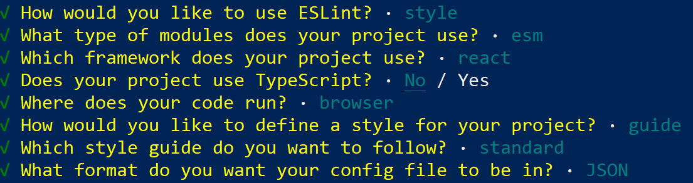
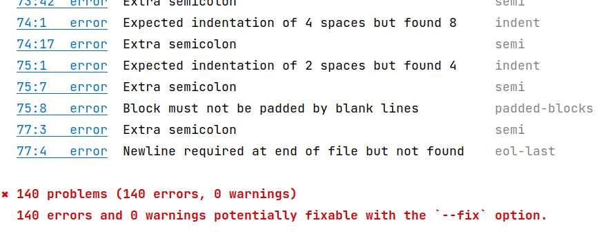
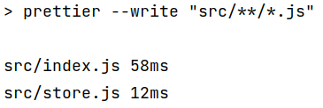
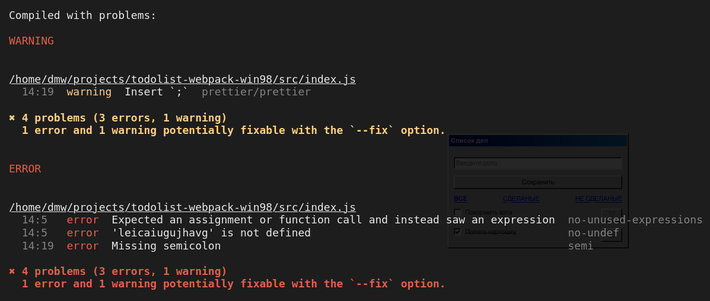
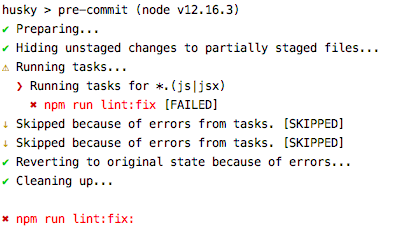

 

## Husky 🐶


[все лекции](https://github.com/dmitryweiner/lectures/blob/main/README.md)

---

> Робер Мартин: «Форматирование кода — это общение, а общение  —  первостепенная задача профессионального разработчика».

> Жорж Кангилем: «Человеку свойственно ошибаться, упорствовать в ошибке  —  дело дьявола».

---

### Задачи
* Вот бы было средство автоматического поиска ошибок в коде.
* Вот бы оно ещё и форматировало код само.
* Вот бы можно было настраивать правила форматирования и критерии ошибок.

---

### Решение: ESLint + Prettier
* ESLint:
  * Статический анализатор кода.
  * Поддерживает огромное множество плагинов.
  * Есть поддержка TypeScript.
  * Может автоматически исправлять код (в некоторых пределах).
* Prettier:
  * Просто хорошо форматирует код (в тех местах, где ESLint не может).

---

### Конфиг ESLint 
* Файл конфига `.eslintrc.json`.
* Сгенерировать его можно командой:
```shell
npx eslint --init
```


---

### Структура конфига
[Подробнее](https://eslint.org/docs/user-guide/configuring/)

```json
{
  "extends": [
    "standard"
    // можно расширить свой список правил, используя готовые наборы
  ],
  "plugins": [
    "prettier"
    // перечисляются подключенные плагины
  ],
  "rules": {
    // список правил, заданных вручную
    "prettier/prettier": ["error"]
  },
  "env": {
    // в каком окружении рассчитывает запускаться код
    "browser": true,
    "es6": true
  },
  "globals": {
    // глобальные переменные, чтоб не ругался на них
  }
}
```
---

### Готовые наборы правил для `"extends"`
* ESLint Recommended – нейтральный набор правил, включены только очевидно необходимые проверки: неиспользуемые переменные и т.п. Все последующие наборы расширяют этот.
* Google – для отступов строго пробелы, точка с запятой обязательна.
* AirBnB – точку с запятой обязательна.
* [Standard](https://github.com/standard/eslint-config-standard/blob/master/.eslintrc.json) – запрещена точка с запятой, но запрещены и завершающие запятые.
---

### Вид правила в `"rules"`
* Поведение настраивается с помощью [списка правил](https://eslint.org/docs/rules/).
* Простой вид правила `"имя правила": "что делать"`:
```js
    'react/prop-types': 'error',
    'react/jsx-no-undef': 'warn',
    'react/jsx-props-no-spreading': 'off',
```
---

### Вид правила в `"rules"`
* Более сложный вид `"имя правила":  [что делать, "параметры"]`:
* Что делать:
  * 0 — выключено
  * 1 — ворнинг
  * 2 — ошибка

```js
    'react/jsx-filename-extension': [
        1, { extensions: ['.tsx', '.jsx'] }
    ],
```
---

### Установка ESLint
* Ставим необходимые библиотеки:
```shell
npm install -D eslint eslint-plugin-standard
```
* Генерируем конфиг или создаём вручную.
* Добавляем вызов линтера в package.json -> scripts:
```json
"scripts": {
    // тут предыдущие команды
    "lint": "eslint src/",
    "lint:fix": "eslint src/ --fix"
}
```
  * npm run lint - запускает линтер.
  * npm run lint:fix - линтер исправляет код.
---

### Примерный вид конфига
```json
{
    "env": {
        "browser": true,
        "es2021": true
    },
    "extends": [
        "standard"
    ],
    "parserOptions": {
        "ecmaVersion": "latest",
        "sourceType": "module"
    },
    "rules": {
      "quotes": [2, "double"],
      "comma-dangle": [2, "never"],
      "indent": ["error", 2],
      "semi": [2, "always"],
      "space-before-function-paren": "off"
    }
}
```
---

### Результат запуска `npm run lint` 😭


Всё починится после запуска `npm run lint:fix` 😊
---

### Prettier
* ESLint неплохо справляется с синтаксическими ошибками, но пасует перед форматированием.
* Для форматирования есть специальная утилита Prettier.
* Управляется своим конфигом `.prettierrc`.
```json
{
  "useTabs": false,
  "printWidth": 120,
  "singleQuote": false,
  "trailingComma": "none"
}
```
* [Документация](https://prettier.io/docs/en/configuration.html).
---

### Установка Prettier
* Ставим пакеты:
```shell
npm install -D prettier eslint-config-prettier eslint-plugin-prettier
```
* В конфиге ESLint надо сослаться правила из Prettier и упомянуть плагин:
```json
{
    "plugins": ["prettier"],
    "rules": {
      "prettier/prettier": "warn",
      // тут остальные правила
    }
}
```

---

### Добавление команд запуска
* package.json -> scripts
```json
{
    "scripts": {
      // ...остальное
      "prettier": "prettier --write \"src/**/*.js\""
    }
}
```
* Результат работы `npm run pretter`:

---

### Конфиги ESLint и Prettier должны по смыслу совпадать
* Пробелы или табы, 2 пробела или 4
  * Prettier: "useTabs": false
  * ESLint: "indent": ["error", 2]
* Одинарные кавычки или двойные
  * Prettier: "singleQuote": false
  * ESLint: "quotes": [2, "double"],

---

### Конфиги ESLint и Prettier должны по смыслу совпадать
* Ставить `;` в конце или нет
  * Prettier: "semi": true
  * ESLint: "semi": [2, "always"]
* Ставить запятую после последнего элемента массива или объекта
  * Prettier: "trailingComa": false
  * ESLint: "comma-dangle": [2, "never"],
---

### ESLint + Webpack
* Хорошо бы ошибки, найденные линтером показывались во время просмотра сайта 
при запуске `npm run start`.
* Для этого надо поставить плагин [eslint-webpack-plugin](https://webpack.js.org/plugins/eslint-webpack-plugin/): 
```shell
npm i -D eslint-webpack-plugin
```
* И добавить его в конфиг Webpack:
```js
const ESLintPlugin = require('eslint-webpack-plugin');
//
module.exports = {
    // ...
    plugins: [new ESLintPlugin()],
    // ...
};
```
---

### ESLint + Webpack
Результат работы


---

### ESLint + TypeScript
* Установка:
```shell
npm i -D @typescript-eslint/eslint-plugin @typescript-eslint/parser
```
* Конфиг eslint.json:
```json
{
    "parser": "@typescript-eslint/parser",
    "parserOptions": {
      "ecmaVersion": 2019,
      "sourceType": "module",
      "ecmaFeatures": {
        "jsx": true
      },
      "project": "tsconfig.json",
      "tsconfigRootDir": "."
    },
    "plugins": [
      "prettier",
      "@typescript-eslint"
    ]
}
```
---

### Husky
* Идея: не давать коммитить в репозиторий, пока код не пройдёт проверку линтером.
* Эту задачу решает [Husky 🐶](https://github.com/typicode/husky), woof!
* Husky работает за счёт [git hooks](https://git-scm.com/book/ru/v2/%D0%9D%D0%B0%D1%81%D1%82%D1%80%D0%BE%D0%B9%D0%BA%D0%B0-Git-%D0%A5%D1%83%D0%BA%D0%B8-%D0%B2-Git).
* Установка:
```shell
npm install -D husky lint-staged
```
---

### Husky
* Добавление Husky в `package.json`:

```json
{
  "husky": {
    "hooks": {
      "pre-commit": "lint-staged"
      // что делать при коммите
    }
  },
  "lint-staged": {
    // запустить линтер для файлов в коммите
    "*.(js|jsx|ts|tsx)": [
      "npm run lint:fix"
    ]
  }
}
```
---

### Не даёт закоммитить

---

### Полезные плагины
* eslint-plugin-promise – проверки на типичные ошибки при использовании Promise. Немного странно работает с кодом на TypeScript.
* eslint-plugin-optimize-regex – плагин, который даёт советы по улучшению регулярных выражений.
* @typescript-eslint – правила eslint для проверки кода на TypeScript. И набор для отключения базовых правил, не совместимых с TS.
---

### Полезные плагины
* eslint-plugin-node - Плагин, предназначенный специально для Node.js-проектов.
* eslint-plugin-lodash - рекомендаций по написанию кода, использующего lodash.
* eslint-plugin-compat - проверяет совместимость кода с текущими браузерами.
---

### SonarJS
* Плагин для выявления высокоуровневых ошибок в коде:
  * Копипасты.
  * [Запахов кода](https://ru.wikipedia.org/wiki/%D0%9A%D0%BE%D0%B4_%D1%81_%D0%B7%D0%B0%D0%BF%D0%B0%D1%88%D0%BA%D0%BE%D0%BC).
  * [Переусложненного кода](https://ru.wikipedia.org/wiki/%D0%A6%D0%B8%D0%BA%D0%BB%D0%BE%D0%BC%D0%B0%D1%82%D0%B8%D1%87%D0%B5%D1%81%D0%BA%D0%B0%D1%8F_%D1%81%D0%BB%D0%BE%D0%B6%D0%BD%D0%BE%D1%81%D1%82%D1%8C).
* [Документация](https://github.com/SonarSource/eslint-plugin-sonarjs).
---

### SonarJS
* Установка:
```shell
npm i -D eslint-plugin-sonarjs
```
* Добавление в конфиг `eslint.json`:

```json
{
  "plugins": [
    /* тут другие плагины*/
    "sonarjs"
  ],
  "extends": [
    /* ... */
    "plugin:sonarjs/recommended"
  ]
}
```
---


---


### Полезные ссылки
* [Боб Мартин "Чистый код"](https://coollib.com/b/486351-robert-sesil-martin-chistyiy-kod-sozdanie-analiz-i-refaktoring/read).
* [Дока по ESLint](https://eslint.org/docs/user-guide/getting-started).
* [Полезные плагины для ESLint](https://habr.com/ru/post/417841/).
* [Prettier, ESLint, Husky, Lint-Staged и EditorConfig](https://habr.com/ru/company/ruvds/blog/428173/).
* []().
* []().
* []().