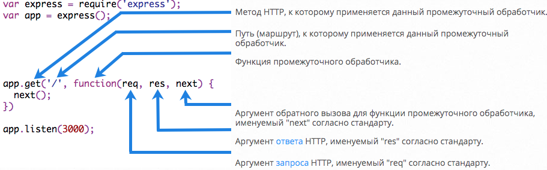

## Express.js


[Дмитрий Вайнер](https://github.com/dmitryweiner)

---

### Express.js
* Создан в 2010.
* Создатель [TJ Holovaychik](https://github.com/tj) ([твитор](https://twitter.com/tjholowaychuk)).


---

### Особенности
* Де факто стандарт в бэкенде на Node.js.
* Лицензия [MIT](https://ru.wikipedia.org/wiki/%D0%9B%D0%B8%D1%86%D0%B5%D0%BD%D0%B7%D0%B8%D1%8F_MIT).
* Написан по мотивам [Sinatra](https://ru.wikipedia.org/wiki/Sinatra).
* Часто используется с MongoDB, и с React/Angular/Vue ([MEAN](https://ru.wikipedia.org/wiki/MEAN_(%D0%B2%D0%B5%D0%B1-%D1%80%D0%B0%D0%B7%D1%80%D0%B0%D0%B1%D0%BE%D1%82%D0%BA%D0%B0))).

---

### Установка
* Установка библиотеки:
```shell
npm i express
```
* Настройка запуска в ```package.json```:
```json
  "scripts": {
    "start": "node index.js",
```
* Или запуск с помощью [```nodemon```](https://github.com/remy/nodemon):
```shell
npm i nodemon
```
```json
  "scripts": {
    "start": "nodemon index.js",
```
---

### Минимальный сервер
```js
const express = require('express');
const app = express();
const port = process.env.PORT || 3000;
app.get('/', (req, res) => {
  res.send('Hello World!'); // отправка ответа
});
app.listen(port, () => {
  console.log(`Example app listening on port ${port}!`)
});
```
---

### Статический сервер
* Express может работать, как сервер статики.
```js
// можно указать, из какого каталога брать файлы
app.use(express.static('public'));
// можно указать, какой URL отвечает за статику
app.use('/media', express.static('public'));
```
---

### Общая идеология обработчиков
* Нужно описать обработчики разной степени специфичности.
* Express ищет обработчик, подходящий к запросу.
* Обработчик может либо:
  * послать ответ; 
  * отправить запрос дальше по цепочке в следующий подходящий обработчик;
  * выкинуть ошибку;
---

### Общий вид обработчика



* Реакция только на GET /
```js
app.get('/', (req, res) => {
    res.send('Hello World!');
});
```
----
* Реакция на определённый URL:

```js
app.use('/admin', function (req, res, next) { // GET 'http://www.example.com/admin/new?sort=desc'
    next();
})
```
* Делает ровно то же:

```js
app.all('/admin', function (req, res, next) { // GET 'http://www.example.com/admin/new?sort=desc'
    next();
})
```
---

### Объект req
* Очень полезный объект, хранит в себе информацию о запросе:
* Тело запроса ```req.body```.
* Кукисы ```req.cookies```.
* [Документация](https://expressjs.com/ru/4x/api.html#req).
---

### Объект res
* Позволяет отправить HTTP-статус.
* Заголовки.
* Тело ответа.
* [Документация](https://expressjs.com/ru/4x/api.html#res).
---
### Объект res
* Отправка статуса:

```js
res.status(201);
```
* Отправка текста:

```js
res.send('Some text');
```
* Отправка JSON:

```js
res.json({ a: 1 });
```
* Можно статус и ответ:

```js
res.status(201).json({ b: 2 });
```

---

### Метод next()
* Позволяет передать управление в следующий подходящий обработчик.
* Если ответ уже задан, его не получится изменить в следующих обработчиках.
* Можно передать в next() ошибку, чтобы она была обработана другим обработчиком.
```js
next(new Error('Not found'));
```

---

### Обработка ошибок
* Можно задать специальный обработчик (у него должно быть 4 параметра), который будет перехватывать ошибки
и как-то красиво их выводить:
```js
app.use(function(err, req, res, next) {
    console.error(err.stack);
    res.status(500).send('Something is broken!');
});
```
* [Пример](https://github.com/dmitryweiner/todo-server/blob/main/server/index.js).
---

### Работа с куками
* Чтение:

```js
req.cookies.name
```
* Запись ([документация](https://expressjs.com/ru/4x/api.html#res.cookie)):

```js
  res.cookie('cookieName',randomNumber, { maxAge: 900000, httpOnly: true });
```
---

### Типы HTTP запроса
* При отправке HTTP-запроса указывается его тип:
  * GET.
  * POST.
  * PUT.
  * DELETE.
  * OPTIONS.
* [Документация](https://developer.mozilla.org/en-US/docs/Web/HTTP/Methods).
---

### RESTful API
* Для удобства использования и разработки API организуется по методике [RESTful API](https://ru.wikipedia.org/wiki/REST).

---

### Роуты
* [Документация](https://expressjs.com/ru/guide/routing.html).
* [Ещё документация](https://developer.mozilla.org/en-US/docs/Learn/Server-side/Express_Nodejs/routes).

---

### Параметры из роута
```js
router.get('/:id', (req, res) => {
  console.log(req.params.id);
});
```

---

### Middleware
* JSON.
* CORS.
* Image upload.
* Logs.
* Свой собственный обработчик.
---

### Разбор тела POST-запроса
```js
const express = require('express');
const app = express();
// Для запросов с заголовком Content-Type: application/json
app.use(express.json());
// Для запросов с заголовком Content-Type:  application/x-www-form-urlencoded
app.use(express.urlencoded({ extended: true }));
app.post('/profile', function (req, res, next) {
  console.log(req.body)
  res.json(req.body)
})
```
---

### MongoDB 

---

### Mongoose.js
https://developer.mozilla.org/en-US/docs/Learn/Server-side/Express_Nodejs/mongoose

---

### Тестирование
https://github.com/visionmedia/supertest#readme
https://hackernoon.com/api-testing-using-supertest-1f830ce838f1

---
### Полезные ссылки
https://expressjs.com/ru/4x/api.html
https://developer.mozilla.org/en-US/docs/Learn/Server-side/Express_Nodejs/Introduction
https://github.com/dmitryweiner/mini-chat-server
https://github.com/dmitryweiner/todo-server