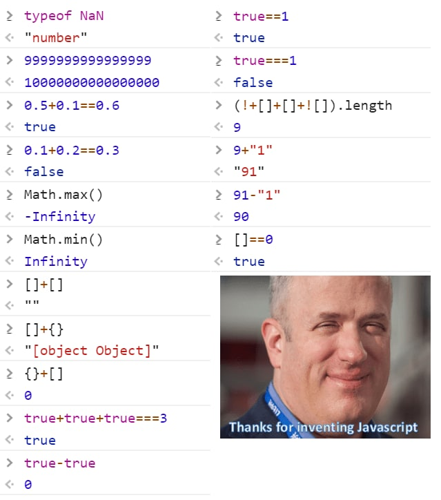
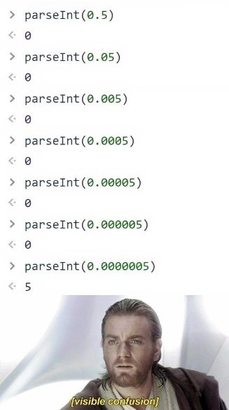
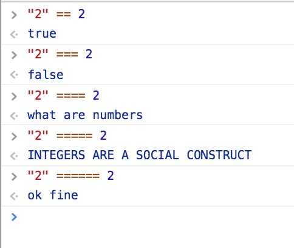

### Введение в JavaScript
#### Операторы и конструкции языка
#### Типы данных
#### Среды выполнения


[Дмитрий Вайнер](https://github.com/dmitryweiner)

[видео](https://drive.google.com/file/d/1r96__wjtHx5sK_5nBxTDN1CSchu8i3hX/view?usp=sharing)
---

### Факты
* Создатель [Брендан Айк (Brendan Eich)](https://twitter.com/brendaneich?lang=en).
* Год создания: 1995.
* Текущая версия: [12th Edition – ECMAScript 2021](https://en.wikipedia.org/wiki/ECMAScript#12th_Edition_%E2%80%93_ECMAScript_2021).
---

### Основные принципы
* Нестрогая типизация.
* Низкий порог входа.
* Выполняется в браузере (уже не только).
* Выполняется интерпретатором без компиляции.
* Прощает ошибки программиста (додумывает что-то своё).
---

### История развития языка

---

### История развития языка

---

### История развития фреймворков на JS

---

### История развития фреймворков на JS

---

### Подключение JS
```html
<!DOCTYPE html>
<html lang="ru">
<head>
    <meta charset="UTF-8">
    <title>Title</title>
  <script>
    console.log("Я скрипт!"); // 1. скрипт в <head>
  </script>
  <script src="script.js"></script><!-- 2. скрипт во внешнем файле -->
</head>
<body>
<script>
  console.log("И я скрипт!"); // 3. скрипт в <body>
</script>
</body>
</html>
```
---

### Подключение JS
* От способа подключения JS зависит время его выполнения.
* Скрипты, добавленные в `<head>`, выполняются первыми до построения DOM-дерева.
* Скрипты в `<body>` выполняются во время рендера DOM.
* Скрипты выполняются в порядке подключения.
* [Подробнее](https://learn.javascript.ru/script-async-defer), [ещё](https://learn.javascript.ru/external-script).
---

### Объявление переменных
* Устаревший синтаксис:
```js
var i = 1;
```
* Современный синтаксис:
```js
let i;
const j = 2;
```
* За один раз можно объявить и инициализировать несколько переменных:
```js
const i = 1, j = 2;
```
---

### Чем плох var?
* Объявление переменной перемещается в начало блока (hoisting).
* Нет блочной области видимости.
* Нет ошибки при повторном объявлении.
* При объявлении в глобальной области видимости затрагивает объект window.
* [Подробнее](https://learn.javascript.ru/var).
---

### Разница между let и const
* **const** служит для переменных, чьё значение не будет изменяться:
```js
const a = 1;
a = 2; // Exception!
const arr = [1, 2, 3];
arr.push(4); // всё хорошо, ссылка на массив не изменилась
```
* **let** для тех переменных, которые изменяются:
```js
let i = 1;
i = 2; // всё в порядке
```
---

### Области видимости
* Переменная видна только после объявления.
```js
console.log(i); // Uncaught ReferenceError: i is not defined
const i = 1;
console.log(i); // 1
```
* Переменная, объявленная внутри блока, видна только внутри этого блока.
```js
if (true) {
    const i = 1;
}
console.log(i); // Uncaught ReferenceError: i is not defined
```
* [Подробнее](https://habr.com/ru/post/517338/).
---

### Области видимости
* Внутри блока видны внешние переменные сколь угодного высоких уровней.
```js
const i = 1;
{
    console.log(i); // 1
}
```
* Блочные переменные перекрывают внешние при совпадении имён.
```js
const i = 1;
{
    const i = 2;
    console.log(i); // 2
}
```
---

### Типы данных
* **number**: число.

```js
const i = 1; // в десятиричном виде
const j = 0xBE; // в 16-ричном виде
const k = 0777; // в восьмеричном виде
const f = 0b0101010; // в двоичном виде
```
* **string**: строка.

```js
const s = "string";
const anotherString = '123';
const phrase = `Обратные кавычки позволяют
 встраивать переменные ${s}`; // шаблонная строка
```
* **boolean**: [булево](https://ru.wikipedia.org/wiki/%D0%91%D1%83%D0%BB%D1%8C,_%D0%94%D0%B6%D0%BE%D1%80%D0%B4%D0%B6) значение.

```js
const isSet = true;
```
---

### Строки
* Адресация к нужному элементу строки (индексация с 0):
```js
const str = "123";
console.log(str[1]); // 2
```
* Длина строки:
```js
const str = "123";
console.log(str.length); // 3
```
* Строки [иммутабельны](https://ru.wikipedia.org/wiki/%D0%9D%D0%B5%D0%B8%D0%B7%D0%BC%D0%B5%D0%BD%D1%8F%D0%B5%D0%BC%D1%8B%D0%B9_%D0%BE%D0%B1%D1%8A%D0%B5%D0%BA%D1%82):
```js
const str = "123";
str[2] = "4"; // str === "123"
```
* [Методы строк](https://learn.javascript.ru/string).
---

### Объединение строк
* Для склеивания строк удобно использовать [шаблонные строки](https://developer.mozilla.org/ru/docs/Web/JavaScript/Reference/Template_literals):
```js
const name = "Вася";
let greeting = "Привет, " + name + "! Как поживаешь?"; // ❌
greeting = `Привет, ${name}! Как поживаешь?`; // ✔️
```
* Внутри `${...}` можно писать любой валидный JS-код, возвращающий что-то:
```js
const a = 1, b = 2;
console.log(`a + b = ${a + b}`);
```
---

### Типы данных
* **function**: функция.

```js
const f = function (i) {
    return i * 2;
};
```
* **array**: массив.

```js
const arr = [1, 2, 3];
```
* **object**: объект.

```js
const obj = {
    field: 1
};
```
---

### Специальные типы
* **undefined**: не определено.

```js
let u;
console.log(u); // undefined
```
* **null**: значение неизвестно.

```js
let u = null;
console.log(u); // null
```
---

### Как узнать тип прямо в коде
* Оператор **typeof**:

```js
typeof undefined // "undefined"
typeof 0 // "number"
typeof 10n // "bigint"
typeof true // "boolean"
typeof "foo" // "string"
typeof null // "object" -- известный баг
typeof alert // "function"
```
---

### Операторы
* Присваивание: =
* Математические: *, /, +, -, %, **, ++, --
* Сравнения: >, <, >=, <=, ==, !=, ===, !==
* Логические: !, ||, &&
* Тернарный: ?
* Побитовые: |, &, ~, ^, <<, >>, >>>
* [Подробнее](https://learn.javascript.ru/operators).

---

### Неявное приведение типа
* Операторы неявно приводят переменные к тому типу, с которым работают.
* Математические операторы приводят к типу number, кроме оператора +.
* Логические операторы и операторы сравнения приводят к типу boolean.
* [Подробнее](https://learn.javascript.ru/type-conversions).
```js
"6" / "2" // 3
3 + "2" // 5
```
---


---

### Особенности оператора +
* Оператор "+" работает ещё и со строками, поэтому если первый операнд строка, то второй будет преобразован в строку:

```js
'2' + 1
// '21'

'2' - 1
// 1
```
---

### Явное приведение типа
* Если есть сомнения относительно типа пришедших данных, можно преобразовать к нужному типу:

```js
let value = "123";
console.log(value + 1); // "1231"
console.log(Number(value) + 1); // "124"
```
* Преобразовывать можно в любой встроенный тип: String, Number, Boolean, Array:

```js
String(123) // "123"
Boolean("false") // false
Number("123") // 123
```
* [Подробнее](https://learn.javascript.ru/type-conversions).
---

### Приведение типа и системы счисления
* Можно использовать приведение для преобразования между системами счисления:
* Из десятичной в любую другую:
```js
console.log(
    Number(123).toString(16 /* тут основание системы */)
);
// "7b"
```
* В десятичную систему:
```js
console.log(
    parseInt("7b", 16)
);
// 123
```
---


---

### Странности JS
* Поскольку преобразование типов может происходить неявно, некоторый код
  [выполняется странно](https://github.com/denysdovhan/wtfjs).
* Чтобы так не было, код надо писать с учётом типов или пользоваться типизированным языком TypeScript.
---

### Сравнение с учётом типа
* Есть два оператора сравнения: == и ===.
* Оператор == сравнивает, приводя операнды преимущественно к типу Number.
* У объектов проверяются ссылки. Если один объект, а другой нет &mdash; пытается привести объект к примитивному типу:
```js
1 == "1" // true
```
* Оператор === сравнивает ещё и типы операндов. Если они не равны, равенство неверно:
```js
1 === "1" // false
```
---

### Сравнение с учётом типа
* Следует пользоваться **ТОЛЬКО** операторами **===** и **!==** без неявного приведения типа.


---

### Сравнение строк
* Строки сравниваются посимвольно согласно кодам символов:
```js
"12" < "3" // true
"9" > "123" // true
```
---

### Массивы
* Массивы объявляются с помощью квадратных скобок.
* Нумерация индексов элементов начинается с 0.
* Можно добавлять/удалять элементы в любой момент.
* Длина массива хранится в свойстве .length.
```js
const a = [], arr = [1, 2, 3];
arr.length; // 3
arr.push(4); // [1, 2, 3, 4]
arr.length; // 4
arr[0]; // 1
```
---

### Объекты
* Объект создаётся с помощью фигурных скобок, в которых перечисляются поля и значения.
* В объект можно добавить поле после создания.
* Значение поля можно посмотреть с помощью оператора точка "."
```js
const obj = {
    field: 1,
    stringField: "123",
    method() { /* ... */ }
};
obj.anotherField = true;
console.log(obj.field); // 1
```
---

### Создание объекта
* При создании объекта можно использовать другие переменные в качестве полей:
```js
const str = "John";
const password = "1#$%1";
const account = 10000;
// ❌
const user = {
    name: str,
    password: password,
    account: account
};
// ✔
const user = {
    name: str,
    password,
    account
};
```
---

### Optional chaining
* Что если мы пытаемся получить доступ к полю объекта,
  а такого поля нет?
* Чтобы не было ошибки, надо использовать оператор "?.":
```js
const obj = {
    a: 1,
    b: 2
};
console.log(obj.c.d); // Error!
console.log(obj?.c?.d); // undefined
```
* [Подробнее](https://learn.javascript.ru/optional-chaining).

---

### Ссылочные типы данных
* Присваивание переменных, содержащих массивы или объекты, происходит по ссылке:

```js
const obj = { a: 1, b: 2 };
const anotherObj = obj;
anotherObj.b = 42;
console.log(obj.b); // 42

const arr = [1, 2, 3];
const anotherArr = arr;
anotherArr[1] = 123;
console.log(arr[1]); // 123
```
----


---

### Условия
* Условный оператор if / else обрамляется фигурными скобками.
* В условии должно быть булево значение или выражение, возвращающее такое значение.
* Если в условии не булево значение, оно будет к нему приведено.
```js
const a = 1, b = 2;
if (a > b) {
    console.log("a больше b");
} else {
    console.log("a не больше b");
}
```
---

### Switch
* Если if'ов много, удобно сделать из них switch:
```js
switch (a) {
    case 1: 
        console.log("a === 1");
        break;
    case 2: 
        console.log("a === 2");
        break;
    case 3: 
        console.log("a === 3");
        break;
    default: console.log("ни одно условие не сработало");
}
```
---

### Циклы
* Циклы делаются с помощью конструкций while, do/while, for:

```js
let i = 0;
while(i < 5) {
    console.log(i);
    i++;
}

// переменная объявляется прямо в for
for (let j = 0; j < 5; j++) {
    console.log(j);
}
```

---

### Варианты for
* Помимо классического for'а с переменной цикла есть ещё 2 удобных варианта для походов по массивам:

```js
const arr = [1, 2, 3];

// итерируем по индексам массива
for (let i in arr) {
    console.log(arr[i]);
}

// итерируем по элементам массива
for (let item of arr) {
  console.log(item);
}
```
---

### Полезные ссылки
* https://learn.javascript.ru/
* https://htmlacademy.ru/courses/343