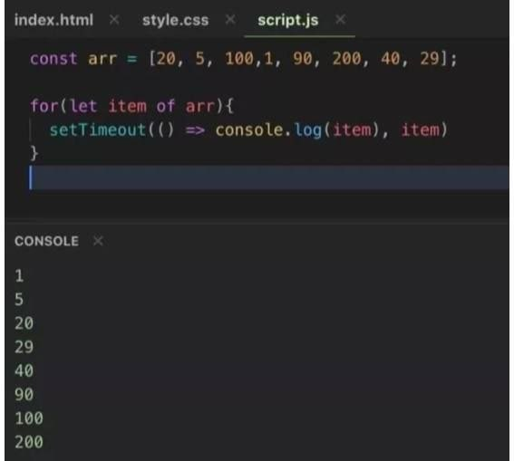
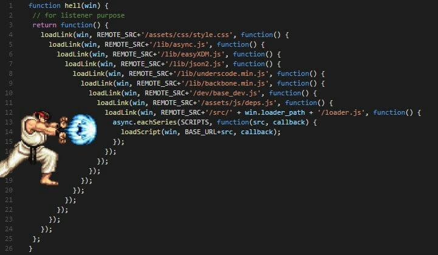
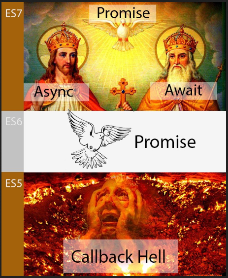
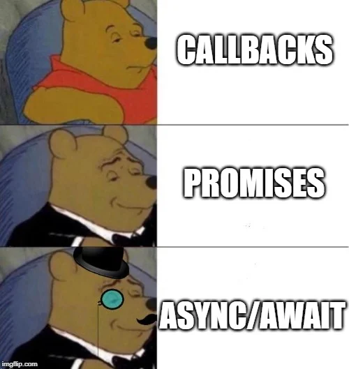

### JavaScript
* Таймеры
* Асинхронный код
* async/await
* Обработка ошибок
* Запросы в сеть

[Дмитрий Вайнер](https://github.com/dmitryweiner)

[видео](https://drive.google.com/file/d/1mgIP1vZfdrC-PmYGN39tV0vFVoJT9xwN/view?usp=sharing)
---

### Многопоточность и асинхронность
* JS &mdash; однопоточный язык.
* Многопоточность организована с помощью Event Loop.
* [Демо как это работает](http://latentflip.com/loupe/?).
* [Объяснение с картинками](https://habr.com/ru/post/501702/).
---


---

### Таймеры
* Для асинхронной работы используются функции **setTimeout**, **setInterval**.
* setTimeout срабатывает 1 раз через N миллисекунд:
* setInterval срабатывает каждые N миллисекунд.
* Для отключения таймеров используются функции **clearTimeout**, **clearInterval**.
* [Подробнее](https://learn.javascript.ru/settimeout-setinterval).
```js
const timerId = setTimeout(usefulFunction, 1000);
clearTimeout(timerId);
```
---

### Таймер
```html
<button id="start">Start</button>
<button id="stop">Stop</button>
<span id="currentCount"></span>
<script>
  let counter = 0, timerId;
  const start = document.getElementById("start");
  const stop = document.getElementById("stop");
  const currentCount = document.getElementById("currentCount");
  start.addEventListener("click", () => {
      timerId = setInterval(() => {
          currentCount.innerText = counter.toString();
          counter++;
      }, 1000);
  })
  stop.addEventListener("click", () => {
      clearInterval(timerId);
  })
</script>
```
---

### Замыкания
* Функция при создании копирует всё внешнее лексическое окружение. Это называется замыканием (closure).
* У каждого экземпляра функции своё замыкание.
* [Подробнее](https://learn.javascript.ru/closure).
---

### Замыкания
```js
function createIncrementFunc() {
    let counter = 0;
    return () => {
        console.log(counter);
        counter++;
    }
}

const counter1 = createIncrementFunc();
const counter2 = createIncrementFunc();
counter1(); // 0
counter1(); // 1
counter1(); // 2

counter2(); // 0
```
---

### Замыкания
* Что выведет этот код и почему?
```js
let i;
for(i = 1; i <= 3; i++) {
    setTimeout(() => console.log(i), 1000);
}
```
* Как сделать, чтобы он вывел 1, 2, 3? ⬇️
----
* На момент вызова функции внутри таймера значение переменной i уже остановилось в 3.
* Если мы хотим иметь актуальное значение i во время вызова таймера, необходимо скопировать значение во внутриблочную переменную,
  которая будет создаваться каждый прогон цикла.

```js
let i;
for(i = 1; i <= 3; i++) {
  const innerI = i;
  setTimeout(() => console.log(innerI), 1000);
}
```
---


---

### Exception
* В процессе работы программа может генерировать исключения, сигнализирующие о невозможности продолжения работы.
* Чтобы выбросить исключение, применяется конструкция throw:
```js
function divide(a, b) {
    if (b === 0) {
      throw new Error("Division by zero is strictly prohibited!");
    }
    return a / b;
}
```
* [Подробнее](https://learn.javascript.ru/exception).
---

### Try / catch
* Исключение можно перехватить и обработать.
```js
try {
    throw new Error('Уупс!');
} catch (e) {
    console.log(e.name + ': ' + e.message);
}
```
* Исключения бывают разные, в зависимости от типа ошибки.
* В конце может быть блок finally, выполняющийся всегда.
* [Подробнее](https://learn.javascript.ru/try-catch).
---

### [Типы ошибок](https://developer.mozilla.org/ru/docs/Web/JavaScript/Reference/Global_Objects/Error)
* EvalError: ошибка, возникающая в глобальной функции eval().
* InternalError: при выбрасывании внутренней ошибки в движке JavaScript. К примеру, ошибки «слишком глубокая рекурсия» («too much recursion»).
* RangeError: при выходе числовой переменной или параметра за пределы допустимого диапазона.
---

### [Типы ошибок](https://developer.mozilla.org/ru/docs/Web/JavaScript/Reference/Global_Objects/Error)
* ReferenceError: при разыменовывании недопустимой ссылки.
* SyntaxError: при разборе исходного кода в функции eval().
* TypeError: при недопустимом типе для переменной или параметра.
* URIError: при передаче в функции encodeURI() или decodeURI() недопустимых параметров.
---

### Try / catch / finally
```js
let result;

try {
    result = unstableFunction();
} catch (e) {
  if (e instanceof TypeError) {
    // обработка исключения TypeError
  } else if (e instanceof RangeError) {
    // обработка исключения RangeError
  } else if (e instanceof EvalError) {
    // обработка исключения EvalError
  } else {
    // обработка остальных исключений
  }
} finally {
  // в независимости от того, произошла ошибка или нет:
  freeMemory();
}
```
---

### Promise
* Промис &mdash; это способ организации асинхронного кода.
* Он хранит и меняет своё состояние в зависимости от выполнения.
* [Подробнее](https://learn.javascript.ru/promise).


---

### Promise
```js
const promise = new Promise((resolve, reject) => {
  setTimeout(() => {
    // переведёт промис в состояние fulfilled с результатом "result"
    resolve("result");
  }, 1000);
});
```
---

### Promise: реакция на выполнение
```js
// promise.then навешивает обработчики на успешный результат или ошибку
promise
  .then(
    result => {
      // первая функция-обработчик - запустится при вызове resolve
      console.log("Fulfilled: " + result); // result - аргумент resolve
    },
    error => {
      // вторая функция - запустится при вызове reject
      console.log("Rejected: " + error); // error - аргумент reject
    }
  );
```
---

### Promise: then / catch
* Обработчик отказа можно вынести в отдельный метод:

```js
promise
  .then(
    result => {
      console.log("Fulfilled: " + result); // result - аргумент resolve
    })
  .catch(
    error => {
      console.log("Rejected: " + error); // error - аргумент reject
    }
  );
```
---

### Promise: цепочки
* Если then/catch возвращают promise или какое-то значение, можно вызвать следующий then/catch.
* Так промисы можно объединять в цепочки.
* Это пригодится, когда мы будем делать сетевые запросы.

```js
fetch(...)
  .then(...)
  .then(...)
  .then(...)
```
---

### Promise.all()
* Можно запустить несколько промисов одновременно и подождать результатов выполнения их всех:

```js
Promise.all([
  fetch('/article/promise/user.json'),
  fetch('/article/promise/guest.json')
]).then(results => {
  console.log(results);
});
```
---

### Заранее завершившийся промис
* `Promise.resolve(value)` возвращает промис, выполненный с переданным значением.
```js
Promise.resolve(1).then(value => console.log(value));
// 1
```
* `Promise.reject(value)` возвращает промис, отклонённый с переданным значением.
```js
Promise.reject(2).catch(value => console.log(value));
// 2
```
---

### Что выведет код?
```js
setTimeout(function timeout() {
  console.log(1);
}, 0);
Promise.resolve().then(function resolve() {
  console.log(2);
});
console.log(3);
```

---


---


---

### async/await
* Async/await это
  [синтаксический сахар](https://ru.wikipedia.org/wiki/%D0%A1%D0%B8%D0%BD%D1%82%D0%B0%D0%BA%D1%81%D0%B8%D1%87%D0%B5%D1%81%D0%BA%D0%B8%D0%B9_%D1%81%D0%B0%D1%85%D0%B0%D1%80)
  над промисами.
* Модификатор async применяется к функции и означает, что она возвращает промис:
```js
// было
function f() {
    return new Promise(resolve => resolve(10));
}
// стало
async function f() {
    return 10;
}
```
---


---

### async/await
* Await применяется вместо then там, где нужно подождать ответа промиса:
```js
// было
f().then(result => console.log(result));
// стало
const result = await f();
console.log(result);
```
* Await может быть применен **только** в функции с модификатором **async** или на
  самом [верхнем уровне вызовов](https://habr.com/ru/post/524068/).
* [Подробнее](https://learn.javascript.ru/async-await).
---

### Async/await
* Было:

```js
function f() {
  return new Promise(resolve => resolve(10));
}

f().then(result => console.log(result));
```
* Стало:

```js
async function f() {
  return 10;
}

const result = await f();
console.log(result);
```
---

### async/await и исключения
* Можно обрабатывать исключения внутри async-функций.
* Это аналог then().catch():
```js
async function check() {
    let result;
    try {
        result = await f();    
    } catch (e) {
        result = "Error!";
    }
    return result;
}
```
---

### Походы в сеть: fetch
* Обращение к сети происходит с помощью функции **fetch**.
* Fetch возвращает промис, работать с которым лучше с помощью синтаксического сахара async/await:
```js
const response = await fetch("https://api.github.com/users/dmitryweiner");
const json = await response.json();
console.log(json);
```
* [Подробнее](https://learn.javascript.ru/fetch).
---

### Походы в сеть: fetch
* Отправка более сложного запроса:

```js
let user = {
  name: 'John',
  surname: 'Smith'
};

let response = await fetch('/article/fetch/post/user', {
  method: 'POST',
  headers: {
    'Content-Type': 'application/json;charset=utf-8'
  },
  body: JSON.stringify(user)
});

let result = await response.json();
```
---

### Задачи
* Написать функцию `counter(n)`, которая выводит в консоль раз в секунду числа n, n-1 ... 2, 1, 0 и останавливается.
* Написать функцию `createCounter(n)`, возвращающую объект с методами:
  * start() -- запускает (или возобновляет) счётчик c интервалом 1 секунда: N, N-1.
  * pause() -- приостанавливает счёт, но не сбрасывает счётчик.
  * stop() -- останавливает счёт, сбрасывает счётчик.
---

### Задачи
* Написать функцию `delay(n)`, возвращающую промис, который резолвится через n секунд.
* Решить задачу со счётчиком `N, N-1 ... 2, 1, 0` через функцию `delay`.
* Написать функцию, возвращающую название первого репозитория на github.com по имени пользователя 
  (2 последовательных запроса: https://api.github.com/users/%USERNAME%).
---

### Полезные ссылки
* https://learn.javascript.ru/promise-basics
* https://learn.javascript.ru/async-await
* https://learn.javascript.ru/fetch
* https://learn.javascript.ru/fetch-api
* https://3-info.ru/post/4984
* https://habr.com/ru/company/piter/blog/426709/