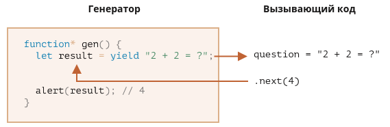

### JavaScript
#### Генераторы
#### Map / Set
#### Работа с датами
#### Математика


[Дмитрий Вайнер](https://github.com/dmitryweiner)
---

### Генераторы
* Генераторы &mdash; функции, возвращающие несколько значений.
* Генератор останавливает выполнение, пока его не попросили о значении 
  ([ленивые вычисления](https://ru.wikipedia.org/wiki/%D0%9B%D0%B5%D0%BD%D0%B8%D0%B2%D1%8B%D0%B5_%D0%B2%D1%8B%D1%87%D0%B8%D1%81%D0%BB%D0%B5%D0%BD%D0%B8%D1%8F)).
* [Подробнее](https://learn.javascript.ru/generators).
---

### Работа с генератором
* Чтобы объявить генератор, достаточно добавить *:
```js
function * generator() {
    //
}
```
* Возврат значений из генератора с помощью оператора yield:
```js
function * generator() {
    yield 1;
    yield 2;
    yield 3;
}
```
---

### Генератор и `.next()`
* Что возвращает:

```js
function * generator() {
    yield 1;
    yield 2;
    yield 3;
}
const gen = generator();
gen.next(); // {value: 1, done: false}
```
* Признак окончания `{done: true}`:

```js
function * generator() {
    yield 1;
    return 2;
}
const gen = generator();
gen.next(); // {value: 1, done: false}
gen.next(); // {value: 2, done: true}
```
---

### Генератор и `.next()`
* Передача значения в генератор:

```js
function * generator() {
    const value = yield 1;
    console.log(value); // 123
}
const gen = generator();
gen.next(123); // {value: 1, done: false}
```


---

### Работа с генератором
* Итерация по значениям:
```js
function * generator(n) {
    for(let i = 0; i < n; i++) {
        yield i;
    }
}
for (let value of generator(10)) {
    console.log(value);
}
```
* Вызов функции возвращает объект генератора, который можно итерировать.
---

### Композиция генераторов 
* Генератор может содержать другие генераторы:

```js
function * generator(n) {
    for(let i = 0; i < n; i++) {
        yield i;
    }
}
function * composition() {
    yield * generator(5);
    yield * generator(10);
}
for (let value of composition()) {
    console.log(value); // 0, 1, 2, 3, 4, 0, 1, 2, 3, 4, 5, 6, 7, 8, 9
}
```
---

### Генератор и оператор ...spread
* Генератор возвращает итерируемое значение, значит можно применить ...spread и создать массив, например:
```js
function * generator(n) {
    for(let i = 0; i < n; i++) {
        yield i;
    }
}
const arr = [...generator(5)]; // [0, 1, 2, 3, 4]
```
---

### Map, Set
* Set &mdash; это объект для хранения набора уникальных значений.
* Map &mdash; это объект для хранения пар ключ-значение.
* [Подробнее](https://learn.javascript.ru/map-set).
---

### Set
```js
// конструктор
const numbers = new Set();

// добавление значений
numbers.add(1);
numbers.add(2);
numbers.add(2);
numbers.add(3);
numbers.add(3);

// взять значения в виде массива
Array.from(numbers.values()); // [1, 2, 3]

// проверка, есть ли такое значение
numbers.has(1); // true

// размер коллекции
numbers.size; // 3

// очистка
numbers.clear();
```
---

### Set
* Простой способ поместить в массив только уникальные значения из другого массива:
```js
const arr = [1, 4, 4, 6, 1, 5, 6];
const unique = [...new Set(arr)]; // [1, 4, 6, 5]
```
* Используется то, что Set можно итерировать (и применить оператор ...spread соответственно).
---

### Map
* new Map() – создаёт коллекцию.
* map.set(key, value) – записывает по ключу key значение value.
* map.get(key) – возвращает значение по ключу или undefined, если ключ key отсутствует.
* map.has(key) – возвращает true, если ключ key присутствует в коллекции, иначе false.
* map.delete(key) – удаляет элемент по ключу key.
* map.clear() – очищает коллекцию.
* map.size – возвращает текущее количество.
---

### Работа с датами
* Конструкторы:
```js
new Date(); // текущая дата
new Date(milliseconds);
new Date(datestring);
new Date(year, month, date, hours, minutes, seconds, ms);
```
* Получение компонентов даты:
  * getFullYear() -  получить год (из 4 цифр)
  * getMonth() - получить месяц, от 0 до 11.
  * getDate() - получить число месяца, от 1 до 31.
  * getHours(), getMinutes(), getSeconds(), getMilliseconds()
---

### Работа с датами
* Установка компонентов даты:
    * setFullYear(year [, month, date])
    * setMonth(month [, date])
    * setDate(date)
    * setHours(hour [, min, sec, ms])
    * setMinutes(min [, sec, ms])
    * setSeconds(sec [, ms])
    * setMilliseconds(ms)
    * setTime(milliseconds)
* [Подробнее](https://learn.javascript.ru/datetime).
---

### Локальное представление даты
* Можно представить дату в региональном формате (зависит от выставленного региона в системе и браузере):

```js
const date = new Date();
date.toLocaleString(); // "18.10.2021, 12:00:34"
date.toLocaleTimeString(); // "12:00:34"
date.toLocaleDateString(); // "18.10.2021"
```
---

### Сравнение дат
* Даты можно сравнивать:

```js
const date1 = new Date('1995-12-17T03:24:00');
const date2 = new Date('2022-04-13T10:48:00');
date2 > date1 // true
```
* Дата больше, если она позже.
---

### Moment.js
* Для удобной работы с датами можно подключить библиотеку [moment.js](https://momentjs.com/).

```js
moment().format('MMMM Do YYYY, h:mm:ss a'); // October 17th 2021, 9:22:04 pm
moment().format('dddd');                    // Sunday
moment().format("MMM Do YY");               // Oct 17th 21

moment().startOf('day').fromNow();        // 21 hours ago
moment().endOf('day').fromNow();          // in 3 hours
moment().startOf('hour').fromNow();       // 22 minutes ago
```
---

### Математика
* Вся математика лежит в объекте Math.
* Константы:
  * `Math.E` - число Эйлера или Непера (2,718).
  * `Math.PI` - Число π (3,14159265).
* Функции:
  * `Math.ceil(x)` - значение числа, округлённое к большему целому.
  * `Math.floor(x)` - значение числа, округлённое к меньшему целому.
  * `Math.round(x)` - "обычное" округление.
---

### Математика
* `Math.random()` - псевдослучайное число в диапазоне от 0 до 1.
* `Math.max([x[, y[, …]]])` - наибольшее число из своих аргументов.
* `Math.min([x[, y[, …]]])` - наименьшее число из своих аргументов.
* `Math.sin(x)` - синус числа.
* `Math.sqrt(x)` - положительный квадратный корень числа.
* [Подробнее](https://developer.mozilla.org/ru/docs/Web/JavaScript/Reference/Global_Objects/Math).
---

### Большие числа
* Для представления чисел больше 2<sup><small>53</small></sup>-1 используется тип BigInt:
```js
const theBiggestInt = 9007199254740991n;
const alsoHuge = BigInt(9007199254740991);
const maxSafe = BigInt(Number.MAX_SAFE_INTEGER) + 1n;
```
* [Подробнее](https://developer.mozilla.org/ru/docs/Web/JavaScript/Reference/Global_Objects/BigInt).
---

### Типизированные массивы
* Для работы с памятью удобно использовать типизированные массивы.
  * [Обработка изображений](https://hacks.mozilla.org/2011/12/faster-canvas-pixel-manipulation-with-typed-arrays/).
  * Захват звука.
  * Хранение структур с фиксированным размером.
* [Подробнее](https://developer.mozilla.org/ru/docs/Web/JavaScript/Typed_arrays), [ещё](https://learn.javascript.ru/arraybuffer-binary-arrays).
---


---

### Типизированные массивы
* Представление 16-битного куска памяти как массива знаковых 32-битных чисел:
```js
const buffer = new ArrayBuffer(16);
const int32View = new Int32Array(buffer);
for (const i = 0; i < int32View.length; i++) {
  int32View[i] = i * 2;
}
```
---

### Задачи
* Реализовать генератор, бесконечно возвращающий случайное число в заданном диапазоне `random(n, m)`.
* Реализовать генератор, бесконечно возвращающий очередное число из
  [последовательности Падована](https://ru.wikipedia.org/wiki/%D0%9F%D0%BE%D1%81%D0%BB%D0%B5%D0%B4%D0%BE%D0%B2%D0%B0%D1%82%D0%B5%D0%BB%D1%8C%D0%BD%D0%BE%D1%81%D1%82%D1%8C_%D0%9F%D0%B0%D0%B4%D0%BE%D0%B2%D0%B0%D0%BD%D0%B0).
* Реализовать генератор, бесконечно возвращающий очередное простое число.
---

### Задачи
* Посчитать число вхождений букв (или слов) в строке, используя `Map`.
* Написать функцию `getPrime(n)`, возвращающее n-ное по счёту простое число, используя BigInt.
---

### Полезные ссылки
* https://learn.javascript.ru/generators
* https://learn.javascript.ru/map-set
* https://learn.javascript.ru/date
* https://learn.javascript.ru/number
* https://learn.javascript.ru/arraybuffer-binary-arrays
