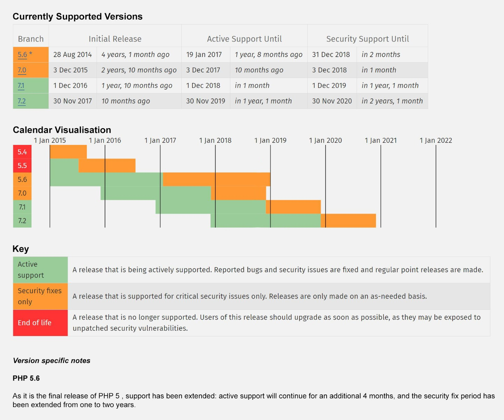
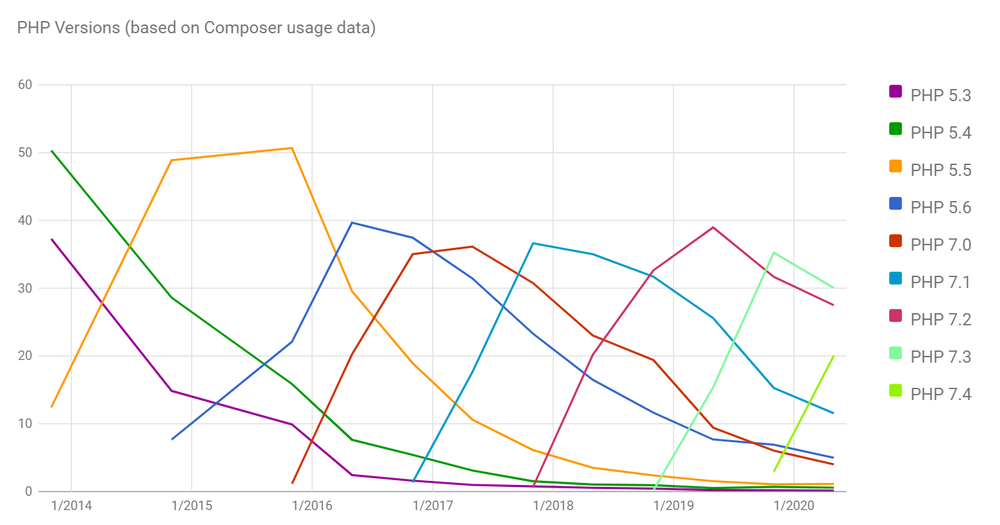
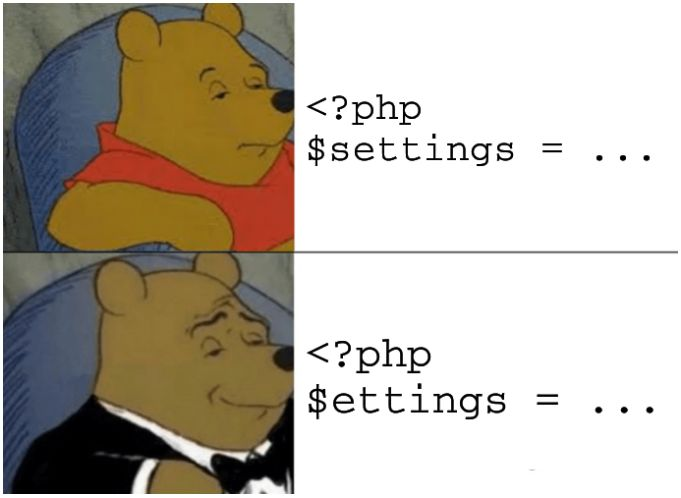

## PHP


[все лекции](https://github.com/dmitryweiner/web-lectures/blob/main/README.md)

[видео](https://drive.google.com/file/d/1QRx4Z71uLf4v_45VtZ-pG_GJx5hoOQIF/view?usp=sharing)
---

### Идея
* PHP &mdash; рекурсивный акроним словосочетания PHP: Hypertext Preprocessor.
* Серверный интерпретатор (по типу Node.js).
* Создан 8 июня 1995.
* Текущая версия 8.0.
* Создатели: 
[Расмус Лердорф](https://github.com/rlerdorf), 
[Энди Гутманс](https://andigutmans.com/),
[Зеев Сураски](http://zsuraski.blogspot.com/).


<div style="display: flex; flex-direction: row; justify-content: center;">
<div style="width:150px">


</div>
<div style="width:150px">


</div>
<div style="width:150px">


</div>
</div>
---


---


---

### Распространённые фреймворки
* [Symfony](https://symfony.com/).
* [Laravel](https://laravel.ru/).
* [Zend](https://framework.zend.com/).
* [Yii2](https://www.yiiframework.com/).
---

### Системы менеджмента контента (CMS)
* [Drupal](https://www.drupal.org/).
* [Wordpress](https://wordpress.com/ru/create/).
* [Joomla](https://joomla.ru/).
* [Magento](https://magento.com/).
---

### Система управления зависимостями
* [Composer](https://packagist.org/)
```shell
curl -sS https://getcomposer.org/installer | php
```
* Зависимости хранятся в composer.json:
```json
{
    "name": "your-vendor-name/package-name",
    "description": "A short description of what your package does",
    "require": {
        "php": ">=7.4",
        "another-vendor/package": "1.*"
    }
}
```
---

### Установка
* Windows:
  * [OpenServer](https://ospanel.io/).
  * [Denwer](http://www.denwer.ru/).
* Linux:
```shell
# ставит PHP 7.4 на Ubuntu 20.04
sudo apt install php php-xml php-curl php-mysql php-mbstring php-gd
```
---

### Apache, Nginx
* При установке на Linux может потребоваться поставить веб-сервер
([Apache](https://www.digitalocean.com/community/tutorials/how-to-install-the-apache-web-server-on-ubuntu-18-04-quickstart-ru)
или [Nginx](https://www.digitalocean.com/community/tutorials/how-to-install-nginx-on-ubuntu-20-04-ru)).
* И настроить его конфиги:
  * [Apache](https://www.tutorialspoint.com/php/php_apache_configuration.htm).
  * [Nginx](https://linuxconfig.org/basic-php-7-and-nginx-configuration-on-ubuntu-16-04-linux).
---

### Хостинг
* [Поисковик по хостингам](https://ru.hostadvice.com/hosting-services/free-php-hosting/).
* [000webhost.com](https://www.000webhost.com/).
---

### Запуск локально
* В PHP есть встроенный сервер для разработки.
* Чтобы его запустить в текущем каталоге, нужно:
```shell
php -S 127.0.0.1:8080 -t ./
```
---

### Базовый синтаксис
* [PHP-теги](https://www.php.net/manual/ru/language.basic-syntax.phptags.php):
```php
<?php /* всё, что в этих тегах, интерпретируется, как PHP-код */ ?>
```
  * Тег ?&gt; можно не закрывать, если файл содержит только код PHP.
* Создание переменных:
```php
<?php
$a = 1;
$b = $a + 1;
```
* Вывод:
```php
<?php
echo 123;
```
---


---

### Вывод для дебага
* Без типов:
```php
print_r([1, 2, 3]);
// Array ( [0] => 1 [1] => 2 [2] => 3 ) 
```
* Если надо вывести тип, используется [var_dump()](https://www.php.net/manual/ru/function.var-dump.php):
```php
<?php
var_dump([1, 2, 3]);
// array(3) { [0]=> int(1) [1]=> int(2) [2]=> int(3) } 
```
---

### Укороченный вывод
* Вместо echo можно использовать короткий синтаксис "&lt;?=":
```php
<?php
  $a = "123";
  echo $a;
?>
```
* Короче:
```php
<?php
  $a = "123";
?>
<?=$a?>
```
---

### Типы данных
```php
$number = 123;

$double = 1.23;

$boolean = true;

$string = "123";

$array = [1, 2, 3];

$object = new class{};

$function = function() {};
```

[Подробнее](https://www.php.net/manual/ru/language.types.php).
---

### Определение типа переменной
* Всегда можно определить тип переменной с помощью [**gettype**](https://www.php.net/manual/ru/function.gettype.php):
```php
$unknown = 1.23;
echo gettype($unknown);
// double
```
---

### Интерпретируемые строки
* Строки в одинарных кавычках не интерпретируются:
```php
$name = "Vasya";
echo 'My name is $name';
// My name is $name
```
* Строки в двойных кавычках интерпретируются:
```php
$name = "Vasya";
echo "My name is $name";
// My name is Vasya
```
---

### Полезные методы для строк
* Разделение по ключу:
```php
explode(':', '1:2:3:4'); // array('1', '2', '3', '4')
```
* Взятие подстроки:
```php
substr('abcdef', 1, 3);  // bcd
```
* [Их довольно много](https://www.php.net/manual/ru/ref.strings.php).
---

### Операторы
* Арифметика:
  * \+ Сложение.
  * \- Вычитание.
  * \* Умножение.
  * / Деление.
  * % Деление по модулю.
  * \** Возведение в степень.
---

### Операторы
* Строки складываются оператором точка ".":
```php
$name = "Vasya";
$greeting = "My name is ";
echo $greeting . $name;
// My name is Vasya
```
---

### Сравнение
```php
$n == $m //	true, если $n равно $m

$n === $m //	true, если $n равно $m и имеют одинаковые типы

$n != $m //	true, если $n не равна $m

$n !== $m //	true, если отличаются тип или значение переменных

$n < $m //	true, если $n меньше $m

$n > $m //	true, если $n больше $m

$n <= $m //	true, если $n меньше или равна $m

$n >= $m //	true, если $n больше или равна $m
```
---

### Операторы управления
* if/else:

```php
if ($a > $b) {
    echo "a больше, чем b";
} elseif ($a == $b) {
    echo "a равен b";
} else {
    echo "a меньше, чем b";
}
```
* for:

```php
for ($i = 1; $i <= 10; $i++) {
    echo $i;
}
```
---

### Операторы управления
* switch:

```php
switch ($value) {
    case 'значение1':
        // код
        break;
    case 'значение2':
        // код
        break;    
    default:
        // код
        break;
}
```
* while:

```php
$i = 0;
while ($i < 4) {
    $i++;
    echo "i = $i";
}
```
---

### Операторы цикла
* continue: переходит к следующей итерации.
* break: прерывает цикл.
---

### Тернарный оператор
```php
$is_admin = ($user['permissions'] === 'admin') ? true : false;
```
---

### Перехватывание исключений
* Используется конструкция [try/catch/finally](https://www.php.net/manual/ru/language.exceptions.php):
```php
try {
    echo f() . "\n";
} catch (Exception $e) {
    echo 'Поймано исключение: ',  $e->getMessage(), "\n";
} finally {
    echo "finally.\n";
}
```
---

### Подавление ошибок
* [Оператор "@"](https://www.php.net/manual/ru/language.operators.errorcontrol.php) выключает отображение ошибок для конкретного действия:
```php
$file_name = @file('non_existent_file') or
    die ("Failed in opening the file: error: '$errormsg'");
```
---

### Массивы
* В массив можно складывать значения любого типа:
```php
$arr = [1, 2, true, "123"];
```
* Индекс массива начинается с 0:
```php
echo $arr[0]; // 1
```
* Положить в массив ещё один элемент:
```php
$arr[] = "Ещё один элемент";
```
---

### Ассоциативные массивы
* Ключи массива могут быть строками:
```php
$arr = [
    "хлеб" => 60,
    "яйца" => 200,
    "колбаса" => 300
];
```
---

### Foreach
* Массив удобно перебирать с помощью foreach:
```php
$arr = [1, 2, true, "123"];
foreach ($arr as $value) {
    echo $value;
}
```
---

### Проверка существования элемента по ключу
* Обращение к массиву по несуществующему ключу вызовет ошибку.
* Чтобы так не было, надо вначале проверить, существует ли он, методом [**isset()**](https://www.php.net/manual/ru/function.isset.php):
```php
if (isset($_POST['email'])) {
    // ..
}
```
---

### Полезные методы массивов
* Переворачивание массива:
```php
array_reverse([1, 2, 3, 4); // [4, 3, 2, 1]
```
* Проверка, что это массив:
```php
is_array([1, 2, 3, 4); // true
```
* Слепить массив в строку:
```php
implode(',', 'имя', 'почта', 'телефон'); // имя,почта,телефон
```
* [Все методы](https://www.php.net/manual/ru/ref.array.php).
---

### Неявное приведение типов
* Тип переменной определяется по контексту, в котором она используется:

```php
$foo = "1";  // $foo - это строка (ASCII-код 49)

$foo *= 2;   // $foo теперь целое число (2)

$foo = $foo * 1.3;  // $foo теперь число с плавающей точкой (2.6)

$foo = 5 * "10 Little Piggies"; // $foo - это целое число (50)

$foo = 5 * "10 Small Pigs";     // $foo - это целое число (50)
```
---

### Явное приведение типов
* Имя требуемого типа записывается в круглых скобках перед приводимой переменной ([подробнее](https://www.php.net/manual/ru/language.types.type-juggling.php)).
```php
$foo = (int) "1"; // целое число
```
  * (int), (integer) - приведение к int.
  * (bool), (boolean) - приведение к bool.
  * (float), (double), (real) - приведение к float.
  * (string) - приведение к string.
  * (array) - приведение к array.
  * (object) - приведение к object.
---

### Функции
* Функции бывают [именованные](https://www.php.net/manual/ru/functions.user-defined.php)
и [анонимные](https://www.php.net/manual/ru/functions.anonymous.php):

```php
function foo($arg_1, $arg_2, /* ..., */ $arg_n) {
  echo "Пример функции.\n";
  return $retval;
}

$greet = function($name) {
  echo "Привет, $name";
};
$greet('Мир');
$greet('PHP');
```

---

### Typehint
* Начиная с PHP 7.4 можно [указывать](https://www.php.net/manual/ru/language.types.declarations.php)
тип параметров и возвращаемого значения:

```php
function sum(float $a, float $b): float {
    return $a + $b;
}
```
---

### Стрелочные функции
* Начиная с PHP 7.4 можно создавать [стрелочные функции](https://www.php.net/manual/ru/functions.arrow.php):
```php
$sum = fn($x, $y) => $x + $y;
$sum(1, 2); // 3
```
---

### Объекты и классы
* Пример работы с классом:

```php
class foo {
    function do_foo() {
        echo "Код foo.";
    }
}

$bar = new foo;
$bar->do_foo(); // -> оператор вызова метода или чтения поля
```

* ООП в языке [представлено](https://www.php.net/manual/ru/language.oop5.php) полностью.
---

### Оператор передачи по ссылке
* С помощью оператора "&" можно передавать [параметр по ссылке](https://www.php.net/manual/ru/language.references.pass.php),
что позволяет его изменять:
```php
$arr = [1, 2, 3, 4];
foreach ($arr as &$value) {
    $value = $value * 2;
}
// [2, 4, 6, 8]
```
---

### Оператор передачи по ссылке
* Его можно указывать в параметрах функции или метода:

```php
function foo(&$var) {
    $var++;
}

$a = 5;
foo($a);
// $a здесь равно 6
```
---

### Импорты
* Можно импортировать код из других файлов с помощью методов require, require_once, include и include_once:
  * [require](https://www.php.net/manual/ru/function.require.php): вызывает ошибку, если файл не найден.
  * [include](https://www.php.net/manual/ru/function.include.php): вызывает warning, если файл не найден.
  * include_once, require_once: импортируют файл единожды.
* Подключение файла вызывает его выполнение.
---

### Пример импорта
* footer.php:

```php
<?php
echo "<p>Copyright &copy; 1999-" . date("Y") . " W3Schools.com</p>";
```
* index.php:

```php
 <html>
<body>

<h1>Welcome to my home page!</h1>
<p>Some text.</p>
<p>Some more text.</p>
<?php include 'footer.php';?>

</body>
</html> 
```
---

### Возвращаемое значение
* Модуль может возвращать значение:
```php
<?php
// db.php
return [
    'class' => 'yii\db\Connection',
    'dsn' => 'mysql:host=localhost;dbname=yii2basic',
    'username' => 'root',
    'password' => '',
    'charset' => 'utf8',
];
```
* Которое может быть использовано при импорте:
```php
$db = require __DIR__ . '/db.php';
```
---

### Пространство имён
* Для избежания коллизий имён используются [пространства имён](https://www.php.net/manual/ru/language.namespaces.rationale.php) (аналог пакетов в Java).
* Пространства имён могут быть вложенные.
* Путь можно указывать относительный.

```php
namespace project\util;

class Debug {
    static function helloWorld() {
        print "Привет из класса Debug";
    }
}

// в другом файле:
project\util\Debug::helloWorld();

// или
use project\util;
Debug::helloWorld();
```
---

### [Области видимости](https://www.php.net/manual/ru/language.variables.scope.php)
* Переменная, объявленная на верхнем уровне файла, видна везде в этом файле и во всех подключенных файлах.
* Переменная, объявленная в функции или методе видна только локально.
* Чтобы использовать переменные из глобальной области видимости, используется ключевое слово ```global```:
```php
$a = 1;
$b = 2;
function sum() {
    global $a, $b;
    return $a + $b;
}
```
---

### Переменные окружения
* Переменные окружения лежат в [$_ENV](https://www.php.net/manual/ru/reserved.variables.environment.php):
```php
echo 'Моё имя пользователя: ' .$_ENV["USER"] . '!';
```
---

### Глобальные константы
* Глобальные константы лежат в [$_SERVER](https://www.php.net/manual/ru/reserved.variables.server.php):
  * PHP_SELF: Имя файла скрипта, который сейчас выполняется.
  * SERVER_ADDR: IP-адрес сервера, на котором выполняется текущий скрипт.
  * QUERY_STRING: Строка запроса, если есть, через которую была открыта страница.
  * REMOTE_ADDR: IP-адрес, с которого пользователь просматривает текущую страницу.
---

### Обработка форм
* При отправке формы совершается запрос методом **POST**. Данные запроса хранятся в глобальном объекте ```$_POST```.
* При вызове такого типа ```index?query=123``` данные хранятся в ```$_GET```.
* [Подробнее](https://addphp.ru/materials/base/1_13.php).

```php
<form action="<?=htmlentities($_SERVER['PHP_SELF']) ?>" method="post">
    <input type="text" name="field">
    <button type="submit">Сохранить</button>
</form>
<?php 
    $field = isset($_POST['field']) ? $_POST['field'] : '';
	if (!empty($field))	{
		echo 'Вы ввели: ' . $field;
	}
```
---

### Чтение и запись файлов
* Можно [читать и писать файлы](https://addphp.ru/materials/base/1_14.php), если есть права в системе.

```php
$handle = @fopen("/tmp/inputfile.txt", "r");
if ($handle) {
    while (($buffer = fgets($handle, 4096)) !== false) {
        echo $buffer;
    }
    if (!feof($handle)) {
        echo "Ошибка: fgets() неожиданно потерпел неудачу\n";
    }
    fclose($handle);
}
```
---

### Cookies
* Кукисы можно прочитать с помощью глобального массива ```$_COOKIES```.
* Запись кукисов происходит с помощью метода ```setcookie('name', 'value')```.
* У кукисов есть много [дополнительных параметров](https://developer.mozilla.org/ru/docs/Web/HTTP/Cookies):
  * Домен.
  * Время жизни.
  * Путь.
* [Подробнее](https://addphp.ru/materials/base/1_15.php).
---

### Сессия
* PHP умеет сам отслеживать сессию и сохранять некие сессионные данные.
* Сессия начинается с помощью метода ```session_start()```, а уничтожается методом ```session_destroy()```.
* Данные сессии хранятся в глобальном массиве ```$_SESSION```.
---

### Работа с датами
* Функция date выводит текущие дату и время в заданном формате:
```php
echo date('H:i:s d.m.Y'); //вернет 06:41:17 08.11.2021
```
* time() возвращает [UNIX timestamp](https://www.unixtimestamp.com/) для текущего момента:
```php
echo time(); // 1636353544
```
* mktime(): timestamp для определённой даты:
```php
echo mktime(12, 0, 0, 2, 1, 2000); // 949406400 
```
* [Подробнее](http://old.code.mu/books/php/base/rabota-s-datami-v-php.html).
---

### Подключение к БД
* [Краткий курс MySQL](https://addphp.ru/materials/mysql/1_3.php).
* [PHP + MySQL](https://addphp.ru/materials/mysql/1_4.php).

```php
// подключение к базе
$link = mysqli_connect('localhost', 'user', 'password', 'db_name');

// обработка ошибки
if (!$link) {
  die('<p style="color:red">'.mysqli_connect_errno().' - '.mysqli_connect_error().'</p>');
}

// создание запроса к базе
$result = mysqli_query($link, "SELECT * FROM customers;");

// вывод данных
echo '<p>Все пользователи: </p><ul>';
while ($row = mysqli_fetch_row($result)) {
  echo "<li>Имя: {$row[1]}</li>";
}
echo '</ul>';
```
---

### Более удобный способ
* Файл connect.php:
```php
$link = new MySQLi('localhost', 'user', 'password', 'db_name');
if ($link->connect_error) {
    die('<p style="color:red">'.$link->connect_errno.' - '.$link->connect_error.'</p>');
}
$link->query("SET NAMES utf8");
```
* В остальном коде:
```php
require_once 'connect.php';
$result = $link->query("SELECT * FROM users");
while ($row = $result->fetch_row()) {
  // ...
}
```
---

### Форма и добавление данных в БД
* [Детальнее](https://addphp.ru/materials/mysql/1_5.php).
* Форма:
```php
<form action="handler.php" method="post">
	<input type="text" name="email" placeholder="E-mail адрес">
    <button type="submit">Сохранить</button>
</form>
```
---

### Форма и добавление данных в БД
* handler.php:

```php
<?php
require_once 'connect.php';
$email = isset($_POST['email'])
    // не забыть заэкранировать 
    ? trim(mysqli_real_escape_string($link, $_POST['email'])) 
    : '';

if (!empty($email)) {
    $link->query("INSERT INTO newsletter(email) VALUES ('{$email}')");
    // Проверяем прошла ли операция (свойство affected_rows возвращает число строк, 
    // затронутых предыдущей операцией MySQL (в нашем случае 1)
    if ($link->affected_rows == 1) {
        echo '<h1>Спасибо за подписку</h1>';
    } else {
        echo '<p>Что-то пошло не так при попытке записи вашего email в базу данных</p>';
    }
}
```
---

### Экранирование данных
* Данные от пользователя могут стереть базу или изменить данные.
* Их необходимо экранировать с помощью [```mysqli_real_escape_string```](https://www.php.net/manual/ru/mysqli.real-escape-string.php).
```php
$escaped_email = mysqli_real_escape_string(
    $link,
    $_POST['email']
); 
```


---

### Persistent data object (PDO)
* К базе также удобно подсоединяться через PDO.
* Плюсы:
  * Автоматическое экранирование данных.
  * Параметризация запросов.
  * Запрос одним действием.
  * Возвращает ассоциативный массив.
* [Руководство](https://prowebmastering.ru/php-pdo-start.html), [ещё одно](https://metanit.com/php/mysql/2.1.php).
---
  
### PDO
```php
try {
  $conn = new PDO("mysql:host=localhost;dbname=%DB_NAME%", "root", "mypassword");
  echo "Database connection established";
  $userid = 123;
  $sql = "SELECT * FROM Users WHERE id = :userid";
  $stmt = $conn->prepare($sql);
  $stmt->bindValue(":userid", $userid);
  $stmt->execute();
  if($stmt->rowCount() > 0) {
foreach ($stmt as $row) {
  $username = $row["name"];
  $userage = $row["age"];
}
  } else {
    echo "Пользователь не найден";
  }
}
catch (PDOException $e) {
    echo "Connection failed: " . $e->getMessage();
}
```
---

### Короткий способ биндинга параметров
```php
    $stmt = $pdo->prepare("SELECT `name` FROM categories WHERE `id` = ?");
    $stmt->execute([$id]);
     
    $stmt = $pdo->prepare("SELECT `name` FROM categories WHERE `name` = :name");
    $stmt->execute(['name' => $name]);
  ```
---

### Получение данных
* Получение одной записи:
```php
$stmt = $db->prepare("SELECT * FROM categories WHERE `id` = ?");
$stmt->execute([$id]);
$category = $stmt->fetch(PDO::FETCH_LAZY);
```
* Получение всех записей:
```php
$data = $db->query("SELECT * FROM categories")->fetchAll(PDO::FETCH_ASSOC);
foreach ($data as $k => $v){
  echo 'Category name: '.$v['name'].'<br>';
}
```
---

### Редирект
* Может возникнуть необходимость перенаправить пользователя на какую-нибудь другой сайт:
```php
header("Location: http://www.example.com/");
exit;
```
* Или на другую страницу на том же сервере:
```php
header("Location: http://"
    .$_SERVER['HTTP_HOST']
    .dirname($_SERVER['PHP_SELF'])
    ."/file.php"); // ПОМЕНЯТЬ ИМЯ ФАЙЛА!
exit;
```
* Хедеры надо посылать **до того**, как отправлен HTML.
---

### Полезные ссылки
* https://www.php.net/manual/ru/tutorial.php
* http://ru.html.net/tutorials/php/
* https://getjump.github.io/ru-php-the-right-way/
* https://addphp.ru/
* https://proglib.io/p/samouchitel-dlya-nachinayushchih-kak-osvoit-php-s-nulya-za-30-minut-2021-02-08
* https://php.zone/kurs-php-dlya-nachinayushih

