## 📙 Библиотеки компонентов для React.js ⚛

[все лекции](https://github.com/dmitryweiner/lectures/blob/main/README.md)
---

### Краткий обзор библиотек
* Как ставить.
* Как подключать.
* Демо.
* Документация.
* Гибкость и желание странного (календари, ...).
* Актуальность (когда последний коммит, как часто релизы).
---

###  Material-UI
* [Репозиторий](https://github.com/mui/material-ui).
* Установка:

```shell
npm install @mui/material @emotion/react @emotion/styled
```
* Подключение:

```js
import * as React from 'react';
import Button from '@mui/material/Button';

function App() {
  return <Button variant="contained">Hello World</Button>;
}
```
---

### Material-UI
* Демо:
  * https://www.react-most-wanted.com/
  * https://github.com/alexanmtz/material-sense
* [Документация](https://mui.com/material-ui/getting-started/overview/).
* Релизы [часто (раз в неделю примерно)](https://github.com/mui/material-ui/releases). 
---

### Выбор даты и времени в Material-UI
* Компоненты для [выбора времени и даты](https://mui.com/x/react-date-pickers/getting-started/)
очень продвинутые:

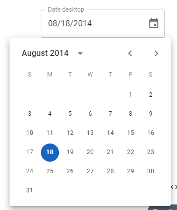
---

### 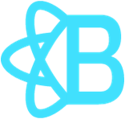 React Bootstrap
* [Документация](https://react-bootstrap.github.io/getting-started/introduction).
* Установка:

```shell
npm install react-bootstrap bootstrap
```
* Подключение CSS в index.js:

```js
import 'bootstrap/dist/css/bootstrap.min.css';
```
* Подключение компонентов:

```js
import Button from 'react-bootstrap/Button';
// ..
<Button as="a" variant="primary">Button as link</Button>
```
---

### React Bootstrap
[Демо](https://github.com/emaildano/react-bootstrap-example)

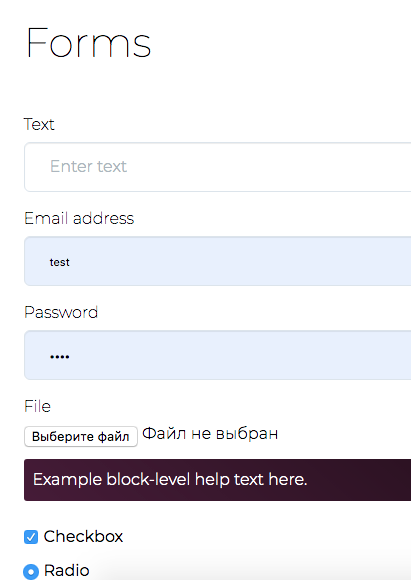
---

###  Blueprint 
* [Репозиторий](https://github.com/palantir/blueprint).
* [Документация](https://blueprintjs.com/docs/).
* Установка:

```shell
npm i @blueprintjs/core
```

* Использование:

```js
import { Button } from "@blueprintjs/core";
// ...
<Button intent="success" text="button content" onClick={incrementCounter} />
```
---

### Blueprint
* [Демо](https://codesandbox.io/examples/package/@blueprintjs/core).
* [Ещё демо](https://dribbble.com/Palantir).

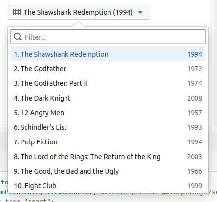
---

###  Ant Design

* [Документация](https://ant.design/docs/react/use-with-create-react-app#Install-and-Initialization).
* [Компоненты](https://ant.design/components/overview/).
* [Демо](https://preview.pro.ant.design/dashboard/analysis).

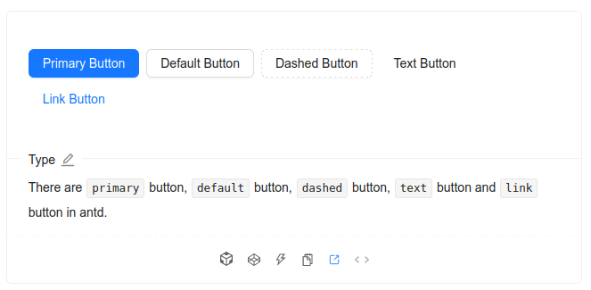
---

###  Chakra UI

* [Документация](https://chakra-ui.com/getting-started).
* [Компоненты](https://chakra-ui.com/docs/components).
* [Демо](https://chakra-ui.com/community/showcase).

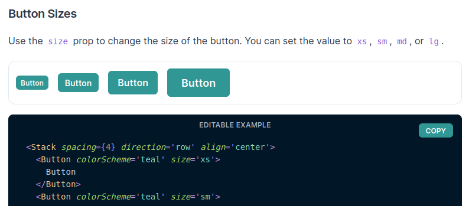
---

### 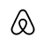 Visx

* [Документация](https://airbnb.io/visx/docs).
* [Компоненты](https://airbnb.io/visx/gallery).
* [Демо](https://codesandbox.io/s/lp10d).

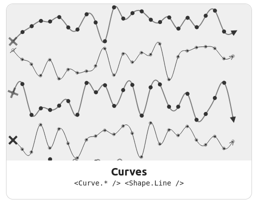
---

### Grommet

* [Документация](https://v2.grommet.io/docs).
* [Компоненты](https://v2.grommet.io/components).
* [Демо](https://codesandbox.io/examples/package/grommet).

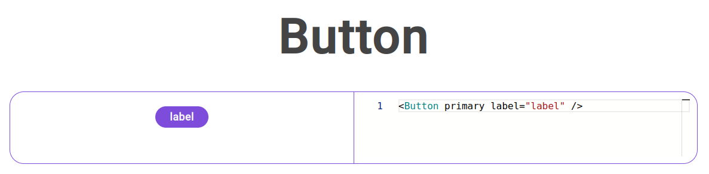
---

### Fluent UI

* [Документация](https://developer.microsoft.com/en-us/fluentui#/get-started).
* [Компоненты](https://developer.microsoft.com/en-us/fluentui#/controls/web).
* [Демо](https://codesandbox.io/s/744r0).

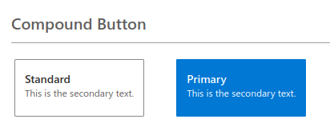
---

### React Admin
* Готовый компонент для админки.
* [Документация](https://marmelab.com/react-admin/Tutorial.html).
* [Демо](https://marmelab.com/react-admin-demo/).
---

### Поисковик по отдельным компонентам
* [Поиск](https://bit.cloud/components?q=datepicker) (для примера ищем datepicker).

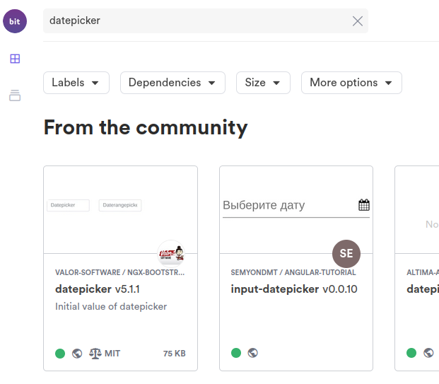

---

### CCS-фреймворк в стиле Windows98

* https://jdan.github.io/98.css/
* [Demo](https://github.com/dmitryweiner/todolist-webpack-win98)

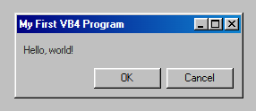

---

### CSS-фреймворк в стиле [NES](https://ru.wikipedia.org/wiki/Nintendo_Entertainment_System)

https://nostalgic-css.github.io/NES.css/

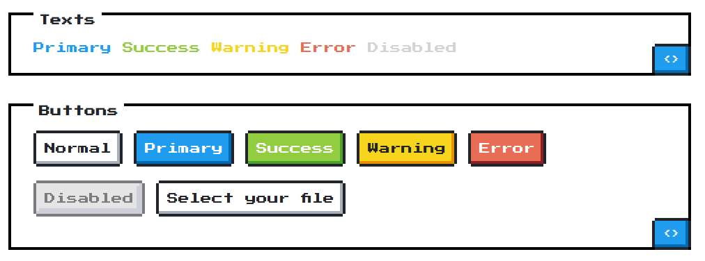
