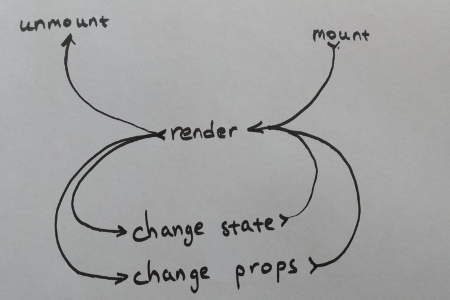
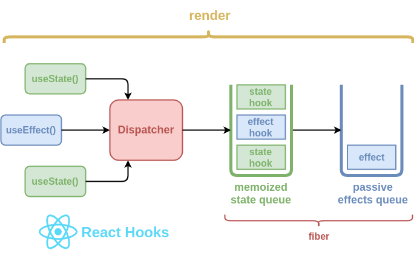
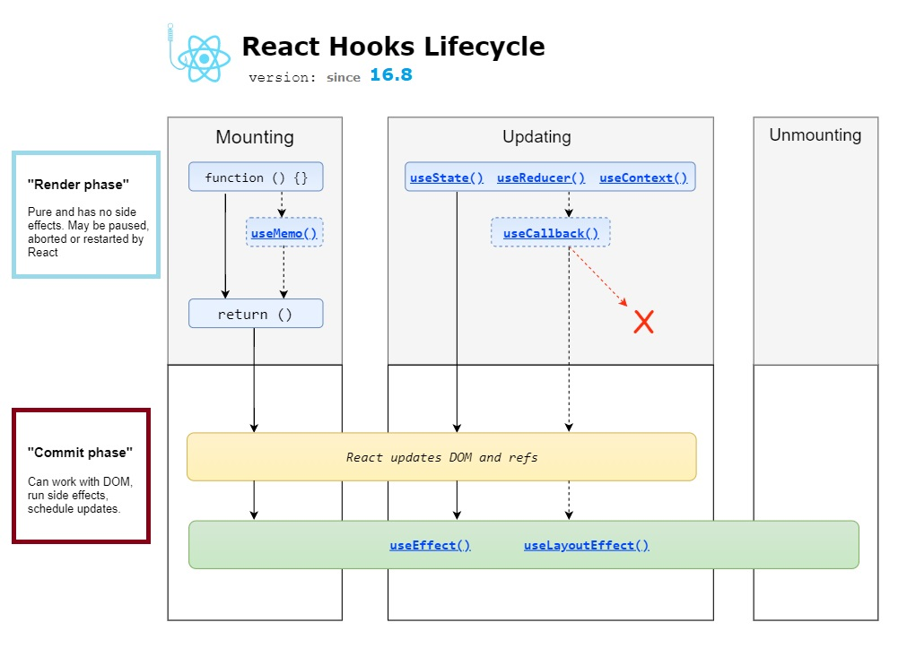

## React: FC и хуки


[все лекции](https://github.com/dmitryweiner/lectures/blob/main/README.md)

Видео: 
  [1](https://drive.google.com/file/d/11hBKHlofUsjI8aN4ccc4HTFfwsykzH6s/view?usp=sharing),
  [2](https://youtu.be/yFsY1U2aD7o)
---

### FC vs Class
* Изначально в реакте писали [компоненты-классы](https://reactjs.org/docs/react-component.html).
* Но у них было несколько существенных недостатков:
  * Многословность.
  * Потеря контекста ```this``` в обработчиках.
  * Трудности с оптимизацией производительности.
* Сейчас отраслевой стандарт &mdash; функциональные компоненты.
---

### Функциональный компонент VS компонент класс

----


---

### Жизненный цикл компонента

---



[подробнее](https://stackoverflow.com/a/58376472/3012961)
---


---

### Разделяем чистую функцию и состояние
* По определению компонента он должен быть 
  [чистой функцией](https://ru.wikipedia.org/wiki/%D0%A7%D0%B8%D1%81%D1%82%D0%BE%D1%82%D0%B0_%D1%84%D1%83%D0%BD%D0%BA%D1%86%D0%B8%D0%B8).
* Чистая функция не может иметь состояние или производить сайд-эффекты.
  * Эти идеи пришли в реакт из функционального программирования 
    ([монады](https://pirx.ru/blog/2010/11/24/monad-monoid/)
     из [Lisp](https://ru.wikipedia.org/wiki/%D0%9B%D0%B8%D1%81%D0%BF),
     [Haskell](https://ru.wikipedia.org/wiki/Haskell)).
* Чтобы иметь состояние и/или вызывать эффекты,
  используются специальные функции внутри компонента, хуки.
---


---

### Список хуков
```js
import {
    // Базовые
        useState,
        useEffect,
        useContext,
    // Дополнительные
        useRef,
        useMemo,
        useCallback,
        useReducer
} from 'react';
```
[Полный список](https://reactjs.org/docs/hooks-reference.html)
----


---

### Правила вызова хуков
* Хук вызывается внутри компонента.
* Важен порядок вызова хуков, если он изменится, начнутся _странности_.
* Вызовы хуков должны располагаться на первом уровне вложенности компонента-функции.
* Нельзя оборачивать их в условные конструкции или циклы.
* [Подробнее](https://reactjs.org/docs/hooks-rules.html).
---

### useState
```javascript
const [value, setValue] = useState(initialValue);
```
* value &mdash; текущее значение: когда меняется, компонент перерисовывается.
* setValue(newValue) &mdash; метод установки нового значения, сеттер.
* initialValue &mdash; начальное значение.
* [Документация](https://reactjs.org/docs/hooks-reference.html#usestate)
---
### useState
* При вызове сеттера запускается рендер компонента с новым значением `value`:

```jsx
function Component() {
  const [value, setValue] = useState(0);
  return <>
      <a onClick={() => setValue(1)}>Set 1</a>
    {value}
  </>;
}
```
---

### useState: сеттер подробнее
```javascript
const [value, setValue] = useState(initialValue);
```
* Сеттер принимает на вход ИЛИ:
    * Новое значение.
    ```js
    setValue(123);
    ```
    * Или функцию (лямбду), которая принимает на вход старое значение и должна вернуть новое.  
    ```js
    setValue(value => value + 1);
    ```
---

### useState: сеттер
* Вызов сеттера вызывает перерисовку компонента.
  * По сути, функция-компонент выполняется заново с новым значением стейта.
* После вызова сеттера значение стейта ещё старое:
```js
const [value, setValue] = useState(123);
console.log(value); // >>> 123
setValue(456);
console.log(value); // >>> 123
```
* Значение изменится только при следующем рендере.
---

### Простейший счётчик
```javascript
function Counter({ initialCount = 0 }) {
    const [count, setCount] = useState(initialCount);
    return <>
        <button onClick={() => setCount(count + 1)}>
            Click me!
        </button>
        { count }
    </>;
}
```
[Живой пример](https://dmitryweiner.github.io/react-standalone/counter.html)
---

### useEffect
* Хук для сайд-эффектов вроде таймера или обращения к сети.
* Выполняется после [фазы коммита](https://projects.wojtekmaj.pl/react-lifecycle-methods-diagram/).
* useEffect вызывается асинхронно, сразу после того, как применится изменение к DOM.
  То есть он гарантирует,  что он будет выполнен после рендера компонента,
* Эффект может привести к следующему рендеру, если стейт изменится.
* Эффект вызывается при изменении списка зависимостей.
---

### useEffect
```javascript
useEffect(() => {
    /* effect code */ 
    return () => {/* shutdown code */};
}, [dependencies]);
```
* Принимает на вход колбек и зависимости.
* Колбэк возвращает метод, который будет вызван в следующий цикл отрисовки, чтобы прибрать за собой:
  * Отменить таймеры, например.
  * Освободить память.
* Эффект вызывается при изменении списка зависимостей ```dependencies```.
* [Документация](https://reactjs.org/docs/hooks-reference.html#useeffect).
---

### useEffect: указание зависимостей
* Если надо вызывать эффект при каждом рендере компонента:
```js
  useEffect(() => {}); // [dependencies] === undefined
  ```
* Если надо вызывать эффект 1 раз после монтирования компонента:
```js
  useEffect(() => {}, []);
  ```
* Если надо вызывать эффект при изменении переменной `value`:
```js
  useEffect(() => {}, [value]);
  ```
* [Документация](https://reactjs.org/docs/hooks-reference.html#conditionally-firing-an-effect),
  [хорошее объяснение](https://overreacted.io/a-complete-guide-to-useeffect/).
----

### useEffect вместо методов жизненного цикла

```jsx
import { useEffect } from "react";

function Component() {

  useEffect(() => {
    // componentDidMount()
    return () => {
      // componentWillUnmount()
    };
  }, []);

  useEffect(() => {
    // componentDidUpdate()
  });
  return <>...</>;
}
```
---

### useEffect: ```dependencies```
* Сравнение списка зависимостей происходит по значению.
* Если передан объект, сравнивается ссылка на объект, при изменении поля объекта эффект не вызывается.
* Если изменилась ссылка на объект, эффект вызывается.
---

### useEffect + Strict mode
* Если главный компонент обёрнут в `<StrictMode>` в `index.js` и версия React.js **18**:
```jsx
root.render(
  <React.StrictMode>
    <App />
  </React.StrictMode>
);
```
* Тогда useRef будет [вызываться **дважды**](https://github.com/facebook/react/issues/24502).
* Чтобы так не было, надо убрать `StrictMode`.
---

### Пример: таймер 
```javascript
function Timer() {
    const [time, setTime] = useState(0);
    useEffect(() => {
      let innerTime = time;
      const timerId = setInterval(
              () => {
                innerTime++;
                setTime(innerTime);
              },
              1000
      );
      return () => clearInterval(timerId);
    }, []);
    return <span>{time}</span>;
}
```
Переменная ```innerTime``` необходима, потому что выполнение происходит в
[замыкании](https://learn.javascript.ru/closure),
где значение переменной ```time``` не меняется.
---

### Таймер
Можно написать без добавочной переменной, используя свойство сеттера принимать на вход функцию.
```javascript
function Timer() {
    const [time, setTime] = useState(0);
    useEffect(() => {
      const timerId = setInterval(
              () => setTime(time => time + 1),
              1000
      );
      return () => clearInterval(timerId);
    }, []);
    return <span>{time}</span>;
}
```
---

### useRef
```js
const refContainer = useRef(initialValue);
refContainer.current = newValue;
```
* Хук для создания переменной, значение которой сохраняется между рендерами.
* В отличие от useState, изменение этой переменной не вызывает ререндер.
* Текущее значение лежит в ```.current```.
* Сеттера нет.
* [Документация](https://reactjs.org/docs/hooks-reference.html#useref).
---

### useRef: управляемый таймер
Можно управлять тем, на сколько он увеличивается.
```javascript
function ControlledTimer() {
    const [time, setTime] = useState(0);
    const increment = useRef(1);
    useEffect(() => {
        setInterval(() => {
            setTime(value => value + increment.current);
        }, 1000);
    }, []);
    return <>
        {time}
        <button onClick={() => increment.current = increment.current + 1 }>Faster!</button>
    </>;
}
```
---

### useRef
* Обычно useRef используют для доступа к DOM'у.
* Так можно захватывать фокус ввода при загрузке страницы:

```javascript
function TextInputWithFocusButton() {
    const inputEl = useRef(null);

    function onButtonClick() {
        // `current` points to the mounted text input element
        inputEl.current.focus();
    }

    return <>
        <input ref={inputEl} type="text" />
        <button onClick={onButtonClick}>Focus the input</button>
    </>;
}
```
---

### useMemo
* Поскольку компонент-функция вызывается каждый раз, когда меняются пропсы и стейт,
все вычисления в теле этой функции выполняются заново.
* Если они тяжелые (типа вычисления числа π), хорошо бы результат кешировать.
* Это называется [мемоизацией](https://ru.wikipedia.org/wiki/%D0%9C%D0%B5%D0%BC%D0%BE%D0%B8%D0%B7%D0%B0%D1%86%D0%B8%D1%8F).
---

### useMemo
```javascript
const value = useMemo(
    () => hardCaclulations(), 
    [dependencies]
);
```
* value &mdash; мемоизированное значение.
* hardCaclulations() &mdash; функция, выполняющая тяжёлые вычисления.
  * обратите внимание на то, как она вызвана: нужно в useMemo передать именно функцию, а не значение.
* dependencies &mdash; зависимости (когда они меняются, перевычисляется значение).
* [Живой пример](https://codepen.io/dmitryweiner/pen/JjYxBVp?editors=0010), 
[документация](https://reactjs.org/docs/hooks-reference.html#usememo).

---

### useCallback
* Иногда требуется мемоизировать функцию, чтобы она не создавалась каждый рендер.
* Это бывает нужно, когда создание функции &mdash; дорогая операция, или если не надо, чтобы она менялась.
---

### useCallback
```javascript
const memoCallback = useCallback(
    (params) => callback(params),
    [dependencies]
);
```
* memoCallback &mdash; мемоизированная функция.
* callback(params) &mdash; исходная функция.
* dependencies &mdash; зависимости (при изменении функция пересоздаётся).
* [Живой пример](https://codepen.io/dmitryweiner/pen/gOaqdda?editors=0010).
* [документация](https://reactjs.org/docs/hooks-reference.html#usememo).
---

### useReducer
* Идея взята из библиотеки [Redux.js](https://redux.js.org/).
* Хук принимает на вход функцию, делающую из старого состояния новое в соответствии с пришедшим
  экшеном.

```javascript
const initialState = 0;

function reducer(state, action) {
  switch (action.type) {
    case 'increment':
      return state + 1;
    default:
      return state;
  }
}
const [state, dispatch] = useReducer(reducer, initialState);
```
[Живой пример](https://codepen.io/dmitryweiner/pen/YzyBBoQ?editors=0010), [документация](https://reactjs.org/docs/hooks-reference.html#usereducer).
---

### useContext
* Способ пробрасывания состояния (данных) вглубь дерева потомков на любой уровень. 
* Без непосредственного указывания этих данных в промежуточных узлах в виде пропсов.
* Компонент на любой глубине может вызвать `useContext` и получить эти данные.
* [Документация](https://reactjs.org/docs/hooks-reference.html#usecontext).
---

### useContext
```js
import { useState, createContext, useContext } from "react";

const UserContext = createContext();

function App() {
  const [user, setUser] = useState("Piter Griffin");

  return (
    <UserContext.Provider value={user}>
      <h1>{`Hello ${user}!`}</h1>
      <Component />
    </UserContext.Provider>
  );
}

function Component() {
  const user = useContext(UserContext);

  return (
    <>
      <h1>Component</h1>
      <h2>{`Hello ${user} again!`}</h2>
    </>
  );
}
```
---

### Библиотека кастомных хуков
* Не стоит писать свой велосипед, если есть [react-use](https://github.com/streamich/react-use)
* Полезные хуки
  * [useList](https://github.com/streamich/react-use/blob/master/docs/useList.md)
  * [useAsync](https://github.com/streamich/react-use/blob/master/docs/useAsync.md)
  * [useKeypress](https://github.com/streamich/react-use/blob/master/docs/useKeypress.md)
  * [useHover](https://github.com/streamich/react-use/blob/master/docs/useHover.md)
  * [useWindowSize](https://github.com/streamich/react-use/blob/master/docs/useWindowSize.md)
---

### Задачи
* Сделать обратный таймер, который идёт от 10 до 0 и останавливается (используя useEffect).
* Сделать таймер, который начинает идти от 0 до бесконечности при нажатии кнопки <button>▶</button>.
* Сделать вывод простых чисел раз в секунду. Каждую следующую секунду в строку добавляется очередное простое число:

Выводит: 2, 3, 5, 7, 11, 13, ...
---

* Светофор:


---

* Написать компонент, принимающий на вход строку и каждую секунду переносящий последний
 символ строки в начало:
 
```jsx
<Revert s="привет!" />
привет!
!привет
т!приве
ет!прив
``` 
---

### Полезные ссылки
* [Документация](https://reactjs.org/docs/hooks-reference.html)
* https://metanit.com/web/react/6.1.php
* https://github.com/streamich/react-use/
* <iframe width="560" height="315" src="https://www.youtube.com/embed/jd8R0a2Ur8Q" title="YouTube video player" frameborder="0" allow="accelerometer; autoplay; clipboard-write; encrypted-media; gyroscope; picture-in-picture" allowfullscreen></iframe>
