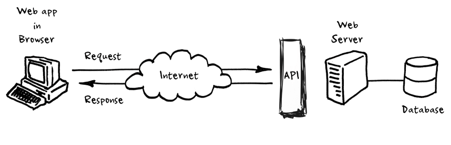

## React - Запросы в сеть



[все лекции](https://github.com/dmitryweiner/lectures/blob/main/README.md)

[Видео](https://youtu.be/wKuWpQrqquE)
---

### Как делать запросы?
* С помощью Fetch API: `fetch("URL")`
* Библиотека [react-query](https://github.com/tanstack/query)
* Библиотека [react-fetching-library](https://github.com/marcin-piela/react-fetching-library#readme)
---

### Задача
* Написать компонент, отображающий форму:
<br/><label>
ID:
<input><br/>
</label>
<button>Получить данные!</button> 
* При нажатии кнопки компонент обращается в API:
https://jsonplaceholder.typicode.com/posts/:id
* Полученные результаты показываются на экране. Поля `title` и `body`:

```json
{
    "userId": 1,
    "id": 4,
    "title": "eum et est occaecati",
    "body": "ullam et saepe reiciendis voluptatem adipisci\nsit amet autem assumenda provident rerum culpa\nquis hic commodi nesciunt rem tenetur doloremque ipsam iure\nquis sunt voluptatem rerum illo velit"
}
```  
---

### Создадим разметку и базовый стейт
```tsx
import {FormEvent, useState} from "react";

export default function Fetcher() {
    const [id, setId] = useState("");

    const handleSubmit = (e: FormEvent<HTMLFormElement>) => {
        e.preventDefault();
        // TODO fetch
    };

    return <form onSubmit={handleSubmit}>
        <label>
            ID:
            <input type="text" value={id} onChange={e => setId(e.target.value)}/>            <br/>
        </label>
        <button type="submit">Получить данные!</button>
    </form>;
}
```
---

### Отправка запроса
```ts
type Result = {
    userId: string;
    id: string;
    title: string;
    body: string;
} | undefined;

const URL = "https://jsonplaceholder.typicode.com/posts";

// in component
const handleSubmit = async (e: FormEvent<HTMLFormElement>) => { // async!
    e.preventDefault();
    const request = await fetch(`${URL}/${id}`); // await!
    const data = await request.json();
    setResult(data);
};
```
---

### Вывод результатов
```tsx
// in component
{result && <div>
    <b>{result?.title}</b><br/>
    {result?.body}
</div>}
```
---

### А как же обработка ошибок?
```tsx
const handleSubmit = async (e: FormEvent<HTMLFormElement>) => {
    e.preventDefault();
    setError("");
    try {
        const request = await fetch(`${URL}/${id}`);
        if (response.status !== 200) {
            throw Error(response.statusText);
        }
        const data = await request.json();
        setResult(data);
    } catch (e) {
        if (e instanceof Error) {
            setError(e.message);
        }
    }
};
// ...
{error && <div className={styles.error}>{error}</div>}
```
---

### Всё в сборе
```tsx
import {FormEvent, useState} from "react";
import styles from "./Fetcher.module.css";

type Result = {
    userId: string;
    id: string;
    title: string;
    body: string;
} | undefined;

const URL = "https://jsonplaceholder.typicode.com/posts";

export default function Fetcher() {
    const [id, setId] = useState("");
    const [error, setError] = useState("");
    const [result, setResult] = useState<Result>();

    const handleSubmit = async (e: FormEvent<HTMLFormElement>) => {
        e.preventDefault();
        setError("");
        try {
            const request = await fetch(`${URL}/${id}`);
            if (response.status !== 200) {
                throw Error(response.statusText);
            } 
            const data = await request.json();
            setResult(data);
        } catch (e) {
            if (e instanceof Error) {
                setError(e.message);
            }
        }
    };

    return <form onSubmit={handleSubmit}>
        <label>
            ID:
            <input type="text" value={id} onChange={e => setId(e.target.value)}/>
            <br/>
        </label>
        <button type="submit">Получить данные!</button>
        {result && <div>
            <b>{result?.title}</b><br/>
            {result?.body}
        </div>}
        {error && <div className={styles.error}>{error}</div>}
    </form>;
}
```
---

### Отправка `POST`
```tsx
const handleSubmit = async (e: FormEvent<HTMLFormElement>) => {
    e.preventDefault();
    setError("");
    try {
        const data = {
          // данные из формы
          login: "admin",
          password: "123"
        };
        const request = await fetch(URL, {
            method: "POST",
            headers: {
              "Accept": "application/json",
              "Content-Type": "application/json"
            },
            body: JSON.stringify(data)
        });
        const result = await request.json();
        setResult(data);
    } catch (e) {
        if (e instanceof Error) {
            setError(e.message);
        }
    }
};
```
---

### Плюсы и минусы
* Плюсы:
    * Просто.
* Минусы:
    * Нет кеширования.
    * Нет состояния загрузки.
    * Лапшекод.
---


* [Документация](https://tanstack.com/query/v4/docs/overview), [примеры](https://github.com/TanStack/query/tree/main/examples/react).
* Установка:
```sh
npm i @tanstack/react-query
```
* Использование:
```js
const { isLoading, error, data } = useQuery(['repoData'], () =>
    fetch('https://api.github.com/repos/tannerlinsley/react-query').then(res =>
      res.json()
    )
)
if (isLoading) return 'Loading...'
if (error) return 'An error has occurred: ' + error.message
```
---

### Установка в index.tsx|index.jsx
```ts
import {QueryClient, QueryClientProvider, useQuery} from '@tanstack/react-query';

const queryClient = new QueryClient();

const root = ReactDOM.createRoot(
    document.getElementById('root') as HTMLElement
);
root.render(
  <QueryClientProvider client={queryClient}>
    <App/>
  </QueryClientProvider>
);
```  
---

### Переписываем компонент
```tsx
const [id, setId] = useState("");
const [input, setInput] = useState("");

const {data, error, isFetching} = useQuery(
    ['post', id], // ключ для кэша
    async () => { // метод получения данных
        const request = await fetch(`${URL}/${id}`);
        if (response.status !== 200) {
           throw Error(response.statusText);
        }
        return await request.json();
    },
    {enabled: !!id} // если id не задан, запрос не делается
);

const handleSubmit = async (e: FormEvent<HTMLFormElement>) => {
    e.preventDefault();
    setId(input);
};
``` 

---

### Вывод данных
```tsx
{isFetching ? (
    "Loading..."
) : error instanceof Error ? (
    <span>Error: {error.message}</span>
) : (
    <>
        <h1>{data?.title}</h1>
        <div>
            <p>{data?.body}</p>
        </div>
        <div>{isFetching ? "Background Updating..." : " "}</div>
    </>
)}
``` 
---

### Выносим получение данных в хук
```tsx
type Post = {
    userId: string;
    id: string;
    title: string;
    body: string;
} | undefined;

const URL = "https://jsonplaceholder.typicode.com/posts";

const getPostById = async (id: string): Promise<Post> => {
    const request = await fetch(`${URL}/${id}`);
    if (response.status !== 200) {
        throw Error(response.statusText);
    } 
    return await request.json();
};

function usePost(postId: string) {
    return useQuery(
        ["post", postId],
        () => getPostById(postId),
        {enabled: !!postId}
    );
}
```
---

### Всё в сборе 
```tsx
import {FormEvent, useState} from "react";
import styles from "./Fetcher.module.css";
import {useQuery} from "@tanstack/react-query";

type Post = {
    userId: string;
    id: string;
    title: string;
    body: string;
} | undefined;

const URL = "https://jsonplaceholder.typicode.com/posts";

const getPostById = async (id: string): Promise<Post> => {
    const request = await fetch(`${URL}/${id}`);
    if (response.status !== 200) {
        throw Error(response.statusText);
    }
    return await request.json();
};

function usePost(postId: string) {
    return useQuery(
        ["post", postId],
        () => getPostById(postId),
        {enabled: !!postId}
    );
}

export default function FetcherQuery() {
    const [id, setId] = useState("");
    const [input, setInput] = useState("");

    const {data, error, isFetching} = usePost(id);

    const handleSubmit = async (e: FormEvent<HTMLFormElement>) => {
        e.preventDefault();
        setId(input);
    };

    return <form onSubmit={handleSubmit}>
        <label>
            ID:
            <input type="text" value={input} onChange={e => setInput(e.target.value)}/>
            <br/>
        </label>
        <button type="submit">Получить данные!</button>
        {isFetching ? (
            "Loading..."
        ) : error instanceof Error ? (
            <span>Error: {error.message}</span>
        ) : (
            <>
                <h1>{data?.title}</h1>
                <div>
                    <p>{data?.body}</p>
                </div>
                <div>{isFetching ? "Background Updating..." : " "}</div>
            </>
        )}
    </form>;
}
```
---

### Кеширование 
Надо задать параметр staleTime, чтобы запросы кешировались. По умолчанию он 0, запросы не кешируются.
```ts
useQuery(
    ["post", postId],
    () => getPostById(postId),
    {
         enabled: !!postId,
         staleTime: 10000 // <-- время протухания кеша в ms
    }
);
```

[Подробнее](https://tanstack.com/query/v4/docs/guides/caching), 
[ещё](https://tanstack.com/query/v4/docs/guides/important-defaults).
---

### Задачи
* Написать компонент, отображающий форму:
    <br/><label>
    ID:
    <input>
    </label>
    <button>Получить данные!</button><br/> 
* При нажатии кнопки компонент обращается по адресу https://jsonplaceholder.typicode.com/posts/:id.
* Также компонент обращается по адресу https://jsonplaceholder.typicode.com/users/:userId, где `userId` получен из предыдущих данных.
* Показать экране: из post - поля `title` и `body`, из user - поля `name`, `email`.
---

### Задачи
* То же, что и на предыдущей странице, но с отображением состояния загрузки.

