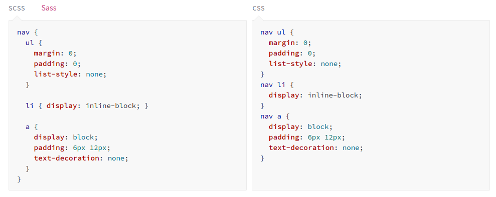

## Стили и ассеты в React


[все лекции](https://github.com/dmitryweiner/lectures/blob/main/README.md)

[Видео](https://youtu.be/VmjhFBbPP1s)
---

### Задачи
* Разработка интерфейса &mdash; это не только скучные формы и кнопки.
* Нужно решать следующие задачи:
    * Стилизовать элементы.
    * Отрисовать картинки.
    * Показать красивые шрифты.
---

### Disclaimer
* Дальше разговор пойдёт про приложение, созданное с помощью ```create-react-app```.
* В случае кастомного конфига Webpack можно всё настроить так, как хочется.
---

### Варианты использования ассетов
* Assets (активы) &mdash; вспомогательные файлы для изменения внешнего вида компонентов.
* Варианты, где они лежат:
  * В папке ```public``` лежит то, что будет использоваться многими компонентами:
    * Общие иконки.
    * Шрифты.
    * Стили страницы.
  * В папке компонента лежит то, что используется только самим компонентом.
---

### Подключение ассетов из `public`
```shell
├── public
│   ├── cat.jpg
└── src
    ├── components
    │   └── CatView.jsx
```
```jsx
export default function CatView() {
    return <></>;
}
```
---

### Подключение ассетов из папки компонента
```shell
    ├── components
    │   └── CatView
    │       ├── cat.jpg
    │       └── CatView.jsx
```
```jsx
import cat from "./cat.jpg";

export default function CatView() {
  return <></>;
}
```
---

### Стили
* Стили бывают **глобальные**: влияют на все компоненты сразу.
* И **scoped**-стили: действуют только на текущий компонент.
---

### Глобальные стили
```shell
└── src
    ├── App.css
    ├── App.js
```
```jsx
import './App.css';

function App() {
  return (
    <div className="App">
      ...
    </div>
  );
}
```
---

### Scoped-стили
* Файл стилей должен иметь префикс `module`:
```css
/* ./styles.module.css */
.cat {
    width: 90vh;
    height: 90vh;
}
```
* Класса указывают как свойство импортированного объекта:
```jsx
import cat from "./cat.jpg";
import styles from "./styles.module.css";
export default function CatView() {
    return <></>;
}
```
* [Подробнее](https://create-react-app.dev/docs/adding-a-css-modules-stylesheet/).
---

### Как работают scoped-стили?
* После рендера класс дополняется случайным набором символов, уникальным для каждого компонента.
* Результат рендера:

```html

```

```css
.styles_cat__HjvK7 {
  width: 90vh;
  height: 90vh;
}
```
---

### Условные стили
* Если нужно назначать стиль с некоторым условием, то можно писать так:

```jsx
<span className={isError ? styles.red : ""}>Ошибка!</span>
```
* Пример:

```jsx
import styles from "./Button.module.css";
export default function Button() {
  const [isOn, setIsOn] = useState(false);
  return <>
    <span className={isOn ? styles.red : styles.green}>ЛАМПОЧКА</span>
    <button onClick={() => setIsOn(!isOn)}>ВКЛ</button>
  </>
}
```
---

### Несколько классов у одного компонента
* Как и в простом HTLM, одному компоненту можно навешивать несколько классов:
```jsx
<span className={`${styles.red} ${styles.green}`}>
  ...
</span>
```
---

### Альтернативы
* Стилизовать компоненты можно и внутри сами этих компонентов.
* Иногда это удобнее, т.е. стили лежат там же, где и использующий их код.
* Варианты:
  * [css-in-js](https://cssinjs.org/?v=v10.9.0).
  * [styled-components](https://styled-components.com/).
  * [Emotion](https://github.com/emotion-js/emotion).
---

### Использование препроцессора SASS/SCSS
* [Про препроцессор](https://sass-lang.com/guide).
* [Инструкция, как уставить](https://create-react-app.dev/docs/adding-a-sass-stylesheet).


---

### Задачи
* Сделать кнопку, которая при нажатии меняет свой цвет с красного на зелёный и обратно:
<button style="background-color: green">Нажми меня!</button>
---

### Полезные ссылки 
* https://create-react-app.dev/docs/adding-a-stylesheet