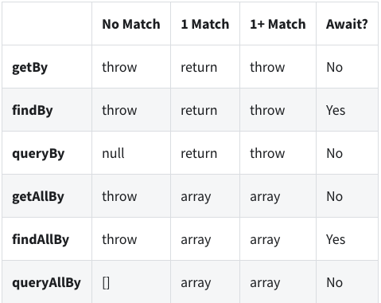

## React: тестирование компонентов


[все лекции](https://github.com/dmitryweiner/web-lectures/blob/main/README.md)

Видео: [1](https://drive.google.com/file/d/1oG1geSnRc68Lj-lm-g9u7f506GgHq6gm/view?usp=sharing),
[2](https://drive.google.com/file/d/1R-ke3qpaJOxy0HFrEkkjxE-a39srlX6Z/view?usp=sharing),
[3](https://drive.google.com/file/d/1WmCb0--oRzK4cjPm8IXIgxTRRbgnqwGe/view?usp=sharing)
---

### TDD
* Разработку лучше вести по методу 
  [Test Driven Development](https://ru.wikipedia.org/wiki/%D0%A0%D0%B0%D0%B7%D1%80%D0%B0%D0%B1%D0%BE%D1%82%D0%BA%D0%B0_%D1%87%D0%B5%D1%80%D0%B5%D0%B7_%D1%82%D0%B5%D1%81%D1%82%D0%B8%D1%80%D0%BE%D0%B2%D0%B0%D0%BD%D0%B8%D0%B5).
* Вначале пишем тест, в котором формулируем требования в виде кода.
* Тест не проходит.
* Пишем компонент, чтобы тест проходил.
---


---

### testing-library
* Мы будем пользоваться библиотекой ```@testing-library/react```.
* Под капотом она использует фреймворк тестирования Jest.
* Она уже установлена в приложении, созданном через ```create-react-app```.
* [Если её надо поставить](https://testing-library.com/docs/react-testing-library/intro).
---

### Методика тестирования
* Мы будем придерживаться методики [AAA](https://medium.com/@pjbgf/title-testing-code-ocd-and-the-aaa-pattern-df453975ab80):
* **A**rrange:
  * Инициализировать необходимые данные.
  * Отрендерить компонент.
* **A**ct:
  * Вызывать нужные события.
  * Активировать таймеры.
* **A**ssert:
  * Найти нужный элемент.
  * Взять его содержимое.
  * Проверить на соответствие ожиданиям.
---

### Setup / teardown

* Для кода, исполняющегося неоднократно, есть специальные обработчики:
  * **beforeEach**: выполнить код перед каждым тестом.
  * **afterEach**: выполнить код после каждого теста.
  * **beforeAll**: выполнить код перед запуском тестов (коннект к базе, например).
  * **afterAll**: выполнить код после запуска (удаление тестовых данных).
* [Документация](https://jestjs.io/docs/setup-teardown).
---

### Рендер компонента
* Для начала необходимо отрендерить компонент, как в настоящем приложении.
* Для этого используется метод **render**:

```js
import { render } from '@testing-library/react';
import Component from './Component';

test('Проверка рендера', () => {
    render(<Component prop="value" />);
});
```
* Результат лежит в **screen**.
---

### Поиск нужных элементов

```javascript
import { screen } from '@testing-library/react';
screen.getByText(/Item #[0-9]: /);
```

* **ByTestId**: по test-id.
* **ByText**: по тексту.
* **ByDisplayValue**: по отображаемому значению.
* **ByRole**: по роли.
* **ByLabelText**: по лейблу.
* **ByPlaceholderText**: по плейсхолдеру.  
* **ByTitle**: по тайтлу.
* **ByAltText**: по параметру alt="".
[Документация](https://testing-library.com/docs/react-testing-library/cheatsheet/#queries).
---

### Варианты поиска
```javascript
await screen.findByText(/Item #[0-9]: /);
```



---

### Варианты поиска

* Синхронные: ```getBy...```, ```getAllBy...```, ```queryBy...```, ```queryAllBy...```.
* Асинхронные: ```findBy...```, ```findAllBy...```.
  * Ждут 1 секунду, пока элемент появится, потом exception.
  * Можно изменить время ожидания:
    ```js
    screen.findByText('text', { timeout: 5000 });
    ```
  * Обработчик теста должен быть async.
---

### Пример поиска
* Ищем вот этот DIV

```jsx
<div>Hello World</div>
```

* Методы поиска

```javascript
// По строке:
getByText('Hello World'); // полное совпадение
getByText('llo Worl', { exact: false }); // частичное совпадение
getByText('hello world', { exact: false }); // игнорируем регистр

// Matching a regex:
getByText(/World/); // поиск подстроки
getByText(/world/i); // поиск подстроки без регистра
getByText(/^hello world$/i); // полное совпадение без регистра
getByText(/Hello W?oRlD/i); // advanced regex

// Кастомная функция поиска:
getByText((content, element) => content.startsWith('Hello'));
```
---

### Ожидание реакции компонента
**waitFor()**: Вызывает функцию до тех пор, пока она не перестанет выбрасывать исключение,
или пока не закончится 1 секунда.

```js
await waitFor(() => screen.getByRole('alert'));
// короткая запись такого:
await screen.findByRole('alert');
```
---

### Эмуляция событий
* fireEvent.<имя события>(найденная нода)
```js
fireEvent.click(screen.getByText('Нажми меня'));
```
* Можно передать данные в событие:
```js
fireEvent.input(element, { 
    target: { value: 'Some text' } 
});
```
* Возможные события:
  * click
  * submit
  * input
  * change
* [Список событий](https://github.com/testing-library/dom-testing-library/blob/master/src/event-map.js).
---

### Изменения стейта и асинхронность
* Изменение стейта и последующий рендер происходят не мгновенно.
* Тест должен подождать, пока всё отрендерится после действий пользователя.
* Для этого используется метод **act**(() => {}) ([документация](https://reactjs.org/docs/testing-recipes.html#act)).
* Оборачиваем в act то, что меняет стейт (даже рендер).
* Асинхронные методы поиска элементов findBy<что-то> уже [содержат в себе act](https://testing-library.com/docs/dom-testing-library/api-async/).
---

### Работа с таймером
* Настоящий таймер:

```js
await new Promise(resolve => setTimeout(resolve, 1000));
```

* Фейковый таймер:

```js
beforEach(() => {
  jest.useFakeTimers(); // включить фейковые таймеры
});

afterEach(() => {
  jest.useRealTimers(); // отключить фейковые таймеры (afterEach)
});

test('Проверка отложенных действий', () => {
  jest.advanceTimersByTime(1000); // перемотать время на 1 с вперёд
});
```

* [Документация](https://jestjs.io/docs/en/timer-mocks).

---

### Ожидания (матчеры)
```js
expect(screen.getByText('TEXT')).toBeInTheDocument();
```
* Можно вставить expect().**not**.to<ожидание>()
* **toBeInTheDocument**: проверка на существование.
* **toHaveLength**: длина массива столько-то.
* **toHaveTextContent**: содержимое такое-то.
* **toHaveValue**: значение инпута.
* **toHaveAttribute**: существование атрибута с нужным значением.
* **toHaveClass**: навешен нужный класс.
* [Список матчеров jest](https://jestjs.io/docs/expect), 
  [матчеры testing-library](https://github.com/testing-library/jest-dom#custom-matchers).

---

### Проверка на существование и несуществование
* Проверить, что элемент находится на экране, просто:
```js
expect(screen.getByTestId('button')).toBeInTheDocument();
```
* Проверить, что элемента нет (_query!_):
```js
expect(screen.queryByTestId('button')).toBeNull();
```
* **Важное замечание:** HTML-элемент после скрытия нужно найти заново, т.к. он пересоздаётся.
* [Документация](https://testing-library.com/docs/guide-disappearance/).
---

### Проверка внутреннего состояния инпута
* Когда нужно проверить, что в интпут введено нужно значение:
```js
const input = screen.getByTestId('input');
expect(input.value).toEqual(title);
```
* Или что чекбокс в правильном состоянии:
```js
const input = screen.getByTestId('checkbox');
expect(input.checked).toEqual(true);
```
---

### Проверка объектов
* Все поля должны совпадать:

```js
  // objectContaining, with nested object, containing full props/values
  // PASSES
  expect({ position: { x: 0, y: 0 } }).toEqual(expect.objectContaining({
    position: {
      x: expect.any(Number),
      y: expect.any(Number)
    }
  }));

  // objectContaining, with nested object, containing partial props/values
  // FAILS
  expect({ position: { x: 0, y: 0 } }).toEqual(expect.objectContaining({
    position: {
      x: expect.any(Number)
    }
  }));

  // objectContaining, with nested object, also declared with objectContaining, containing partial props/values
  // PASSES
  expect({ position: { x: 0, y: 0 } }).toEqual(expect.objectContaining({
    position: expect.objectContaining({
      x: expect.any(Number)
    })
  }));
```
---

### Проверка объектов
* Проверка, что поле просто есть (другие поля не проверяем):

```js
  // toMatchObject, with nested object, containing full props/values
  // PASSES
  expect({ position: { x: 0, y: 0 } }).toMatchObject({
    position: {
      x: expect.any(Number),
      y: expect.any(Number)
    }
  });

  // toMatchObject, with nested object, containing partial props/values
  // PASSES
  expect({ position: { x: 0, y: 0 } }).toMatchObject({
    position: {
      x: expect.any(Number)
    }
  });
```
---

### Примеры
* Дальше приведено несколько примеров для иллюстрации представленных ранее идей.
* Следует воспринимать этот код критически, не стоит слепо копировать его себе в проект.
* Вначале мы формулируем спецификацию на будущий компонент, потом описываем её в виде теста (TDD).
* Потом пишем компонент, чтобы он проходил тест. Допустимо делать это параллельно.
---

### Пример с представлением
* Написать компонент, который просто отображает некий текст, переданный в пропс text.
* Пишем вначале тест:

```js
import { render, screen } from '@testing-library/react';

test('renders what it got', () => {
  const text = 'Test text';
  render(<Component text={text} />);
  // поиск элемента по data-testid
  const element = screen.getByTestId('component');
  // проверка, что элемент есть в документе
  expect(element).toBeInTheDocument();
  // проверка, что он имеет нужное содержимое
  expect(element).toHaveTextContent(text);
});
```
---

### Компонент-представление
* Потом пишем компонент, чтобы тест проходил:

```jsx
function Component({ text }) {
    return <span data-testid="component">{text}</span>;
}
```
---

### Компонент-список
* Написать компонент, который отображает массив строк.
* Если передали пустой массив, отображает текст "Список пуст".
* Напишем вначале тест на положительный кейс (список полон):

```js
import { render, screen } from '@testing-library/react';

test('renders full list', () => {
  const list = ['one', 'two', 'three'];
  render(<List list={list} />);
  const elements = screen.getAllByTestId('list-item');
  expect(elements).toHaveLength(list.length);
  for (let i = 0; i < elements.length; i++) {
      expect(elements[i]).toHaveTextContent(list[i]);
  }
});
```
---

### Негативный кейс
* Напишем тест на случай с пустым массивом:

```js
import { render, screen } from '@testing-library/react';

test('renders empty list', () => {
  const list = [];
  render(<List list={list} />);
  const element = screen.getByTestId('list');
  expect(element).toHaveTextContent('Список пуст');
});
```
---

### Напишем компонент, проходящий тесты
```jsx
function List({ list }) {
  function renderList() {
    if (!list.length) {
      return 'Список пуст';
    }
    return list.map((item, index) => (
      <li key={index} data-testid="list-item">
        {item}
      </li>
    ));
  }
    
  return <ul data-testid="list">
    {renderList()}
  </ul>;
}
```
---

### Кнопка
* Должна отображать надпись, переданную в title.
* При нажатии должна вызывать handleClick.

```js
import { render, screen, fireEvent } from '@testing-library/react';

test('renders empty list', () => {
  const title = 'title';
  const handleClick = jest.fn();
  render(<Button title={title} handleClick={handleClick} />);
  const element = screen.getByText(title);
  expect(element).toBeInTheDocument();
  expect(handleClick).not.toBeCalled();
  fireEvent.click(element);
  expect(handleClick).toBeCalled();
});
```
---

### Кнопка
* Реализация кнопки довольно лаконичная:

```jsx
function Button({ title, handleClick }){
  return <button onClick={handleClick}>{title}</button>;
}
```
---

### Форма
* Должна отображать поле.
* В которое можно что-то ввести.
* При сабмите формы вызывается handleSubmit.
* Этому обработчику в виде параметра передаётся объект вида ```{field: "что-то ввели"}```.
* То, что пришло обработчику, должно совпадать с тем, что ввели.
---

### Форма
* Тест:

```js
import { render, screen, fireEvent } from '@testing-library/react';

test('can enter text and submit', () => {
  const handleSubmit = jest.fn();
  const field = 'field contents';
  render(<Form handleSubmit={handleSubmit} />);
  const input = screen.getByTestId('input');
  const form = screen.getByTestId('form');
  fireEvent.input(input, { target: {value: field }}); // ввод в поле
  expect(handleSubmit).not.toBeCalled();
  fireEvent.submit(form); // отправка формы
  expect(handleSubmit).toBeCalledWith(expect.objectContaining(
    { field }
  ));
});
```

---

### Форма
* Компонент:

```jsx
function Form({ handleSubmit }) {
  const [field, setField] = useState('');
  function handleSubmitInner(e) {
    e.preventDefault();
    handleSubmit({ field });
  }
  return <form data-testid="form" onSubmit={handleSubmitInner}>
    <input
      data-testid="input"
      value={field}
      onChange={e => setField(e.target.value)}/>
    <button type="submit">Submit</button>
  </form>;
}
```
---

### Таймер
* При появлении на экране таймер начинает отсчитывать секунды.
* Секунды начинают идти с 0 до бесконечности.

```js
import { render, screen } from '@testing-library/react';

test('timer works', async () => {
    jest.useFakeTimers();
    render(<Timer />);
    expect(await screen.findByTestId('timer'))
        .toHaveTextContent('0');
    // тут меняется стейт в useEffect, поэтому act():
    act(() => jest.advanceTimersByTime(1000));
    expect(await screen.findByTestId('timer'))
        .toHaveTextContent('1');
    jest.useRealTimers();
});
```
---

### Таймер
* Компонент:

```jsx
function Timer() {
  const [count, setCount] = useState(0);
  
  useEffect(() => {
    const intervalId = setInterval(() => {
        setCount(count => count + 1);
    }, 1000);
    return () => clearInterval(intervalId);
  }, []);
  
  return <span data-testid="timer">{count}</span>;
}
```
---

### Полезные ссылки
* Testing-library:
  * [Руководство](https://www.robinwieruch.de/react-testing-library).
  * [Шпаргалка](https://testing-library.com/docs/react-testing-library/cheatsheet/).
  * [Документация](https://testing-library.com/docs/).
  * [Список matchers](https://github.com/testing-library/jest-dom#custom-matchers).
* [Список matchers jest](https://jestjs.io/docs/en/using-matchers).
* [Рецепты тестирования реакта](https://reactjs.org/docs/testing-recipes.html).
