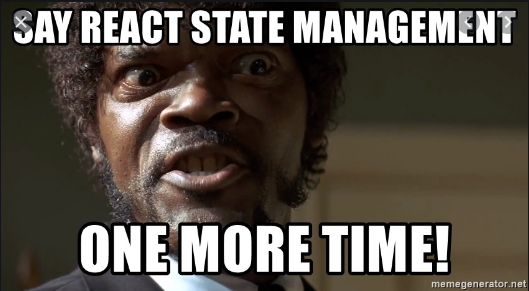

## React controls



[Дмитрий Вайнер](mailto:dmitry.weiner@gmail.com)

[видео]()

---

### Напоминалочка об основах

Компонент должен возвращать JSX-лист, который встраивается в виртуальное DOM-дерево. 
Компонент-класс делает это в методе render(), компонент-функция просто возвращает JSX.

```jsx
function Component() {
    return <span>А я компонент!</span>;
}

class Component extends React.Component {
    render() {
        return <span>И я компонент!</span>;
    }
}
```

---

### Узлы JSX

JSX состоит из узлов (листьев). Нельзя вернуть несколько узлов просто так. 
Они должны быть обёрнуты в <></> (Это короткая запись [React.Fragment](https://reactjs.org/docs/fragments.html)). 

Так неправильно:
```jsx
return <p>Покормить кота</p>
     <p>Искупать рыб</p>;
```

Так правильно:
```jsx
return <>
    <p>Покормить кота</p>
    <p>Искупать рыб</p>
</>;
```

---

### Вывод списков
Элементы динамического списка должны обладать атрибутом key. Если у элементов есть id, нужно использовать его. 
Если нет возможности сгенерировать id, можно использовать индекс массива, но при обновлении массива это 
чревато проблемами с обновлением.
```jsx
function List() {
    const items = [1, 2, 3];
    return <ul>
        {items.map((item, index) => <li key={index}>{/* временное решение */}
            {item}
        </li>)}
    </ul>;
}
```

---

### Вывод списков
Если у элементов есть id, нужно использовать его.

```jsx
function List({ items }) {
    return <ul>
        {items.map(item => <li key={item.id}>{/* хорошее решение */}
            {item.title}
        </li>)}
    </ul>;
}
```

---

### Формат вызова компонентов в JSX

```jsx
<Component
    text="some test" // так передаем строку
    number={123} // число
    value={value} // значение переменной
    someFunction={functionName} // ссылка на функцию
    anotherFunction={() => /..../} // анонимная функция 
/>
```

Точно так же можно поступать с HTML-тегами. У них есть свой набор параметров, их можно указывать:
```jsx
<input type="text" value={5}/>
```

---

### Тип работы с компонентом

* [Uncontrolled](https://reactjs.org/docs/uncontrolled-components.html)
    * Хранит своё значение сам.
    * Не извещает компонент об изменениях.
    * Получаем его значение через ref.
    * Нужен например для &lt;input type="file" /&gt;

* [Controlled](https://reactjs.org/docs/forms.html#controlled-components)
    * Текущее начение хранится в стейте.
    * При изменениях меняет стейт. 

---

### События

У компонента случаются разнообразные события:
* onChange: значение изменилось.
* onClick: кликнули.
* onFocus: компонент получил фокус ввода.
* onBlur: компонент потерял фокус ввода.
* onSubmit: отправка формы.
* [Полный список](https://www.w3schools.com/jsref/dom_obj_event.asp)
* [Список с объяснениями](https://www.w3schools.com/tags/ref_eventattributes.asp)

---

### Работа с событиями

```jsx
function Component() {
    function handleChange(event) {
        console.log(event);
    }
    return <input onChange={handleChange} />;
}
```
* event: произошедшее событие.
* event.target: DOM-элемент, в котором оно произошло.
* event.target.value: текущее значение элемента (кроме чекбокса).
* event.target.checked: текущее значение чекбокса.
---

### Вмешательство в работу событий

```jsx
function Form() {
    function handleSubmit(event) {
        // Отмена отправки формы
        event.preventDefault();
    }
    return <form onSubmit={handleSubmit}>
        <input/>
        <button type="submit">Отправить</button>
        <button type="reset">Очистить</button>
    </form>;
}
```
* event.preventDefault(): отмена обычной обработки события (отправки формы в данном случае).
* [Работа с дефолтными действиями](https://learn.javascript.ru/default-browser-action)

---

### Вмешательство в работу событий
#### Отмена перехода по ссылке
```jsx
function Link() {
    function handleClick(event) {
        event.preventDefault();
    }
    return <a href="#" onClick={handleClick}>Click me!</a>;
}
```

---

### Кнопка

<button>Нажми меня!</button>

```jsx
function Button({ title }) {
    function handeClick() {
        console.log('Аааа, меня нажали!!!');
    }
    return <button onClick={handeClick}>{title}</button>;
}
```

---

### Текстовое поле

```jsx
<input type="text" value={value} onChange={changeHandler} />
```

* Типы текстового поля (значение свойства type):
    * text: <input type="text" />
    * number: <input type="number" />
    * email: <input type="email" />
    * password: <input type="password" />
    * date: <input type="date" />
* Поддерживается не всеми браузерами.

---

### Чекбокс

<label><input type="checkbox" />Выбери меня!</label>

```jsx
function Checkbox() {
    const [isChecked, setIsChecked] = useState(false);
    return <>
        <input
            type="checkbox"
            checked={isChecked} // тут внимательно, не value 
            onChange={e => setIsChecked(e.target.checked)}/>
        {isChecked ? 'checked' : 'not checked'}
    </>;
}
```

---

### Радио-кнопки

Объединяются в группу по одному и тому же name:

```jsx
function Radio() {
    const [value, setValue] = useState(0);
    return <>
        <input
            type="radio"
            name="radioName"
            checked={value === 0}
            onChange={() => setValue(0)}>
            To be
        </input>
        <input
            type="radio"
            name="radioName"
            checked={value === 1}
            onChange={() => setValue(1)}>
            or not to be
        </input>
        You selected: {value}
    </>;
}
```

---

### Радио-кнопки поумнее

<input type="radio" name="r">Быть</input>
<input type="radio" name="r">Не быть</input>

```jsx
const variants = ['to be', 'or not to be'];
function Radio() {
    const [value, setValue] = useState(0);
    return <>
        {variants.map((variant, index) => <input
            key={index} // тут можно index, если массив не меняется
            type="radio"
            name="radioName"
            checked={value === index}
            onChange={() => setValue(index)}>
            {variant}
        </input>)}
        You selected: {variants[value]}
    </>;
}

```

---

### Ползунок

<input type="range"/>

```jsx
function Range({ max = 0, min = 100 }) {
  const [value, setValue] = useState(0);
  function handleChange(e) {
    // ВНИМАНИЕ! Явное приведение к Int,
    // т.к. из события приходит СТРОКА
    setValue(Number.parseInt(e.target.value));
  }
  return <>
    <input
      type="range"
      value={value}
      onChange={handleChange}
    />
    Current value: {value}
  </>;
}
```

---

### Селектбокс

<select>
  <option>Воронеж</option>
  <option>Рио-де-Жанейро</option>
</select>

```jsx
const variants = ['Воронеж', 'Рио-де-Жанейро'];
function Select() {
  const [value, setValue] = useState(0);
  return <>
    <select onChange={e => setValue(e.target.value)}>
        {variants.map((variant, index) => (
            <option key={index} value={index}>
                {variant}
            </option>
        ))}
    </select>
    Selected: {variants[value]}
  </>;
}
```

---

### Множественный селектбокс

<select multiple>
  <option>Воронеж</option>
  <option>Астрахань</option>
  <option>Брянск</option>
</select>

```jsx
const variants = ['Воронеж', 'Астрахань', 'Брянск'];
function MultipleSelect() {
  const [value, setValue] = useState([]); // Начальное значение изменилось
  return <>
    <select multiple={true} onChange={e => setValue(e.target.value)}>
        {variants.map((variant, index) => (
            <option key={index} value={index}>
                {variant}
            </option>
        ))}
    </select>
    Selected: {value.join(',')}
  </>;
}
```

---


