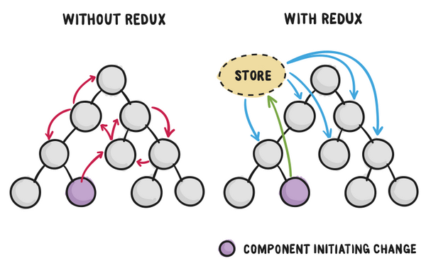

## React + Redux


[Дмитрий Вайнер](mailto:dmitry.weiner@gmail.com)

[видео]()

---

### State management
* Можно хранить состояние приложения размазанным по компонентам.
* Плюсы:
  * Просто. Не надо думать.
  * Всё под рукой.
* Минусы:
  * Приходится пробрасывать потомками стейт и методы изменения.
  * Может нарушиться консистентность.
  * Изменения очень дорогие.

---

## Идея



---

### Redux
* Библиотека управления состоянием.
* Авторы: [Dan Abramov](https://github.com/gaearon) и [Andrew Clark](https://github.com/acdlite).
* Дата первого релиза: 2.06.2015.
* Текущая версия: 4.0.
* [Документация](https://redux.js.org/api/api-reference).
* [Учебникъ](https://redux.js.org/tutorials/fundamentals/part-1-overview).

---

### Схема работы


---

## Плюсы и минусы
* Плюсы:
  * Состояние приложения лежит в одном единственном месте.
  * Изменения атомарные и последовательные.
  * Можно восстановить историю изменений.
* Минусы:
  * Много кода.
  * Много новых файлов.
  * Можно запутаться в изменениях стейта.

---

## Подключение 
* Установка:
```shell
npm i redux react-redux
```
* Создание стора (в ```store.js```):
```js
import { createStore } from 'redux';
const store = createStore(reducer);
export default store;
```
* Подключение в приложение (в ```index.js```):
```js
const rootElement = document.getElementById('root');
ReactDOM.render(
  <Provider store={store}>
    <TodoApp />
  </Provider>,
  rootElement
);
```

---

## State-first подход

---

### Actions

---

### Action creators

---

## Reducer

---

### Компоновка редьюсеров

---

### Селекторы

---

## Использование с React.js

---

## Компоненты классы

---

## Функциональные компоненты

---

## Селекторы

---

## Диспетчер

---

### Middleware

---

## Расширение браузера для Redux

---

## Варианты разумной организации файлов и папок
* В одном файле.
* В папке redux:
* По фичам.

---

## Что можно улучшить?
* А как делать асинхронные запросы в сеть?
  * Redux Thunk!
* Запутался, какой экшон следует за каким?
  * Redux Saga!
* Селекторы пересчитываются при каждом рендере, помогити!
  * Reselect!
* Слишком много разрозненных файлов, можно это будет структура с мутаторами и экшенами?
  * Redux Toolkit!
  
---

## Полезные ссылки
* [Лекция Эндрю Кларка про реакт.](https://www.youtube.com/watch?v=ZVYVtUFDf28)
  https://tproger.ru/translations/redux-for-beginners/
