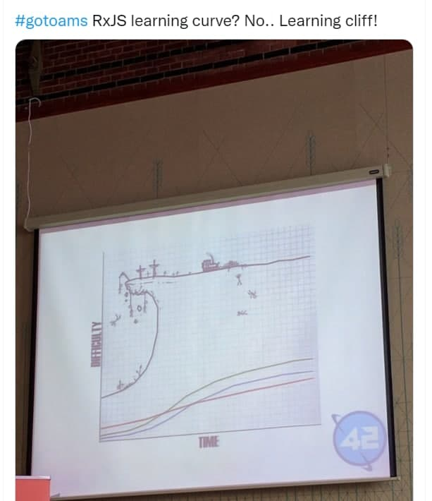
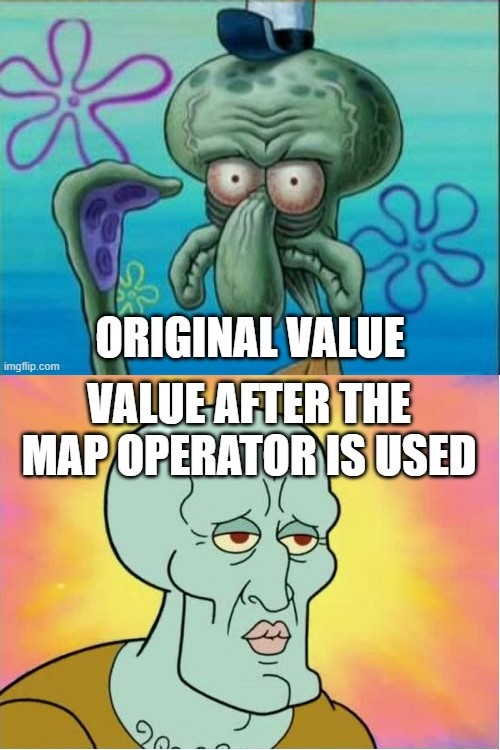
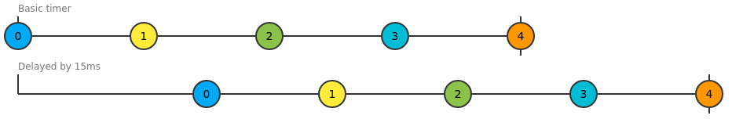
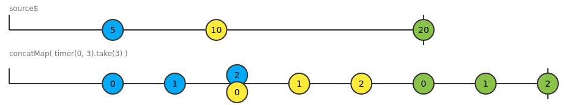
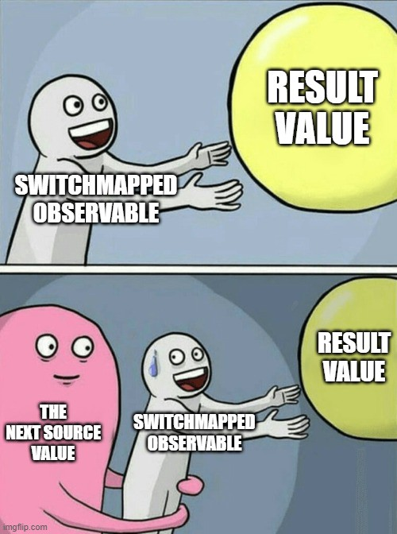

## RxJS


[Дмитрий Вайнер](https://github.com/dmitryweiner)

---

### Концепция
* RxJS &mdash; библиотека, реализующая шаблон реактивного программирования 
["наблюдатель"](https://ru.wikipedia.org/wiki/%D0%9D%D0%B0%D0%B1%D0%BB%D1%8E%D0%B4%D0%B0%D1%82%D0%B5%D0%BB%D1%8C_(%D1%88%D0%B0%D0%B1%D0%BB%D0%BE%D0%BD_%D0%BF%D1%80%D0%BE%D0%B5%D0%BA%D1%82%D0%B8%D1%80%D0%BE%D0%B2%D0%B0%D0%BD%D0%B8%D1%8F)).
* Есть источник изменений, продуцирующий некоторые события.
* Есть слушатели этих изменений, реагирующие только тогда, когда изменения происходят.
* Это называется 
[декларативное программирование](https://ru.wikipedia.org/wiki/%D0%94%D0%B5%D0%BA%D0%BB%D0%B0%D1%80%D0%B0%D1%82%D0%B8%D0%B2%D0%BD%D0%BE%D0%B5_%D0%BF%D1%80%D0%BE%D0%B3%D1%80%D0%B0%D0%BC%D0%BC%D0%B8%D1%80%D0%BE%D0%B2%D0%B0%D0%BD%D0%B8%D0%B5)
(в отличие от императивного).
---


---


---

### Установка
* Текущая версия 7.4.
* Через npm:
```shell
npm i rxjs
```
* Через CDN:
```html
<script src="https://unpkg.com/rxjs@7.4.0/dist/bundles/rxjs.umd.min.js"></script>
```
---

### Источник сообщений
* Источник сообщений зовут Observable (то, за чем наблюдают).
* Observable бывает разный:
  * Обычный Observable: на него может подписаться только один слушатель.
  * Subject: на него подписываются несколько слушателей.
  * Scheduler: планировщик событий в соответствии с Event Loop в JS.
---
  

---
  
### Слушатель
* Слушатель подписывается на события с помощью метода subscribe().
* До подписки на источник событий Observable и не думает начать выполняться.

---

### Потоки данных
* В процессе движения события от источника к слушателю с событием могут происходить
разнообразные метаморфозы.
* Можно это представить в виде трубы между источником и слушателем, в которой находятся разные фильтры.
* Кстати, это осуществляется с помощью метода pipe().
---


---

### Способы создания Observable
* Прямой способ:
```js
import { Observable } from "rxjs";
const obs = new Observable((sub) => {
    sub.next(1);
    setTimeout(() => {
      sub.next(3);
      sub.complete();
    }, 500);
});
obs.subscribe(console.log);
// 1, 3
```
* Из любого итерируемого объекта:
```js
import { from } from "rxjs";
from([1, 2, 3]).subscribe(console.log);
// 1, 2, 3
```
---

### Способы создания Observable
* Из списка аргументов:
```js
import { of } from "rxjs";
of(1, 2, "челюсть").subscribe(console.log);
// 1, 2, "челюсть"
```
* Из события:
```js
import { fromEvent } from "rxjs";
const clicks = fromEvent(document, "click");
clicks.subscribe(console.log);
```
---

### Таймер
* Если передать 1 аргумент, таймер сработает через указанное время:
```js
import { timer } from "rxjs";
timer(3000).subscribe(console.log);
// 0 (через 3 секунды)
```
* Второй аргумент означает, через сколько миллисекунд таймер будет регулярно срабатывать:
```js
import { timer } from "rxjs";
timer(3000, 1000).subscribe(console.log);
// 0, 1, 2, 3...
```
* [Попробовать](https://thinkrx.io/rxjs/timer/).
---

### Интервал
* Срабатывает регулярно через указанное количество миллисекунд:
```js
import { interval } from "rxjs";
interval(500).subscribe(console.log);
// 0, 1, 2, 3...
```
* [Попробовать](https://thinkrx.io/rxjs/interval/).
---

### Операторы
* К проходящим между слушателем и источником данным можно применить различные операторы, пользуясь методом pipe().
* Преобразование: map, scan, buffer.
* Фильтрация: filter, take, skip, distinct.
* Обработка ошибок: catchError, retry, onErrorResumeNext.
* Условия: skipUntil, skipWhile, takeUntil, takeWhile.
* Математические: min, max, count.
* Утилиты: tap, delay.
---

### Map
* Позволяет модифицировать приходящие сообщения и отправить дальше:
```js
import { interval } from "rxjs";
import { map } from "rxjs/operators";
interval(1000)
    .pipe(
      map(i => i + " 🦆")
    )
    .subscribe(console.log);
// 0 🦆, 1 🦆, 2 🦆
```
* [Попробовать](https://thinkrx.io/rxjs/map/).
---


---

### Take
* take(N) возьмёт максимум N значений из источника и завершится:
```js
import { interval } from "rxjs";
import { take } from "rxjs/operators";
interval(1000)
    .pipe(
      take(5)
    )
    .subscribe(console.log);
// 0, 1, 2, 3, 4
```
* [Попробовать](https://thinkrx.io/rxjs/take/).
---

### TakeUntil
* takeUntil(otherStream) будет принимать значения, пока другой терминирующий поток не отправит значение:
```js
import { interval, timer } from "rxjs";
import { takeUntil } from "rxjs/operators";
const source$ = interval(100);
const terminator$ = timer(500);
source$.pipe(
    takeUntil(terminator$)
)
.subscribe(console.log);
// 0, 1, 2, 3
```
* [Попробовать](https://thinkrx.io/rxjs/takeUntil/).
---
### TakeWhile
* takeWhile(predicate) будет принимать значения, пока условие истинно:
```js
import { interval } from "rxjs";
import { takeWhile } from "rxjs/operators";
interval(100).pipe(
    takeWhile(n => n < 5)
)
.subscribe(console.log);
// 0, 1, 2, 3, 4
```
* [Попробовать](https://thinkrx.io/rxjs/takeWhile/).
---

### Filter
* Фильтр пропустит те значения, которые удовлетворяют функции-условию:
```js
import { interval } from "rxjs";
import { filter } from "rxjs/operators";
interval(100).pipe(
    filter(n => n % 2 === 0)
)
.subscribe(console.log);
// 0, 2, 4, 6
```
* [Попробовать](https://thinkrx.io/rxjs/filter/).
---

### Tap
* tap нужен для побочных эффектов. Этот оператор никак не влияет на передачу сообщений,
но получает их все. Пригождается для логирования.
```js
import { interval } from "rxjs";
import { take, tap } from "rxjs/operators";
interval(100).pipe(
        take(10),
        tap(v => console.log('tap', v))
)
.subscribe(console.log);
// 0, tap 0, 1, tap 1, 2, tap 2
```
* [Попробовать](https://thinkrx.io/rxjs/tap/).
---

### Задержка
* Оператор delay(N) вызывает задержку в передаче сообщений N миллисекунд и передаёт их дальше:
```js
import { interval } from "rxjs";
import { delay } from "rxjs/operators";
interval(100).pipe(
    delay(10)
)
.subscribe(console.log);
// 0, 1, 2, 3... (c задержкой)
```
* [Попробовать](https://thinkrx.io/rxjs/delay/).


---

### Scan
* Оператор scan &mdash; аналог метода reduce в массиве, применяет указанную функцию ко всем сообщениям, 
а результат складывает в аккумулятор:

```js
import { of } from 'rxjs';
import { scan } from 'rxjs/operators';
of(1, 2, 3)
    .pipe(
        scan((acc, curr) => acc + curr, 0)
    )
    .subscribe(console.log);
// output: 1,3,6
```
* [Документация](https://www.learnrxjs.io/learn-rxjs/operators/transformation/scan).
---

### Способы объединения Observables
* Если нужно объединить 2 потока, а порядок потоков важен, надо использовать concat, concatMap.
  * Например, для вызова одного fetch строго после другого.
* Если важен порядок поступления событий, то надо использовать merge, mergeMap.
* Префикс *Map означает, что значения первого потока будут подменены тем, что вернёт второй поток. 
---

### concat
* concat выдаст все значения одного потока, а потом все значения второго.
* Если первый поток не кончается, то второй поток не будет выполнен.
```js
import { interval, concat } from "rxjs";
import { pipe, take } from "rxjs/operators";
concat(
    interval(100)
            .pipe(take(3)),
    interval(100)
            .take(2))
.subscribe(console.log);
// 0, 1, 2, 0, 1
```
* [Документация](https://www.learnrxjs.io/learn-rxjs/operators/combination/concat).
---

### concatMap
* Каждое приходящие из источника сообщение вызывает запуск внутреннего источника:
```js
import { interval } from "rxjs";
import { concatMap } from "rxjs/operators";
interval(100)
    .concatMap(x => interval(10).pipe(take(3)))
.subscribe(console.log);
// 0, 1, 2, 0, 1, 2
```
* [Попробовать](https://thinkrx.io/rxjs/concatMap/).


---

### SwitchMap
* Запускает оба потока, и бросается обрабатывать тот поток, от которого сыпятся сообщения:
* [Попробовать](https://thinkrx.io/rxjs/switchMap/).


---


---

### Есть ещё mergeMap и exhaustMap
[Попробовать](https://thinkrx.io/rxjs/mergeMap-vs-exhaustMap-vs-switchMap-vs-concatMap/).


---

### Таймер на RxJS с остановом
[Источник](https://stackblitz.com/edit/typescript-ivdebg?file=index.ts).

```js
const COUNTDOWN_SECONDS = 10;

// elem refs
const remainingLabel = document.getElementById('remaining');
const pauseButton = document.getElementById('pause');
const resumeButton = document.getElementById('resume');

// streams
const interval$ = interval(1000).pipe(mapTo(-1));
const pause$ = fromEvent(pauseButton, 'click').pipe(mapTo(false));
const resume$ = fromEvent(resumeButton, 'click').pipe(mapTo(true));

const timer$ = merge(pause$, resume$)
  .pipe(
    startWith(true),
    switchMap(val => (val ? interval$ : empty())),
    scan((acc, curr) => (curr ? curr + acc : acc), COUNTDOWN_SECONDS),
    takeWhile(v => v >= 0)
  )
  .subscribe((val: any) => remainingLabel.innerHTML = val);
```
---

### Игровые площадки
* https://rxviz.com/
* https://thinkrx.io/rxjs/
---

### Полезные ссылки
* https://riptutorial.com/rxjs
* https://angdev.ru/rxjs/about/
* https://www.learnrxjs.io/
* https://javascript.plainenglish.io/rxjs-operators-in-pictures-but-mostly-memes-7137cea5c8cc