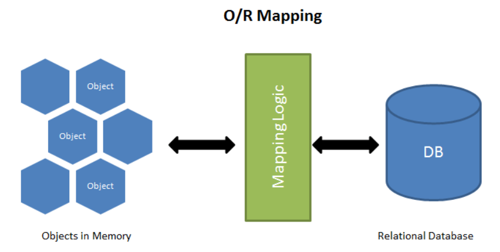

### ORM `Sequelize` + Node.js


[все лекции](https://github.com/dmitryweiner/web-lectures/blob/main/README.md)

[видео](https://youtu.be/ZO51ORYhSvg)
---

### ORM 

> [Object-Relational Mapping](https://ru.wikipedia.org/wiki/ORM) — объектно-реляционное отображение или преобразование, «виртуальная объектная база данных».
---


---

### Установка 
```shell
npm i sequelize sqlite3
```
[Документация](https://sequelize.org/)
---

### Подключение
```js
const { Sequelize } = require('sequelize');
const sequelize = new Sequelize({
  dialect: 'sqlite', // тип базы
  storage: 'path/to/database.sqlite' // путь до базы и имя
});
```
---

### Модель
* Модель — это абстракция, представляющая таблицу в БД.
* Модель определяет название таблицы, то, какие колонки она содержит и их типы данных.
* Имя модели в единственном числе, имя таблицы автоматически во множественном.
* [Подробнее](https://sequelize.org/docs/v6/core-concepts/model-basics/).
---

### Определяем модель
```js
const User = sequelize.define('User', {
  // Model attributes are defined here
  id: {
    type: DataTypes.INTEGER,
    autoIncrement: true,
    primaryKey: true
  },
  firstName: {
    type: DataTypes.STRING,
    allowNull: false
  },
  lastName: {
    type: DataTypes.STRING
    // allowNull defaults to true
  }
}, {
  // Other model options go here
});
``` 
---

### Поля createdAd, modifiedAt
* Поля createdAd, modifiedAt создаются вручную, специально их создавать не надо.
* Если это поведение надо отключить:

```js
const User = sequelize.define('user', { /* ... */ }, {
  // don't add the timestamp attributes (updatedAt, createdAt)
  timestamps: false,

  // If don't want createdAt
  createdAt: false,

  // If don't want updatedAt
  updatedAt: false,
});
```
---

### Синхронизация модели с БД
* `User.sync()` - создаёт таблицу, если её нет, ничего не делает, если она есть.
* `User.sync({ force: true })` - стирает таблицу, если есть, создаёт заново.
* `User.sync({ alter: true })` - обновляем поля таблицы, если она уже есть.
* `await User.drop()` - удаление таблицы. 
* `await sequelize.sync({ force: true })` - синхронизация всех таблиц.
---

### Работа с моделью
* [Документация](https://sequelize.org/docs/v6/core-concepts/model-querying-basics/).
* INSERT:
```js
const jane = User.create({ name: "Jane" });
```
* UPDATE:
```js
const jane = await User.create({ name: "Jane" });
jane.set({
    name: "Ada"
});
// As above, the database still has "Jane" and "green"
await jane.save();
```
---

### Работа с моделью
* DELETE:
```js
const jane = await User.create({ name: "Jane" });
await jane.destroy();
```
* SELECT:
```js
const users = await User.findAll();
```
* SELECT WHERE:
```js
Post.findAll({
    where: {
      authorId: 2
    }
});
```
---

### Find
* findAll - выборка всех данных.
* findByPk - выборка строки по первичному ключу.
* findOne - выборка одной строки.
* findOrCreate - если не нашли создать.
* findAndCountAll - подсчёт найденных строк.
* https://sequelize.org/docs/v6/core-concepts/model-querying-finders/
---

### Связи между таблицами
* Один к одному:
```js
User.hasOne(Token);
Token.belongsTo(User);
```
* Один ко многим:
```js
User.hasMany(Token);
Token.belongsTo(User);
```
* Многие ко многим:
```js
User.belongsToMany(Token);
Token.belongsToMany(User);
```
* [Подробнее](https://sequelize.org/docs/v6/core-concepts/assocs/).
---

### Поля таблицы для связи
* Специально создавать поля для связи не надо, это происходит автоматически.
* Можно задать:
  * имя;
  * поведение при удалении;
  * можно ли NULL;

```js
Project.belongsTo(User, { 
    foreignKey: {
        name: 'id_manager',
        allowNull: false
    },
    onUpdate: 'CASCADE',
    onDelete: 'CASCADE',
});
```
---

### Полезные ссылки
* [Демо-репозиторий](https://github.com/dmitryweiner/express-auth-example/commit/9bb11f6c2c38d9d08e43361d44aff17161801471).
* https://sequelize.org/
* https://habr.com/ru/post/566036/
* https://habr.com/ru/post/565062/
