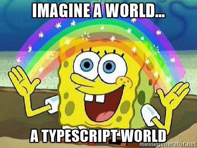

## TypeScript + React



[Дмитрий Вайнер](mailto:dmitry.weiner@gmail.com)

[видео]()

---

### Как начать писать на TypeScript в React
* Простой путь:
  * Сгенерировать проект с помощью CRA.
* Срединный путь:
  * Установить TS в проект, сгенерированный в CRA.
* Путь для героев:
  * Настроить конфиг Webpack.

---

### create-react-app (CRA)
* Утилита для быстрого создания приложения на React.js ([подробнее](https://create-react-app.dev/docs/getting-started)).
* Запуск:
```shell
npx create-react-app %ИМЯ_ПРИЛОЖЕНИЯ% --параметры
```
* Параметры:
  * --template  [подробнее](https://create-react-app.dev/docs/custom-templates/)
    * --template=typescript создаёт приложение с TS.
  * --use-npm 
    * Использовать [NPM](https://www.npmjs.com/), по умолчанию используется [Yarn](https://yarnpkg.com/).
  
---

### CRA + TS
* Создание приложения:
```shell
npx create-react-app my-app --template typescript --use-npm
```
* Получается следующая структура:
```
├── README.md
├── node_modules
├── package-lock.json
├── package.json
├── public
│   ├── favicon.ico
│   ├── index.html
│   ├── logo192.png
│   ├── logo512.png
│   ├── manifest.json
│   └── robots.txt
├── src
│   ├── App.css
│   ├── App.test.tsx
│   ├── App.tsx
│   ├── index.css
│   ├── index.tsx
│   ├── logo.svg
│   ├── react-app-env.d.ts
│   ├── reportWebVitals.ts
│   └── setupTests.ts
└── tsconfig.json
```

---

### Переход на TS в CRA-приложении
* Переименовать любой файл в *.ts.
* Автоматически создаётся tsconfig.json. 
* Установить TS (версия 4.0 или даже 3.2, если возникают проблемы): 
```shell
npm install typescript@4.0
```
* Установить типы:
```shell
npm i --save-dev @types/react-dom @types/react
```

---

### Переход на TS в CRA-приложении
* Если сгенерённый конфиг не работает (ошибка с JSX), можно использовать этот:
```json
{
    "compilerOptions": {
      "target": "es5",
      "lib": [
        "dom",
        "dom.iterable",
        "esnext"
      ],
      "allowJs": true,
      "skipLibCheck": true,
      "esModuleInterop": true,
      "allowSyntheticDefaultImports": true,
      "strict": true,
      "forceConsistentCasingInFileNames": true,
      "noFallthroughCasesInSwitch": true,
      "module": "esnext",
      "moduleResolution": "node",
      "resolveJsonModule": true,
      "isolatedModules": true,
      "noEmit": true,
      "jsx": "react"
    },
    "include": [
      "./src/**/*.ts"
    ]
}
```

---

### TS + Webpack с нуля
* Достаточно подробная [инструкция](https://webpack.js.org/guides/typescript/).
* Конфиг:
```js
const path = require('path');
module.exports = {
  entry: './src/index.ts',
  module: {
    rules: [
      {
        test: /\.tsx?$/,
        use: 'ts-loader',
        exclude: /node_modules/,
      },
    ],
  },
  resolve: {
    extensions: ['.tsx', '.ts', '.js'],
  },
  output: {
    filename: 'bundle.js',
    path: path.resolve(__dirname, 'dist'),
  },
};
```

---

### Типы данных в React
* Компоненты.
  * Функции.
  * Классы.
* Пропсы.
* События.

---

### Вначале типизируем пропсы
* Это делается с помощью конструкции type.
* Если планируется использовать пропсы где-то снаружи файла (но зачем?), применяется конструкция interface.
```typescript
type ItemProps = {
    id: number;
    title: string;
    clickHandler: () => void;
}
```

---

### React.Component
* Используется дженерик React.Component<PropType, StateType>:

```tsx
type CounterProps = {
    initialCounter: number;
}
type CounterState = {
    counter: number;
}
class Counter extends Component<CounterProps, CounterState> {
    constructor(props) {
        super(props);
        this.state = {counter: props.initialCounter};
        this.timerId = null;
    }
    componenDidMount() {
        this.timerId = setInterval(() => this.setState({counter: this.state.counter}), 1000); 
    }
    componentWillUnmount() {
        clearInterval(this.timerId);
    }
    render() {
        return <>{this.state.counter}</>;
    }
}
```

---

### Функциональный компонент
* Не надо пользоваться встроенным типом React.FC (короткая запись FunctionComponent).
Доводы: [1](https://github.com/typescript-cheatsheets/react#function-components), 
  [2](https://github.com/facebook/create-react-app/pull/8177).
* Тип компонента &mdash; обычная функция:
```tsx
type CounterProps = {
    initialCounter: number;
}
function Counter({ initialCounter }: CounterProps) {
    const [counter, setCounter] = useState(initialCounter);
    useEffect(() => {
        const timerId = setInterval(() => {
            setCounter(counter => counter + 1);
        }, 1000);
    }, []);
    return <>{counter}</>;
}
```
---

### Типизация хуков
* Обычно тип выводится из начального значения:
```ts
const [counter, setCounter] = useState(0);
// у counter тип number 
```
* Если оно неизвестно или пустой массив, то нужно использовать дженерик:
```ts
const [strings, setStrings] = useState<string[]>([]);
setStrings(['abc']);
```
---

### Типизация событий
* Встроенные типы:
  * AnimationEvent, ChangeEvent, ClipboardEvent, CompositionEvent, DragEvent, 
    FocusEvent, FormEvent, KeyboardEvent, MouseEvent, PointerEvent, TouchEvent, 
    TransitionEvent, WheelEvent. 
  * Для всего остального SyntheticEvent.
* Пример работы:
```tsx
function Button() {
    function handleClick(e: MouseEvent) {
        console.log('Button clicked!');
    }
    return <button onClick={handleClick}>Click me!</button>;
}
```

---

### Уточнение типа события
* Чтобы явно указать, какие поля есть у события, нужно уточнить тип элемента,
  в котором событие произошло ([подробнее](https://fettblog.eu/typescript-react/events/)).
* Для этого используется дженерик Событие<HTML-элемент>:
```tsx
function Form() {
    const [value, setValue] = useState('');

    function handleChange(e: ChangeEvent<HTMLInputElement>) {
        setValue(e.target.value);
    }
 
    return <input value={value} onChange={handleChange} />;
}
```

---

### Библиотека DefinitelyTyped
* Если для какой-то библиотеки не хватает типов, можно их _попытаться_ поставить через:
```shell
npm i -D @types/ИМЯ_БИБЛИОТЕКИ
```
* [Почитать](https://github.com/DefinitelyTyped/DefinitelyTyped).

---

### Использование кастомных *.d.ts
* Можно описать вручную определения типов для нужной библиотеки, используя *.d.ts файлы.
* Указать этот файл, там, где используется библиотека:
```ts
///<reference path="path/to/file.d.ts" />
```
* [Подробнее](https://stackoverflow.com/questions/18091724/search-path-for-typescript-d-ts-files)

---

### Полезные ссылки
* https://github.com/typescript-cheatsheets/react
* https://fettblog.eu/typescript-react/

---


&mdash; I know TypeScript