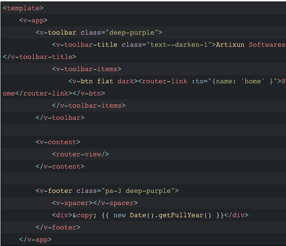
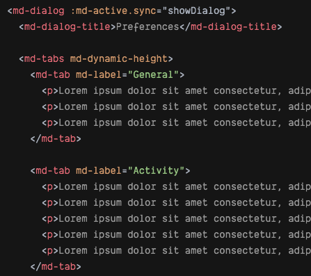

## Vue: библиотеки компонентов


[Дмитрий Вайнер](https://github.com/dmitryweiner)

---

### Disclaimer
* Фреймворк Vue 3 вышел сравнительно недавно, поэтому не все библиотеки компонентов поддерживают возможность
работы в нём. 
* Все примеры показаны для Vue 2.x.
* Если есть версия библиотеки для Vue 3, об этом будет упомянуто.
---

### Vuetify
* [Репо](https://github.com/vuetifyjs/vuetify).
* [Демо](http://vuetify-demo.codefrontback.com/).
* [Документация](https://vuetifyjs.com/en/getting-started/installation/).
* Поддержка Vue 3: [в процессе разработки](https://vuetifyjs.com/en/introduction/roadmap/).
* Установка в проекте, созданном через CLI:
```shell
npx -p @vue/cli vue add vuetify
```
---

### Vuetify


---

### Vue-material
* [Репо](https://github.com/vuematerial/vue-material).
* [Демо](http://vma.isocked.com/#/dashboard), [ещё](https://codesandbox.io/s/mn16ll7ly?module=App.vue).
* [Документация](https://www.creative-tim.com/vuematerial/getting-started).
* Поддержка Vue 3: [маловероятно](https://github.com/vuematerial/vue-material/issues/2277).
* Установка:
```shell
npm install vue-material
```
```js
import Vue from 'vue'
import VueMaterial from 'vue-material'
import 'vue-material/dist/vue-material.min.css'
Vue.use(VueMaterial);
```
---

### Vue-material


---

### Bootstrap-Vue
* [Репо](https://github.com/bootstrap-vue/bootstrap-vue).
* [Демо](https://bootstrap-vue.org/play).
* [Документация](https://bootstrap-vue.org/docs).
* Поддержка Vue 3: [энтузиасты пилят либу](https://cdmoro.github.io/bootstrap-vue-3/).
* Установка:
```shell
npm i bootstrap bootstrap-vue
```
```js
import Vue from 'vue'
import { BootstrapVue, IconsPlugin } from 'bootstrap-vue'
import 'bootstrap/dist/css/bootstrap.css'
import 'bootstrap-vue/dist/bootstrap-vue.css'
Vue.use(BootstrapVue)
Vue.use(IconsPlugin)
```
---

### Bootstrap-Vue


---

### Element UI
* [Репо](https://github.com/ElemeFE/element).
* [Демо](https://codesandbox.io/examples/package/element-ui).
* [Документация](https://element.eleme.io/#/en-US/component/quickstart).
* Поддержка Vue 3: [element-plus](https://element-plus.org/#/en-US).
* Установка:
```shell
npx -p @vue/cli vue add element
```
```js
import Vue from 'vue';
import ElementUI from 'element-ui';
import 'element-ui/lib/theme-chalk/index.css';
Vue.use(ElementUI);
```
---

