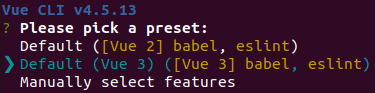
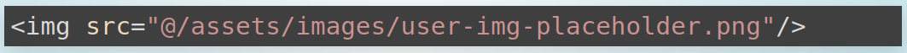
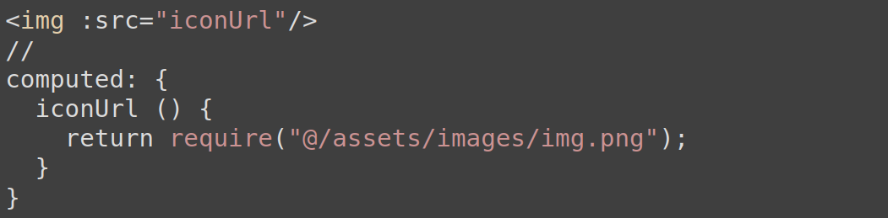
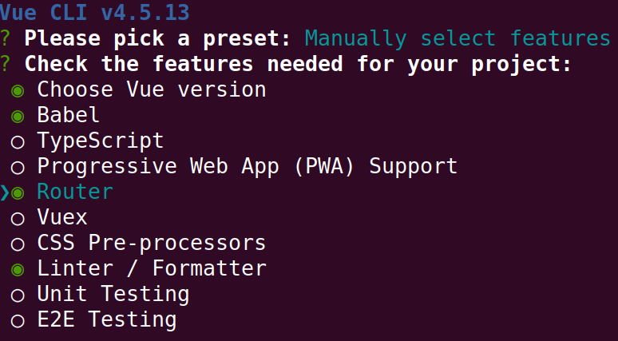
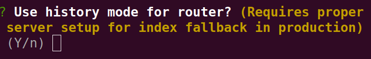

## Vue: основы


[Дмитрий Вайнер](https://github.com/dmitryweiner)

[видео](https://drive.google.com/file/d/1TA0qIDOKzamhLjS5lu73x30qZdCNfsDY/view?usp=sharing)
---

### Общие факты
* Первый релиз в 2014.
* Текущая версия: 3 (на 2021й год).
* [Документация](https://v3.vuejs.org/).
* Создатель [Эван Ю](https://twitter.com/youyuxi).
---

### Основные фишки фреймворка
* Шаблон, стили и код в одном файле.
* Двустороннее связывание с моделью.
* Реализация [MVVM](https://ru.wikipedia.org/wiki/Model-View-ViewModel).
---

### Установка
* Можно использовать в standalone режиме, ничего не собирать:

```html
<head>
    <script src="https://unpkg.com/vue@next"></script>
    <script>
        document.addEventListener('DOMContentLoaded', function () {
            const App = {
                el: '#root',
                data: () => ({
                    value: "Hello world!"
                })
            };
            Vue.createApp(App).mount('#root');
        });
    </script>
</head>
<body>
<div id="root">
    <p>{{ value }}</p>
</div>
</body>

```
---

### Создание приложения
* Если есть админские права:
```shell
npm install -g @vue/cli
vue create %APP_NAME%
```
* Если нет прав:
```shell
npx -p @vue/cli vue create %APP_NAME%
```
* Для **д**ефолтной установки без лишних вопросов добавить ключ ```-d```.
* Создание приложения в графическом интерфейсе:
```shell
vue ui
```
* [Документация](https://cli.vuejs.org/guide/creating-a-project.html#vue-create).
---

### Опции:




---

### Общая структура компонента
* Компонент располагается в одном файле.
* Файл содержит три блока:
  * Шаблон &lt;template&gt;.
  * Стили (не обязательный) &lt;style&gt;.
  * Код &lt;script&gt;.
---
```vue
<template>
  <div>
    {{ value }}
    <span class="red">{{ stateValue }}</span>
  </div>
</template>
<style scoped>
  .red {
    color: red;
  }
</style>
<script>
import IncludedComponent from './IncludedComponent';

export default {
  components: { IncludedComponent },
  props: {
    value: {
      type: String,
      required: true
    }
  },
  data () {
    return {
      stateValue: 1
    }
  },
  computed: {
    computedValue() { return this.stateValue + 1 },
  },
  watch: {
    value: 'watchValue'
  },
  methods: {
    watchValue () { console.log('value is changed') }
  },
  mounted () { console.log('Component is mounted') }
}
</script>
```
---

### TypeScript
* В блоке script можно указать язык, на котором написан компонент (по умолчанию JS):
  * ts.
  * tsx.
* Чтобы это работало хорошо, надо при создании проекта выбирать поддержку TS.
* [Про поддержку TS](https://v3.vuejs.org/guide/typescript-support.html).
---

```vue
<script lang="ts">
import { PropType } from "vue";

type ListProps = {
  initialList: string[];
};

type ListState = {
  list: string[];
};

export default {
  name: "List",
  props: {
    initialList: {
      type: Object as PropType<string[]>,
      required: true,
    },
  },
  data(props: ListProps): ListState {
    return {
      list: props.initialList,
    };
  },
};
</script>
```
---

### Поля компонента
* **components**: компоненты, использованные в данном компоненте.
* **props**: переданные пропсы.
* **data()**: изменяемые данные (аналог state).
* **computed**: вычисляемые данные.
* **watch**: наблюдатель над изменяемыми данными.
* **methods**: методы компонента.
* **setup**: вызывается до монтирования компонента.
* **mounted**: вызывается после монтирования.
* **unmounted**: после демонтирования.
---

### Области видимости
* Поля и методы доступны у экземпляра компонента с помощью ```this.поле```:
  * props.
  * data.
  * methods.
  * computed.
* Не стоит давать им одинаковые имена во избежание коллизий.
---

### Жизненный цикл компонента

---

### Передача пропсов
* Один компонент может вызвать другой (в смысле, использовать в шаблоне).
* При вызове можно передать пропсы.
* Они могут быть использованы в другом компоненте.
* При изменении пропсов компонент перерисовывается автоматически.
---

### Потомок 
```vue
<template>
  <div><!-- Без этого элемента линтер ругается -->
    {{ value }}
  </div>
</template>
<script>
export default {
  name: "Child",
  props: {
    value: {
      type: String, // Указываем явно тип пропса
      required: true // Пропс обязателен
    }
  }
}
</script>
```
---

### Родитель
```vue
<template>
  <Child value="42"/><!-- Если не передать пропс, линтер ругается -->
</template>
<script>
import Child from "./Child";

export default {
  name: "Parent",
  components: { Child }
}
</script>
```
---

### Изменение стейта
* При изменении стейта компонент обновляется автоматически:
```vue
<template>
    <div>
      {{ timer }}
    </div>
</template>
<script>
export default {
    name: "Timer",
    data() {
      return {
        timer: 0
      }
    },
    mounted() {
      this.intervalId = setInterval(() => this.timer = this.timer + 1, 1000);
    },
    unmounted() {
      clearInterval(this.intervalId);
    }
}
</script>
```
---

### Вычислимые свойства
* Легко поддасться соблазну и вычислять разные данные в шаблоне.
* Минус этого подхода в том, что эти вычисления будут происходить при каждом рендере.
* Можно было бы перенести эти вычисления в methods, но они всё равно будут происходить
  при каждом рендере.
* Чтобы так не было, применяют computed-свойства, которые вычисляются **только** при изменении стейта.
* [Подробнее](https://v3.vuejs.org/guide/computed.html).
---

### Вычислимые свойства
* Так плохо: ❌

```vue
<template>
  <div>{{inputString.split("").reverse().join("")}}</div>
</template>
<script>
export default {
  name: "Reverser",
  data() {
    return {
      inputString: "Привет!"
    }
  }
}
</script>
```
---
### Вычислимые свойства
* Так хорошо: ✅

```vue
<template>
  <div>{{reversedString}}</div>
</template>
<script>
export default {
  name: "Reverser",
  data() {
    return {
      inputString: "Привет!"
    }
  },
  computed: {
    reversedString() {
      return this.inputString.split("").reverse().join("");
    }
  }
}
</script>
```
---

### Computed + getter + setter
* У computed можно задать отдельно геттер и сеттер.
* [Подробнее](https://v3.vuejs.org/guide/computed.html#computed-setter).

```js
computed: {
  fullName: {
    // getter
    get() {
      return this.firstName + ' ' + this.lastName
    },
    // setter
    set(newValue) {
      const names = newValue.split(' ')
      this.firstName = names[0]
      this.lastName = names[names.length - 1]
    }
  }
}
```
---

### Watcher (наблюдатель)
* Наблюдатель &mdash; это такая функция, которая вызывается при изменении
  нужной переменной стейта.
* Имя наблюдателя должно совпадать с именем наблюдаемого стейта.
* На вход функции подаётся новое и старое значения.
* [Подробнее](https://v3.vuejs.org/guide/computed.html#watchers).
---

### Watcher (наблюдатель)
```vue
<script>
export default {
    name: "Timer",
    data() {
      return {
        timer: 0
      }
    },
    mounted() {
      this.intervalId = setInterval(() => this.timer = this.timer + 1, 1000);
    },
    unmounted() {
      clearInterval(this.intervalId);
    },
    watch: {
      timer(newTime, oldTime) {
        // тут какая-то реакция на изменение
        if (newTime > 10) {
          console.log("It's time!");
        }
      }
    }
}
</script>
```
---

### События
* Элементы DOM могут генерировать события при кликах, вводе, прокручивании.
* Чтобы подписаться на них, необходимо:
  * Добавить параметр ```v-on:ТИП СОБЫТИЯ``` или ```@ТИП СОБЫТИЯ```.
  * К нему добавить обработчик.
* [Подробнее](https://v3.vuejs.org/guide/events.html).
  
```vue
<button v-on:click="counter += 1">Add 1</button>
<button @click="counter -= 1">Subtract 1</button>
<button @click="method">Subtract 1</button>
```
---

### Типы событий
* Мышь:
  * click.
  * scroll.
* Инпут:
  * focus.
  * blur.
* Клавиатура:
  * submit. 
  * keydown.
  * keyup.
---

### Модификаторы событий
  * .stop: event.stopPropagation()
  * .prevent: event.preventDefault()
  * .capture
  * .self
  * .once
  * .passive
---
  
### Модификаторы событий
```vue
<!-- событие не будет распространяться выше по иерархии -->
<a @click.stop="doThis"></a>

<!-- форма не перезагрузит страницу -->
<form @submit.prevent="onSubmit"></form>

<!-- модификаторы можно объединять -->
<a @click.stop.prevent="doThat"></a>

<!-- можно не навешивать свой обработчик -->
<form @submit.prevent></form>

<!-- сработает только если событие пришло от самого элемента, не от детей -->
<div @click.self="doThat">...</div>
```
---

### Передача данных в события
```vue
<template>
  <div id="inline-handler">
    <button @click="say('hi')">Say hi</button>
    <button @click="say('what')">Say what</button>
  </div>
</template>
<script>
export default {
  methods: {
    say(message) {
      console.log(message);
    }
  }
}
</script>
```
---

### Счётчик нажатий на кнопку
```vue
<template>
  <button @click="counter += 1">Нажали раз: {{counter}}</button>
</template>
<script>
export default {
  name: "Counter",
  data() {
    return {
      counter: 0
    }
  }
}
</script>
```
---
### Язык шаблонов
* Шаблон интерполирует всё, что ему положат в {{}}.
* Там могут быть пропсы, стейт, вызов метода, computed, JS-код.
* Главное, чтобы это возвращало текст.
* [Подробнее](https://v3.vuejs.org/guide/template-syntax.html).
```vue
✅
{{ number + 1 }}
{{ ok ? 'YES' : 'NO' }}
{{ message.split('').reverse().join('') }}
❌
{{ var a = 1 }}
{{ if (ok) { return message } }}
```
---

### Директивы шаблонов
* Директивы добавляются в теги и позволяют реализовывать следующую функциональность:
  * v-bind: динамическое изменение атрибута.
  * v-if, v-else, v-else-if, v-show: условный рендеринг.
  * v-for: отрисовка списка.
  * v-model: двусторонее связывание.
* [Подробнее](https://v3.vuejs.org/api/directives.html).
---

### Условный рендеринг
* Для отрисовки блока добавляется параметр v-if к тегу.
* Если надо отрисовать 2 блока в противофазе, пишем v-if, v-else.
* Можно добавлять следующее условие: v-if, v-else-if.
* [Подробнее](https://v3.vuejs.org/guide/conditional.html).
---

```vue
<template>
  <div>
    <div v-if="isShow">
      Скрываемый блок
    </div>
    <button @click="isShow = true">Показать</button>
    <button @click="isShow = false">Скрыть</button>
  </div>
</template>

<script>
export default {
  name: "Conditional",
  data() {
    return {
      isShow: true
    }
  }
}
</script>
```
---

### Отличия v-if и v-show
* **v-if** честно удаляет элемент из DOM-дерева (со всеми срабатывающими хуками, если это компонент).
* **v-show** только скрывает элемент (display:none).
* Для часто меняющихся блоков надо делать v-show.
---

### Вывод списков
* Списки выводятся с помощью директивы v-for.
* Добавлять её надо в тот элемент, который будет повторяться.
* На вход подаётся массив или что-то итерируемое (Map, Set).
* Можно брать не только элемент массива, но и его индекс.
* Необходимо указывать уникальный ключ (id или индекс), дабы не обновлять весь список при рендере.
* [Подробнее](https://v3.vuejs.org/guide/list.html).
---

```vue
<template>
  <ul>
    <li v-for="(item, key) in list" :key="key">
      {{item}}
    </li>
  </ul>
</template>
<script>
export default {
  name: "List",
  data() {
    return {
      list: ["один", "два", "три"]
    }
  }
}
</script>
```
---

### V-bind (короткая и полная записи)
* Бывает нужно менять значения атрибутов динамически.
* Чтобы объяснить это шаблону, используется конструкция v-bind:
```vue
<a v-bind:href="url">Динамическая ссылка</a>
```
* Допускается короткая форма записи:
```vue
<a :href="url">Динамическая ссылка</a>
```
* Так можно делать с любыми атрибутами.
* [Подробнее](https://v3.vuejs.org/api/directives.html#v-bind).
---

### Формы и двусторонее связывание
* Фреймворк позволяет связать стейт с полем ввода с помощью директивы **v-model**.
* То есть при изменении стейта изменяется поле.
* А при изменении поля изменяется стейт.
* Всё это делается автоматически.
* [Подробнее](https://v3.vuejs.org/guide/forms.html).
---

```vue
<template>
  <div>
    <input v-model="value"/>
    Вы ввели: {{ value }}
    <button @click="value = '123'">Изменить стейт</button>
  </div>
</template>
<script>
export default {
  name: "Form",
  data() {
    return {
      value: ""
    }
  }
}
</script>
```
---

### Слоты
* Поскольку компоненты как теги, можно обернуть в компонент что-нибудь ещё:
```vue
<Component>
    Тут какой-то текст.
</Component>
```
* В самом компоненте это можно вывести в шаблоне в виде слота:
```vue
<template>
    <slot></slot>
</template>
```
---

### Слоты
* Слоты могут быть именованные и их может быть несколько.
* У слота нет доступа к данным компонента, где он выведен.
* У компонента, отображающего слот, нет доступа к данным слота.
* [Подробнее](https://v3.vuejs.org/guide/component-slots.html).
---

```vue
<fancy-button>
  Классная кнопка!
</fancy-button>
<!-- FancyButton.vue -->
<template>
  <button @click="clickReaction">
    <slot></slot>
  </button>
</template>
<script>
export default {
  name: "FancyButton",
  methods: {
    clickReaction() {
      console.log("Clicked!");
    }
  }
}
</script>
```
---

### Стили локальные и общие
* Стили бывают локальные и глобальные.
* Локальные стили (с атрибутом **scoped**) распространяются только на тот компонент, где объявлены.
* Глобальные видны всем.
* [Подробнее](https://vue-loader.vuejs.org/guide/scoped-css.html).
```vue
<style>/* эти стили влияют на весь проект */
  a {
    color: green;
  }
</style>
<style scoped>/* это стили компонента */
  li {
    background-color: green;
  }
</style>
```
---

### Динамические стили
* Стили могут меняться в зависимости от изменения стейта.
* Это делается с помощью директивы v-bind (или просто символа :).
```vue
<div :class="{ active: isActive }"></div>
```
* В данном случае ```active``` &mdash; это тот класс, который навесится, если ```isActive === true```.
* [Подробнее](https://v3.vuejs.org/guide/class-and-style.html).
---

### Динамические стили
* Можно указывать несколько динамических классов:
```vue
<div
    class="static"
    :class="{ active: isActive, 'text-danger': hasError }"
></div>
```
* Или даже так:
```vue
<div :class="[activeClass, errorClass]"></div>
//
data() {
      return {
        activeClass: 'active',
        errorClass: 'text-danger'
      }
}
```
---

### Ассеты
* Картинки и другие файлы подключаются в шаблоне так:

* Если картинка должна быть динамической:

* [Подробнее](https://stackoverflow.com/questions/47313165/how-to-reference-static-assets-within-vue-javascript).
---

### Роутер
* Правильнее всего при создании приложения выбрать использование роутера:


---

### Роутер
* Не забыть включить историю:

---

### Роутер 
* Если приложение уже создано, всегда можно поставить роутер вручную.
* Ручная установка:
  * Поставить библиотеку:
  ```shell
     npm i vue-router
  ```
  * Создать файл с роутами.
  * Подключить роутер к приложению в main.js.
* [Документация](https://next.router.vuejs.org/guide/).
---

### Файл с роутами
```js
import { createRouter, createWebHistory } from 'vue-router';
import Home from '../views/Home.vue';

const routes = [
  {
    path: '/',
    name: 'Home',
    component: Home
  },
  {
    path: '/about',
    name: 'About',
    // Ленивая загрузка: подгрузится только при визите страницы
    component: () => import(/* webpackChunkName: "about" */ '../views/About.vue')
  }
];

const router = createRouter({
  history: createWebHistory(process.env.BASE_URL),
  routes
});

export default router;
```
---

### Подключение роутера в main.js
```js
import { createApp } from 'vue'
import App from './App.vue'
import router from './router'

createApp(App).use(router).mount('#app');
```
---

### Тестирование
* Для Vue 2.* тестирование проводится совершенно так же, как в React.js, с использованием
  библиотеки [testing-library](https://testing-library.com/docs/vue-testing-library/intro/).
* Методика Arrange Act Assert.
* [Примеры](https://testing-library.com/docs/vue-testing-library/examples).

```shell
npm install -D @testing-library/vue
```
```js
import {render, fireEvent} from '@testing-library/vue';
import Component from './Component.vue';
test('increments value on click', async () => {
    const {getByText} = render(Component);
    getByText('Times clicked: 0');
    const button = getByText('increment');
    await fireEvent.click(button);
    await fireEvent.click(button);
    getByText('Times clicked: 2');
})
```
---

### Тестирование в Vue3
* В Vue3 работает только библиотека @vue/test-utils.
* [Документация](https://vue-test-utils.vuejs.org/guides/#getting-started).
* Тест в ней выглядит немного иначе:

```js
describe("Clicker.vue", () => {
    it("при клике на кнопку увеличивает значение", async () => {
    const initialValue = 10;
        const wrapper = shallowMount(Clicker, {
            props: { initialValue },
        });
        expect(wrapper.text()).toMatch(initialValue.toString());
        await wrapper.find("button").trigger("click");
        expect(wrapper.text()).toMatch(Number(initialValue + 1).toString());
    });
});
```
----

### Clicker.vue
```vue
<template>
  {{current}}
  <button @click="current += 1">click me!</button>
</template>

<script>
export default {
  name: "Clicker",
  props: {
    initialValue: {
      type: Number,
      required: true
    }
  },
  data() {
    return {
      current: this.initialValue
    };
  }
};
</script>
```
---

### Тестирование таймеров
* Не забыть, что для обновления компонента надо вызвать [$nextTick()](https://v3.vuejs.org/api/global-api.html#nexttick):

```js
beforeEach(() => {
  jest.useFakeTimers();
});

afterEach(() => {
  jest.useRealTimers();
});

describe("Timer.vue", () => {
  it("через 10 секунд показывает 10", async () => {
    const initialValue = 0;
    const deltaTime = 10;
    const wrapper = shallowMount(Timer, {
      props: { initialValue }
    });
    expect(wrapper.text()).toMatch(initialValue.toString());
    jest.advanceTimersByTime(deltaTime * 1000);
    await wrapper.vm.$nextTick();
    expect(wrapper.text()).toMatch(Number(initialValue + deltaTime).toString());
  });
});
```
----

### Timer.vue
```vue
<template>
  {{ current }}
</template>

<script>
export default {
  name: "Timer",
  props: {
    initialValue: {
      type: Number,
      required: true
    }
  },
  data() {
    return {
      current: this.initialValue
    };
  },
  mounted() {
    this.intervalId = setInterval(() => this.current += 1, 1000);
  }
};
</script>
```
---

### Тестирование компонента с fetch
```js
import { enableFetchMocks } from 'jest-fetch-mock';
import GithubFetcher from "../../src/components/GithubFetcher";
import {shallowMount} from "@vue/test-utils";
enableFetchMocks();

const response = {
  /* ... */
};

describe('GithubFetcher.vue', () => {
    it('вводим username в поле ввода и получаем информацию', async () => {
        fetch.mockResponseOnce(JSON.stringify(response));
        const wrapper = shallowMount(GithubFetcher, {});
        const input = wrapper.find("input");
        input.element.value = "test";
        await input.trigger("input");
        await wrapper.find("button").trigger("click");
        await wrapper.vm.$nextTick();
        expect(wrapper.text()).toMatch("test");
    })
})
```
----
### GithubFetcher.vue

```vue
<template>
  <div>
    <label>
      Введите ник на гитхабе:
      <input type="text" v-model="nick">
    </label>
    <button @click="load">Загрузить!</button>
    <div v-if="isLoading">Загружается...</div>
    <div v-if="result">
      {{ JSON.stringify(result) }}
    </div>
  </div>
</template>
<script>
export default {
  name: "GithubFetcher",
  data() {
    return {
      nick: "",
      isLoading: false,
      result: undefined
    }
  },
  methods: {
    async load() {
      const res = await fetch(`https://api.github.com/users/${this.nick}`);
      const json = await res.json();
      this.result = json;
    }
  }
}
</script>
```
---

### Отладка
* Можно поставить отладочное расширение для 
  [Google Chrome](https://chrome.google.com/webstore/detail/vuejs-devtools/ljjemllljcmogpfapbkkighbhhppjdbg)
  или [FireFox](https://github.com/vuejs/devtools/releases/tag/v6.0.0-beta.15).
* С ним можно видеть иерархию компонентов, стейт, пропсы.


---

### Composition API
* Идеи функционального программирования дошли и до разработчиков Vue.
* И им они показались стоящими. Поэтому теперь можно писать компоненты в функциональном стиле.
* Это называется [Composition API](https://v3.vuejs.org/guide/composition-api-introduction.html).
* Подобный подход позволяет выделить повторяющиеся куски компонентов
  (например, одинаковую реакцию на события) в отдельные функции.
---

### Что дальше?
* [Компоненты-классы](https://class-component.vuejs.org/), обёрнутые в декораторы.
* [Менеджеры состояния](https://vuex.vuejs.org/).
* [Библиотеки компонентов](https://material-ui.com/ru/).
* [Composition API](https://v3.vuejs.org/guide/composition-api-introduction.html).
---

### Полезные ссылки
* https://v3.vuejs.org/guide/introduction.html
* https://v3.vuejs.org/style-guide/
* https://lmiller1990.github.io/vue-testing-handbook/
