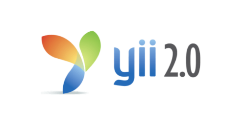
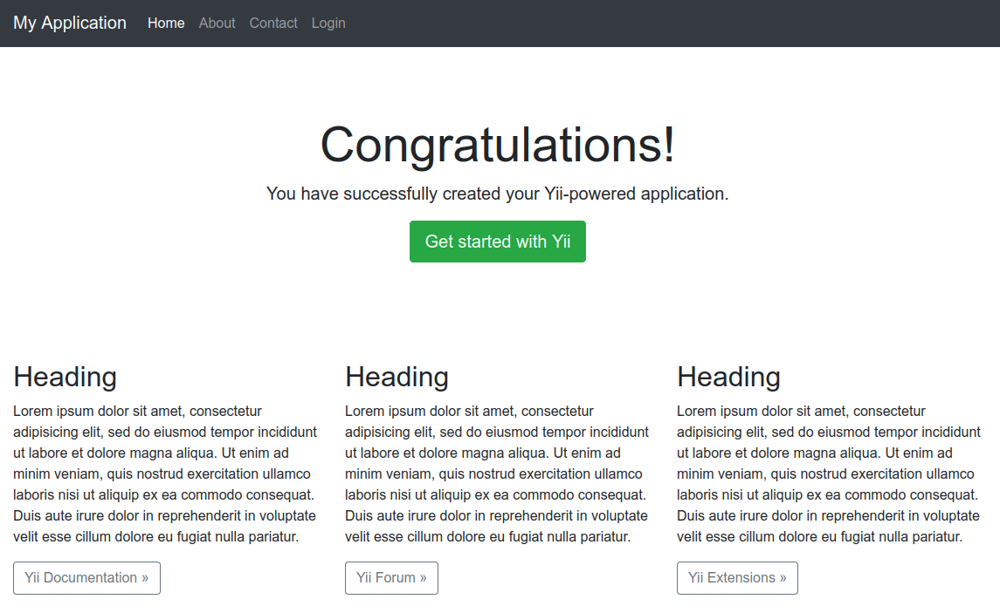
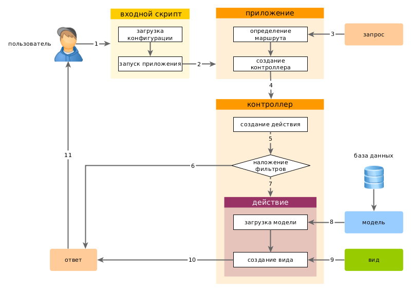
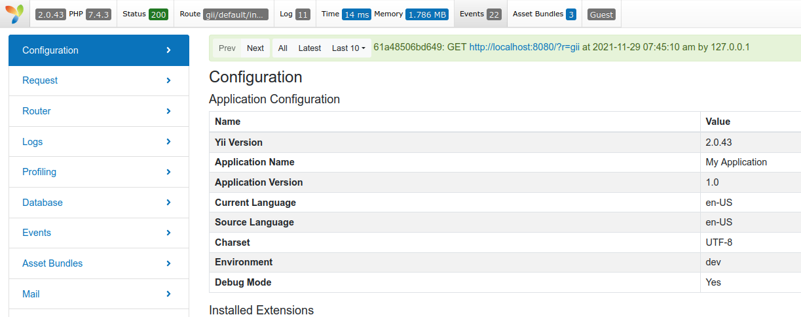

## Yii2



[Дмитрий Вайнер](https://github.com/dmitryweiner)

[видео](https://drive.google.com/file/d/1Va0cDQk9H9eLFUpfWLirn0adVPIu6zT9/view?usp=sharing)
---

### Yii2
* Yii &mdash; акроним от "Yes It Is!", произносится "йии".
* Первый релиз 1 января 2008.
* Текущая версия 2 (в 2021-м должна была выйти [3-я версия](https://www.yiiframework.com/yii3-progress)).
* Создатель [Цян Суэ](https://twitter.com/qiang_xue).
* [Документация](https://www.yiiframework.com/doc/guide/2.0/ru/).

<div style="display: flex; flex-direction: row; justify-content: center;">
<div style="width:150px">


</div>
</div>
---

### Идеи
* Реализация паттерна [MVC](https://ru.wikipedia.org/wiki/Model-View-Controller).
* Очень мощные консольные команды.
* Генерация моделей и CRUD по базе.
* REST из коробки.
* Миграции БД.
* Шаблонизаторы Twig и Smarty.
---

### Установка
* Вначале надо [поставить Composer](https://getcomposer.org/download/)
* Генерация проекта:
```shell
composer create-project --prefer-dist yiisoft/yii2-app-basic %PROJECT_NAME%
```
* [Подробности](https://www.yiiframework.com/doc/guide/2.0/ru/start-installation).

---

### Запуск
* Встроенный сервер:

```shell
cd %PROJECT_NAME%
./yii serve
```

* Настройка хостинга:
  * [Apache](https://www.yiiframework.com/doc/guide/2.0/ru/start-installation#recommended-apache-configuration).
  * [Nginx](https://www.yiiframework.com/doc/guide/2.0/ru/start-installation#recommended-nginx-configuration).
---


---

### Структура приложения
```
composer.json       используется Composer'ом, содержит описание приложения
config/             конфигурационные файлы
    console.php     конфигурация консольного приложения
    web.php         конфигурация Web приложения
commands/           содержит классы консольных команд
controllers/        контроллеры
models/             модели
runtime/            файлы, которые генерирует Yii во время выполнения приложения (логи, кэш и т.п.)
vendor/             содержит пакеты Composer'а и, собственно, сам фреймворк Yii
views/              виды приложения
web/                корневая директория Web приложения. Содержит файлы, доступные через Web
    assets/         скрипты, используемые приложением (js, css)
    index.php       точка входа в приложение Yii. С него начинается выполнение приложения
yii                 скрипт выполнения консольного приложения Yii
```
---
### Жизненный цикл


---

### Ассеты
* JS и CSS файлы, которые должны быть на всех страницах, подключаются в `assets/AppAsset.php`:
```php
public $css = [
    'css/site.css',
];
public $js = [
    'js/jquery.js', // для примера! 
];
```
---

### Ассеты
* CSS, JS, картинки, шрифты лежат в `web`.
* В папке `web/assets` лежат сжатые и закешированные файлы, туда ничего класть не надо.
---

### Layout
* По умолчанию шаблон оборачивается в layout, который лежит в `views/layouts/main.php`.
* Это поведение можно [изменить](https://stackoverflow.com/questions/35407690/how-to-change-default-layout-for-all-controllers-in-yii2).
* У каждого экшена или контроллера можно [задать свой layout](https://stackoverflow.com/questions/31851718/set-layout-from-module-controller-in-yii2/35408865).
---

### Механизм работы фреймворка
* Поступает запрос вида: ```/index.php?r=%CONTROLLER_NAME%/%ACTION_NAME%```.
  * При использовании Nginx или Apache запрос можно посылать в виде ```/controller/action```.
* Фреймворк ищет в controllers класс с именем ```%CONTROLLER_NAME%Controller``` (С большой буквы).
* Далее ищет метод, соответствующий экшену (```action%ACTION_NAME%```).
---

### Экшен по умолчанию
* Если экшен не указан, вызывается `actionIndex`.
```php
public function actionIndex()
{
    return $this->render('index');
}
```
---

### Примеры URL -&gt; контроллер
```
/article -> app\controllers\ArticleController;
/post-comment -> app\controllers\PostCommentController;
/admin/post-comment -> app\controllers\admin\PostCommentController;
/adminPanels/post-comment -> app\controllers\adminPanels\PostCommentController.
```
---

### Структура контроллера
* Контроллер &mdash; это класс, наследуемый от ```yii\web\Controller```.

```php
namespace app\controllers;

use yii\web\Controller;

class SiteController extends Controller
{
    public function actionIndex()
    {
        return $this->render('index');
    }

    public function actionHelloWorld()
    {
        return 'Hello World';
    }
}
```
---

### Контроллер и шаблон
* Экшен контроллера может рендерить вью:
```php
public function actionIndex()
{
    return $this->render('index');
}
```
* Шаблон должен лежать в views/%ИМЯ_КОНТРОЛЛЕРА%/index.php (и называться соответственно тому, что передали в `render()`):⬇
----
#### views/site/index.php
```php
<?php
/* @var $this yii\web\View */
use yii\helpers\Html;
$this->title = 'About';
$this->params['breadcrumbs'][] = $this->title;
?>
<div class="site-about">
    <h1><?= Html::encode($this->title) ?></h1>
    <p>
        This is the About page. You may modify the following file to customize its content:
    </p>
    <code><?= __FILE__ ?></code>
</div>
```
---

### Передача данных в шаблон
* Передаём данные:
```php
public function actionIndex()
{
    return $this->render('index', ['data' => 123]);
}
```
* Используем в шаблоне `index.php`:
```php
<?=$data;?>
```
---


### Формы
* Форма строится с помощью класса [ActiveForm](https://yiiframework.com.ua/ru/doc/guide/2/input-forms/).
* С помощью него можно реализовать [валидацию](https://yiiframework.com.ua/ru/doc/guide/2/input-validation/) (обязательность полей, правила).
* Динамическую загрузку значений.
---

### Форма в шаблоне
* Форма в шаблоне строится с помощью хелпера [Html](https://www.yiiframework.com/doc/guide/2.0/en/helper-html).
* Так сделано для защиты от [атаки CSRF](https://ru.wikipedia.org/wiki/%D0%9C%D0%B5%D0%B6%D1%81%D0%B0%D0%B9%D1%82%D0%BE%D0%B2%D0%B0%D1%8F_%D0%BF%D0%BE%D0%B4%D0%B4%D0%B5%D0%BB%D0%BA%D0%B0_%D0%B7%D0%B0%D0%BF%D1%80%D0%BE%D1%81%D0%B0).
```php
<?= Html::beginForm(['mouse/index'], 'POST'); ?>
    <?=Html::input('text', 'mouse_name', '', ['label' => 'Имя мыши:'])?>
    <?= Html::submitButton('Сохранить') ?>
<?= Html::endForm(); ?>
```
---

### Обработка запросов
* Данные, отправленные в форме, попадают в экшен с помощью вызова метода:
```php
Yii::$app->request->post()
```
* GET-параметры можно получать с помощью метода:
```php
$id = $request->get('id', 1);
// equivalent to: $id = isset($_GET['id']) ? $_GET['id'] : 1;
```
* Узнать, с чем к нам пришли:
```php
$request = Yii::$app->request;
if ($request->isAjax) { /* the request is an AJAX request */ }
if ($request->isGet)  { /* the request method is GET */ }
if ($request->isPost) { /* the request method is POST */ }
if ($request->isPut)  { /* the request method is PUT */ }
```
---

### Запросы к БД
* Вначале надо настроить конфиг для доступа к базе `config/db.php`:
```php
return [
    'class' => 'yii\db\Connection',
    'dsn' => 'mysql:host=localhost;dbname=yii2basic',
    'username' => 'root',
    'password' => '',
    'charset' => 'utf8',
    // Schema cache options (for production environment)
    //'enableSchemaCache' => true,
    //'schemaCacheDuration' => 60,
    //'schemaCache' => 'cache',
];
```
---

### SQL запросы
* Запросы выполняются с помощью [\yii\db\Query](https://yiiframework.com.ua/ru/doc/guide/2/db-query-builder/):
```php
$rows = (new \yii\db\Query())
    ->select(['id', 'email'])
    ->from('user')
    ->where(['last_name' => 'Smith'])
    ->limit(10)
    ->all();
```
---

### Запросы на обновление/изменение
* [Примеры запросов](https://hotexamples.com/ru/examples/yii.db/Query/createCommand/php-query-createcommand-method-examples.html).
```php
$request = Yii::$app->request;
if ($request->isPost) {
    $query = new \yii\db\Query();
    $command = $query->createCommand();
    $mouse_name = $request->post()['mouse_name'];
    $command->insert('mice', ['name' => $mouse_name])->execute();
}
```
---

### Модель формы
* Для удобной работы с формами используются классы, отнаследованные от `yii\base\Model`.
* Модель можно наполнить данными, полученными из POST.
* Модель применяется в [валидации](https://yiiframework.com.ua/ru/doc/guide/2/input-validation/).
* Модель помогает нарисовать форму в шаблоне.
* [Руководство](https://www.yiiframework.com/doc/guide/2.0/ru/structure-models).
---

### Типовая модель

```php
namespace app\models;
use Yii;
use yii\base\Model;

class LoginForm extends Model {
    public $username;
    public $password;

    // правила валидации
    public function rules()
    {
        return [
            [['username', 'password'], 'required'],
        ];
    }

    // метки атрибутов
    public function attributeLabels()
    {
        return [
            'username' => 'Логин',
            'password' => 'Пароль',
        ];
    }
    
    public function login()
    {
        if ($this->validate()) {
            return Yii::$app->user->login($this->getUser(), $this->rememberMe ? 3600*24*30 : 0);
        }
        return false;
    }
}
```
---

### Отображение модели в форме

```php
/* @var $this yii\web\View */
/* @var $form yii\bootstrap4\ActiveForm */
/* @var $model app\models\LoginForm */

<?php $form = ActiveForm::begin([
    'id' => 'login-form',
    'layout' => 'horizontal',
    'fieldConfig' => [
        'template' => "{label}\n<div class=\"col-lg-3\">{input}</div>\n<div class=\"col-lg-8\">{error}</div>",
        'labelOptions' => ['class' => 'col-lg-1 col-form-label'],
    ],
]); ?>
    <?= $form->field($model, 'username')->textInput(['autofocus' => true]) ?>
    <?= $form->field($model, 'password')->passwordInput() ?>
    <div class="form-group">
        <div class="offset-lg-1 col-lg-11">
            <?= Html::submitButton('Login', ['class' => 'btn btn-primary', 'name' => 'login-button']) ?>
        </div>
    </div>
<?php ActiveForm::end(); ?>
```
---

### Работа с моделью в экшене

```php
public function actionLogin()
{
    $model = new LoginForm();
    if ($model->load(Yii::$app->request->post()) && $model->login()) {
        return $this->goBack();
    }

    $model->password = '';
    return $this->render('login', [
        'model' => $model,
    ]);
}
```

---
### Полезные методы модели
* Модель можно наполнить данными формы:
```php
$model->load(Yii::$app->request->post());
```
* Проверка валидности формы:
```php
if ($model->validate()) { /* ... */ }
```
---

### ActiveRecord
* Для удобства работы с базой используются потомки класса `yii\db\ActiveRecord`.
* Их тоже называют моделями, т.к. ActiveRecord наследуется от Model.
* Они также могут валидировать данные.
* [Документация](https://yiiframework.com.ua/ru/doc/guide/2/db-active-record/).
---

### Типовая модель AR

```php
namespace app\models;
 
use Yii;
use yii\db\ActiveRecord;
class User extends ActiveRecord
{
    public $id;
    public $username;
    public $password;
    
    public static function tableName()
    {
        return '{{user}}';
    }
    
    public function getId()
    {
        return $this->getPrimaryKey();
    }
}
```
---

### Работа с моделями AR
* Поиск по ID:
```php
$customer = Customer::findOne(123);
```
* Поиск по полю:
```php
$customer = Customer::find()
    ->where(['id' => 123])
    ->one();
```
* Поиск всех:
```php
$customers = Customer::find()
    ->where(['status' => Customer::STATUS_ACTIVE])
    ->orderBy('id')
    ->all();
```
---

### Работа с моделями AR
* Сохранение новой записи:
```php
$customer = new Customer();
$customer->name = 'James';
$customer->email = 'james@example.com';
$customer->save();
```
* Обновление записи:
```php
$customer = Customer::findOne(123);
$customer->email = 'james@newexample.com';
$customer->save();
```


---
### Генерация моделей по существующей БД
* Фреймворк может сгенерировать модели по существующей БД вместе со всеми ключами и связями.
* Для этого достаточно зайти на [localhost:8080/?r=gii](http://localhost:8080/?r=gii).
* Также фреймворк умеет сам генерировать контроллеры, формы и даже [CRUD](https://ru.wikipedia.org/wiki/CRUD) для админок.
* [Документация](https://yiiframework.com.ua/ru/doc/guide/2/start-gii/).
---

### Миграции
* Для управления уже существующей базой используется механизм миграций.
* Создать миграцию:
```shell
yii migrate/create <name>
yii migrate/create create_post_table
```
* Накатить миграции:
```shell
yii migrate
yii migrate 3
```
* Откатить:
```shell
yii migrate/down     # отменяет самую последнюю применённую миграцию
yii migrate/down 3   # отменяет 3 последних применённых миграции
```
* [Документация](https://yiiframework.com.ua/ru/doc/guide/2/db-migrations/).
---

### Юзер и авторизация
* [Исчерпывающая инструкция](https://кодер.укр/%D0%B7%D0%B0%D0%BF%D0%B8%D1%81%D0%B8/yii2-basic-%D0%B0%D0%B2%D1%82%D0%BE%D1%80%D0%B8%D0%B7%D0%B0%D1%86%D0%B8%D1%8F-%D0%B8-%D1%80%D0%B5%D0%B3%D0%B8%D1%81%D1%82%D1%80%D0%B0%D1%86%D0%B8%D1%8F-%D1%87%D0%B5%D1%80%D0%B5%D0%B7-%D0%B1%D0%B4)
как сделать регистрацию и авторизацию.

---
### Дебаг
* В Yii2 есть развитая панель разработчика, располагается снизу:


---

### Полезные ссылки
* https://www.yiiframework.com/doc/guide/2.0/ru/
* http://des1roer.blogspot.com/2015/06/yii2.html
* https://fructcode.com/ru/blog/yii2-lessons-how-to-create-page/
* https://yiiframework.com.ua/ru/doc/guide/2/
